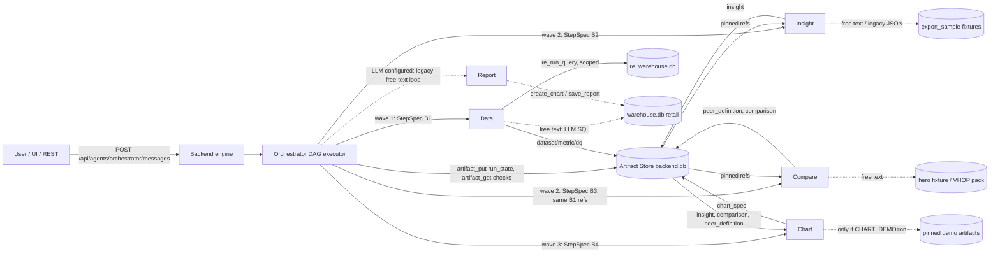
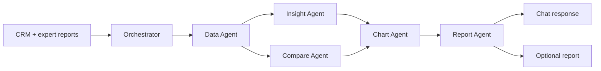
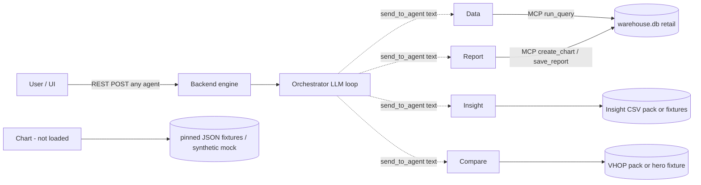
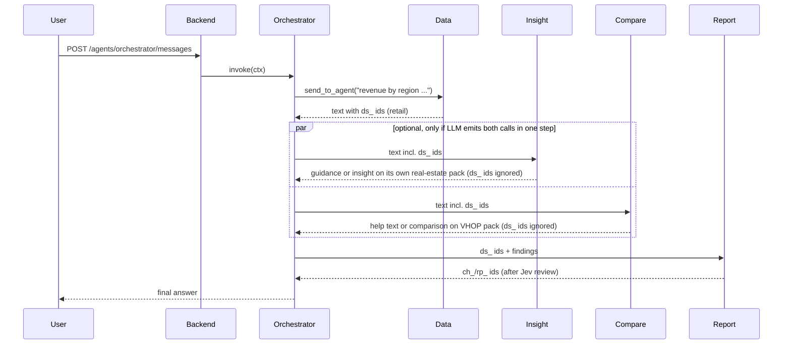
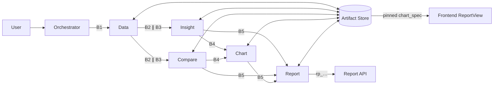

# AGENTS.md — VDaAgent repository guide

## Guideline

- Don't use sub agent
- Use TTD for development
- Do not commit secrets. Every `agents/<name>/.env` is gitignored; change the `.env.example` next to it.

> Audit snapshot: 2026-09-30, branch `agent_a/debug` (base commit `4b420e9`, large uncommitted
> working tree in `agents/compare`, `agents/insight`, untracked `agents/chart`). Status below is
> derived from code first, then offline runtime evidence. Nothing here was proven against a live
> LLM or a running Backend. Re-verify after merges.
>
> **Update 2026-09-30 (later the same day):** integration decisions D1–D10 were APPROVED, WS1 (shared contracts +
> artifact store) was IMPLEMENTED, and a Docker dev/offline-test environment was added. Chart is now in the uv
> workspace and listed in the backend configs with `enabled: false`. Current integration status lives in
> [`docs/integration/`](docs/integration/INTEGRATION_MASTER_PLAN.md); the audit tables below keep their original
> findings and are annotated where they changed.
>
> **Update 2026-09-30 (WS2):** the Data agent serves `StepSpec@1` deterministically over the real-estate DW and
> writes `dataset`/`metric`/`dq` artifacts.
> **Update 2026-09-30 (WS3):** Insight and Compare consume those same artifacts through `StepSpec@1` and write
> `insight` / `peer_definition` / `comparison` artifacts; demo user scopes are seeded (B-10); B-11 stays BLOCKED.
> **Update 2026-09-30 (WS4):** Chart is an enabled plugin that turns those artifacts into `chart_spec` artifacts with
> per-value source refs; demo/synthetic mode is off unless `CHART_DEMO=on`.
> **Update 2026-09-30 (WS5):** one message to the Orchestrator runs Data → [Insight ∥ Compare] → Chart as a
> code-enforced DAG through the Backend engine, with `run_state` and an artifact-quoting answer; works without LLM keys. **§0 below is the maintained current state; §1–§15 are the baseline
> audit (morning of 2026-09-30), annotated where they changed.**

---

## 0. Current State (maintained after every workstream)

Last update: WS5, 2026-09-30. Detailed specifications live in [`docs/integration/`](docs/integration/):
[master plan](docs/integration/INTEGRATION_MASTER_PLAN.md) (decisions, blockers, workstreams),
[canonical data contract](docs/integration/CANONICAL_DATA_CONTRACT.md) (envelope, payloads, field mapping),
[agent contract matrix](docs/integration/AGENT_CONTRACT_MATRIX.md) (operations, errors),
[E2E test plan](docs/integration/E2E_TEST_PLAN.md) (golden case, executed results §9). This section is the overview.

### 0.1 Status vocabulary

| Label | Meaning |
|---|---|
| APPROVED | Design decision accepted by the Integration Owner (D1–D10, 2026-09-30) |
| IMPLEMENTED | Present in source code |
| VERIFIED | Confirmed by an executed offline test or runtime check cited here or in E2E_TEST_PLAN §9 |
| PLANNED | Approved, not implemented |
| BLOCKED | Waiting on a business decision; must not be guessed |

### 0.2 Target architecture (APPROVED)

```mermaid
flowchart LR
    U[User] --> O[Orchestrator<br/>code DAG, LLM intent/plan]
    O -->|StepSpec@1| D[Data<br/>re_warehouse, deterministic]
    D -->|dataset/metric/dq| I[Insight]
    D -->|dataset/metric/dq| C[Compare]
    I -->|insight| CH[Chart]
    C -->|peer_definition/comparison| CH
    CH -->|chart_spec| R[Report]
    I --> R
    C --> R
    R --> OUT[Chat answer / saved report]
    S[(Artifact Store<br/>ArtifactEnvelope)] -. all artifacts .- D & I & C & CH & R
```

### 0.3 Actual architecture (only connections present in code; solid = VERIFIED offline, dashed = implemented, not verified)



Verified chain (WS5): ONE user message → Orchestrator plans B1 → (B2 ∥ B3) → B4 and dispatches each wave as one
assistant step of `send_to_agent` calls; the engine runs B2 and B3 concurrently; every returned ref is checked before
it is forwarded. Report (B5) is not in the DAG yet (WS6); with an LLM configured, free text still takes the legacy loop.

### 0.4 Workstream progress (WS1–WS7)

| WS | Component / owner | Status | Deliverables and files | Tests executed | Blockers / next |
|---|---|---|---|---|---|
| WS1 | Contracts + Backend store (Backend lead) | IMPLEMENTED, VERIFIED | `ArtifactRef.content_hash`, ≤1 snapshot per draft ([envelope.py](contracts/vdagent_contracts/envelope.py)); store input-ref/hash/snapshot/semantic checks ([artifact_store.py](backend/vdagent_backend/db/artifact_store.py) `_check_inputs`); `chart` in `ALL_AGENTS` ([tools.py](backend/vdagent_backend/mcp/tools.py)); D9 helpers ([peer_rules.py](contracts/vdagent_contracts/peer_rules.py)) | 77 WS1 tests PASS; backend+contracts 218 PASS | semantic-required / INVALID⇒reason rules not enforced (need payload decisions) |
| Docker | DevOps | IMPLEMENTED, VERIFIED | [Dockerfile.python](Dockerfile.python) (`runtime`, `test`), [docker-compose.yml](docker-compose.yml) (dev, `offline`, `test`), [docker/seed-if-missing.sh](docker/seed-if-missing.sh), `make docker-*`, chart in uv workspace | image builds; offline stack healthy; suite in container | — |
| WS2 | Data agent (AGENT_A) | IMPLEMENTED, VERIFIED (with deviation B-11; WS3 added `dim_sales_channel` to the dataset) | [steps.py](agents/data/vdagent_data/steps.py) (`run_step`, `fetch_units`, `aggregate_metrics`), `DataAgent` in [agent.py](agents/data/vdagent_data/agent.py), `DATA_LLM=off`, dependency on `vdagent-contracts`; compose offline sets `DATA_LLM=off` | RED 28 fail + 6 import error → GREEN 46 PASS (`agents/data`); `make docker-test` 1029 PASS / 27 SKIP | B-10 scopes not seeded; B-11 peer rule; data catalog JSON missing |
| WS3 | Insight + Compare (+ B-10 seed) | IMPLEMENTED, VERIFIED; peer-set acceptance BLOCKED (B-11) | shared resolver [step_inputs.py](contracts/vdagent_contracts/step_inputs.py); Insight [stepspec.py](agents/insight/vdagent_insight/stepspec.py), [dw_reader.py](agents/insight/vdagent_insight/dw_reader.py), D2/D8 model changes in [contracts.py](agents/insight/vdagent_insight/contracts.py), [semantic_insight.sc-1.yaml](agents/insight/config/semantic_insight.sc-1.yaml), routing in [bridge.py](agents/insight/vdagent_insight/bridge.py); Compare [stepspec.py](agents/compare/vdagent_compare/stepspec.py), package injection in `vh_service.CompareService`, routing in [agent.py](agents/compare/vdagent_compare/agent.py); `JsonTools` in [agentkit mcp_client.py](agents/_shared/vdagent_agentkit/mcp_client.py); B-10 `scopes.seed_missing_demo_scopes` + [data/seed_users.py](data/seed_users.py) | RED (6 fail + 4 collection errors + 3 fail + 1 fail) → GREEN: WS3 files 41 PASS / 1 SKIP (B-11); `make docker-test` 1070 PASS / 28 SKIP; Docker REST chain Data→Insight/Compare | B-11, B-12, B-2, D2b, B-3 |
| WS4 | Chart (+ Backend config) | IMPLEMENTED, VERIFIED; 7-peer chart BLOCKED (B-11) | [chart stepspec.py](agents/chart/vdagent_chart/stepspec.py) (projection → unchanged `ChartAgentService` → `chart_spec@1` with `bindings[].source_ref`), `resolve_analysis_inputs` in [step_inputs.py](contracts/vdagent_contracts/step_inputs.py), routing + demo gate in [agent.py](agents/chart/vdagent_chart/agent.py) / [\_\_init\_\_.py](agents/chart/vdagent_chart/__init__.py), plugin enabled in `backend/config*.yaml`, deps in `agents/chart/pyproject.toml` | RED 12 fail → GREEN 13 PASS / 1 SKIP (`test_ws4_integration.py`); chart suite 125 PASS / 1 SKIP; `make docker-test` 1083 PASS / 29 SKIP; Docker REST chain → 5 chart_spec, 18/18 bindings resolve | B-11 (peer set), policy name `chart-policy/demo-1.0` (naming debt) |
| WS5 | Orchestrator DAG (+ catalogs) | IMPLEMENTED, VERIFIED (golden without B5 Report; 7 peers BLOCKED by B-11) | [dag.py](agents/orchestrator/vdagent_orchestrator/dag.py), [planner.py](agents/orchestrator/vdagent_orchestrator/planner.py), [executor.py](agents/orchestrator/vdagent_orchestrator/executor.py), [answer.py](agents/orchestrator/vdagent_orchestrator/answer.py), `OrchestratorAgent` in [agent.py](agents/orchestrator/vdagent_orchestrator/agent.py), frozen [catalogs](contracts/vdagent_contracts/catalogs/) `data/insight/compare/chart.json` (data 1.3.0 / insight 2.0.0 declared unimplemented operations: replaced, vocabulary kept — see master plan WS5), compose offline `ORCH_*` | RED 2 collection errors → GREEN 45 PASS (`agents/orchestrator`, incl. real-engine golden with a barrier); `make docker-test` 1116 PASS / 29 SKIP; Docker: one message → 4 steps, B2 ∥ B3 | per-step timeout impossible (engine R4) → run deadline; LLM planning not wired; B-11 |
| WS6 | Report (+ B5, save_report embeds, ChartSpecView) | IMPLEMENTED, VERIFIED offline and in a real browser (5/5 charts, §18) | `agents/report/vdagent_report/{stepspec,compose}.py`, B5 in the Orchestrator, `report.json`, `/api/chart-specs`, `ChartSpecView.tsx` | WS7 acceptance PASS | B-11 |
| WS7 | E2E acceptance | IMPLEMENTED, VERIFIED offline (§18); F-05 auth BLOCKED; live LLM/Jev NOT VERIFIED | `acceptance/ws7/` (`run.sh`), [WS7_INDEPENDENT_AUDIT.md §12](docs/integration/WS7_INDEPENDENT_AUDIT.md), [evidence](docs/integration/ws7_remediation_evidence/) | host + Docker 1196 PASS / 29 SKIP; Vitest 10 PASS; acceptance 14/14 PASS | F-05; B-11, B-2, D2b, B-3, B-12 |

### 0.5 Six agents now

| Agent | IMPLEMENTED | VERIFIED | Not implemented |
|---|---|---|---|
| Orchestrator | **code-enforced DAG** (`AnalysisRequest@1` or deterministic free text): B1 Data → B2 Insight ∥ B3 Compare → B4 Chart, boundary ref checks, `run_state@1`, artifact-quoting answer; legacy LiteLLM loop kept for free text when an LLM is configured | 30 DAG unit tests + 3 real-engine tests + Docker one-message golden | LLM-proposed plans; Report step (WS6) |
| Data | **StepSpec path** (`fetch_units`, `aggregate_metrics`) over `re_warehouse`; legacy LLM SQL for free text (retail) | WS2 tests; Docker runtime StepSpec → 3 artifacts (with scopes seeded in a disposable volume) | peer selection (WS3/B-11); catalog JSON |
| Insight | **StepSpec `explain_unit` over Data artifacts** (DwArtifactReader, sc-1 config, shared `insight` artifact); legacy free text / JSON on its export pack | WS3 tests + Docker REST chain; legacy suite unchanged | market context from DW (no macro rows in the dataset); Orchestrator sender (WS5) |
| Compare | **StepSpec `compare_to_peers` over Data artifacts** (net area, ratio tolerance, shared `peer_definition` + `comparison`); legacy hero/CSV free text | WS3 tests + Docker REST chain; legacy suite unchanged | approved peer rule (B-11), `min_peer_count` (B-2) |
| Chart | **StepSpec `draw_chart` over real insight/comparison artifacts** → `chart_spec@1` (bar target-vs-peer, scatter over actual peers, KPI cards) with exact per-value `source_ref`; enabled plugin; demo/synthetic only with `CHART_DEMO=on` | WS4 tests + Docker REST chain; 112 legacy demo tests unchanged | 7-peer chart (B-11); consumer of chart_spec (Report, WS6) |
| Report | LangGraph + Jev over retail `ds_` datasets | fake unit tests | Chart/Insight/Compare artifacts (WS6) |

### 0.6 Data, snapshots and semantics (APPROVED + where enforced)

- Canonical source `re_warehouse` (D1), TEXT keys (D2), `sc-1` (D3). Golden: `SNAP-2026-09-28` only.
- Snapshot must be explicit and APPROVED; DRAFT (`SNAP-2026-09-29`), unknown or `latest` are rejected — enforced by
  `steps._pin_snapshot` (VERIFIED). The store rejects artifacts whose inputs disagree on snapshot/semantic (WS1, VERIFIED).
- Scope always comes from the Backend (`get_user_context`, `re_run_query` scoped views), never from a message (VERIFIED).
- D8/B-4: missing metrics are `null` + limitation (`METRIC_UNAVAILABLE`, `WINDOW_INCOMPLETE`), never 0 (VERIFIED in Data).
- D9: peer area = `net_area_m2`; no `area_m2` fallback (`peer_rules.peer_area`, used by Data; VERIFIED). The mock
  value is `area_m2 × 0.92` (`SYNTHETIC_SOURCE:net_area_m2`), business meaning BLOCKED.
- Artifact types/schemas in use: `dataset` `re_dataset@1`, `metric` `re_metric@1`, `dq` `re_dq@1` (producer `data`);
  `insight` `insight.v2` (producer `insight`); `peer_definition` `peer_definition@1`, `comparison` `comparison@1`
  (producer `compare`); `chart_spec` `chart_spec@1` (producer `chart`, payload `bindings[]` =
  `{record_index, field, value_exact, unit, source_ref}` with `source_ref` = `<id>@<v>#<json pointer>`). Details: [CANONICAL_DATA_CONTRACT §4–§5](docs/integration/CANONICAL_DATA_CONTRACT.md),
  [AGENT_CONTRACT_MATRIX §3](docs/integration/AGENT_CONTRACT_MATRIX.md).
- Consumers read inputs only through `resolve_data_inputs` (hash-pinned refs, same snapshot/semantic, metric/dq
  derived from the dataset, caller scope) — VERIFIED; Insight/Compare never load their own fixtures on this path
  (tests patch the loaders to fail).
- DAG semantics (WS5, VERIFIED): waves from `validate_plan`; `all` / `any` dependency modes (`UPSTREAM_FAILED:<agent>`
  on the step); refs forwarded only after `artifact_get` confirms type, hash, snapshot and semantic; one run deadline
  (`ORCH_DAG_TIMEOUT_S`) → `timed_out` + DEADLINE_EXCEEDED; `run_state@1` versioned per transition; a repeated
  invocation of the same plan reuses completed steps. Details: [INTEGRATION_MASTER_PLAN WS5](docs/integration/INTEGRATION_MASTER_PLAN.md),
  [AGENT_CONTRACT_MATRIX §3.6](docs/integration/AGENT_CONTRACT_MATRIX.md).
- Chart never recomputes: it projects comparison metrics / peerValues / Insight bindings; null or invalid values are
  not charted (`NOT_CHARTED_NULL`, `INVALID_BINDING`), upstream limitations are carried — VERIFIED.
- Insight semantic config `sc-1`: values copied from `re_warehouse` sc-1 with status; Insight-only keys kept from
  3.1.0 as PENDING with provenance (B-12).

### 0.7 Configuration

| Variable | Where | Effect |
|---|---|---|
| `DATA_LLM=off` | process env or `agents/data/.env` | Data loads without LLM settings and serves StepSpec only (free text answers with an explanation). Set for `backend-offline`. |
| `INSIGHT_LLM=off`, `COMPARE_LLM=off` | same | TEMPLATE / rules mode (pre-existing) |
| `ORCH_LLM=off` | `agents/orchestrator/.env` or env | Orchestrator loads without LLM settings; free text is classified deterministically (unit code + vì sao / so sánh / biểu đồ) into the DAG. Set for `backend-offline`. |
| `ORCH_SNAPSHOT_ID`, `ORCH_SEMANTIC_VERSION` | same | explicit snapshot / semantic pin for free-text DAG runs (offline stack: `SNAP-2026-09-28`, `sc-1`); unset → the run is refused (`SNAPSHOT_REQUIRED`), never "latest" |
| `ORCH_DAG_TIMEOUT_S` | same | whole-run deadline (default 300) |
| `CHART_DEMO=on` | `agents/chart/.env` or env (or plugin `opts: {demo: true}`) | enables `chart demo` / `chart ask` (pinned demo + synthetic upstream). Off by default; never in production (D6). |
| `VDAGENT_CONFIG` | shell / compose | which backend YAML (compose: `backend/config.compose.yaml`) |

Others: §9 and README "Environment variables".

### 0.8 Verified commands (latest results)

```bash
uv sync
uv run pytest -q -p no:cacheprovider agents/data                             # 46 passed
uv run pytest -q -p no:cacheprovider                                          # 1116 passed, 29 skipped (host)
docker compose --profile test build tests && make docker-test                 # 1116 passed, 29 skipped
docker compose --profile test run --rm tests python -m pytest -q -p no:cacheprovider agents/orchestrator   # 45 passed
docker compose --profile test run --rm tests python -m pytest -q -p no:cacheprovider -rs agents/chart   # 125 passed, 1 skipped (B-11)
docker compose --profile test run --rm tests python -m pytest -q -p no:cacheprovider -rs \
  backend/tests/test_seed_scopes.py contracts/vdagent_contracts/tests/test_step_inputs.py \
  agents/insight/vdagent_insight/tests/test_dw_integration.py agents/compare/vdagent_compare/tests/test_dw_integration.py \
  agents/compare/vdagent_compare/tests/test_ws3_cross_agent.py agents/compare/vdagent_compare/tests/test_ws3_plugins.py   # 41 passed, 1 skipped (B-11)
docker compose --profile test run --rm tests python -m pytest -q -p no:cacheprovider \
  agents/data/vdagent_data/tests/test_steps.py agents/data/vdagent_data/tests/test_agent_steps.py   # 34 passed
```

Skips: Insight `export/` pack absent (11), Compare VHOP pack absent (13), live keys absent (3), B-11 pending (2: Compare peer set, Chart 7-peer chart).
Golden case in Docker (WS5): `make docker-offline-up`, then ONE message:

```bash
curl -s -X POST -H 'X-User-Id: u_000000000001' -H 'Content-Type: application/json' localhost:8001/api/agents/orchestrator/messages \
  -d '{"content":"Vì sao căn A12-08 bán chậm? So sánh với các căn tương đồng và vẽ biểu đồ."}'
curl -s -H 'X-User-Id: u_000000000001' localhost:8001/api/tasks/<task_id>   # task + invocations + answer
```

Observed results: [E2E_TEST_PLAN §9 WS5](docs/integration/E2E_TEST_PLAN.md).
Full Docker workflow: §14 "Docker workflow".

### 0.9 Open blockers

| Id | What | Blocks |
|---|---|---|
| D2b | Segment mapping `HIGH_END`/`MID_END` → Insight enum | WS3 Insight |
| B-2 | `min_group_size` (PENDING in `sc-1`) ↔ Compare `min_peer_count` | WS3 Compare |
| B-3 | Business meaning of synthetic `net_area_m2` | sign-off of peer results |
| ~~B-10~~ | Resolved in WS3: `seed_users.py` seeds demo scopes only for users with no scope row (`scopes.seed_missing_demo_scopes`) | — |
| B-11 | (also blocks the 7-peer golden chart in WS4) No approved rule reproduces the 7 golden peers: hard filters give 64 in scope (8 within LB-01..03, incl. C05-02 with similarity 0.7948 > golden B15-02 0.5758); Compare engine selects 5 (same batch LB-02, floor MID); `dw_peer_n = 7` is a stored count | E-06 peer-set acceptance (test skipped) |
| B-12 | Insight `sc-1` action codes/templates and Insight-only thresholds have no approved sc-1 source | Insight wording/recommendations on sc-1 |
| — | Report needs real LLM keys (no offline switch); Orchestrator runs offline since WS5 (`ORCH_LLM=off`) | WS6 runtime |

---

## 1. System Overview & Target Architecture

Target design (diagram):



What actually exists: a **Backend-hosted plugin system** (`backend/`, `sdk/`). The Backend loads
the plugins listed in `backend/config.yaml`, runs every agent turn in-process, and lets agents talk
to each other only through the `send_to_agent` tool → `ctx.call_agent(...)` (free text in, free
text out). Any agent can also be messaged directly by the user through
`POST /agents/{agent}/messages` ([rest.py:74](backend/vdagent_backend/api/rest.py#L74)). There is
no fixed pipeline: the Orchestrator's LLM decides at runtime whom to call.

Two data domains coexist and are **not connected**:

| Domain | Store | Used by |
|---|---|---|
| Retail sales demo warehouse | `var/warehouse.db` (seeded by `data/seed_warehouse.py`), MCP tools `list_tables`, `run_query`, datasets `ds_…` | data, report (and orchestrator via prompts) |
| Real-estate DW mock | `var/re_warehouse.db` (`data/seed_re_warehouse.py`), MCP tools `re_*` | exposed by the Backend; no agent prompt uses it |
| VHOP real-estate CSV export pack (`export/…csv`) | local folders / bundled fixtures | insight, compare (own readers); chart (own JSON fixtures) |

## 2. Repository Structure & Shared Infrastructure

| Path | Role |
|---|---|
| `sdk/vdagent_sdk/__init__.py` | Plugin interface: `Agent.invoke/compact`, `InvocationContext` (L149), `PluginAPI`, rules R1–R11 |
| `backend/vdagent_backend/` | FastAPI app, REST + SSE (`api/`), turn engine (`engine/engine.py`, `waitgraph.py`), MCP server (`mcp/`), SQLite (`db/`), plugin loader (`plugins.py`) |
| `backend/config.yaml`, `config.compose.yaml` | Plugin list: orchestrator, data, compare, insight, report, chart (chart enabled since WS4; its demo commands need `CHART_DEMO=on`, D6) |
| `contracts/vdagent_contracts/` | Pydantic envelope/intent/report contracts. Used by the Backend (`artifact_store`, `mcp/re_sql.py`, `db/scopes.py`), **imported by no agent** |
| `agents/_shared/vdagent_agentkit/` | Shared LiteLLM/MCP/testing kit. **Imported by no agent** (each agent keeps its own copy) |
| `agents/_template/` | Echo plugin template |
| `agents/{orchestrator,data,compare,insight,report,chart}/` | The six agents |
| `data/seed_*.py` | Seeders for `var/warehouse.db`, `var/re_warehouse.db`, `var/backend.db` |
| `warehouse/` | Only `id_registry.json`, `SNAPSHOT_RULES.md`; the VHOP pack (`warehouse/vhop/export/`) is **not present** |
| `docs/superpowers/specs/` | Source of truth for Backend/plugin design. `docs/agent-a/` is secondary (see its README) |

Backend engine facts relevant to multi-agent flow
([engine.py](backend/vdagent_backend/engine/engine.py)):
- One stack per (user, agent): an agent runs one turn at a time per user; other calls queue FIFO (L317).
- `call_agent` checks (L548): unknown agent, self-call, `max_depth` (default 4), and deadlock via the
  wait-for graph (L537, [waitgraph.py](backend/vdagent_backend/engine/waitgraph.py)). Rejections return `error: …` text to the caller.
- Model timeouts become `DEADLINE_EXCEEDED`, other exceptions `INTERNAL`; the parent receives an error text. No retries in the engine.
- `max_steps` default 12 assistant steps per turn.

## 3. Six-Agent Implementation Inventory

| Agent | Package | In uv workspace | In `config.yaml` | Engine | LLM | Data source | Status |
|---|---|---|---|---|---|---|---|
| Orchestrator | `agents/orchestrator/vdagent_orchestrator` | yes | yes | Generic LiteLLM tool loop | required | via peers | **PARTIAL** – prompt-driven routing only |
| Data | `agents/data/vdagent_data` | yes | yes | Generic loop for free text + **deterministic StepSpec path (WS2)** | required for free text; not for StepSpec (`DATA_LLM=off`) | retail `warehouse.db` (free text); **`re_warehouse` (StepSpec)** | **PARTIAL** – real-estate artifacts IMPLEMENTED (WS2); no consumer yet |
| Insight | `agents/insight/vdagent_insight` | yes | yes | Deterministic pipeline + optional LLM narration | optional (TEMPLATE fallback) | own CSV pack / bundled fixtures | **IMPLEMENTED standalone, NOT wired to Data** |
| Compare | `agents/compare/vdagent_compare` | yes | yes | Deterministic engine + optional LLM plan/phrase | optional | own VHOP CSV pack / hero fixture | **IMPLEMENTED standalone, NOT wired to Data** |
| Chart | `agents/chart/vdagent_chart` (untracked) | **yes** (2026-09-30) | **yes, enabled (WS4)** | Deterministic spec builder + optional LLM advisor | optional | **real insight/comparison artifacts (StepSpec)**; demo fixtures only with `CHART_DEMO=on` | **IMPLEMENTED (WS4)** – no Orchestrator sender yet |
| Report | `agents/report/vdagent_report` | yes | yes | LangGraph + Jev judge | required | `ds_…` datasets via MCP | **PARTIAL** – charts itself, no Chart/Insight/Compare contract |

## 4. Detailed Architecture and Capabilities of Each Agent

### 4.1 Orchestrator
- **Update (WS5):** `OrchestratorAgent` runs the code-enforced DAG (dag/planner/executor/answer) for `AnalysisRequest@1` and, without an LLM, for deterministic free text; see §0. The bullets below describe the unchanged LLM loop.
- **Status (baseline):** PARTIAL. Entry: `setup()` [__init__.py](agents/orchestrator/vdagent_orchestrator/__init__.py) → `build_agent` ([agent.py:194](agents/orchestrator/vdagent_orchestrator/agent.py#L194)).
- **Flow:** open MCP session, offer all MCP tools + `send_to_agent`, loop up to `max_steps`; tool calls of one step run concurrently in a `TaskGroup` ([agent.py:164](agents/orchestrator/vdagent_orchestrator/agent.py#L164)); peer call at L188.
- **Planning:** only the system prompt ([prompts/system.md](agents/orchestrator/vdagent_orchestrator/prompts/system.md)). `prompts/intent.md` and `prompts/plan.md` exist but are **never loaded** (only `system`/`compact` are, L205). No typed plan, no intent classifier, no workflow state.
- **I/O:** free-text user message in; free-text answer citing `ds_/ch_/rp_` ids out.
- **Downstream:** any peer; prompt tells it to pass dataset ids to compare/insight (system.md:30–31), which those agents ignore (see §6).
- **Tests:** `tests/test_agent.py` (fake LLM/MCP). NOT RUN (no venv, §10).
- **Gaps:** no deterministic router; no Chart awareness (prompt lists five agents); same code as Data.

### 4.2 Data
- **Update (WS2):** `StepSpec@1` messages now run [steps.py](agents/data/vdagent_data/steps.py) without an LLM (`fetch_units`, `aggregate_metrics`) and write `re_dataset@1`/`re_metric@1`/`re_dq@1` artifacts; see §0 and [AGENT_CONTRACT_MATRIX §3.1](docs/integration/AGENT_CONTRACT_MATRIX.md). The bullets below describe the unchanged free-text path.
- **Status (baseline):** PARTIAL. Code identical to orchestrator except `NAME/DESCRIPTION` and prompt (`diff -r` confirms).
- **Capabilities:** LLM writes read-only SQL against the retail warehouse via MCP `run_query`, returns `ds_…` dataset ids (Backend stores datasets). No validation/normalization layer of its own; SQL safety is in the Backend (`mcp/sql.py`).
- **Not implemented:** CRM ingestion, expert-report ingestion, real-estate normalization, producing the VHOP pack consumed by Insight/Compare. The prompt never mentions `re_*` tools.
- **Tests:** `tests/test_agent.py` (fake). NOT RUN. Old v4 pipeline removed in `be5cd92`.
- **Local env:** `agents/data/.env` is **missing** in this checkout → plugin fails to load at Backend start unless the shell provides `OPENAI_API_KEY/OPENAI_BASE_URL/LLM_MODEL`.

### 4.3 Insight
- **Update (WS3):** a `StepSpec@1` `explain_unit` now reads the Data artifacts (`stepspec.py`, `dw_reader.py`) and writes a shared `insight` artifact; see §0. The bullets below describe the unchanged legacy path.
- **Status (baseline):** implemented as a standalone deterministic pipeline; not fed by Data.
- **Entry:** `setup()` → `build_runtime` ([runtime.py:109](agents/insight/vdagent_insight/runtime.py#L109)) → `InsightAgent.invoke` ([bridge.py:403](agents/insight/vdagent_insight/bridge.py#L403)) → `answer` (L363) → `run_task` ([agent.py:318](agents/insight/vdagent_insight/agent.py#L318)).
- **Stages (agent.py docstring):** idempotency → input checks (E02–E04) → memory load → sufficiency gate (`gate.py`) → candidates T1/T2/T3/T7 (`candidates/`) → LLM narration steps (`llm/steps.py`) or TEMPLATE → `assess.py` (confidence/KEY) → persist envelope in own SQLite store (`var/insight_artifacts.db`) → memory save.
- **Input:** JSON `InsightTaskRequest` ([contracts.py](agents/insight/vdagent_insight/contracts.py)) or Vietnamese free text naming a unit/building/project (`parse_free_text`, bridge.py:121). Missing refs are filled from its own reader (`reader.prepare`, L351).
- **Data source:** `data_folder` ([runtime.py:64](agents/insight/vdagent_insight/runtime.py#L64)): `<repo>/export` if present, else bundled `tests/fixtures/export_sample` (81 units). `<repo>/export` does not exist here → **fixtures mode**.
- **Output:** Vietnamese text reply (`render_reply`); artifact stays in Insight's private store, not in the Backend artifact store.
- **LLM:** Gemini primary, OpenAI fallback (`config/llm.yaml`); no key or `INSIGHT_LLM=off` → TEMPLATE.
- **Tests:** ~30 test files, golden fixtures `tc01–tc07`, `tc21–tc23`, `export_sample`; `test_live.py` is live-LLM. NOT RUN (pydantic/pytest not installed).
- **Gaps:** ignores `ds_…`; no call to Data; no output consumable by Chart/Report other than text.

### 4.4 Compare
- **Update (WS3):** a `StepSpec@1` `compare_to_peers` now reads the Data artifacts (`stepspec.py`) and writes shared `peer_definition` + `comparison` artifacts; see §0. The bullets below describe the unchanged legacy path.
- **Status (baseline):** implemented standalone; not fed by Data.
- **Entry:** `setup()` ([__init__.py](agents/compare/vdagent_compare/__init__.py)) → `CompareAgent` ([agent.py](agents/compare/vdagent_compare/agent.py)).
- **Flow:** understand (JSON request used as is, else LLM `ComparisonPlan` via `planner.py`, else rule parser `vh_chat.parse_request`) → `CompareService.run` in a thread (agent.py:117; peers `vh_peers.py`, math `vh_math.py`, sufficiency `vh_sufficiency.py`) → LLM phrasing checked by `phrasing.check_phrase`, else template. Turn budget 25 s (L40).
- **Data source:** hero fixture `fixtures/hero_a12_08.json`, or VHOP CSV pack at `VDAGENT_VHOP_DATA_DIR` / `warehouse/vhop`, `var/vhop`, `data/vhop` ([vh_data.py:154-192](agents/compare/vdagent_compare/vh_data.py#L154-L192)). No pack present → only A12-08 hero questions work.
- **Output:** markdown tables + an evidence JSON tool step (artifact id, content hash, peer definition). Artifacts are **not persisted** to the Backend.
- **Tests:** `tests/test_*.py`, `evals/live_eval.py` (live). Pytest NOT RUN; offline smoke **PASS** (§10).

### 4.5 Chart
- **Update (WS4):** enabled Backend plugin; `StepSpec@1` `draw_chart` reads real insight/comparison artifacts and persists `chart_spec` (see §0); demo/synthetic only with `CHART_DEMO=on`. The bullets below are the baseline.
- **Status (baseline):** MOCKED; not part of the running system. Since 2026-09-30 it is in the root `pyproject.toml` workspace, listed in `backend/config*.yaml` with `enabled: false`, has a docker-compose `.env` mount and the WS1 MCP permissions (`chart` in `ALL_AGENTS`, writes `chart_spec`).
- **Entry:** `setup()` ([__init__.py:24](agents/chart/vdagent_chart/__init__.py#L24)) → `ChartPluginAgent.invoke` ([agent.py:25](agents/chart/vdagent_chart/agent.py#L25)).
- **Accepted input:** only `chart demo <scenario>` (pinned fixtures, `demo/artifacts.json`) or `chart ask <question>` (L30, L39). Any other text returns a usage message (L54) — so an Orchestrator free-text request can never produce a chart.
- **`chart ask`:** builds a **synthetic** upstream bundle (metric/insight/comparison) in `mock_upstream.py` (e.g. L158 `"Synthetic"`, L171, L347) — values are fabricated for demo, not taken from Insight/Compare.
- **Core:** `ChartTaskInput` contract ([contracts.py](agents/chart/vdagent_chart/contracts.py)), artifact types `metric|evidence|insight|comparison`, pinned version + hash validation, chart selection/policy, Vega/Plotly rendering, output validation.
- **Persistence:** `getattr(ctx, "artifacts", None)` (L76) — the SDK `InvocationContext` has **no `artifacts` attribute**, so charts are never persisted in the Backend; refs are local only.
- **Tests:** 20 test files. Pytest NOT RUN; offline demo run **PASS** (§10).

### 4.6 Report
- **Status:** PARTIAL.
- **Entry:** `setup()` → `build_agent` ([agent.py:141](agents/report/vdagent_report/agent.py#L141)) → `LangGraphAgent.invoke` (L109) → graph ([graph.py:83](agents/report/vdagent_report/graph.py#L83)): agent ⇄ tools; draft → `assess` (Jev judge, [judge.py](agents/report/vdagent_report/judge.py)) → at most one revision (graph.py:140) → finalize.
- **Capabilities:** builds charts itself via MCP `create_chart(dataset_id, …)` (retail `ds_…` datasets only) and saves markdown via `save_report` → `rp_…`.
- **Not implemented:** consuming Chart Agent specs, Insight envelopes or Compare artifacts; evidence lineage beyond ids quoted in text.
- **Tests:** `tests/test_agent.py`, `tests/test_judge.py`. NOT RUN.
- **Local env:** `agents/report/.env` **missing** → plugin fails to load unless the shell provides the variables.

## 5. Actual End-to-End Runtime and Sequence Diagram

Actual graph (all edges are LLM-chosen, free text over `send_to_agent`):



Typical sequence when a user asks the Orchestrator for a report:



## 6. Cross-Agent Communication & Contract Matrix

| Edge | Mechanism | Payload | Can downstream consume it? | Verdict |
|---|---|---|---|---|
| Orchestrator → Data | `send_to_agent` (Backend `call_agent`) | free text | yes (LLM) | PARTIAL |
| Data → Insight | none (only via Orchestrator text) | `ds_…` ids in text | **no**: Insight parses unit/project names or `InsightTaskRequest` JSON, reads its own pack | MISMATCH |
| Data → Compare | none (only via Orchestrator text) | `ds_…` ids in text | **no**: Compare reads VHOP pack/hero fixture | MISMATCH |
| Insight → Chart | none | — | Chart expects `ChartTaskInput` + pinned artifacts it can resolve | MISSING |
| Compare → Chart | none | — | same | MISSING |
| Chart → Report | none; Chart not loaded; no Backend persistence | — | Report uses MCP `create_chart` instead | MISSING |
| Insight/Compare → Report | only via Orchestrator text | markdown text | Report can quote text; no typed evidence | PARTIAL |
| Report → final output | text answer + `rp_…` saved report | markdown | yes | MATCH (for retail data) |

Semantic issues:
- **Domain split:** Data = retail sales; Insight/Compare/Chart = real-estate (units, DOM, price/m²). Metrics, IDs and time ranges never align.
- **IDs:** `ds_…` (Backend) vs `ART-INSIGHT-CANDIDATES-…` (Insight store) vs Compare in-memory artifact ids vs `chart_chart_task_…@1` (Chart local). No shared registry; `vdagent_contracts` envelope is unused by agents.
- **Snapshots:** Insight/Compare/Chart pin `SNAP-20260630-01`/semantic versions; Data has no snapshot concept.
- **Errors:** peer failures surface as `error: …` text; Insight/Compare always return prose (guidance) rather than structured errors.

## 7. Data Flow, Artifact Schemas and Evidence Lineage

| Producer | Artifact | Schema | Stored in | Lineage |
|---|---|---|---|---|
| Data | dataset `ds_…` | columns/rows (Backend `db/`) | `backend.db` | SQL text |
| Insight | `ArtifactEnvelope` + `insight_candidates` | `vdagent_insight/contracts.py` | `var/insight_artifacts.db` (private) | `input_artifact_refs` with content hashes (own pack) |
| Compare | comparison result | dicts in `vh_service.py` | not persisted | evidence JSON in tool step |
| Chart | chart spec | `contracts.py`, `schema.py` | in-memory (`FixtureArtifactStore`) | pinned refs + hashes |
| Report | chart `ch_…`, report `rp_…` | Backend MCP | `backend.db` | `ds_` ids embedded as `{{chart:…}}` / `{{dataset:…}}` |

End-to-end evidence lineage from CRM → report does **not** exist: lineage is internally sound only within Insight, Compare and Chart separately.

## 8. Orchestration, Parallelism and Failure Handling

- **Planning:** LLM-only, prompt-driven. No explicit DAG.
- **Parallelism:** possible — several `send_to_agent` calls in one step run concurrently (orchestrator agent.py:164) and the engine runs different agents concurrently; not guaranteed (depends on the LLM).
- **Chart waits for upstream:** not applicable — Chart is not called.
- **Timeouts:** per-LLM-call timeout per plugin (`LLM_TIMEOUT_S`); Compare turn budget 25 s; Insight task deadline (`constraints.deadline_ms`) → PARTIAL artifact.
- **Retries:** none in engine; Compare falls back model → fallback model → rules; Insight Gemini → OpenAI → TEMPLATE; Report one revision.
- **Missing data:** Compare returns `PACK_MISSING` text; Insight returns guidance; Chart returns dependency failure.
- **Deadlock/depth:** guarded by wait-for graph and `max_depth`.

## 9. LLM Providers, Configuration and Execution Modes

| Agent | Env file | Required vars | Offline mode |
|---|---|---|---|
| orchestrator | `agents/<n>/.env` | `OPENAI_API_KEY`, `OPENAI_BASE_URL`, `LLM_MODEL` | none (plugin fails to load) |
| data | `agents/data/.env` | same, unless `DATA_LLM=off` | `DATA_LLM=off`: StepSpec only (WS2) |
| report | `agents/report/.env` | same + optional `JUDGE_MODEL`, `JEV_DECISIONS_URL` | none |
| insight | `agents/insight/.env` | optional `GEMINI_API_KEY`/`OPENAI_API_KEY`; `INSIGHT_ARTIFACT_SOURCE`, `INSIGHT_EXPORT_DIR`, `INSIGHT_STORE_PATH`, `INSIGHT_LLM=off` | TEMPLATE |
| compare | `agents/compare/.env` | optional `OPENAI_API_KEY`, `LLM_MODEL`, `LLM_FALLBACK_MODEL`, `COMPARE_LLM`, `VDAGENT_VHOP_DATA_DIR` | rules + templates |
| chart | `agents/chart/.env` | optional `OPENAI_API_KEY`, `LLM_MODEL` | deterministic policy |

Local checkout state (names only): `.env` exists for chart, compare, insight, orchestrator; **missing for data and report**.

## 10. Test Inventory, Golden Cases and Verified Commands

Inventory: `backend/tests` (13 files), `contracts/.../tests` (4), `agents/_shared/.../tests` (2), orchestrator/data (1 each, fake LLM), report (2), compare (7 + `evals/live_eval.py`), insight (~30 + fixtures `tc01–tc07`, `tc21–tc23`, `export_sample`), chart (20). No cross-agent integration or E2E test exists.

Runs performed during this audit (2026-09-30):

| Command | Result |
|---|---|
| `.venv/bin/python -m pytest` | **BLOCKED** at audit time – no `.venv`. Superseded: after `uv sync`, `uv run pytest -q` → 995 passed, 27 skipped; same in Docker (see Docker workflow) |
| Offline smoke: `PYTHONPATH=sdk:agents/compare python3` → `parse_request("so sánh căn A12-08 với nhóm tương đồng")` → `CompareService().run` → `render` | **PASS** – peer group of 5, LIMITED data level, snapshot `SNAP-20260630-01` |
| Offline: `PYTHONPATH=sdk:agents/chart python3`, `ChartPluginAgent.invoke` for every `scenario_names()` | **PASS** 24/24 scenarios produce chart artifacts; `missing_dependency` fails as designed |
| Same agent with `"[from: orchestrator] vẽ biểu đồ so sánh A12-08 …"` | **FAIL (contract)** – usage message; free text unsupported |
| `python3 -c "import vdagent_insight.bridge"` | **BLOCKED** – pydantic missing |
| Orchestrator/Data/Report/Backend tests | **NOT TESTED** (deps) |
| Live E2E via Backend | **NOT TESTED** (deps, missing `.env`, paid APIs) |

Run the suite: `uv sync && uv run pytest -q` (chart is now a workspace member; its 112 tests run with the rest).

## 11. Target vs Actual Architecture Gap Matrix

| # | Agents | Expected | Actual | Evidence | Class | Sev |
|---|---|---|---|---|---|---|
| G1 | Chart, Backend | Chart runs in pipeline | WS4: enabled plugin, consumes real artifacts; no Orchestrator sender yet (WS5) | `agents/chart/vdagent_chart/stepspec.py`, `backend/config.yaml` | PARTIAL (MATCH for the chart step) | P1 |
| G2 | Data → Insight/Compare | Data supplies both | WS3: both consume the same `re_dataset@1` artifacts via StepSpec (legacy free text still on own packs) | `vdagent_insight/stepspec.py`, `vdagent_compare/stepspec.py` | MATCH (structured path) | — |
| G3 | Data | CRM/real-estate retrieval & normalization | Real-estate DW via StepSpec (WS2); free text still retail; no CRM tables exist | `agents/data/vdagent_data/steps.py` | PARTIAL | P0 |
| G4 | Chart | Consumes real Insight/Compare output | WS4: StepSpec path over real artifacts; demo/synthetic gated off | `agents/chart/vdagent_chart/stepspec.py` | MATCH | — |
| G5 | Orchestrator | Real planning & routing | WS5: code-enforced DAG with catalogs; LLM planning not wired (`intent.md`/`plan.md` still unused) | `vdagent_orchestrator/dag.py`, `executor.py` | PARTIAL (MATCH for the deterministic path) | P2 |
| G6 | Chart → Report | Report uses Chart specs | Report calls MCP `create_chart` | report prompts/system.md:27 | MISMATCH | P1 |
| G7 | Chart | Persist chart artifacts | WS4: `chart_spec@1` via MCP `artifact_put` (demo path still uses the missing `ctx.artifacts`) | `agents/chart/vdagent_chart/stepspec.py` | MATCH (structured path) | — |
| G8 | All | Shared evidence lineage/IDs | Private stores, `vdagent_contracts` unused by agents | §7 | MISSING | P1 |
| G9 | Insight ∥ Compare | Parallel | WS5: enforced (one wave, TaskGroup), verified with a barrier in the real engine | `vdagent_orchestrator/executor.py`, `tests/test_ws5_golden.py` | MATCH | — |
| G10 | Orchestrator prompt | Knows six agents | Prompt (legacy loop) still lists five; the DAG uses catalogs incl. chart | prompts/system.md | MISMATCH (legacy path) | P2 |
| G11 | Data, Report | Plugins load | `.env` missing locally | §9 | UNVERIFIED | P1 |
| G12 | Pack | VHOP pack available | `export/`, `warehouse/vhop/` absent | `ls` | MISSING | P0 |
| G13 | All | Unit/E2E verified | Tests not run | §10 | UNVERIFIED | P1 |

## 12. Integration Readiness & Blockers

1. No shared data contract between Data and Insight/Compare (different domain, ids, storage).
2. Chart is not a Backend plugin and accepts only demo commands.
3. VHOP pack absent → Insight on 81-unit fixtures, Compare on hero fixture only.
4. Dependencies not installed locally; `data`/`report` `.env` missing → full Backend run impossible here.
5. No integration/E2E test for any agent boundary.

## 13. Prioritized P0/P1/P2 Remediation Backlog

**P0**
- Decide a single data domain; make Data produce the VHOP-style artifacts (or publish the pack into the Backend artifact store) and let Insight/Compare accept `artifact_id`/`ds_` refs.
- Add chart to root `pyproject.toml` workspace + `backend/config.yaml` (+ compose mount), and give it a structured input path (`ChartTaskInput` JSON) instead of demo commands.
- Remove/flag synthetic `chart ask` from production paths.
- Ship the VHOP pack at `warehouse/vhop/export/` (or configure `VDAGENT_VHOP_DATA_DIR`/`INSIGHT_EXPORT_DIR`).

**P1**
- Define cross-agent envelope (reuse `vdagent_contracts.envelope`) and persist Insight/Compare/Chart outputs via MCP `artifact_put`.
- Orchestrator: use `intent.md`/`plan.md`, add chart to roster, prefer parallel insight+compare calls.
- Report: consume Chart specs and Insight/Compare envelopes; preserve lineage.
- Add SDK artifact API or make Chart use MCP `artifact_put`.
- Add contract tests per edge and one offline E2E with fake LLM.

**P2**
- Migrate orchestrator/data/report onto `vdagent_agentkit` to remove duplicated code.
- Clean outdated docs in `docs/agent-a/` (TypeScript references) and chart README (Windows-only commands).

## 14. Developer Runbook and Integration Guide

```bash
uv sync                                     # installs the whole workspace, chart included
for a in orchestrator data compare insight report chart; do cp -n agents/$a/.env.example agents/$a/.env; done
make reset-db                               # seeds var/warehouse.db and var/backend.db
uv run python data/seed_re_warehouse.py     # optional real-estate DW mock
make backend                                # http://127.0.0.1:8000
uv run pytest -q                            # backend, contracts, all agents
```

Offline checks without dependencies (stdlib only, verified):
```bash
PYTHONPATH=sdk:agents/compare python3 -c "from vdagent_compare.vh_service import CompareService; from vdagent_compare.vh_chat import parse_request, render; print(render(CompareService().run(parse_request('so sánh căn A12-08 với nhóm tương đồng'))))"
```

### Docker workflow (verified 2026-09-30)

One image (`Dockerfile.python`: targets `runtime`, `test`); the Backend runs all plugins in-process. Compose
(`docker-compose.yml`): `seed` + `backend` (dev, `./var`, `.env` files mounted read-only), profile `offline`
(`backend-offline` on :8001, named volume `vdagent_offline_var`, no keys), profile `test` (`tests`, no network).
Seeding never overwrites an existing database (`docker/seed-if-missing.sh`); `make reset-db` is the only reset.

```bash
make docker-env                  # create missing agents/<name>/.env from .env.example; fill in the keys
make docker-build                # docker compose build + test image
make docker-up                   # dev backend on http://localhost:8000 (fails loudly if an agents/<name>/.env is missing)
docker compose ps                # health: "(healthy)" once GET /api/users answers
docker compose logs -f backend   # plugin load lines: "plugin vdagent_<name> loaded|failed|disabled"
make docker-down                 # stop; ./var is kept

make docker-test                 # offline suite in a container without network (995 passed, 27 skipped)
docker compose --profile test run --rm tests python -m pytest -q -p no:cacheprovider agents/insight               # 516 passed, 14 skipped
docker compose --profile test run --rm tests python -m pytest -q -p no:cacheprovider agents/compare agents/chart  # 189 passed, 13 skipped

make docker-offline-up           # isolated keyless backend on http://localhost:8001
curl -s -H 'X-User-Id: u_000000000001' localhost:8001/api/agents   # orchestrator, data, compare, insight, chart (since WS5)
make docker-offline-down         # stop, keep the volume
make docker-offline-clean        # remove the offline containers and the disposable vdagent_offline_var volume

docker compose build && docker compose --profile test build tests   # after source changes (same as make docker-build)
```

Offline (no keys) plugin status: orchestrator loaded (`ORCH_LLM=off`: DAG only, since WS5), data loaded (`DATA_LLM=off`, StepSpec only, since WS2), compare loaded (rules),
insight loaded (TEMPLATE, bundled fixtures), chart loaded (StepSpec; demo off, since WS4); report fails with `missing required environment variable
OPENAI_API_KEY` (no offline switch yet, WS6). Since WS3 the seed step also
gives the demo users their documented scopes (B-10 resolved). Compare and insight answer from their legacy fixtures (`SNAP-20260630-01`), not from
the canonical DW; this is standalone regression. The structured flow Orchestrator → Data → [Insight ∥ Compare] → Chart is
implemented and verified (WS5); Report integration and the full E2E with Report are WS6–WS7.

Adding an agent: copy `agents/_template`, add to root `pyproject.toml` workspace, `uv sync`, list under `plugins:`. Talk to peers only via `send_to_agent`; share data via MCP artifacts (`artifact_put`/`artifact_get`), not local files.

## 15. Known Limitations & Unverified Areas

- (Resolved 2026-09-30) The offline suite now runs on the host and in Docker: 995 passed, 27 skipped (missing data packs and live keys).
- Live LLM behaviour (routing quality, parallel calls, Jev judge) unverified.
- (WS2) Data StepSpec path VERIFIED offline; unverified: the free-text LLM path against the real-estate DW (prompt still retail), Data under a live Backend with an Orchestrator caller, and any consumer of its artifacts.
- Backend startup verified in Docker without keys (orchestrator, data, compare, insight, chart loaded since WS5); startup with real LLM `.env` files (legacy free-text loops, Report) remains unverified.
- (WS5) Unverified: LLM-proposed plans (free text with an LLM configured still takes the legacy loop), per-step timeouts (only a run deadline exists), behaviour under a real Backend restart mid-run (run_state allows resuming completed steps but no automatic resume is wired).
- Insight pipeline not executed at all in this audit (pydantic missing).
- `re_*` MCP tools exist but no agent is instructed to use them.
- Large uncommitted changes in compare/insight and untracked chart may change before merge.

## 16. WS6 Current-State Addendum (authoritative, 2026-09-30)

This addendum supersedes earlier WS6/Report statements in the baseline audit. WS6 is **IMPLEMENTED and VERIFIED offline**; WS7 has not started.



- Report Mode is triggered by a deterministic request containing `báo cáo`/`report`; it plans B1 → (B2 ∥ B3) → B4 → B5. Chat Mode remains B1 → (B2 ∥ B3) → B4. `report` is now a DAG target backed by `report.json`.
- `report.draft_report` reads only hash-pinned `insight`, `peer_definition`, `comparison`, and optional `chart_spec@1` artifacts through `resolve_analysis_inputs`. The resolver checks owner visibility, type/schema, hash, snapshot, semantic version, one common dataset, and Compare→PeerDefinition lineage.
- Deterministic composition in `agents/report/vdagent_report/compose.py` creates exactly six Vietnamese sections. Every numerical statement carries `<artifact>@<version>#<JSON-pointer>`; all statements and all chart bindings are re-resolved before save. A mismatch returns `EVIDENCE_INVALID` and writes neither `rp_…` nor `report@1`.
- The saved report uses `{{chart_spec:<id>@<version>}}`. Backend validates embed ownership/type/version; `GET /api/chart-specs/{id}/{version}` exposes the Vega-Lite payload owner-scoped; `ChartSpecView` renders it. Legacy `{{chart:…}}` and `{{dataset:…}}` embeds remain supported.
- `REPORT_LLM=off` enables keyless deterministic Report Mode in `backend-offline`. The existing LangGraph/Jev retail path remains unchanged when an LLM is configured.

Verified evidence: inherited baseline was 115 PASS / 8 FAIL (seven B5 RED tests plus one report newline mismatch). After WS6, targeted Orchestrator/Report/API/embed tests: **114 PASS**; real in-process six-agent golden: **PASS**; frontend build: **PASS**, frontend tests: **8 PASS**; full offline Docker suite: **1139 PASS, 29 SKIP, 14 subtests PASS**. The isolated Docker request completed all six agents with B2/B3 overlapping, DOM 138 vs peer median 61, price 72,500,000 vs 64,500,000 VND/m², gap 12.40%, five current Compare peers, five charts, two tables, six report sections, `report@1`, and retrievable `rp_9703bbe1162b`.

Open blockers remain B-11 (seven-peer acceptance), B-2 (`min_peer_count`), D2b (segment mapping), B-3 (synthetic fixture area meaning), and B-12 (Insight thresholds). Live LLM/Jev behavior remains unverified. WS7 is **NO-GO** only if it requires seven-peer acceptance; it is otherwise ready to begin, but was intentionally not started.

## 17. WS7 Independent Audit Addendum (authoritative, 2026-09-30)

WS7 had **not** been implemented (no acceptance suite, no browser test; §16 and E2E_TEST_PLAN said PLANNED). An
independent audit re-executed everything; full report: [WS7_INDEPENDENT_AUDIT.md](docs/integration/WS7_INDEPENDENT_AUDIT.md),
evidence (screenshots, logs, scripts): [ws7_audit_evidence/](docs/integration/ws7_audit_evidence/).

**VERIFIED by the audit (runtime, isolated Docker project `vdagent_ws7audit`, port 8021):** ONE message to the
Orchestrator ran all six agents (task `t_7eac4e6a6fe3`); Insight ∥ Compare overlapped; B2/B3 got identical B1 refs;
SNAP-2026-09-28 / sc-1 on every artifact; DOM 138 vs 61, 72,500,000 vs 64,500,000 VND/m², gap 12.40 %, five Compare
peers; every artifact reaches the one dataset, no dangling refs; chart bindings 18/18 and report statements 28/28
resolve exactly; no PRJ-Y / demo data; cross-user report/chart_spec/task → 404; missing user or MCP token → 401;
four concurrent requests isolated; crash → task `failed: backend restarted`.

**Test evidence (auditor-executed):** host `uv run pytest -q -p no:cacheprovider` and Docker `tests` profile: 1139
passed, 29 skipped (27 environment, 2 B-11); frontend (copy, `node:22-slim`) build PASS, Vitest 8 PASS; real-browser
golden (Playwright + system Chrome): answer, `rp_` link, six sections PASS, **3 of 5 charts render** (KPI cards fail).

**Defects (all OPEN unless noted):** F-01 HIGH invalid Vega-Lite for KPI charts (`mark: "kpi_card"`), not caught by
Report validation or any test; F-02 MEDIUM content hash covers mutable `status`, superseded versions cannot be
re-verified; F-03 MEDIUM failed/partial runs show `task.status = completed`; F-04 MEDIUM crash leaves run_state
`running`, no resume at runtime; F-05 HIGH for production: no authentication (`X-User-Id` trusted); F-06 MEDIUM no WS7
acceptance suite; F-07 LOW doc contradictions (RESOLVED by this update); F-08 LOW out-of-scope row count disclosed;
F-09 LOW Vega-Lite v5 vs v6 warnings, "— VHop" titles; F-10 LOW stale `__pycache__`; F-11 LOW duplicate requests create
new full runs. No CRITICAL finding.

**Still NOT VERIFIED:** live LLM / Jev paths, runtime timeout/cancel (unit-level only), production deployment.
**Business blockers unchanged:** B-11, B-2, D2b, B-3, B-12 (owner questions in the audit report §9).
**Readiness:** offline deterministic demo — ready after F-01; live-LLM — not verified; production — not ready.

## 18. WS7 Remediation (authoritative, 2026-09-30; supersedes the open statuses in §17)

Findings F-01…F-04, F-06 and F-08…F-11 are **FIXED and VERIFIED**. F-05 is **BLOCKED**; F-07 was resolved earlier.
Details and the root cause of each finding are in [WS7_INDEPENDENT_AUDIT.md §12](docs/integration/WS7_INDEPENDENT_AUDIT.md).

Rules that now hold:

- **Chart specs.** Every `chart_spec.payload.vega_lite` must pass `vdagent_contracts.vega_lite.validate_vega_lite`
  (Vega-Lite **v6**, real marks and channels, fields present in the data).
  - Chart does not store a spec that fails.
  - Report rejects one (`EVIDENCE_INVALID`).
  - `kpi_card` is a semantic chart type. In Vega-Lite it renders as a `text` mark.
- **Hash verification.** Verify stored artifacts with `artifact_store.verify(envelope)`, not by recomputing
  `compute_content_hash` directly. A SUPERSEDED version verifies against its status at write time. Stored hashes are
  never rewritten.
- **Run outcome.** Root runs report their outcome with `ctx.report_outcome(...)`.
  - `tasks.outcome` is one of `completed | partial | failed | interrupted`.
  - A failed run gives `task.status = failed`.
- **Restart.** Recovery marks the task `failed / interrupted` and writes a new run_state version with status
  `interrupted`. There is **no automatic resume**; the user must re-ask.
- **Idempotency.** `POST /api/agents/{agent}/messages` accepts an `Idempotency-Key` header. Requests are deduplicated
  only per (user, agent, key). A reused key with different content returns 409. Identical text without a key is never
  merged.
- **Data scope.** Out-of-scope rows are never counted. `re_run_query` has no `count_hidden`, and Data artifacts have no
  `hidden_rows`.
- **Authentication (F-05): BLOCKED.** `X-User-Id` is dev-only. See
  [docs/integration/AUTH_DESIGN.md](docs/integration/AUTH_DESIGN.md) for decisions AUTH-1…5. **Not production-ready.**
- **Acceptance.** Run `acceptance/ws7/run.sh`. Set `WS7_BROWSER_PYTHON` to a Python that has Playwright; Chrome is
  used by default. It creates only the Docker project `vdagent_ws7acc` and volume `vdagent_ws7acc_var`, on port 8021,
  and removes them afterwards.
- **Business blockers.** B-11 (still 5 peers; no seven-peer rule), B-2, D2b, B-3 and B-12 are unchanged.

## 19. Live AI Happy Case Validation (2026-09-30)

**Result: LIVE AI HAPPY CASE = PASS.** It was run once, with one user request sent through the real frontend in Chrome
(Playwright):
"Vì sao căn A12-08 bán chậm? So sánh với các căn tương đồng, vẽ biểu đồ và xuất báo cáo."
Run details:
- Stack: isolated Docker project `vdagent_ws7live`, port 8022, with its own volume, removed afterwards.
- Task: `t_0723fc9834ce`, ending `completed / partial`.
- Invocations: orchestrator → data → insight ∥ compare → chart → report, all `completed`.
- Evidence: [docs/integration/live_ai_evidence/](docs/integration/live_ai_evidence/).

**Provider and model** (no secrets recorded):
- Provider: OpenAI (`OPENAI_BASE_URL=https://api.openai.com/v1`).
- The Insight fallback model `gpt-6-luna` served the call. The Insight primary is Gemini, which was not used because
  `GEMINI_API_KEY` is empty.
- Usage: 1 LLM call, 2861 input and 178 output tokens, cost ≈ 0.000375 USD, latency 4.0 s.

**Which agents actually called AI.** Only **Insight** (`narrative_mode: LLM`, event `INSIGHT_LLM_CALLED`).
- **Data, Compare, Chart, Report:** their `StepSpec@1` paths are deterministic by design. They were loaded with their
  keys, but do not call an LLM on this path.
- **Orchestrator:** kept at `ORCH_LLM=off` deliberately. With an LLM configured, free text goes to the **legacy
  tool loop and bypasses the DAG**; LLM planning is not wired. Its LLM would therefore break the required path.

**Canonical facts.** The live run matches the deterministic baseline exactly:
- SNAP-2026-09-28 / sc-1.
- DOM 138 vs peer median 61.
- 72,500,000 vs 64,500,000 VND/m², a gap of 12.40%.
- 5 Compare peers (A12-11, A10-02, A14-03, B09-05, B11-07). B-11 is stated in the answer.
- `discount_pct` and `inquiry_leads_30d` are reported as unavailable (`METRIC_UNAVAILABLE` / `WINDOW_INCOMPLETE`),
  never invented.

**Lineage.** `acceptance/ws7/test_lineage.py` on the live store gave 7/7 PASS:
- Every version's hash verifies.
- There is one dataset, and B2.in == B3.in == B1.out.
- 5 chart_specs are valid Vega-Lite built from real artifacts, and their bindings resolve.
- 28/28 report statements resolve.
- No PRJ-Y, D12-09 or `hidden_rows`.

**Browser.**
- The report has all 6 sections.
- 5/5 charts are rendered as SVG.
- No raw `{{chart_spec:…}}` tokens.
- 0 console messages, 0 page errors, 0 failed requests.
- The answer appeared in 6.4 s.

**AI vs baseline.** The AI changed wording only:
- The numbers in the answer are the same set, and the report `value_exact` values are identical (28/28).
- Wording stays associative ("yếu tố có khả năng liên quan"), with no causal claim.
- **No hallucination was found.**
- Minor: the LLM phrased the `subsidy_duration_mo` limitation more briefly ("chưa có dữ liệu đầy đủ"). It omits the
  deterministic note that the data is missing not at random. This drops a nuance but is not a fact change.

**Regression.**
- Offline `acceptance/ws7/run.sh` gave PASS 14/14 both before and after the live run.
- `git diff --check` is clean.
- No code was changed.

**Remaining blockers (not changed):** B-11, B-2, D2b, B-3, B-12 and F-05 (no authentication).

**Live AI demo: READY (limited scope)** for this happy case, with Insight narration live on an offline-pinned stack.
**NOT READY** for:
- live Orchestrator planning, because the LLM free-text path bypasses the DAG;
- Gemini as primary (no key);
- the Report LangGraph/Jev path;
- production use (F-05).

## 20. Orchestrator LLM Planner Validation (2026-09-30; supersedes the Orchestrator notes in §0.5, §4.1 and §19)

**ORCHESTRATOR LIVE LLM PLANNER = READY** for the single validated happy case, on an offline-pinned stack.
It is **not production-ready**: F-05 authentication is still BLOCKED.

### Architecture

**Before.** `ORCH_LLM=on` sent free text to the legacy LiteLLM tool loop, which bypassed the DAG. Only `ORCH_LLM=off`
(the deterministic classifier) or `AnalysisRequest@1` reached the DAG.

**After.** Every free-text analysis runs through the same validated DAG:

```
User → Orchestrator LLM (JSON intent + plan structure, no tools)
     → code: strict schema → catalog agent/operation → validate_plan (dependencies, cycles, one snapshot/semantic)
       → role rules → required steps → unit code grounded in the question → code-owned specs / bindings / pins
     → existing DAG executor → Data → [Insight ∥ Compare] → Chart → Report
```

### Responsibilities

**The LLM decides:**
- `intent`: `in_scope`, `subject_unit_code` and `wants`.
- The plan structure: `step_id`, `agent`, `operation` and `depends_on`.

**Code decides everything else** ([llm_planner.py](agents/orchestrator/vdagent_orchestrator/llm_planner.py)):
- The schema is strict (`extra=forbid`), so the LLM cannot write specs, snapshots or ids.
- Pinning: snapshot and semantic come from `ORCH_SNAPSHOT_ID` / `ORCH_SEMANTIC_VERSION`.
- The StepSpec `spec` of each step comes from `planner.step_spec`, shared with the deterministic planner.
- Input bindings, dependency modes (`chart` and `report` use `any`), and the `plan_id`.
- The accepted LLM output is recorded in `run_state.payload.plan.provenance`: planner, model, prompt version, call
  count, latency and the raw plan.

**Fallback:** none. The run fails safely and no agent is called. Error codes:
- malformed output: `LLM_PLAN_MALFORMED`;
- unknown agent or operation: `UNSUPPORTED_AGENT` / `UNSUPPORTED_OPERATION`;
- dependency problems: `UNKNOWN_DEPENDENCY`, `CYCLE`, `LLM_PLAN_INVALID_DEPENDENCY`;
- missing step: `LLM_PLAN_MISSING_STEP`;
- unit code not in the question: `LLM_PLAN_UNGROUNDED`;
- LLM timeout: `LLM_PLAN_UNAVAILABLE`.

Out-of-scope questions get an explanation and no run. **There is no silent fallback to the deterministic planner.**
The legacy tool loop runs only with `ORCH_LEGACY_LOOP=on`, a debug switch outside the DAG. `ORCH_LLM=off` is
unchanged: its run_state has no `provenance` key.

### Live validation

- **Setup:** Docker project `vdagent_orchllm`, port 8022, own volume, removed after the run.
- **Provider and model:** OpenAI `gpt-4o-mini` for the Orchestrator. Insight used OpenAI `gpt-6-luna` (see §19). No
  secrets were recorded.
- **Happy case:** "Vì sao căn A12-08 bán chậm? So sánh với các căn tương đồng, vẽ biểu đồ và xuất báo cáo." sent once
  over REST with `Idempotency-Key`. The same key sent again returned `200` / `deduplicated: true`, and there was
  still 1 task.
- **Plan produced by the LLM** (1 call, 3.5 s):
  - intent: `in_scope: true`, `A12-08`, wants explain / compare / chart / report;
  - steps: B1 data.fetch_units[]; B2 insight.explain_unit[B1]; B3 compare.compare_to_peers[B1];
    B4 chart.draw_chart[B2, B3]; B5 report.draft_report[B2, B3, B4].
  - Code accepted it with waves `[[B1], [B2, B3], [B4], [B5]]`.
- **Run result:** task `t_6337f64882c3` ended `completed / partial`, with all 6 invocations completed.
  - Insight and Compare both started at 02:49:47.67 (parallel).
  - B2.in == B3.in == B1.out.
- **First attempt, before the prompt fix:** the LLM wrote `"agent": "data.fetch_units"`, copying the dotted catalog
  notation from the prompt. Code **rejected** it (`LLM_PLAN_MISSING_STEP`, since corrected to
  `UNSUPPORTED_AGENT`), and no agent ran. Only the prompt was fixed; validation was not loosened, and a regression test
  was added.
- **Canonical facts are unchanged:**
  - SNAP-2026-09-28 / sc-1.
  - DOM 138 vs 61; 72,500,000 vs 64,500,000 VND/m²; gap 12.40%.
  - 5 peers, and B-11 is shown.
  - `discount_pct` / `inquiry_leads_30d` are unavailable.
  - The 28 report `value_exact` values are identical to the deterministic baseline.
- **Lineage:** 7/7 PASS. Every hash verifies; 28/28 statements and all chart bindings resolve; no PRJ-Y or D12-09.
- **Report and browser:** 6 sections; 5/5 charts render; no raw tokens; 0 console messages.
- **Evidence:** [docs/integration/orch_llm_planner_evidence/](docs/integration/orch_llm_planner_evidence/).

### Tests

- New: [test_llm_planner.py](agents/orchestrator/vdagent_orchestrator/tests/test_llm_planner.py), 28 tests covering:
  - a valid plan, and a valid plan running on the executor with B2 ∥ B3;
  - malformed output, unknown agent or operation, the dotted agent name, cycles, unknown or invalid dependencies;
  - LLM-written spec or pins, a missing step, an ungrounded unit, an LLM timeout, out of scope, no snapshot;
  - mode flags and `ORCH_LLM=off` regression.
- `agents/orchestrator`: 85 passed.
- Host full suite: 1224 passed, 29 skipped.
- `acceptance/ws7/run.sh`: PASS 14/14.
- `git diff --check`: clean.

### Remaining

- Blockers unchanged: B-11, B-2, D2b, B-3, B-12, F-05.
- Only the one happy case was validated live. Other phrasings, languages and follow-up turns are NOT VERIFIED.
- Plans are proposed only for the approved single-unit workflow, since the catalogs contain only those operations.
- LLM availability is a runtime dependency: if the LLM is down, the run fails and does not fall back.

## 21. Live demo stack + 4 happy cases with ORCH_LLM=on (2026-09-30)

### Live Compose fix

**Root cause.** `docker compose -f docker-compose.yml -f docker/compose.demo-live.yml up -d` started the default
services `seed` and `backend`. That is the dev stack: port 8000, no `ORCH_*` variables, container
`team_6_cai-backend-1`, which fails with `SNAPSHOT_REQUIRED`. The override only changed `backend-offline`, a service in
the `offline` profile that this command never starts.

**Fix.**
- The override file was removed.
- `docker-compose.yml` now has `seed-live` / `backend-live` in profile `live`:
  - port 8022, volume `vdagent_live_var`;
  - `ORCH_LLM=on`, `ORCH_SNAPSHOT_ID=SNAP-2026-09-28`, `ORCH_SEMANTIC_VERSION=sc-1`, `ORCH_DAG_TIMEOUT_S=300`;
  - the 6 `agents/<name>/.env` files mounted read-only.
- New Makefile targets: `docker-live-up` (build, seed, wait for `healthy`, then check), `docker-live-check`
  (non-secret status read from the running container), `docker-live-logs`, `docker-live-down`, `docker-live-clean`.
- The Orchestrator now logs its mode at startup:
  `orchestrator: LLM planner on (model …), snapshot …, semantic …` or `deterministic planner (ORCH_LLM=off)`.

**Verified.** `make docker-live-check` printed `ORCH_LLM on`, `SNAP-2026-09-28`, `sc-1`, `300`, `healthy`, the 6
agents, and "LLM planner on (model gpt-4o-mini)".

### HC3 planner rule

**Before.** For "Phân tích căn A12-08 và cho tôi các biểu đồ quan trọng." the LLM planned data → insight → chart:
2 KPI charts and no comparison.

**Now.** Both planners share one semantic rule, `planner.normalize_wants`: charts or a report requested without a named
analysis need **both** Insight and Compare, and a report needs the chart step. This is the rule the deterministic
planner already used.
- The LLM prompt (`orch-llm-plan-1.1.0`) states the rule.
- Code enforces it by rejecting plans that miss a step (`LLM_PLAN_MISSING_STEP`). Validation was only strengthened.
- There is no sentence hardcoding. A single named analysis plus chart stays valid.

### Live results

All 4 cases ran on `gpt-4o-mini`. Every LLM plan was accepted; there were no rejections and no retries.

| HC | Prompt | Plan (waves) | Task | Planner latency | Result |
|---|---|---|---|---|---|
| HC1 | "Vì sao căn A12-08 bán chậm?" | data → insight `[[B1],[B2]]` | `t_e63bab30046c` | 2.3 s | completed / partial |
| HC2 | "So sánh căn A12-08 …" | data → compare `[[B1],[B2]]` | `t_4a34aa062d3c` | 1.9 s | completed / partial |
| HC3 | "Phân tích … các biểu đồ quan trọng." | data → [insight ∥ compare] → chart `[[B1],[B2,B3],[B4]]` | `t_455796e1e19d` | 3.0 s | 5 charts |
| HC4 | "… và xuất báo cáo." | data → [insight ∥ compare] → chart → report `[[B1],[B2,B3],[B4],[B5]]` | `t_2fa1d728cded` | 3.1 s | 6 agents |

HC4 details:
- Browser: 5/5 SVG, 0 console messages.
- Lineage: 7/7, with 28/28 statements.
- In HC3 and HC4, B2 and B3 started in the same millisecond, with identical inputs.

The canonical facts were unchanged across all 4 cases.

Evidence: [docs/integration/demo_live_evidence/](docs/integration/demo_live_evidence/).
Runbook: [docs/integration/DEMO_RUNBOOK_4_HAPPY_CASES.md](docs/integration/DEMO_RUNBOOK_4_HAPPY_CASES.md).

### Regression

- `agents/orchestrator`: 92 passed.
- Host: 1231 passed, 29 skipped. Docker test image: 1231 passed, 29 skipped.
- `acceptance/ws7/run.sh`: PASS 14/14.
- `git diff --check`: clean.

The offline profile is unchanged.

### Status

**Live AI demo for the 4 happy cases: READY.** Not production-ready: F-05.

Blockers B-11, B-2, D2b, B-3 and B-12 are unchanged.

> Detailed architecture reference (audited 2026-09-30): [docs/architecture/MULTI_AGENT_SYSTEM_ARCHITECTURE.md](docs/architecture/MULTI_AGENT_SYSTEM_ARCHITECTURE.md): runtime sequence, contracts, context/memory, observability, security, gaps, production roadmap.

## 22. Architecture source audit (Codex, 2026-09-30)

The architecture document was independently checked against source, contracts, catalogs, tests and recorded
WS7/live evidence. One over-broad “LLM changes wording only” claim was narrowed to the validated happy cases; no
business logic changed. HC4 waves, artifact lineage/pinning, deterministic-vs-LLM boundaries, memory split,
telemetry gaps, recovery and authorization boundaries are verified. Direct acceptance files skip without
`acceptance/ws7/run.sh` environment variables; recorded WS7/browser evidence remains authoritative for those claims.
Remaining risks/blockers are unchanged: F-05 and B-11/B-2/D2b/B-3/B-12.

## 22. Backend v2 migration: `origin/main` merged into staging (2026-09-30)

**CURRENT BACKEND = the new `main` architecture.**
- `runtime/` (engine)
- `http/` (REST + SSE)
- `persistence/` (SQLAlchemy Core + Alembic)
- `mcp/catalog.py` + `mcp/handlers.py` (grants: `mcp_tools` per plugin in `backend/config.yaml`)
- `artifacts/` (`EnvelopeStore`)
- `scopes/`
- `warehouse/` (`RealEstateWarehouse`)

Status: the work sits on branch `integrate/main-into-staging` as an uncommitted merge; `staging-agent` is unchanged.
Full record: [docs/integration/MAIN_STAGING_MERGE_AUDIT.md](docs/integration/MAIN_STAGING_MERGE_AUDIT.md).

**Ported from the old paths (TDD).** Every item keeps its behaviour:
- artifact envelopes with hash / snapshot / semantic / lineage checks and F-02 verify;
- Alembic `0003` (artifacts, user_scopes, task outcome and idempotency key; adopts staging databases in place);
- `get_user_context` and B-10 scopes;
- `re_*` tools with no hidden-row count (F-08);
- `WRITABLE_TYPES`, `McpIdentity.task_id`;
- `chart_spec` embeds and `/api/chart-specs`;
- F-03 outcome, F-04 recovery hook (`Engine(on_interrupted=ArtifactService.interrupt_run)`), F-11 `Idempotency-Key`;
- Vega-Lite v6 for `create_chart`.

Agent business logic is unchanged.

**Verified.**
- Host and Docker: 1314 passed, 29 skipped.
- The only failures are the 4 `test_architecture` checks, caused solely by the old modules (pre-existing in `main`).
- Every agent suite and the real-engine six-plugin golden run on backend v2.
- Frontend: 10/10.
- `acceptance/ws7/run.sh`: PASS 14/14.
- A copy of the live database migrated with all data kept.
- Live HC1–HC4 on backend v2: correct LLM plans; HC4 browser 5/5; lineage 7/7; idempotency deduplicated.

**Cleanup done.** The backend-v1 modules were removed:
- `api/`, `db/`, `engine/`
- `events.py`, `ids.py`, `tokens.py`, `plugins.py`
- `mcp/tools.py`, `mcp/re_sql.py`, `mcp/sql.py`, `mcp/charts.py`

Results after the cleanup: `test_architecture` 4/4; host and Docker 1318 passed, 29 skipped, **0 failed**;
acceptance 14/14; live HC1–HC4 pass. The branch is ready to merge into `staging-agent` pending approval; nothing is
committed or pushed.

**Test-only adapter:** `GrantedTools` in `agents/data/vdagent_data/tests/conftest.py`.

**New risk seen live (not changed):** Insight may write "so với 7 căn". The 7 is the DW's bound `peer_count` behind 12.40%, next to Compare's 5 peers. It is tied to B-11.

**Blockers unchanged:** B-11, B-2, D2b, B-3, B-12, F-05.

## 23. Local POC startup with LLM on: verified flow (2026-09-30)

**Docker audit.** The POC is fully Dockerized.
- One image, `vdagent-python`, built from `Dockerfile.python`: stage 1 builds the React frontend; the `runtime` stage
  serves UI, REST/SSE and MCP on one port, with a healthcheck.
- The Backend runs all 6 agent plugins in-process.
- The databases are SQLite files (`backend.db`, `warehouse.db`, `re_warehouse.db`) in a named volume, seeded by a
  `seed-*` service. There is no separate DB server, by design.
- Keys come only from `agents/<name>/.env`, mounted read-only.

**The one command, one URL:**

```bash
make docker-env          # first time: creates agents/<name>/.env; fill OPENAI_API_KEY, OPENAI_BASE_URL, LLM_MODEL
make docker-live-up      # → http://localhost:8022
```

`docker-live-up` does the following, in order:
1. `docker-env`.
2. **`docker/check-env.sh` preflight**. It fails fast, printing names only (never values), when an agent `.env` is
   missing or orchestrator / data / report lack `OPENAI_API_KEY` / `OPENAI_BASE_URL` / `LLM_MODEL`. It warns when
   Insight has no key.
3. Build and seed.
4. Wait until `healthy`.
5. `docker-live-check`.

**Live switches (verified in source).**

| Switch | Where | Effect |
|---|---|---|
| `ORCH_LLM=on` | compose `backend-live` | Validated LLM planner. `off` switches to the deterministic planner. `ORCH_LEGACY_LOOP=on` is the old debug loop. |
| `ORCH_SNAPSHOT_ID=SNAP-2026-09-28`, `ORCH_SEMANTIC_VERSION=sc-1` | compose | Required by the planner. Without them it answers `SNAPSHOT_REQUIRED`. |
| `ORCH_DAG_TIMEOUT_S=300` | compose | Deadline for a whole run. |
| `OPENAI_API_KEY`, `OPENAI_BASE_URL`, `LLM_MODEL` | `agents/{orchestrator,data,report}/.env` | Required for those plugins to load. The planner calls `openai/<LLM_MODEL>` (verified with `gpt-4o-mini`). |
| `GEMINI_API_KEY` / `OPENAI_API_KEY` | `agents/insight/.env` | Primary Gemini `gemini-3.5-flash-lite`, fallback OpenAI `gpt-6-luna`. With neither key, or with `INSIGHT_LLM=off`, it uses the template. |

**Fallback behaviour.**
- A rejected or unavailable LLM plan fails safely: `Không hoàn thành: LLM_PLAN_*`, and no agent runs.
- There is no silent deterministic fallback. The offline stack is the explicit backup: `make docker-offline-up`, port
  :8001.

**Changes made in this step (TDD, `backend/tests/test_docker_setup.py`, 7 tests):**
- New `docker/check-env.sh`, wired into `docker-live-up`.
- The dev `backend` service (`make docker-up`, :8000) now pins `ORCH_SNAPSHOT_ID` / `ORCH_SEMANTIC_VERSION`, so it no
  longer traps users with `SNAPSHOT_REQUIRED`.
- The test image now contains `docker-compose.yml` and `docker/`. It still contains no `.env`.
- README quick start rewritten as 3 steps.

**Verified.**
- Fresh volume via `make docker-live-up` (isolated project on :8023, so the running :8022 stack was left untouched):
  preflight OK; seed created users and scopes; `healthy` in about 29 s with a cached image; 6 agents; LLM planner on;
  HC4 run through all 6 agents; real-browser report check PASS.
- Host and Docker: **1325 passed, 29 skipped, 0 failed**.
- `acceptance/ws7/run.sh` PASS.
- `git diff --check` clean.

**Incident during this step (resolved).**
- `agents/` had been moved to the desktop trash at 18:39:40, together with every `.env`. It was not deleted by this
  work.
- At the user's request it was restored intact from `~/.local/share/Trash/files/agents`: 343 files, all 6 `.env`,
  and the unstaged test edits.
- Agent tests after the restore: 963 passed.
