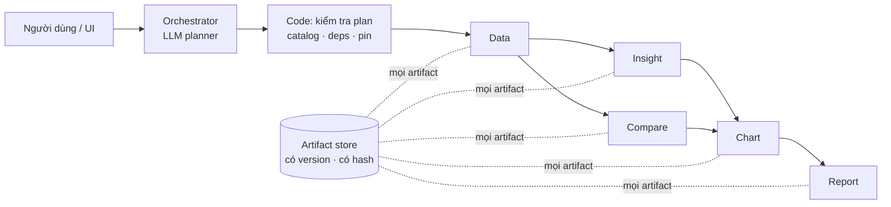

# VDaAgent

Trợ lý phân tích gồm 6 agent, dành cho Sales Ops bất động sản. Bạn đặt câu hỏi bằng ngôn ngữ tự nhiên, ví dụ "Vì sao căn
A12-08 bán chậm? So sánh với các căn tương đồng, vẽ biểu đồ và xuất báo cáo.". Hệ thống trả về câu trả lời có trích dẫn,
biểu đồ và báo cáo 6 phần.

- **Các agent:** Orchestrator, Data, Insight, Compare, Chart và Report. Chúng là plugin chạy trong cùng một tiến trình
  Backend, và chỉ giao tiếp qua engine của Backend cùng một artifact store dùng chung.
- **LLM ở chỗ cần ngôn ngữ, code ở chỗ cần con số.**
  - LLM của Orchestrator hiểu câu hỏi và đề xuất plan. Code kiểm tra plan rồi chạy nó dưới dạng DAG.
  - Insight dùng LLM để diễn đạt kết quả.
  - Data, Compare, Chart và Report chạy deterministic.
- **Truy vết được.**
  - Mọi artifact đều có version và content hash.
  - Mọi con số trong biểu đồ hay báo cáo đều có `source_ref` trỏ về đúng field của artifact.
  - Mỗi run pin một snapshot (`SNAP-2026-09-28`) và một semantic version (`sc-1`).

## Kiến trúc tóm tắt



- Chi tiết: [docs/architecture/MULTI_AGENT_SYSTEM_ARCHITECTURE.md](docs/architecture/MULTI_AGENT_SYSTEM_ARCHITECTURE.md).
- Trạng thái hiện tại và các blocker: [AGENTS.md](AGENTS.md).

## Yêu cầu

- Docker kèm Docker Compose v2 (`docker compose version`).
- GNU make.
- Một API key tương thích OpenAI, cho mode live.

**Không cần cài Node/npm hay Python trên máy để chạy demo Docker.** Image tự build frontend React, và container backend
phục vụ cả UI lẫn API trên cùng một cổng. Không cần `npm run dev`.

## 1. Clone và tạo file env

```bash
git clone git@github.com:HOANGQUANGMINH371195/Team_6_cAi.git
cd Team_6_cAi
make docker-env        # tạo agents/<name>/.env từ .env.example (không bao giờ ghi đè file đã có)
```

Điền key vào các file. Mọi `.env` đều được gitignore và được mount chỉ đọc vào container; không file nào bị đóng vào
image.

| File | Cho mode live | Ghi chú |
|---|---|---|
| `agents/orchestrator/.env` | **bắt buộc:** `OPENAI_API_KEY`, `OPENAI_BASE_URL`, `LLM_MODEL` | LLM planner. Đã kiểm chứng với `gpt-4o-mini`. |
| `agents/data/.env` | **bắt buộc:** cùng 3 biến trên | Thiếu thì plugin không load. Trên đường demo, Data không gọi LLM. |
| `agents/report/.env` | **bắt buộc:** cùng 3 biến trên | Giống Data. Bản thân báo cáo là deterministic. |
| `agents/insight/.env` | `OPENAI_API_KEY` và/hoặc `GEMINI_API_KEY` | Không có key nào thì Insight diễn đạt bằng template. |
| `agents/compare/.env`, `agents/chart/.env` | file phải tồn tại; key tuỳ chọn | Deterministic trên đường demo. |

Không đặt các biến `ORCH_*` trong `.env`. Service live tự đặt chúng: `ORCH_LLM=on`,
`ORCH_SNAPSHOT_ID=SNAP-2026-09-28`, `ORCH_SEMANTIC_VERSION=sc-1`, `ORCH_DAG_TIMEOUT_S=300`.

## 2. Khởi động demo live

```bash
make docker-live-up
```

Lệnh này build image, seed dữ liệu demo vào volume `vdagent_live_var`, khởi động `backend-live` ở
**http://localhost:8022**, đợi container `healthy`, rồi in trạng thái.

## 3. Kiểm tra hệ thống đã chạy

```bash
make docker-live-check
```

Output mong đợi (không bao giờ in key):

```
backend:   http://localhost:8022
ORCH_LLM               on
ORCH_SNAPSHOT_ID       SNAP-2026-09-28
ORCH_SEMANTIC_VERSION  sc-1
ORCH_DAG_TIMEOUT_S     300
health                 healthy
agents                 orchestrator data compare insight report chart
orchestrator: LLM planner on (model gpt-4o-mini), snapshot SNAP-2026-09-28, semantic sc-1
insight: data source fixtures, LLM on
```

Nếu dòng `agents` thiếu agent nào, chạy `make docker-live-logs | grep failed`. Log sẽ nêu tên biến bị thiếu.

## 4. Demo 4 happy case

1. Mở **http://localhost:8022**.
2. Chọn user **Alice** (dropdown góc trên bên trái).
3. Click agent **orchestrator**.
4. Dán prompt và nhấn Enter.

| # | Prompt | Plan do LLM lập | Kết quả cần thấy |
|---|---|---|---|
| HC1 | `Vì sao căn A12-08 bán chậm?` | Data → Insight | Tồn 138 ngày; "có khả năng liên quan" tới giá cao hơn peer 12,4% |
| HC2 | `So sánh căn A12-08 với các căn tương đồng và chỉ ra những khác biệt đáng chú ý.` | Data → Compare | 72.500.000 so với 64.500.000 VND/m² (+12,40%), DOM 138 so với 61, **5 peer**, ghi chú B-11 |
| HC3 | `Phân tích căn A12-08 và cho tôi các biểu đồ quan trọng.` | Data → [Insight ∥ Compare] → Chart | 5 id biểu đồ |
| HC4 | `Vì sao căn A12-08 bán chậm? So sánh với các căn tương đồng, vẽ biểu đồ và xuất báo cáo.` | Data → [Insight ∥ Compare] → Chart → Report | đủ 6 agent; trong **Artifacts → Reports** có báo cáo 6 phần với 5 biểu đồ render |

- Các bước của plan và các wave (vd `[[B1],[B2,B3],[B4],[B5]]` với HC4) được ghi trong `run_state` của mỗi run.
- Để xem plan của LLM trong log: `docker compose --profile live logs backend-live | grep "llm plan accepted"`.
- Kịch bản demo đầy đủ, lời thuyết trình và những điều không được nói:
  [docs/integration/DEMO_RUNBOOK_4_HAPPY_CASES.md](docs/integration/DEMO_RUNBOOK_4_HAPPY_CASES.md).

## 5. Dừng và dọn dẹp

```bash
make docker-live-down     # dừng, giữ dữ liệu
make docker-live-clean    # xoá container live và volume vdagent_live_var (lần start sau sẽ sạch)
```

## Các mode khác

| Mode | Lệnh | URL | Dùng khi |
|---|---|---|---|
| Offline (không cần key, planner deterministic) | `make docker-offline-up` / `make docker-offline-down` / `make docker-offline-clean` | http://localhost:8001 | demo dự phòng, regression |
| Bộ acceptance (stack mới, tách biệt) | `acceptance/ws7/run.sh` (đặt `WS7_BROWSER_PYTHON` là Python có Playwright để chạy bước trình duyệt) | cổng 8021 | phải in `WS7 acceptance: PASS` |
| Bộ test offline trong Docker | `make docker-test` | — | lần chạy gần nhất: 1231 pass / 29 skip |
| Stack dev (`./var`, cấu hình cũ) | `make docker-up` / `make docker-down` | http://localhost:8000 | **không phải** demo live: stack này không đặt pin `ORCH_*`, nên LLM planner trả `SNAPSHOT_REQUIRED` |
| Chạy local không dùng Docker | `uv sync`, `make reset-db`, `make backend`, rồi `cd frontend && npm install && npm run dev` | :8000 / :5173 | phát triển |

Test trên máy: `uv sync && uv run pytest -q -p no:cacheprovider`. Test frontend: `cd frontend && npm test`.

## Xử lý sự cố

| Triệu chứng | Cách xử lý |
|---|---|
| `SNAPSHOT_REQUIRED — no snapshot configured` | Bạn đang ở stack dev (cổng 8000). Dùng `make docker-live-up` và cổng **8022**. |
| `port is already allocated` | Có thứ khác đang giữ cổng 8022. Chạy `docker ps --format '{{.Names}} {{.Ports}}'`, rồi `make docker-live-clean`. |
| `Không hoàn thành: LLM_PLAN_…` | Plan của LLM bị bước kiểm tra từ chối, nên chưa có gì chạy. Xem `make docker-live-logs \| grep "llm plan rejected"`. Gửi lại, hoặc dùng mode offline. |
| Thiếu một agent | Thiếu biến trong `agents/<name>/.env`. Xem `make docker-live-logs \| grep failed`. |
| Gửi xong không thấy task nào | Chưa chọn user. Chọn Alice. |

## Cần biết trước khi demo

- Compare dùng **5 peer**. Bộ "golden" 7 căn của nghiệp vụ chưa có luật chọn được duyệt (**B-11**, BLOCKED).
- Chỉ **Orchestrator** (lập plan) và **Insight** (diễn đạt) gọi LLM.
- Metric thiếu (`discount_pct`, `inquiry_leads_30d`) được báo là không có dữ liệu, không bao giờ là 0.
- Các phát hiện là tương quan ("có khả năng liên quan"), không phải nguyên nhân.
- **Chưa sẵn sàng production.** Danh tính người dùng chỉ là header demo `X-User-Id` (F-05, BLOCKED); xem
  [docs/integration/AUTH_DESIGN.md](docs/integration/AUTH_DESIGN.md).

## Tham chiếu cho developer

- Danh sách plugin nằm trong `backend/config.yaml` (trong Docker là `backend/config.compose.yaml`).
- Mỗi plugin export `setup(api, opts)` và chỉ phụ thuộc `vdagent_sdk` (`sdk/`, luật lượt chạy R1–R11).
- Plugin load lỗi sẽ được log là `plugin <module> failed: …` và bị bỏ qua.
- Thêm agent: copy `agents/_template`, thêm vào uv workspace trong `pyproject.toml`, rồi liệt kê dưới `plugins:`.
- Contract (`StepSpec@1`, `AgentReport@1`, envelope của artifact, catalog) nằm trong `contracts/vdagent_contracts/`.
- Override của Backend (`backend/.env`, tuỳ chọn): `VDAGENT_MCP_PUBLIC_URL`, `VDAGENT_BACKEND_DB`,
  `VDAGENT_WAREHOUSE_DB`, `VDAGENT_FRONTEND_DIST`, `VDAGENT_MAX_DEPTH` (4), `VDAGENT_MAX_STEPS` (12), `VDAGENT_CONFIG`.
- Design spec: [docs/superpowers/specs/](docs/superpowers/specs/). Kế hoạch tích hợp và bằng chứng:
  [docs/integration/](docs/integration/).
