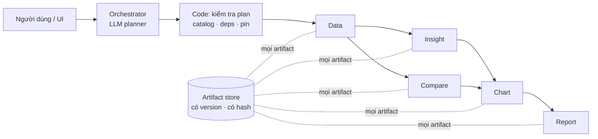

# VDaAgent

Trợ lý phân tích gồm 6 agent, dành cho Sales Ops bất động sản. Bạn đặt câu hỏi bằng ngôn ngữ tự nhiên, ví dụ "Vì sao căn
A12-08 bán chậm? So sánh với các căn tương đồng, vẽ biểu đồ và xuất báo cáo.". Hệ thống trả về câu trả lời có trích dẫn,
biểu đồ và báo cáo 6 phần.

- **Các agent:** Orchestrator, Data, Insight, Compare, Chart và Report. Chúng là plugin chạy trong cùng một tiến trình
  Backend, và chỉ giao tiếp qua engine của Backend cùng một artifact store dùng chung.
- **LLM ở chỗ cần ngôn ngữ, code ở chỗ cần con số.**
  - LLM của Orchestrator hiểu câu hỏi và đề xuất plan. Code kiểm tra plan rồi chạy nó dưới dạng DAG.
  - Insight dùng LLM để diễn đạt kết quả.
  - Data, Compare, Chart và Report chạy deterministic.
- **Truy vết được.**
  - Mọi artifact đều có version và content hash.
  - Mọi con số trong biểu đồ hay báo cáo đều có `source_ref` trỏ về đúng field của artifact.
  - Mỗi run pin một snapshot (`SNAP-2026-09-28`) và một semantic version (`sc-1`).

## Kiến trúc tóm tắt



- Chi tiết: [docs/architecture/MULTI_AGENT_SYSTEM_ARCHITECTURE.md](docs/architecture/MULTI_AGENT_SYSTEM_ARCHITECTURE.md).
- Trạng thái hiện tại và các blocker: [AGENTS.md](AGENTS.md).

## Chạy POC (LLM bật) trong 3 bước

**Cần có:** Docker kèm Compose v2 (`docker compose version`), GNU make, và một API key tương thích OpenAI.
**Không cần** Node/npm hay Python trên máy: image tự build frontend, và một container phục vụ cả UI lẫn API.

### Bước 1: clone

```bash
git clone git@github.com:HOANGQUANGMINH371195/Team_6_cAi.git
cd Team_6_cAi
```

### Bước 2: điền key

```bash
make docker-env     # tạo agents/<name>/.env từ .env.example (không ghi đè file đã có)
```

Mở và điền các file sau. Mọi `.env` đều được gitignore, mount chỉ đọc vào container, không bao giờ vào image.

| File | Cần điền | Ghi chú |
|---|---|---|
| `agents/orchestrator/.env` | `OPENAI_API_KEY`, `OPENAI_BASE_URL`, `LLM_MODEL` | LLM planner. Đã kiểm chứng với `gpt-4o-mini`. |
| `agents/data/.env`, `agents/report/.env` | cùng 3 biến trên | Thiếu thì plugin không load. Trên đường demo không gọi LLM. |
| `agents/insight/.env` | `OPENAI_API_KEY` và/hoặc `GEMINI_API_KEY` | Không có key thì Insight diễn đạt bằng template. |
| `agents/compare/.env`, `agents/chart/.env` | không bắt buộc | Chỉ cần file tồn tại. |

Không đặt biến `ORCH_*` trong `.env`. Service live tự đặt `ORCH_LLM=on`, `ORCH_SNAPSHOT_ID=SNAP-2026-09-28`,
`ORCH_SEMANTIC_VERSION=sc-1`, `ORCH_DAG_TIMEOUT_S=300`.

### Bước 3: một lệnh, một URL

```bash
make docker-live-up
```

Rồi mở **http://localhost:8022**.

Lệnh này làm lần lượt:
1. Tạo `.env` còn thiếu.
2. Chạy **preflight** (`docker/check-env.sh`): chỉ in tên file và tên biến bị thiếu, không in giá trị, và dừng nếu còn thiếu.
3. Build image và seed dữ liệu demo vào volume `vdagent_live_var`.
4. Đợi container `healthy`, rồi in trạng thái.

Lần đầu mất vài phút để build image; những lần sau khoảng 30 giây.

Output cuối phải có (không bao giờ in key):

```
ORCH_LLM               on
ORCH_SNAPSHOT_ID       SNAP-2026-09-28
ORCH_SEMANTIC_VERSION  sc-1
health                 healthy
agents                 orchestrator data compare insight report chart
orchestrator: LLM planner on (model gpt-4o-mini), snapshot SNAP-2026-09-28, semantic sc-1
```

**Thử ngay:**
1. Trên http://localhost:8022, chọn user **Alice**, click agent **orchestrator**.
2. Dán câu sau rồi nhấn Enter:
   ```
   Vì sao căn A12-08 bán chậm? So sánh với các căn tương đồng, vẽ biểu đồ và xuất báo cáo.
   ```
3. Sau khoảng 20–30 giây: bảng B1…B5 "hoàn tất". Mở **Artifacts → Reports → "Báo cáo căn A12-08 @ SNAP-2026-09-28"**
   để xem báo cáo 6 phần với 5 biểu đồ.

| Việc | Lệnh |
|---|---|
| Xem lại trạng thái | `make docker-live-check` |
| Xem log | `make docker-live-logs` |
| Dừng (giữ dữ liệu) | `make docker-live-down` |
| Xoá sạch (container và volume) | `make docker-live-clean` |

## Demo 4 happy case

Thao tác: chọn user **Alice**, click agent **orchestrator**, dán prompt, nhấn Enter.

| # | Prompt | Plan do LLM lập | Kết quả cần thấy |
|---|---|---|---|
| HC1 | `Vì sao căn A12-08 bán chậm?` | Data → Insight | Tồn 138 ngày; "có khả năng liên quan" tới giá cao hơn peer 12,4% |
| HC2 | `So sánh căn A12-08 với các căn tương đồng và chỉ ra những khác biệt đáng chú ý.` | Data → Compare | 72.500.000 so với 64.500.000 VND/m² (+12,40%), DOM 138 so với 61, **5 peer**, ghi chú B-11 |
| HC3 | `Phân tích căn A12-08 và cho tôi các biểu đồ quan trọng.` | Data → [Insight ∥ Compare] → Chart | 5 id biểu đồ |
| HC4 | `Vì sao căn A12-08 bán chậm? So sánh với các căn tương đồng, vẽ biểu đồ và xuất báo cáo.` | Data → [Insight ∥ Compare] → Chart → Report | đủ 6 agent; báo cáo 6 phần với 5 biểu đồ |

- Plan do LLM lập nằm trong log: `docker compose --profile live logs backend-live | grep "llm plan accepted"`.
- Kịch bản demo đầy đủ:
  [docs/integration/DEMO_RUNBOOK_4_HAPPY_CASES.md](docs/integration/DEMO_RUNBOOK_4_HAPPY_CASES.md).

## Các mode khác

| Mode | Lệnh | URL | Dùng khi |
|---|---|---|---|
| Offline (không cần key, planner deterministic) | `make docker-offline-up` / `-down` / `-clean` | http://localhost:8001 | demo dự phòng, regression |
| Stack dev (`./var` trên máy, LLM bật khi có key, đã pin snapshot/semantic) | `make docker-up` / `make docker-down` | http://localhost:8000 | phát triển; demo nên dùng `make docker-live-up` |
| Bộ acceptance (stack mới, tách biệt) | `acceptance/ws7/run.sh` (đặt `WS7_BROWSER_PYTHON` là Python có Playwright) | cổng 8021 | phải in `WS7 acceptance: PASS` |
| Bộ test trong Docker | `make docker-test` | — | lần chạy gần nhất: 1325 pass / 29 skip / 0 fail |
| Chạy local không dùng Docker | `uv sync`, `make reset-db`, `make backend`, rồi `cd frontend && npm install && npm run dev` | :8000 / :5173 | phát triển |

Test trên máy: `uv sync && uv run pytest -q -p no:cacheprovider`. Test frontend: `cd frontend && npm test`.

## Xử lý sự cố

| Triệu chứng | Cách xử lý |
|---|---|
| `MISSING agents/<name>/.env` / `EMPTY … : <KEY>` (preflight) | Chạy `make docker-env`, điền đúng biến được nêu, rồi chạy lại `make docker-live-up`. |
| `SNAPSHOT_REQUIRED — no snapshot configured` | Container đang chạy được tạo từ cấu hình cũ. Chạy `make docker-live-up` (hoặc `make docker-up`) để tạo lại container. |
| `port is already allocated` | Có thứ khác đang giữ cổng 8022. Chạy `docker ps --format '{{.Names}} {{.Ports}}'`, rồi `make docker-live-clean`. |
| `Không hoàn thành: LLM_PLAN_…` | Plan của LLM bị bước kiểm tra từ chối, nên chưa có gì chạy. Xem `make docker-live-logs \| grep "llm plan rejected"`. Gửi lại, hoặc dùng mode offline. |
| Thiếu một agent | Thiếu biến trong `agents/<name>/.env`. Xem `make docker-live-logs \| grep failed`. |
| Gửi xong không thấy task nào | Chưa chọn user. Chọn Alice. |

## Cần biết trước khi demo

- Compare dùng **5 peer**. Bộ "golden" 7 căn của nghiệp vụ chưa có luật chọn được duyệt (**B-11**, BLOCKED).
- Chỉ **Orchestrator** (lập plan) và **Insight** (diễn đạt) gọi LLM.
- Metric thiếu (`discount_pct`, `inquiry_leads_30d`) được báo là không có dữ liệu, không bao giờ là 0.
- Các phát hiện là tương quan ("có khả năng liên quan"), không phải nguyên nhân.
- **Chưa sẵn sàng production.** Danh tính người dùng chỉ là header demo `X-User-Id` (F-05, BLOCKED); xem
  [docs/integration/AUTH_DESIGN.md](docs/integration/AUTH_DESIGN.md).

## Tham chiếu cho developer

- Tài liệu SDK và MCP tool cho người viết agent: `make sdk-docs` (build vào `docs/sdk/`, đã gitignore) hoặc
  `make sdk-docs-serve` rồi mở http://127.0.0.1:8080.
- Plugin nằm trong `backend/config.yaml` (trong Docker là `backend/config.compose.yaml`); mỗi plugin export
  `setup(api, opts)` và chỉ phụ thuộc `vdagent_sdk` (`sdk/`). Plugin load lỗi được log `plugin <module> failed: …` và bị
  bỏ qua.
- **Quyền MCP tool** cấp theo từng plugin bằng `mcp_tools: [...]` trong config; plugin không có `mcp_tools` không thấy
  tool nào. Quyền ghi artifact theo loại vẫn do Backend kiểm (mỗi agent chỉ ghi loại của mình).
- Một lượt chạy báo từng bước qua `ctx`: `emit_assistant`, rồi đúng một kết quả cho mỗi tool call
  (`emit_tool_result`; với `send_to_agent` thì `call_agent` trước), và kết thúc bằng một bước không có tool call (câu
  trả lời). Sai thứ tự → Backend đánh lượt đó `contract violation: …`.
- Plugin dùng chung tiến trình và event loop: không được block loop, không ghi `os.environ`, và giữ trạng thái theo user
  trong `ctx.memory` (FTS5 + sqlite-vec trong `backend.db`), không lưu trên object của agent.
- Thêm agent: copy `agents/_template` thành `agents/<name>` (đổi `agent_template/` thành `vdagent_<name>/`); thêm vào
  `[tool.uv.workspace].members`, `[tool.basedpyright].extraPaths`, `dependencies` và `[tool.uv.sources]` của
  `pyproject.toml` gốc rồi `uv sync`; liệt kê `- module: vdagent_<name>` kèm `mcp_tools` trong cả hai file config; với
  Docker thì copy `pyproject.toml` của nó trong `Dockerfile.python` và mount `.env` trong `docker-compose.yml`.
- Backend (kiến trúc mới từ `main`): `runtime/` (engine), `http/` (REST + SSE), `mcp/` (`catalog.py` + `handlers.py`),
  `persistence/` (SQLAlchemy Core + Alembic), `artifacts/`, `conversations/`. Contract (`StepSpec@1`, `AgentReport@1`,
  envelope, catalog) nằm trong `contracts/vdagent_contracts/`.
- Override của Backend (`backend/.env`, tuỳ chọn): `VDAGENT_<KEY>` cho mọi khoá vô hướng của config, vd
  `VDAGENT_BACKEND_DB`, `VDAGENT_RE_WAREHOUSE_DB`, `VDAGENT_MCP_PUBLIC_URL`, `VDAGENT_MAX_STEPS`, và `VDAGENT_CONFIG`.
- Lịch sử thiết kế (spec có ngày): [docs/superpowers/specs/](docs/superpowers/specs/). Kế hoạch tích hợp và bằng chứng:
  [docs/integration/](docs/integration/).
