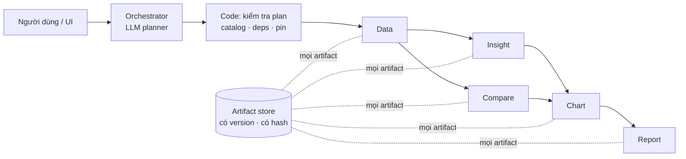

# VDaAgent

Trợ lý phân tích gồm 6 agent, dành cho Sales Ops bất động sản. Bạn đặt câu hỏi bằng ngôn ngữ tự nhiên, ví dụ "Vì sao căn
MAS-U03832 bán chậm? So sánh với các căn tương đồng, vẽ biểu đồ và xuất báo cáo.". Hệ thống đọc **kho dữ liệu thật**
(PostgreSQL của team DATA) và trả về câu trả lời có trích dẫn, biểu đồ và báo cáo 6 phần.

- **Các agent:** Orchestrator, Data, Insight, Compare, Chart và Report. Chúng là plugin chạy trong cùng một tiến trình
  Backend, và chỉ giao tiếp qua engine của Backend cùng một artifact store dùng chung.
- **LLM ở chỗ cần ngôn ngữ, code ở chỗ cần con số.**
  - LLM của Orchestrator hiểu câu hỏi và đề xuất plan. Code kiểm tra plan rồi chạy nó dưới dạng DAG.
  - Insight dùng LLM để diễn đạt kết quả.
  - Data, Compare, Chart và Report chạy deterministic.
- **Truy vết được.**
  - Mọi artifact đều có version và content hash.
  - Mọi con số trong biểu đồ hay báo cáo đều có `source_ref` trỏ về đúng field của artifact.
  - Mỗi run pin một snapshot (`SNAP-2026-09-28`) và một semantic version (`sc-1`).

## Kiến trúc tóm tắt



- Chi tiết: [docs/architecture/MULTI_AGENT_SYSTEM_ARCHITECTURE.md](docs/architecture/MULTI_AGENT_SYSTEM_ARCHITECTURE.md).
- Trạng thái hiện tại và các blocker: [AGENTS.md](AGENTS.md).

## Quick Start

**Cần có:** Docker với Compose v2, GNU make, một API key tương thích OpenAI và **kho dữ liệu PostgreSQL** (xem bên dưới).
Không cần Python hay Node trên máy.

### 1. Clone

```bash
git clone git@github.com:HOANGQUANGMINH371195/Team_6_cAi.git
cd Team_6_cAi
```

### 2. Configure

```bash
cp .env.example .env
```

Điền vào `.env`:

| Biến | Bắt buộc? | Ghi chú |
|---|---|---|
| `OPENAI_API_KEY` | **bắt buộc** | key của endpoint tương thích OpenAI |
| `OPENAI_BASE_URL` | **bắt buộc** | đã điền sẵn `https://api.openai.com/v1` |
| `LLM_MODEL` | **bắt buộc** | đã điền sẵn `gpt-4o-mini` (đã kiểm chứng) |
| `VDAGENT_RE_WAREHOUSE_DB` | **bắt buộc** | DSN của kho thật: `postgresql://vdagent_reader:<mật khẩu>@<host>:<port>/<db>`, nhìn **từ trong Docker** |
| `ORCH_SNAPSHOT_ID` | **bắt buộc** | đã điền sẵn `SNAP-20260630-01`; phải là snapshot APPROVED trong kho |
| `ORCH_SEMANTIC_VERSION` | **bắt buộc** | đã điền sẵn `3.1.0`; phải khớp snapshot |
| `GEMINI_API_KEY` | tuỳ chọn | Insight dùng Gemini trước nếu có key này |
| `VDAGENT_PORT` | tuỳ chọn | cổng của UI và API, mặc định `8000` |

**Host trong DSN:** PostgreSQL ở máy khác thì dùng tên/IP của máy đó. PostgreSQL trên chính máy bạn thì dùng
`host.docker.internal`, và cổng của nó phải mở cho Docker (vd `-p 172.17.0.1:5433:5432`); `127.0.0.1`/`localhost` bị
từ chối vì trong container đó là chính container.

**Chưa có endpoint kho thật?** Dựng bản snapshot `SNAP-20260630-01` mà team DATA giao trong `warehouse/backup/` theo
[agents/data/README.md](agents/data/README.md#1-dựng-postgres-và-nạp-dw-một-lần) bước 1–2, rồi dùng
`VDAGENT_RE_WAREHOUSE_DB=postgresql://vdagent_reader:<mật khẩu>@host.docker.internal:5433/cdw`.

### 3. Run

```bash
make up
```

Lần đầu mất vài phút để build image. `make up` dừng ngay với thông báo rõ ràng (không in giá trị bí mật) nếu `.env` thiếu
biến, nếu kho không kết nối được từ Docker, hoặc nếu snapshot không có/không APPROVED trong kho. **Không bao giờ chạy
trên kho giả.** Khi xong, lệnh in:

```
Warehouse backend: PostgreSQL
Warehouse source: host.docker.internal:5433/cdw
Snapshot: SNAP-20260630-01 (APPROVED)
Semantic version: 3.1.0
agents loaded: chart compare data insight orchestrator report
VDaAgent is up: http://localhost:8000  (UI and API)
```

### 4. Open

UI: http://localhost:8000
API: http://localhost:8000/api (header `X-User-Id: u_000000000001`)

Thử: chọn user **Alice** (thấy dự án 100 và 400), click agent **orchestrator**, gửi
`Vì sao căn MAS-U03832 bán chậm? So sánh với các căn tương đồng, vẽ biểu đồ và xuất báo cáo.`
Sau khoảng 1 phút: bảng B1…B5 "hoàn tất"; báo cáo nằm ở **Artifacts → Reports**.

### Stop

```bash
make down
```

Dữ liệu ứng dụng (người dùng, hội thoại, artifact) giữ trong Docker volume `vdagent_real_var`. Làm lại từ đầu:
`make down && docker volume rm vdagent_real_var`.

### Logs

```bash
make logs
```

## Câu hỏi thử trên kho thật

Đã kiểm chứng 2026-10-01 trên `SNAP-20260630-01` / `3.1.0` (user **Alice**):

| Prompt | Plan | Kết quả |
|---|---|---|
| `Vì sao căn MAS-U03832 bán chậm? So sánh với các căn tương đồng, vẽ biểu đồ và xuất báo cáo.` | Data → [Insight ∥ Compare] → Chart → Report | 13 căn tương đồng; 53.449.321 so với 52.577.623 VND/m² (+1,66%); `SEVERE_PHYSICAL_DEFECT`, `LOW_SALES_INCENTIVE`; biểu đồ; báo cáo 6 phần |
| `Vì sao căn OCP-U00005 bán chậm? So sánh với các căn tương đồng, vẽ biểu đồ và xuất báo cáo.` | như trên | Insight `DEEP_FUNNEL_DROP_OFF`; Compare chỉ còn 1 căn cùng đợt mở bán nên báo **không đủ dữ liệu so sánh** (đúng luật, không bịa nhóm) |

Plan do LLM lập nằm trong log: `make logs | grep "llm plan accepted"`.

## Các mode khác

| Mode | Lệnh | URL | Dùng khi |
|---|---|---|---|
| **Kho giả** (dữ liệu tổng hợp, căn `A12-08`; không cần key, planner deterministic) | `make mock-up` / `make mock-down` | http://localhost:8001 | test, phát triển offline; **không** phải sản phẩm |
| Bộ acceptance trên kho giả (stack mới, tách biệt) | `acceptance/ws7/run.sh` (đặt `WS7_BROWSER_PYTHON` là Python có Playwright) | cổng 8021 | regression |
| Bộ test trong Docker | `make docker-test` | — | không cần mạng, không cần key |
| Chạy local không dùng Docker | `uv sync`, `make reset-db`, `make backend`, rồi `cd frontend && npm install && npm run dev` | :8000 / :5173 | phát triển; kho thật: xem [agents/data/README.md](agents/data/README.md) |

Kịch bản 4 happy case trên kho giả (căn `A12-08`):
[docs/integration/DEMO_RUNBOOK_4_HAPPY_CASES.md](docs/integration/DEMO_RUNBOOK_4_HAPPY_CASES.md).

Test trên máy: `uv sync && uv run pytest -q -p no:cacheprovider`. Test frontend: `cd frontend && npm test`.

## Xử lý sự cố

| Triệu chứng | Cách xử lý |
|---|---|
| `MISSING .env` / `EMPTY .env: <KEY>` | `cp .env.example .env`, điền đúng biến được nêu, rồi `make up` lại. |
| `ERROR: Real warehouse is required. Set VDAGENT_RE_WAREHOUSE_DB in .env.` | Điền DSN PostgreSQL của kho thật. Kho giả chỉ chạy bằng `make mock-up`. |
| `points at 127.0.0.1/localhost` | Trong Docker đó là chính container. Dùng `host.docker.internal` (PostgreSQL trên máy bạn) hoặc host thật. |
| `ERROR: cannot reach the warehouse at …` | Sai host/cổng/mật khẩu, hoặc PostgreSQL chưa mở cổng cho Docker (vd thêm `-p 172.17.0.1:5433:5432`). |
| `ERROR: snapshot … is not in the warehouse` / `not APPROVED` / `semantic version` | Sửa `ORCH_SNAPSHOT_ID` / `ORCH_SEMANTIC_VERSION` trong `.env` theo danh sách thông báo in ra. |
| `MISSING agents: …` | Một plugin không load. Xem `make logs \| grep failed`. |
| `port is already allocated` | Cổng 8000 đang bận. Đặt `VDAGENT_PORT=8010` trong `.env`, rồi `make up`. |
| `Không hoàn thành: LLM_PLAN_…` | Plan của LLM bị bước kiểm tra từ chối, nên chưa có gì chạy. Xem `make logs \| grep "llm plan rejected"`. Gửi lại. |
| `UNIT_NOT_FOUND` | Mã căn không thuộc phạm vi của user (Alice: dự án 100, 400; Bob: 200). |
| Gửi xong không thấy task nào | Chưa chọn user. Chọn Alice. |

## Cần biết trước khi demo

- Mỗi dataset ghi rõ nguồn trong `snapshot.warehouse` (`backend: postgresql`, host, database), và nhãn dữ liệu
  (`SNAPSHOT_STATUS_ASSUMED` cho kho thật, `SYNTHETIC_SOURCE` cho kho giả) suy ra từ nguồn thật, không từ cấu hình.
- Kho thật không có cột trạng thái duyệt snapshot: lớp view `re` ghi `APPROVED`, nên kết quả luôn kèm
  `SNAPSHOT_STATUS_ASSUMED`. Một số cột (`discount_pct`, `asking_price_per_m2`, …) bị lớp view che nên báo thiếu
  (xem [agents/data/README.md](agents/data/README.md#giới-hạn-đã-biết)).
- Luật chọn căn tương đồng của Compare (cùng loại căn, cùng đợt mở bán, diện tích ±10%, cùng nhóm hướng) chưa được
  nghiệp vụ duyệt (**B-11**); nhóm nhỏ hơn mức tối thiểu thì Compare báo không đủ dữ liệu.
- Metric thiếu được báo là không có dữ liệu, không bao giờ là 0. Các phát hiện là tương quan, không phải nguyên nhân.
- **Chưa sẵn sàng production.** Danh tính người dùng chỉ là header demo `X-User-Id` (F-05, BLOCKED); xem
  [docs/integration/AUTH_DESIGN.md](docs/integration/AUTH_DESIGN.md).

## Tham chiếu cho developer

- Tài liệu SDK và MCP tool cho người viết agent: `make sdk-docs` (build vào `docs/sdk/`, đã gitignore) hoặc
  `make sdk-docs-serve` rồi mở http://127.0.0.1:8080.
- Plugin nằm trong `backend/config.yaml` (trong Docker là `backend/config.compose.yaml`); mỗi plugin export
  `setup(api, opts)` và chỉ phụ thuộc `vdagent_sdk` (`sdk/`). Plugin load lỗi được log `plugin <module> failed: …` và bị
  bỏ qua.
- **Quyền MCP tool** cấp theo từng plugin bằng `mcp_tools: [...]` trong config; plugin không có `mcp_tools` không thấy
  tool nào. Quyền ghi artifact theo loại vẫn do Backend kiểm (mỗi agent chỉ ghi loại của mình).
- Một lượt chạy báo từng bước qua `ctx`: `emit_assistant`, rồi đúng một kết quả cho mỗi tool call
  (`emit_tool_result`; với `send_to_agent` thì `call_agent` trước), và kết thúc bằng một bước không có tool call (câu
  trả lời). Sai thứ tự → Backend đánh lượt đó `contract violation: …`.
- Plugin dùng chung tiến trình và event loop: không được block loop, không ghi `os.environ`, và giữ trạng thái theo user
  trong `ctx.memory` (FTS5 + sqlite-vec trong `backend.db`), không lưu trên object của agent.
- Thêm agent: copy `agents/_template` thành `agents/<name>` (đổi `agent_template/` thành `vdagent_<name>/`); thêm vào
  `[tool.uv.workspace].members`, `[tool.basedpyright].extraPaths`, `dependencies` và `[tool.uv.sources]` của
  `pyproject.toml` gốc rồi `uv sync`; liệt kê `- module: vdagent_<name>` kèm `mcp_tools` trong cả hai file config; với
  Docker thì copy `pyproject.toml` của nó trong `Dockerfile.python`; biến môi trường của nó đặt trong `.env` gốc.
- Backend (kiến trúc mới từ `main`): `runtime/` (engine), `http/` (REST + SSE), `mcp/` (`catalog.py` + `handlers.py`),
  `persistence/` (SQLAlchemy Core + Alembic), `artifacts/`, `conversations/`. Contract (`StepSpec@1`, `AgentReport@1`,
  envelope, catalog) nằm trong `contracts/vdagent_contracts/`.
- Override của Backend (`backend/.env`, tuỳ chọn): `VDAGENT_<KEY>` cho mọi khoá vô hướng của config, vd
  `VDAGENT_BACKEND_DB`, `VDAGENT_RE_WAREHOUSE_DB`, `VDAGENT_MCP_PUBLIC_URL`, `VDAGENT_MAX_STEPS`, và `VDAGENT_CONFIG`.
- Lịch sử thiết kế (spec có ngày): [docs/superpowers/specs/](docs/superpowers/specs/). Kế hoạch tích hợp và bằng chứng:
  [docs/integration/](docs/integration/).
