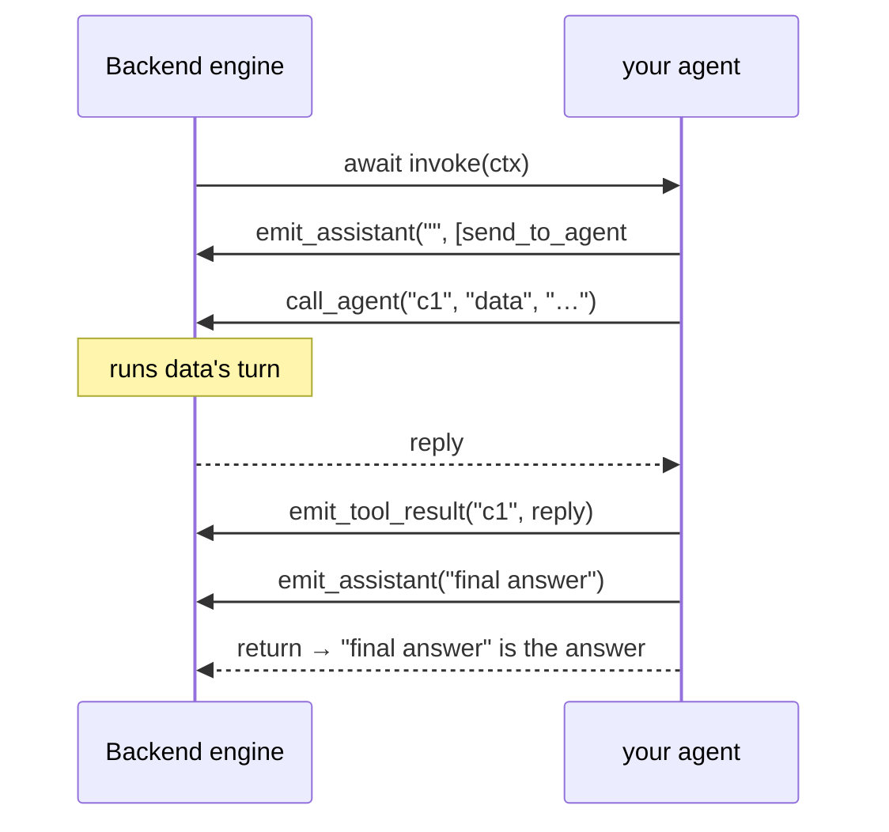

# Agent plugin template

Copy this folder to build a vdagent agent **plugin**. The Backend imports your package at startup
(it is listed under `plugins:` in `backend/config.yaml`), calls its `setup(api, opts)`, and runs
your agent's turns in its own process and event loop. You write the **brain** with whatever you
like — plain code, LiteLLM, LangChain/LangGraph, the OpenAI Agents SDK. Your only dependency on the
Backend is the `vdagent_sdk` package (`sdk/`), summarised below.

For the full reference (a complete example turn, the exact failure messages, what the Backend does
around a turn, troubleshooting), run `make sdk-docs-serve` and open http://127.0.0.1:8080. The same
text is the docstring of `sdk/vdagent_sdk/__init__.py`.

## What a plugin is

```
agents/<name>/
├── README.md
├── pyproject.toml              # "vdagent-<name>"; depends on vdagent-sdk + whatever the brain needs
├── .env.example                # settings your plugin reads (copy to .env, gitignored)
└── vdagent_<name>/
    ├── __init__.py             ← setup(api, opts): read config, build and register your agent(s)
    ├── agent.py                ← brain: your Agent
    ├── …                       ← anything else the brain needs (llm.py, prompts/, …)
    └── tests/test_agent.py     ← your tests
```

The **Backend** owns everything shared: loading plugins, the agent registry, MCP tool permissions,
routing and deadlock checks for agent calls, the checks on how a turn reports its steps, and every
agent's message history. An agent keeps no state between turns.

## Create a plugin

1. `cp -R agents/_template agents/<name>` and rename `agent_template/` → `vdagent_<name>/`.
2. In `agents/<name>/pyproject.toml`: set `name = "vdagent-<name>"`, `packages = ["vdagent_<name>"]`,
   and add the brain's dependencies.
3. Implement your agent in `agent.py` and register it from `setup()` in `__init__.py`
   (`api.register_agent(name="<name>", description="…", agent=...)`; peers see the description).
   Replace `tests/test_agent.py` with tests for it.
4. Root `pyproject.toml`: add `agents/<name>` to `[tool.uv.workspace].members` and
   `[tool.basedpyright].extraPaths`, `vdagent-<name>` to `dependencies`, and
   `vdagent-<name> = { workspace = true }` to `[tool.uv.sources]`. Run `uv sync`.
5. `Dockerfile.python`: add `COPY agents/<name>/pyproject.toml agents/<name>/pyproject.toml`
   next to the others; `docker-compose.yml`: mount `./agents/<name>/.env` read-only into the
   backend service like the others.
6. List `- module: vdagent_<name>` under `plugins:` in `backend/config.yaml` and
   `backend/config.compose.yaml`.
7. `cp agents/<name>/.env.example agents/<name>/.env`, add the settings your brain reads to both
   files, and fill in `.env`.
8. Grant MCP tools in `backend/vdagent_backend/mcp/tools.py` (`ALL_AGENTS` and `PERMISSIONS`);
   an agent name not listed there sees no MCP tools.
9. `uv run pytest agents/<name>`, then `make backend`: the log shows
   `plugin vdagent_<name> loaded: <name>`.

## Configuration

Plugins share the Backend's process, so **never write `os.environ`**: read your own
`agents/<name>/.env` with `dotenv.dotenv_values()` inside `setup()` and pass the values to your
agent. The bundled agents overlay the file on the process environment (`settings.read_env()`), so
the file wins. Raise `vdagent_sdk.PluginConfigError` for a missing or bad setting: the Backend logs
`plugin vdagent_<name> failed: <message>` and starts without your agent.

`opts` is the free-form mapping from the plugin's `config.yaml` entry (`opts: {...}`); the Backend
never interprets it. The echo template uses `opts["name"]` as its agent name (default `echo`).

## The contract

```python
def setup(api: PluginAPI, opts: Mapping[str, Any]) -> None: ...   # or async def

class PluginAPI(Protocol):
    plugin: str                      # your module name
    log: logging.Logger              # "vdagent.plugin.<module>"
    def register_agent(self, *, name: str, description: str, agent: Agent) -> None: ...
    def on_shutdown(self, fn: Callable[[], Awaitable[None]]) -> None: ...

class Agent(Protocol):
    async def invoke(self, ctx: InvocationContext) -> None: ...
    async def compact(self, previous_summary: str, messages: list[Message]) -> str: ...
```

Registrations are all-or-nothing per plugin: if `setup` raises, nothing it registered is kept.
`register_agent` raises `ValueError` for an empty name or description or a name another plugin
already took. `api` is only valid while `setup` runs.

`ctx` (one per turn) gives you:

| Field / method | What |
|---|---|
| `invocation_id`, `task_id`, `user_id` | Ids of this turn. |
| `summary` | Rolling summary of this user's earlier tasks (`""` if none). Put it in your system prompt. |
| `history` | This user's messages with your agent not yet folded into `summary`, as OpenAI chat dicts. Incoming messages read `[from: <sender>] …` (`user` or the calling agent); the last one started this turn. |
| `peers` | Every other registered agent (`name`, `description`). |
| `mcp` | `url` + `token` of the Backend's MCP server (streamable HTTP, `Authorization: Bearer <token>`); the token works only during this turn, and `tools/list` returns only the tools granted to your agent. |
| `max_steps` | Budget of assistant steps for this turn. |
| `memory` | This user's notes for your agent, kept by the Backend across tasks: `save(text, kind, embedding=None)`, `search(query, limit, embedding=None)` (keyword, or cosine nearest when you pass your own embedding), `recent(limit)`, `delete(id)`. What to remember and what reaches the model is yours to decide. |
| `await emit_assistant(content, tool_calls=())` | Record one assistant step (persisted and shown in the UI before it returns). |
| `await emit_tool_result(tool_call_id, content)` | Record one tool result. |
| `await call_agent(tool_call_id, target, message) -> str` | Ask another agent for a `send_to_agent` tool call; returns its reply or an `error: …` text (unknown agent, calling yourself, depth limit, deadlock, peer failed). Emit the reply with `emit_tool_result`. |

A turn, step by step:



### Requirements

The Backend checks these. Breaking one makes the offending `ctx` call raise `ContractViolation`
and fails the turn with `contract violation: <message>`, even if you catch the exception:

- **Record the step before its results.** Call `emit_assistant(content, tool_calls)` before any
  `emit_tool_result` or `call_agent` for those calls; start the next step only after every call of
  this step has a result. Tool-call ids are non-empty and unique within a step.
- **Give every tool call exactly one result**, including `send_to_agent` calls: `call_agent`, then
  `emit_tool_result` with its reply.
- **Call other agents only through `send_to_agent`.** `call_agent` only for a `send_to_agent` call of
  the latest step, once per id; no result for that id while its `call_agent` is still waiting.
- **End with an answer.** When `invoke` returns, every call has a result and the last step has no
  tool calls; its content is the answer. Nothing may use `ctx` after that.

Nothing checks these, so a mistake shows up as wrong behaviour:

- **Keep state only in `ctx`.** `summary`, `history` and `memory` are all you know about the user;
  save what must outlive the turn with `ctx.memory`.
- **Keep per-turn state off `self`.** One agent object serves concurrent turns of different users.
- **Report tool failures as results.** A failed tool becomes result content `error: …` and the turn
  continues. A model timeout: raise `AgentTimeoutError` (the turn fails with `DEADLINE_EXCEEDED`).
  Anything else raised fails the turn with `INTERNAL`.
- **Stay within `ctx.max_steps`** assistant steps; give the model no tools on the last one.
  Internal model calls (embeddings, extraction, judges) do not count.
- **Let cancellation through.** Never swallow `asyncio.CancelledError` (the user cancelled the task,
  or the Backend is stopping).
- **Do not block the event loop.** It is the Backend's; use `asyncio.to_thread` for blocking work.
- **Do not change process-wide state** such as `os.environ`.

## Tools

| Kind | Executed by | Access controlled by | Report it with |
|---|---|---|---|
| MCP tool (`run_query`, `create_chart`, …) | Backend `/mcp` via `ctx.mcp` | Backend `PERMISSIONS` | `emit_assistant` → `emit_tool_result` |
| `send_to_agent` (name is fixed: `vdagent_sdk.SEND_TO_AGENT`) | Backend routes to the peer | Backend call checks (unknown, self, depth, deadlock) | `emit_assistant` → `call_agent` → `emit_tool_result` |
| Local tool | Your plugin | You | `emit_assistant` → `emit_tool_result` |

Local tools are fine, with these rules:

1. **Emit them.** Unemitted steps are not recorded: they vanish from the next turn's history and
   from the UI.
2. Anything the user or another agent must reference (`ds_…`, `ch_…`, `rp_…`) must be created
   through MCP. Never open `warehouse.db` or `backend.db` directly — that bypasses read-only access
   and per-user ownership.
3. Per-user state across turns only in `ctx.memory`.
4. Apply your own timeout (the Backend has no per-turn deadline; MCP calls use 30 s).
5. Never name a tool `send_to_agent`; avoid MCP tool names; truncate large results (the bundled
   agents cut at 16 000 chars and append `…[truncated]`).

## Recipes

### LangChain v1 (`create_agent`) and LangGraph

Working, tested examples: [`agents/insight`](../insight/README.md) (LangChain `create_agent`; its
`CtxBridge` middleware in `bridge.py` maps the loop onto the contract, `MemoryMiddleware` in
`memory.py` uses `ctx.memory`) and [`agents/report`](../report/README.md) (a hand-built LangGraph
`StateGraph` in `graph.py`). `langchain-mcp-adapters` cannot be used: it requires `mcp<2`, and every
plugin shares the Backend's environment (mcp 2.x). Wrap your own MCP client's tools instead
(`agents/insight/vdagent_insight/tools.py`).

### OpenAI Agents SDK

> **Unexecuted sketch.** It shows where the framework plugs into the contract; check it against
> the framework's current docs and let tests that drive `invoke` with a recording `ctx` prove your version.

Emit from run hooks: `on_llm_end` sees one whole model response (all its tool calls together,
which is one assistant step), `on_tool_end` gets a `ToolContext` with the `tool_call_id`.

```python
from agents import Agent as SdkAgent, RunHooks, Runner, function_tool
from agents.mcp import MCPServerStreamableHttp
from agents.tool_context import ToolContext

from vdagent_sdk import InvocationContext, ToolCall


class EmitHooks(RunHooks):
    def __init__(self, ctx: InvocationContext) -> None:
        self.ctx = ctx

    async def on_llm_end(self, context, agent, response):
        text = "".join(part.text for item in response.output if item.type == "message"
                       for part in item.content if part.type == "output_text")
        calls = [ToolCall(i.call_id, i.name, i.arguments) for i in response.output if i.type == "function_call"]
        await self.ctx.emit_assistant(text, calls)

    async def on_tool_end(self, context, agent, tool, result):
        await self.ctx.emit_tool_result(context.tool_call_id, str(result))


def to_sdk_items(history):
    """Chat-completions dicts → Responses input items."""
    items = []
    for m in history:
        if m["role"] == "user":
            items.append({"role": "user", "content": m["content"]})
        elif m["role"] == "assistant":
            if m.get("content"):
                items.append({"role": "assistant", "content": m["content"]})
            for tc in m.get("tool_calls", []):
                items.append({"type": "function_call", "call_id": tc["id"],
                              "name": tc["function"]["name"], "arguments": tc["function"]["arguments"]})
        else:
            items.append({"type": "function_call_output", "call_id": m["tool_call_id"], "output": m["content"]})
    return items


class SdkBackedAgent:
    async def invoke(self, ctx: InvocationContext) -> None:
        @function_tool(name_override="send_to_agent")
        async def send_to_agent(tool_ctx: ToolContext, agent: str, message: str) -> str:
            """Send a message to another agent and wait for its reply."""
            return await ctx.call_agent(tool_ctx.tool_call_id, agent, message)

        async with MCPServerStreamableHttp(params={
            "url": ctx.mcp.url, "headers": {"Authorization": f"Bearer {ctx.mcp.token}"},
        }) as mcp:
            agent = SdkAgent(name="data", instructions=..., tools=[send_to_agent], mcp_servers=[mcp])
            await Runner.run(agent, to_sdk_items(ctx.history), hooks=EmitHooks(ctx), max_turns=ctx.max_steps)
```

Check that MCP tool calls reach `on_tool_end` with a `ToolContext` in your SDK version; otherwise
emit their results from a wrapper. `MaxTurnsExceeded` ends the run without a final step — emit
one, because a turn must end with a step that has no tool calls. Map the SDK's timeout exception to
`AgentTimeoutError`.

### Both

- Put `ctx.summary` in the system prompt, feed `ctx.history` as the conversation.
- Cap model calls at `ctx.max_steps` and make sure the turn ends with an assistant step that has no
  tool calls.
- Build per-turn objects inside `invoke`; the agent object is shared by concurrent turns.

## Testing

Test the brain without the Backend: call `invoke` with a small recording `ctx` (any object with the
`InvocationContext` fields and methods) and assert the steps it emitted; test `setup` with a fake
`PluginAPI` that records `register_agent`. `tests/test_agent.py` here shows both;
`agents/data/vdagent_data/tests/test_agent.py` is a complete example with a scripted LLM, a fake
MCP session and concurrent `call_agent` replies. Inject fakes for anything external (LLM, MCP)
through your agent's constructor, and keep `setup()` the only place that reads configuration.
