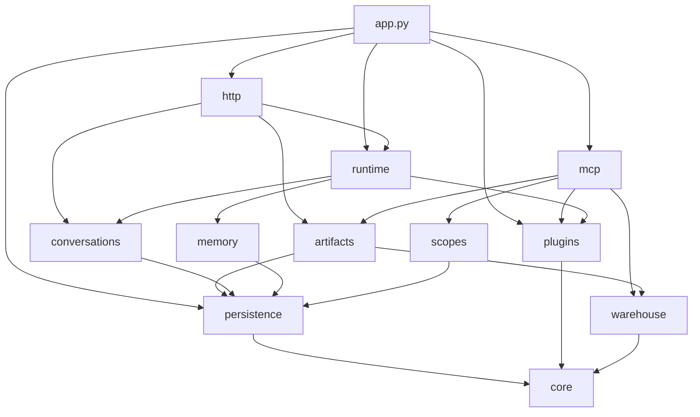
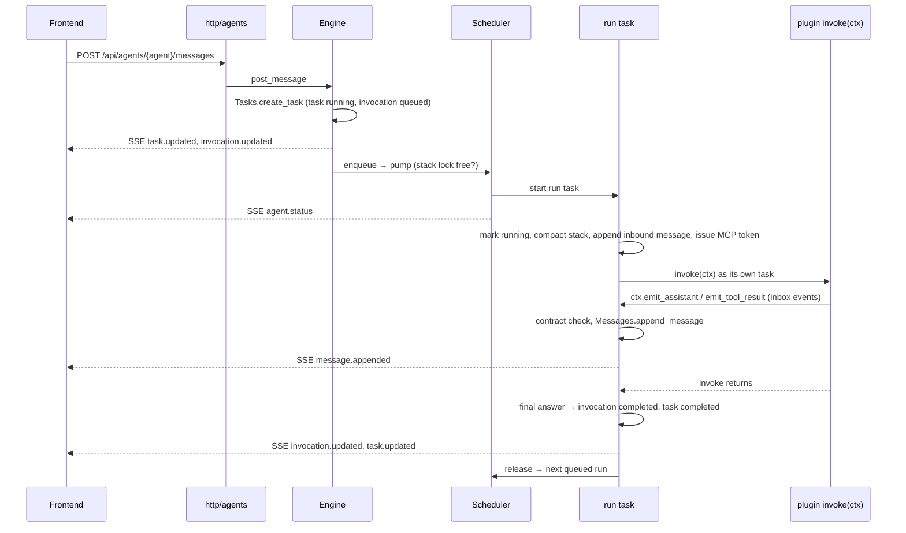
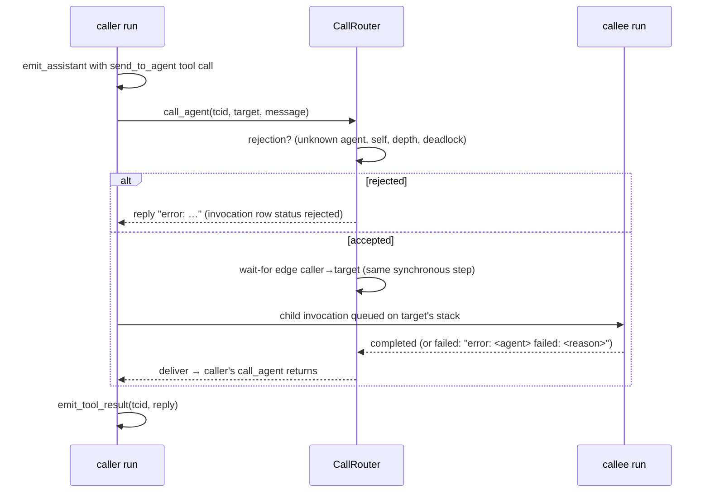
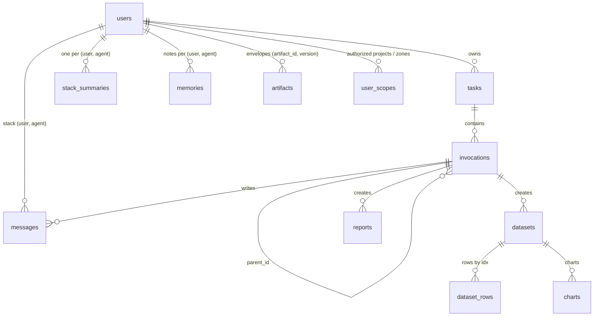

# vdagent Backend

For the backend team. Plugin authors start at `sdk/vdagent_sdk/__init__.py` and
`agents/_template/README.md`; this page is about the Backend itself.

## 1. What it is

One FastAPI process (`vdagent_backend.app:app`) that:

- loads the agent plugins listed in `config.yaml` and runs their turns in-process;
- serves the REST API and a per-user SSE stream to the frontend (`/api/*`), and the built frontend at `/`;
- serves an MCP server (`/mcp`) that agents call during a turn with a per-turn bearer token;
- stores everything in one database (`backend.db`, SQLite today, PostgreSQL prepared).

Runtime model: a single process with a single event loop. Every (user, agent) pair has a
**stack** (the chat history of that agent with that user). A human message creates a **task**; each
agent turn inside it is an **invocation**. One invocation per stack runs at a time; the others
queue. Agents call each other with `send_to_agent`, which queues a child invocation on the
callee's stack and resolves the caller's `call_agent` with the child's answer.

## 2. Package map and dependency rule

| Package | Owns |
|---|---|
| `app.py` | Composition root: `create_app`, lifespan, lazy `app` |
| `config.py` | `Config`, `PluginSpec` (incl. `mcp_tools`), `load_config` |
| `core/` | ids, clock, `describe`/`error_body`, SSE `EventBus`, MCP `TokenRegistry` |
| `persistence/` | `create_database`, table metadata, dialect types, query helpers, Alembic `migrate` |
| `plugins/` | `PluginManager`, immutable `AgentRegistry` with `tools_for(agent)` |
| `conversations/` | `Users`, `Tasks`, `Messages` repositories and their DTOs |
| `artifacts/` | `Artifacts` repository, `ArtifactService`, chart builder (Vega-Lite v6), `EnvelopeStore` + `verify_envelope` (versioned, hashed artifact envelopes of the six-agent DAG) |
| `warehouse/` | read-only SQL (`sql.py`) behind the async `Warehouse`; user-scoped SQL over the real-estate DW (`re_sql.py`) behind `RealEstateWarehouse` |
| `scopes/` | `UserScopes` (the only source of `get_user_context`), demo scope seeding (B-10) |
| `re_warehouse/` | builder of the real-estate DW mock (seed scripts, tests) |
| `memory/` | `ScopedMemory` (`ctx.memory`) and `MemorySearch` (the only dialect-specific queries) |
| `runtime/` | `Engine`, `Scheduler`, `CallRouter`, contract checks, compaction, `Publisher` |
| `http/` | one router per resource, SSE, SPA mount, `Services` |
| `mcp/` | `McpServer`, bearer auth, catalog, argument parsers, handlers, generated reference |



- `core` imports nothing of the Backend; `config` only `core`.
- Domains (`conversations`, `artifacts`, `memory`, `warehouse`) never import `http`, `mcp` or `runtime`.
- `http` and `mcp` never import each other. Only `app.py` imports everything.
- Across packages, import only the names in the package's `__init__.__all__`.

`tests/test_architecture.py` parses every import and fails on a forbidden edge. Each package's
`__init__.py` docstring says what it owns and what it may import.

## 3. Flows

### Human message → task → turn → SSE



### Agent call



### Cancel

`POST /api/tasks/{id}/cancel` → `Engine.cancel_task`: the task id joins the cancelled set; its
queued runs are dropped from every stack of that user; its running runs get `cancel_requested`
and their in-flight invoke or compaction is cancelled. Each run then patches its own stack
(missing tool results `error: turn aborted (cancelled)`, then `[turn failed: cancelled]`) and
releases its lock. Finally every non-terminal invocation of the task is marked `cancelled`, then
the task. A second cancel while one is in progress waits for it.

### Restart recovery

`Engine.recover()` runs in the lifespan before serving: every `queued`/`running` invocation left by
the previous process gets its stack patched with reason `backend restarted` and becomes `failed`;
every `running` task becomes `failed` with outcome `interrupted`, and the `on_interrupted` hook wired by
`app.py` (`ArtifactService.interrupt_run`) writes a new `interrupted` version of each of the task's run_states that was
still running (history kept). There is no automatic resume. `Engine.stop()` on shutdown only cancels run tasks; the
next startup's recovery fixes their rows.

### Run outcome and idempotency

A root turn may report its run's business outcome with `ctx.report_outcome("completed" | "partial" | "failed")`:
`failed` fails the task, `partial` keeps it `completed`; `tasks.outcome` holds it (plus `interrupted` from recovery).
`POST /api/agents/{agent}/messages` accepts `Idempotency-Key`: a retry with the same (user, agent, key) returns the first
task (`200`, `deduplicated: true`); the same key with other content is `409 idempotency_conflict`.

### MCP tool call

```mermaid
sequenceDiagram
  participant P as plugin (MCP client)
  participant A as BearerAuth
  participant M as McpServer
  participant T as McpTools
  participant D as ArtifactService / Warehouse
  P->>A: POST /mcp (Authorization: Bearer ctx.mcp.token)
  A->>A: TokenRegistry.resolve → McpIdentity(user, agent, invocation, task) or 401 invalid_token
  A->>M: tools/list or tools/call
  M->>M: registry.tools_for(agent)
  M->>T: call(identity, granted, name, args)
  T->>T: unknown tool / not granted / bad args → "error: …"
  T->>D: domain call (owner = identity.user_id; artifact_put: only the agent's WRITABLE_TYPES, filed under identity.task_id)
  D-->>P: JSON result text, or "error: <reason>"
```

## 4. Data model and invariants



`artifacts` rows are immutable (SQLite triggers): the only update sets `SUPERSEDED` on older versions; deletes are
refused. `tasks` carries `outcome` and `idempotency_key` (unique per user, agent, key). Revision `0003` adds all of this
and adopts databases created by staging-agent's `schema.sql` in place.

Tables are declared in `persistence/tables.py`. Timestamps are written by Python
(`core.utcnow()`) and read in the API format `YYYY-MM-DDTHH:MM:SS.mmmZ`.

Named invariants:

- **Stack lock**: one running invocation per (user, agent); only its run task writes that stack.
  Message `seq` is `max(seq) + 1` inside the INSERT, which is safe because of this lock.
- **Stack integrity**: every assistant tool call in a stack has a tool result, synthesised on
  failure, cancel or restart.
- **Acyclic wait graph**: a call that would close a cycle of waiting agents is rejected; the edge is
  added in the same synchronous step as the checks.
- **User isolation**: every read of user data filters on the owning user; another user's id reads
  like an unknown id.

## 5. Configuration

`config.yaml` (or the file named by `VDAGENT_CONFIG`; `config.compose.yaml` in Docker):

| Key | Meaning |
|---|---|
| `backend_db` | SQLite file of the Backend database |
| `warehouse_db` | SQLite warehouse, opened read-only |
| `mcp_public_url` | URL plugins' MCP clients use (this Backend's `/mcp`) |
| `frontend_dist` | built frontend served at `/` if present |
| `max_depth` | deepest agent call chain (root invocation is 0) |
| `max_steps` | step budget handed to plugins as `ctx.max_steps` |
| `plugins` | ordered list of `{module, opts, enabled, mcp_tools}` |

Every scalar key can be overridden with `VDAGENT_<KEY>` (e.g. `VDAGENT_BACKEND_DB`). The Backend's
`.env` (the nearest one above the config file) is loaded first; the process environment wins.

`mcp_tools` grants MCP tools to every agent the plugin entry registers:

```yaml
plugins:
  - module: vdagent_report
    mcp_tools: [create_chart, save_report, describe_dataset, get_dataset_rows]
```

An entry without `mcp_tools` gets no tools; an unknown tool name stops startup with a
`ValueError` naming the entry and the tool.

## 6. Persistence

Column types (`persistence/types.py`):

| Type | SQLite | PostgreSQL | Python value |
|---|---|---|---|
| `UtcTimestamp` | TEXT `…SS.ffffffZ` | `timestamptz` | bind an aware `datetime`, read `str` `…SS.mmmZ` |
| `Json` | TEXT | `JSONB` | any JSON-able value |
| `Boolean` | INTEGER 0/1 | `boolean` | `bool` |
| `Embedding` | BLOB (float32) | pgvector (with `PgMemorySearch`) | `list[float]` |

Repositories build Core statements (`select`, `insert`, `update`, `.returning(...)`) and run them
with `fetch_all`, `fetch_one`, `write_returning`, `write_returning_all`; rows are plain dicts keyed
by column name. No `text()` outside `memory/search.py` and dialect-gated migrations.

Migrations run at startup (`migrate(url)` in the lifespan, and in `data/seed_users.py`). A database
created before Alembic (it has `users` but no `alembic_version`) is stamped `0001` and upgraded.

Add a table or column:

1. Change `persistence/tables.py`.
2. Write a revision against a database created by the migrations (`make reset-db` first; an
   adopted pre-Alembic database differs in SQLite-only details and makes autogenerate noisy):

   ```bash
   uv run alembic -c backend/alembic.ini -x url=sqlite+aiosqlite:///var/backend.db \
     revision --autogenerate -m "add x"
   ```

3. Review the generated file in `persistence/migrations/versions/`, name it `NNNN_<slug>.py`,
   gate SQLite-only SQL on `op.get_bind().dialect.name`.
4. `uv run pytest backend/tests/persistence`: the drift test compares a migrated database with
   the metadata.

## 7. Recipes

**Add a REST endpoint.** Put the route in the router of its resource in `http/` (or a new
`http/<resource>.py` added to `http.install`). Parse input, call a repository, `ArtifactService` or
`Engine` through `Svc`, return a DTO; raise `ApiError`/`not_found` for errors. Test it through
`app_client` in `tests/http/`.

**Add an MCP tool.** Add its `types.Tool` and `RESULT_FIELDS` entry to `mcp/catalog.py`, a handler
method to `McpTools` in `mcp/handlers.py` (parse with `mcp/args.py`, call the domain), register it in
`McpTools._handlers`, and grant it in `config.yaml`. `tests/mcp` checks that the result fields match;
`make sdk-docs` regenerates the reference.

**Grant a tool.** Add its name to the plugin entry's `mcp_tools` in `config.yaml` and
`config.compose.yaml`; restart.

**Add a domain package.** Create `vdagent_backend/<name>/__init__.py` with a docstring ending in
`May import: …` and an explicit `__all__`, add the package to `ALLOWED` in
`tests/test_architecture.py`, and wire it in `app.py`.

## 8. Testing

- Layout mirrors the packages: `tests/core`, `tests/persistence`, `tests/plugins`,
  `tests/conversations`, `tests/artifacts`, `tests/memory`, `tests/runtime`, `tests/http`, `tests/mcp`,
  plus `test_config.py`, `test_app.py`, `test_architecture.py`.
- `tests/conftest.py` is the one harness: `FakeAgent` (an SDK `Agent` running a per-test
  `handler(session)`), `Harness` (fixture `harness`: migrated database + `Engine` + five fake
  agents), `app_client(cfg)` (the real app with its lifespan), `migrated_database`, `seed_users`,
  `build_legacy_db` (pre-Alembic database), `make_config`, `wait_for`.
- Rows inserted with raw SQL must set `created_at` (use `NOW`).
- Commands: `uv run pytest backend agents`; one area: `uv run pytest backend/tests/runtime`.

## 9. PostgreSQL migration checklist

1. Add a `database_url` config key; `app.py` uses it instead of `sqlite_url(backend_db)`.
2. Add the `asyncpg` driver dependency.
3. Implement `PgMemorySearch` in `memory/search.py` (generated `tsvector` column + GIN index,
   ranked with negated `ts_rank_cd`; `vector_dims(embedding) = :dim` filter + `<=>` distance) and
   select it by dialect in `memory/scoped.py`.
4. Give `Embedding` a pgvector `Vector()` dialect implementation.
5. Add a migration creating the pgvector extension and the tsvector/vector objects (dialect-gated).
6. `create_database` needs no SQLite pragmas for PostgreSQL; add pool settings if needed.
7. Run the suite against PostgreSQL.

## 10. Log lines worth knowing

| Log line | Meaning |
|---|---|
| `plugin <module> loaded: <agents>` | The plugin registered these agents. |
| `plugin <module> failed: <reason>` | The plugin was skipped; the Backend runs without it. |
| `plugin <module> disabled` | `enabled: false` in the config. |
| `invocation <id> (<agent>) failed: <reason>` | A turn failed; the stack was patched. |
| `invocation <id> (<agent>): model timed out: …` | The plugin raised `AgentTimeoutError` (`DEADLINE_EXCEEDED`). |
| `invocation <id> crashed` / `bookkeeping failed` | A Backend bug; read the traceback. |
| `invocation <id>: <agent>'s invoke ignored cancellation; abandoning it` | A plugin swallowed `CancelledError`. |
| `compaction of stack (<user>, <agent>) failed, continuing: …` | Compaction failed; the turn goes on. |
| `plugin <module>: shutdown hook timed out after …s` / `failed: …` | A shutdown hook misbehaved. |
