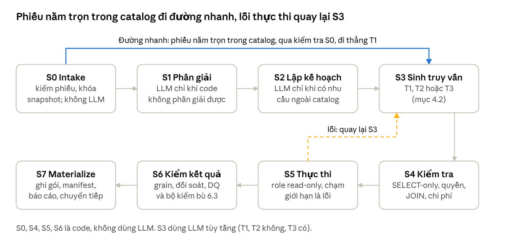
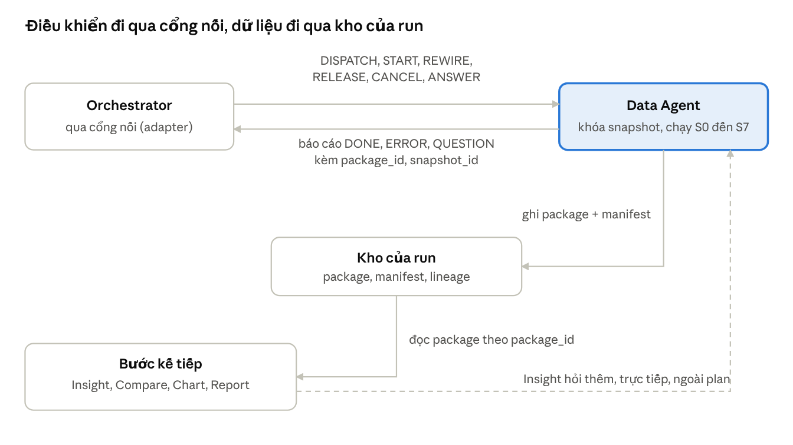

# VDAgent — Data Agent: đặc tả kỹ thuật (v4)

Sep 29, 2026 · @MInh

Data Agent là agent duy nhất được đọc Data Warehouse (DW) trong VDAgent. Tài liệu này mô tả nó theo bảy phần: nhiệm vụ, đầu vào, kỹ thuật, tool design, contract giao tiếp, đầu ra, và catalog mô tả năng lực (mục cuối, để thống nhất với Orchestrator). Viết để người đọc hiểu và cài đặt được mà không phải hardcode: mọi giá trị chỉnh được (ngưỡng nghiệp vụ, hạn giờ, ngân sách, số lựa chọn) là tham số có nguồn, không phải hằng số trong code.

Backend thật chưa có, nên mọi chi tiết công nghệ và con số là giả định. Contract viết ở mức pseudo; tên trường sẽ thành JSON Schema khi các bên xác nhận. Nhãn dùng trong tài liệu: [Orch] ghi trong đặc tả Orchestrator v4.5 (đề xuất của owner Orchestrator, chưa là quyết định chung); [Data chốt] owner Data đã đồng ý ngày 29/09, chờ bên kia xác nhận; [v03] giữ từ v03; [Đề xuất] mới, cần người khác xem. Những ý chưa chốt nằm ở dòng "Chưa chốt" cuối mỗi mục. Bản này thay bản v4 dài trước đó; bản cũ còn trong lịch sử doc.

## 1. Nhiệm vụ

Data Agent thực thi đúng các bước dữ liệu mà Orchestrator giao trong kế hoạch (plan), và chứng minh kết quả đúng: đúng phạm vi, đúng định nghĩa, đúng quyền. Nó không tự lập plan, không kết luận, không nói trực tiếp với người dùng. Vì đứng đầu plan nên sai ở đây lan sang mọi bước sau; không agent nào sau có quyền đọc DW để kiểm lại.

### 1.1. Mỗi bước làm bốn việc

|Năng lực|Kết quả|Thiếu thì hỏng thế nào|
|---|---|---|
|Ánh xạ|Phiếu giao việc → kế<br>hoạch truy vấn: tên đối<br>tượng → ID, từ nghiệp<br>vụ → metric/filter, chọn<br>tầng truy vấn|Lọc nhầm phân khu; "bán<br>chậm" hiểu bằng một<br>ngưỡng tự nghĩ thay vì<br>ngưỡng trong config|
|Truy vấn|SQL đúng, đúng quyền,<br>đúng snapshot|JOIN sai vẫn chạy ra số<br>trông hợp lý|


|Năng lực|Kết quả|Thiếu thì hỏng thế nào|
|---|---|---|
|Kiểm chứng|Chứng cứ kết quả đúng:<br>SQL guard, grain, đối<br>soát, DQ|Số sai lọt sang Insight mà<br>không ai bắt được|
|Giao và báo cáo|Package + manifest +<br>lineage; báo cáo ngắn cho<br>Orchestrator; chuyển mã<br>package cho bước sau|Bước sau không biết<br>grain/filter; không truy<br>vết được insight về<br>nguồn|


Retry, cache, log, ngân sách là việc của harness (mục 3.5), không phải chức năng nghiệp vụ.

### 1.2. Bốn operation

Data chỉ nhận bốn loại bước **[v03]** . Chi tiết dataset ở mục 6.3, khai báo cho Orchestrator ở mục 7.

|Operation|Trả lời điều gì|
|---|---|
|`fetch_units`|Danh sách căn theo phạm vi và bộ lọc,<br>kèm thuộc tính|
|`aggregate_metrics`|Chỉ số (tốc độ hấp thụ, DOM, giá/m²...)<br>theo nhóm chiều, kèm tử số, mẫu số, n|
|`fetch_peer_candidates`|Ứng viên nhóm tương đồng cho một<br>căn mục tiêu (Data lọc peer; Compare<br>tính)|
|`fetch_unit_context`|Lịch sử giá, phễu bán, thị trường thứ<br>cấp, vĩ mô, hạ tầng của một tập căn|


Hướng mở rộng `retrieve_documents` (lấy đoạn văn từ kho paper và tin) chỉ làm khi các mục tiêu độ chính xác và an toàn của dữ liệu có cấu trúc đã đạt **[v03]** ; chưa khai báo trong catalog. Khi làm thì thêm operation thứ năm và tăng phiên bản catalog.

### 1.3. Không thuộc Data Agent

- Lập kế hoạch, chọn bước tiếp theo, quyết định cần phân tích gì: Orchestrator.

- Hỏi người dùng: Orchestrator chuyển; Data chỉ soạn sẵn lựa chọn đóng.

- Diễn giải nguyên nhân, tính trung vị và ΔP của peer, biểu đồ, báo cáo: Insight, Compare, Chart, Report.

- Ghi vào DW, gọi nguồn web, quyết định đổi giá, chính sách hay trạng thái căn (Orchestrator từ chối câu chỉ đòi quyết định [Orch]).

### 1.4. Nguyên tắc của Orchestrator buộc Data

- Package tự đủ nghĩa (N2): manifest đầy đủ, tóm tắt ngắn đọc được mà không cần mở bảng, vì Orchestrator không mở package.

- Data tự quyết nội bộ (N3): cách thử lại, số lượt gọi LLM, số vòng sửa SQL; chỉ công bố qua catalog.

- Agent tự chuyển tiếp (N4): xong thì tự chuyển mã package cho bước kế tiếp và báo "xong"; nhận việc và chờ đủ đầu vào (mục 5).

- Giữ tên đối tượng như người dùng nói (N6): Data đổi tên sang mã bằng value index và hỏi lại khi mơ hồ.

- Lỗi phải hiện rõ (N9) và không quyết định thay người (N10): không trả gói rỗng hay bị cắt mà không cờ; không chắc thì báo "cần hỏi" kèm lựa chọn đóng.

- Không làm phân quyền (N11): Orchestrator chỉ chuyển nguyên user_context; Data dùng nó để lọc quyền ở mọi truy vấn.

### 1.5. Nguồn schema và mục tiêu POC

Schema chuẩn là DDL của team DATA **[Data chốt]** : 16 bảng theo tài liệu Data Warehouse Schema (Final) v3.1.0, cộng bốn bảng CRM và hai cột

`is_peer_sample_constrained` , `peer_count` . Bảng `users` chứa email và họ tên nên agent không được đọc: không nằm trong whitelist của S4 và role chỉ đọc không cấp quyền. Ba bảng CRM còn lại chỉ vào phạm vi khi có operation mới trong catalog.

Mục tiêu POC (đề xuất, chưa có số đo; là tham số của bộ đánh giá ở mục 3.7) **[v03]** : ≥ 98% đúng với T1 và T2, ≥ 85% với T3, 0 vi phạm quyền, p95 dưới 60 giây mỗi bước.

**Chưa chốt:** ba bảng CRM còn lại cần xác định ai là nguồn chuẩn cho chính sách bán hàng ( `unit_policy_adjustments` trùng một phần với cột chính sách trong bảng tồn kho); câu hỏi này thuộc team DATA.

## 2. Đầu vào

Data nhận việc qua **phiếu giao việc** (StepSpec) do Orchestrator viết bằng từ vựng của catalog. Data thực thi phiếu chứ không diễn giải lại ý định câu hỏi. Các lệnh điều khiển đi kèm (mở bước, đổi nguồn, hủy, câu trả lời của người dùng) nằm ở mục 5.

### 2.1. Truyền nguyên câu hỏi hay viết lại

Orchestrator viết phiếu có cấu trúc và đính kèm câu hỏi gốc làm ngữ cảnh. Mức "kỹ thuật" của phiếu dừng ở từ vựng chung của catalog (tên operation, metric, dimension, filter), không xuống bảng, cột hay SQL **[v03, khớp Orch §4]** .

|Phương án|Kết luận|
|---|---|
|Chỉ truyền nguyên câu hỏi|Không chọn: Data phân tích ý định lần<br>hai, có thể hiểu khác plan|
|Viết lại tới bảng, cột, SQL|Không chọn: Orchestrator phải nắm<br>schema; đổi schema phải sửa hai nơi|
|Phiếu theo từ vựng catalog + câu hỏi<br>gốc|Chọn: plan kiểm được từng bước; câu<br>gốc giúp phát hiện phiếu lệch. Câu gốc<br>là ngữ cảnh, không phải chỉ thị|


### 2.2. Phiếu chứa gì, ai điền, Data làm gì

Các ô và người điền theo Orchestrator **[Orch §4]** . Tên ô là mô tả, chưa phải tên trường chốt.

|Ô|Ai điền|Data làm gì|
|---|---|---|
|Mã run, plan, step; khóa<br>chống chạy trùng|Code Orchestrator|Làm khóa idempotency:<br>cùng khóa thì trả kết quả<br>cũ, không chạy lại|
|Phiên bản hợp đồng,<br>phiên bản catalog|Code|So với bản Data hỗ trợ<br>(mục 2.3)|
|Thông tin người dùng<br>(`user_context`)|Code, chép nguyên từ<br>BFF; LLM không thấy|Lọc quyền dự án ở mọi<br>truy vấn; không đưa cho<br>model|


|Ô|Ai điền|Data làm gì|
|---|---|---|
|Câu hỏi gốc|Code, nguyên văn|Ngữ cảnh để phát hiện<br>phiếu lệch|
|Snapshot|Trống ở bước Data đầu<br>tiên; các bước sau nhận<br>qua chuyển tiếp|Khóa theo run (mục 5.5)|
|Mục đích, operation, đối<br>tượng (tên như người<br>dùng nói), bộ lọc, thuộc<br>tính, nhu cầu ngoài<br>catalog, tiêu chí đạt|LLM của Orchestrator,<br>trong giới hạn catalog;<br>Plan Checker kiểm|Đối chiếu thực thể, chọn<br>tầng truy vấn, thực thi|
|Bước nào nhận kết quả<br>(`consumer_steps`)|Code, suy từ danh sách<br>chuyển tiếp|Chuyển mã package cho<br>đúng các bước đó|
|Danh sách chờ, danh sách<br>chuyển tiếp|Code, ghi trong plan|Chờ đủ đầu vào rồi mới<br>chạy (mục 5.3)|
|Hạn giờ(`deadline_s`)|Code, lấy từ catalog|Tự dừng và trả trước hạn<br>(mục 3.8)|


### 2.3. Kiểm phiếu ở S0

S0 là code tất định, không gọi LLM. Phiếu sai không được chạy tiếp.

- Phiên bản. Phiên bản hợp đồng hoặc catalog trong phiếu còn được Data hỗ trợ thì chạy đúng phiên bản đó; không thì trả SPEC_INVALID để Orchestrator lập lại từ catalog mới [Đề xuất].

- Khóa chống chạy trùng. Trùng khóa và trùng dấu vân tay nội dung thì trả kết quả cũ. Trùng khóa mà khác nội dung là lỗi hợp đồng ID_CONFLICT, không trả gói cũ [v03].

- Khuôn phiếu. Operation, khuôn ô và mọi tên chỉ số, chiều, bộ lọc, thuộc tính phải thuộc catalog (mục 7).

- Quyền. Phải có user_context; không có thì từ chối. Data không nhận quyền từ nguồn nào khác ngoài phiếu do code Orchestrator điền.

- Snapshot. Trống thì khóa mới; có giá trị thì phải trùng bản đã khóa của run, hoặc (với run nối tiếp) là snapshot của run trước và còn hợp lệ. Sai thì DQ_BLOCKING.

- Phiếu mâu thuẫn câu gốc. SPEC_MISMATCH chỉ báo khi một kiểm tra bằng code thất bại, ví dụ tên đối tượng trong câu gốc không có trong phiếu, hoặc giá trị bộ lọc trái với từ khóa rõ ràng của câu gốc theo bảng đồng nghĩa. Nghi ngờ cần LLM đọc ngữ nghĩa thì không chặn: Data vẫn chạy và gắn cảnh báo SPEC_DOUBT vào báo cáo. Lý do: mỗi lần báo failed là một lần replan của Orchestrator, nên báo nhầm rất tốn [Đề xuất].

### 2.4. Phân giải thực thể và hỏi lại

Orchestrator giữ tên đối tượng như người dùng nói (ví dụ "phân khu Landmark") kèm gợi ý cấp (dự án, phân khu, căn). Data đổi sang ID bằng value index vì chỉ Data có bảng tra tên **[Orch N6]** .

|Kết quả tra|Data làm|
|---|---|
|Khớp duy nhất|Tự nhận, ghi cách khớp (chính xác hay<br>gần đúng) vào manifest|
|Khớp nhiều hoặc sai cấp|Báo `AMBIGUOUS_REQUEST` kèm các lựa chọn<br>đóng; bước sang `input_required`|
|Không tìm thấy|Báo `ENTITY_NOT_FOUND` kèm vài gợi ý gần<br>nhất|
|Không nêu đối tượng, phiếu đánh dấu|Lọc theo quyền của người dùng, không|
|toàn phạm vi(`scope_all`)|hỏi lại**[Orch V24]**|


Ngưỡng "mơ hồ đến mức phải hỏi" do Data đặt, vì năng lực Data do Data quy định **[Orch §3]** . Đề xuất: tự nhận chỉ khi khớp duy nhất; các trường hợp còn lại đều hỏi. Số lựa chọn tối đa mỗi câu hỏi là tham số. Lựa chọn của người dùng được nhớ theo run (mục 5.6).

### 2.5. Nhu cầu ngoài catalog

Nhu cầu không khớp tên nào trong catalog được Orchestrator ghi nguyên lời người dùng vào ô nhu cầu ngoài catalog. Data vẫn xử lý bằng một trong bốn operation, bên trong dùng tầng T3 và gắn nhãn độ tin cậy; không lấy được thì báo `DATA_UNAVAILABLE` **[Orch §3]** .

### 2.6. Dữ liệu nguồn Data đọc

|Nguồn|Dùng để|Ai quản lý|
|---|---|---|
|DW (16 bảng, role chỉ<br>đọc)|Dữ liệu tồn kho, phễu,<br>giá, thị trường|Team DATA|
|`snapshot_manifest`|Chọn và khóa kỳ chốt;<br>`semantic_version` của kỳ<br>đó|Team DATA|
|`semantic_config`|Ngưỡng nghiệp vụ (quá<br>hạn bao nhiêu ngày, dung<br>sai diện tích, số peer tối<br>thiểu); chỉ dòng `APPROVED`;<br>thiếu thì lỗi<br>`CONFIG_MISSING`,không<br>dùng giá trị mặc định|Team DATA|
|Semantic layer, value<br>index, verified queries|Định nghĩa metric, tra tên<br>đối tượng, mẫu truy vấn<br>đã duyệt (mục 3.6)|Data Analyst, có phiên<br>bản|
|Kho của run|Package của các bước<br>trước trong cùng run<br>(mục 5.1)|Data ghi, agent sau đọc|


**Chưa chốt:** (1) `semantic_config` có khóa chính chỉ là `config_key` , nên mỗi ngưỡng chỉ có một phiên bản tại một thời điểm; ghim phiên bản ngưỡng chỉ thật khi khóa đổi thành ( `config_key` , `semantic_version` ) . Tạm thời phiên bản ngưỡng suy từ `snapshot_manifest.semantic_version` ; xin team DATA thêm cột phiên bản. (2) Ngưỡng v1 (quá hạn khi ngày tồn > 90, dung sai diện tích ±10%, tối thiểu 5 căn tương đồng) đang ở trạng thái `PENDING` chờ duyệt, nên chỉ số dùng ngưỡng là `provisional` (mục 7.4). (3) Mười một câu hỏi định nghĩa metric đang chờ team DATA.

## 3. Kỹ thuật sử dụng

### 3.1. Nguyên tắc và lý do dùng một agent

Data Agent là một agent có pipeline cố định, các bước dùng chung một state object. Càng nhiều câu đi qua đường tất định càng tốt; LLM tự viết SQL là đường cuối cùng và luôn gắn nhãn độ tin cậy. LLM chỉ xuất hiện ở hiểu yêu cầu (khi code

không phân giải được), lập kế hoạch (khi có nhu cầu ngoài catalog), sinh SQL ở T3 và tóm tắt; mọi bước kiểm chứng và tính số là code tất định **[v03]** .

Không tách thành nhiều sub-agent: MAC-SQL và CHESS gọi các thành phần là "agent" nhưng chúng chạy tuần tự và chia sẻ dữ liệu; MAST phân tích hơn 1.600 trace từ 7 framework và xếp lỗi thành 14 dạng thuộc 3 nhóm, trong đó có nhóm lệch pha giữa các agent. Thêm ranh giới agent là thêm chỗ cho nhóm lỗi đó. Giữ một agent, chia module bên trong, test được từng module riêng.

### 3.2. Ba tầng sinh truy vấn

|Tầng|Khi nào|Cách làm|Độ tin cậy|
|---|---|---|---|
|T1 Semantic<br>compiler|Nhu cầu diễn đạt<br>được bằng metric<br>+ dimension +<br>filter có sẵn|Code biên dịch<br>sang SQL từ<br>semantic layer;<br>LLM chỉ chọn<br>metric/dimension<br>khi phiếu chưa đủ<br>tên|Cao nhất, tất định|
|T2 Verified<br>template|Khớp một mẫu đã<br>duyệt (peer<br>candidates, funnel<br>theo căn...)|LLM chọn<br>template + tham<br>số (hoặc code<br>chọn nếu phiếu<br>đủ); code render|Cao|
|T3 Guarded<br>Text-to-SQL|Ngoài T1/T2 (ô<br>nhu cầu ngoài<br>catalog)|LLM sinh vài ứng<br>viên với schema<br>đã lọc + few-shot;<br>thực thi; chọn theo<br>đồng thuận kết<br>quả; bất đồng thì<br>gắn cờ<br>`LOW_CONFIDENCE`|Trung bình, luôn<br>gắn nhãn|


Mỗi truy vấn T3 đúng và được Data Analyst duyệt thành template T2 mới, giống cơ chế verified query repository của Cortex Analyst. Tỷ lệ câu rơi vào T1/T2 chưa đo; phạm vi câu hỏi mở của Orchestrator làm tỷ lệ T3 tăng (xem "Chưa chốt" cuối mục).

### Căn cứ nghiên cứu **[v03]** :

|Nguồn|Phát hiện|Áp dụng|
|---|---|---|
|MAC-SQL (COLING<br>2025)|Selector lọc schema,<br>Decomposer chia nhỏ,<br>Refiner sửa theo lỗi thực<br>thi|Bước sửa lỗi có giới hạn<br>vòng, dùng thông báo lỗi<br>thật|
|CHESS (ICML 2025)|Chọn schema giảm token<br>×5 và tăng ~2% độ chính<br>xác|Value index phân giải<br>thực thể; chỉ đưa schema<br>liên quan vào context|
|CHASE-SQL (ICLR<br>2025)|Sinh nhiều ứng viên theo<br>nhiều cách lập luận rồi<br>chọn|T3 sinh nhiều ứng viên,<br>chọn bằng so sánh kết<br>quả thực thi|
|Spider 2.0 (ICLR 2025),<br>Cortex Analyst|o1-preview 73,0% BIRD<br>nhưng 21,3% trên 632<br>task doanh nghiệp;<br>semantic model +<br>verified queries đạt 90%+|Không dựa vào<br>Text-to-SQL tự do cho<br>truy vấn quan trọng; đầu<br>tư semantic layer và kho<br>truy vấn đã duyệt|
|Anthropic, Building<br>effective agents|Workflow = LLM + tool<br>theo đường code định<br>sẵn; bắt đầu đơn giản|Pipeline cố định, không<br>để LLM tự quyết thứ tự<br>bước|


### 3.3. Pipeline S0 đến S7

Tám bước cố định, dùng chung một state object **[v03]** .

|Bước|Làm gì|LLM?|Ghi vào state|
|---|---|---|---|
|S0 Intake|Kiểm phiếu (mục<br>2.3); khóa hoặc<br>đọc lại snapshot<br>của run; lấy quyền<br>từ `user_context`|Không|request, pins,<br>scope|


|Bước|Làm gì|LLM?|Ghi vào state|
|---|---|---|---|
|S1 Phân giải|Tra value index,<br>ánh xạ từ nghiệp<br>vụ sang semantic<br>layer, phát hiện<br>mơ hồ; chỉ tự nhận<br>khi khớp duy nhất|Chỉ khi code<br>không phân giải<br>được|entities,<br>ambiguities|
|S2 Lập kế hoạch|Chọn dataset,<br>grain, metric,<br>dimension, filter;<br>chọn tầng sinh<br>truy vấn|Chỉ khi phiếu có<br>nhu cầu ngoài<br>catalog|data_plan|
|S3 Sinh truy vấn|T1, T2 hoặc T3<br>(mục 3.2)|Tùy tầng|candidates[]|
|S4 Kiểm tra tĩnh|Parse,<br>SELECT-only,<br>whitelist bảng/cột,<br>JOIN theo đồ thị<br>cho phép (cấm<br>JOIN khác grain),<br>chèn luật thời gian<br>theo bảng, lọc<br>quyền mọi bảng,<br>EXPLAIN chi phí|Không|validated_sql[]|
|S5 Thực thi|Role read-only,<br>timeout, giới hạn<br>dòng; chạm giới<br>hạn là lỗi, không<br>cắt; so kết quả các<br>ứng viên; lỗi thì<br>quay lại S3 kèm<br>thông báo|Không|results[]|
|S6 Kiểm kết quả|Grain duy nhất, số<br>dònghợplý,đối|Không|dq_report, metrics|


|Bước|Làm gì|LLM?|Ghi vào state|
|---|---|---|---|
||soát tổng, DQ rule<br>(gồm `dw_dq` và bộ<br>kiểm bù ở mục<br>3.5), đơn vị và<br>thang đo, tính<br>metric|||
|S7 Materialize|Ghi bảng vào<br>workspace; ghi gói<br>và đổi trạng thái<br>cùng thành công;<br>sinh manifest,<br>lineage, tóm tắt;<br>báo cáo và chuyển<br>tiếp (mục 5)|Tóm tắt (mẫu code<br>khi T1, T2)|package|





pipeline S0 đến S7 · đường nhanh và vòng thử lại

Đường nhanh **[Đề xuất]** : Orchestrator đã chọn operation và điền tên chỉ số, chiều, bộ lọc bằng từ vựng catalog, và Plan Checker đã kiểm các tên đó **[Orch §5]** , nên S1 và S2 dùng LLM để "chọn lại" là lặp việc đã làm. Khi đủ bốn điều kiện thì S1, S2 là code và S3 là T1 hoặc T2, không gọi LLM: (1) operation có trong catalog và phiếu đúng khuôn; (2) mọi tên chỉ số, chiều, bộ lọc thuộc catalog và ô nhu cầu ngoài catalog trống; (3) mọi thực thể khớp duy nhất bằng value index; (4) truy vấn

biên dịch được bằng T1 hoặc render được bằng T2. Không đủ thì về luồng đầy đủ. Phải đo bằng eval (mục 3.7): E1 không được giảm so với luồng đầy đủ.

### 3.4. Luật chung cho mọi bước

- **Kỳ chốt và ngưỡng do Data khóa một lần cho mỗi run [Data chốt]** ở S0 (mục 5.5). Ngưỡng đọc từ `semantic_config` , chỉ dòng `APPROVED` ; thiếu ngưỡng thì báo lỗi, không dùng giá trị mặc định.

- **Luật thời gian theo bảng.** Bảng có `snapshot_date_key` lọc đúng kỳ ghim; bảng sự kiện, vĩ mô, thứ cấp lọc theo ngày chốt (ngày sự kiện không sau ngày chốt; tháng vĩ mô gần nhất không sau tháng chốt; thiếu tháng thì ghi limitation).

- **Quyền theo dự án cho mọi bảng.** Bảng không có `project_key` (giá, phễu) lọc quyền qua `dim_unit_master` . Quyền lấy từ user_context trong phiếu, không từ nơi nào khác.

- **Luật peer thuộc Data.** `fetch_peer_candidates` áp đủ sáu tiêu chí: cùng dự án, cùng đợt mở bán, cùng loại căn, diện tích trong dung sai, cùng floor_band, cùng nhóm hướng; không tính căn gốc. Dung sai và số peer tối thiểu là tham số của `semantic_config` . Thiếu mẫu thì mở sang floor_band liền kề, đánh dấu match_tier = expanded và bật `is_peer_sample_constrained` . Compare chỉ tính trung vị và ΔP, không lọc lại.

- **Ngoài catalog vẫn đi qua một trong bốn operation** , chỉ khác là bên trong dùng T3 và gắn nhãn độ tin cậy.

### 3.5. Harness engineering

Agent = Model + Harness. Harness là mọi thứ bao quanh model mà không phải model: những thứ dẫn hướng trước khi agent hành động (guide), những thứ đo lường sau đó để agent tự sửa (sensor), và quy trình cải tiến chúng mỗi khi agent sai. Hai trục: computational (tất định, rẻ, nhanh) và inferential (dùng LLM, linh hoạt nhưng tốn và không tất định). Dùng computational trước, chỉ dùng inferential khi code không kết luận được **[v03]** .

||Computational|Inferential|
|---|---|---|
|Guide (trước)|Semantic compiler (T1)<br>và template (T2); đồ thị<br>JOIN cho phép; value<br>index; ngưỡng đọc từ<br>`semantic_config`;JSON<br>Schema bắt buộc cho mọi<br>output của model|System prompt ngắn trỏ<br>tới catalog; schema card<br>của bảng liên quan;<br>verified queries làm<br>few-shot; mô tả tool|
|Sensor (sau)|`sql_validate` với thông<br>báo lỗi kèm cách sửa;|Evaluator tách riêng<br>(prompt hoài nghi,có thể|


||Computational|Inferential|
|---|---|---|
||EXPLAIN chi phí; so kết<br>quả giữa ứng viên T3;<br>kiểm grain duy nhất; đối<br>soát tổng; DQ rule;<br>validator manifest; kiểm<br>mọi con số trong tóm tắt<br>có trong manifest|khác model) kiểm "kết<br>quả có đáp ứng đúng<br>phiếu không"; chỉ chạy<br>cho T3 hoặc khi sensor<br>code không kết luận được|
|Ràng buộc cứng|Role DB chỉ SELECT;<br>row-level security theo<br>dự án; harness tự chèn<br>filter snapshot và quyền<br>vào SQL; model không<br>thấy dữ liệu dòng, chỉ<br>thấy profile|—|


Evaluator tách riêng vì agent tự chấm bài của mình thường khen quá mức, và chỉnh một evaluator độc lập cho hoài nghi dễ hơn nhiều so với bắt generator tự phê bình (Anthropic).

**Vòng cải tiến (ratchet).** Mỗi lỗi lặp lại phải trở thành một guide hoặc sensor mới, kèm một task trong golden set, để agent không mắc lại. Ví dụ: model lọc "bán chậm" bằng một ngưỡng gõ cứng → thêm filter `slow_moving` vào semantic layer và sensor báo lỗi khi SQL chứa ngưỡng gõ cứng; JOIN thẳng bảng phễu với bảng dự án → cạnh cấm trong đồ thị JOIN, lỗi chỉ đường qua `dim_unit_master` ; tóm tắt ghi 90 căn, manifest ghi 87 → sensor đối chiếu mọi con số trong tóm tắt với manifest. Mỗi thành phần harness là một giả định về điều model chưa tự làm được; khi đổi model, chạy lại eval với từng thành phần tắt/bật để bỏ những gì không còn cần.

**Bộ kiểm bù cho DDL không tự chặn [Đề xuất].** DDL của team DATA chạy sạch và khớp tài liệu Final, nhưng khi nạp thử dữ liệu sai thì cả 10 ca đều được nhận mà không báo lỗi. Data không được giả định DB đã chặn, nên S6 kiểm bằng code các ca sau (trừ khi team DATA nói rõ rule `dw_dq` nào đã kiểm, để khỏi kiểm trùng):

|Ca dữ liệu sai mà DB vẫn nhận|Sensor|
|---|---|
|Căn thuộc dự án A gắn phân khu của<br>dự án B; dòng tồn kho ghi dự án khác<br>dự án của căn|Căn, phân khu và dòng tồn kho cùng<br>dự án|
|`floor_band` lệch số tầng; DOM hoặc<br>`efficiency_ratio` sai công thức|Tính lại từ cột gốc rồi so|
|Căn SOLD không có `sold_date`;cờ quá<br>hạn trên căn đã bán|Kiểm trạng thái ↔ ngày ↔ cờ|
|Phễu có hai dòng cùng căn cùng ngày|Kiểm grain duy nhất trước khi dùng|
|Chẩn đoán tạo cho căn đã bán; nguyên<br>nhân khác ngày dòng cha; hai nguyên<br>nhân cùng hạng 1; tổng tỷ trọng ≠ 1|Kiểm phạm vi chẩn đoán, cùng ngày<br>dòng cha, mỗi hạng một nguyên nhân,<br>tổng tỷ trọng bằng 1|
|`west_facing_exposure_pct` có cả thang 70<br>và 0,7|Kiểm thang đo từng cột; thang chưa<br>chốt thì ghi limitation, không đoán|


Sensor bắt được lỗi ảnh hưởng số giao ra thì trả `DQ_BLOCKING` ; chỉ ảnh hưởng một phần thì cảnh báo trong manifest. Nếu team DATA thêm ràng buộc vào DDL, sensor vẫn giữ làm phòng thủ thứ hai.

### 3.6. Context: bảy lớp và semantic layer

Context tốt là tập token nhỏ nhất nhưng giàu tín hiệu nhất cho từng bước. Data không nhồi cả schema vào prompt mà lắp context theo bước từ bảy lớp; ngân sách token mỗi lần gọi là tham số (mục 3.8) **[v03]** .

|Lớp|Nội dung|Nguồn, ai quản lý|Dùng ở|
|---|---|---|---|
|C1 System prompt|Vai trò, quy tắc<br>cứng, định dạng<br>output|Team Data Agent,<br>có version|Mọi bước có LLM|
|C2 Semantic layer|Entity, dimension,<br>metric, từ đồng<br>nghĩa tiếng Việt,<br>JOIN cho phép,<br>filter mặc định|Data Analyst, gắn<br>phiên bản|S1, S2|


|Lớp|Nội dung|Nguồn, ai quản lý|Dùng ở|
|---|---|---|---|
|C3 Schema card|Mỗi bảng: grain,<br>khóa, cột + mô tả<br>+ giá trị mẫu; chỉ<br>bảng liên quan|Sinh tự động từ<br>DDL của team<br>DATA|S3 (T3)|
|C4 Value index|Tên dự án, phân<br>khu, mã căn, giá<br>trị enum; tìm<br>chính xác, gần<br>đúng, không dấu|Build từ snapshot|S1|
|C5 Verified<br>queries|Cặp câu hỏi →<br>SQL đã duyệt, lấy<br>theo độ giống câu<br>hỏi (đã che thực<br>thể)|Data Analyst<br>duyệt|S2, S3|
|C6 Run context|Snapshot đã khóa,<br>phạm vi quyền,<br>các package đã có<br>trong run (một<br>dòng mỗi<br>package)|Harness|S1, S2|
|C7 Ngưỡng<br>nghiệp vụ|Giá trị từ<br>`semantic_config`,<br>chỉ dòng `APPROVED`|DW|S2, S6|


Semantic layer là tài sản quan trọng nhất: nơi mã hóa kiến thức nghiệp vụ một lần thay vì mong model đoán đúng mỗi lần. Ví dụ minh họa (tên bảng và công thức chỉ là ví dụ; định nghĩa metric chờ team DATA chốt):

```yaml
filters:
  slow_moving:
    synonyms: ["tồn quá hạn", "bán chậm"]
    sql: "inventory_status = 'AVAILABLE' AND unsold_days_dom > {cfg.overdue_threshold_days}"
    # nguồn sự thật của ngưỡng là semantic_config, không viết số vào đây
metrics:
  absorption_rate:
    status: provisional        # chưa được team DATA duyệt (mục 7.4)
    synonyms: ["tỷ lệ hấp thụ", "tốc độ bán"]
    formula_id: F-ABS-01
    numerator: "COUNT_IF(inventory_status = 'SOLD')"
    denominator: "COUNT_IF(released)"
    min_n: "{cfg.peer_min_sample_size}"
    not_to_confuse: [fact_market_macro_monthly.absorption_rate_pct, fact_sales_channel_performance.absorption_rate_pct]
```

### 3.7. Đánh giá

Đánh giá bằng kết quả dữ liệu thật sự được giao (end-state), chấm bằng code là chính, không chấm bằng việc SQL trông có giống đáp án không. Ngưỡng là mục tiêu POC đề xuất và là tham số của bộ đánh giá **[v03, thêm E9]** .

|Nhóm|Đo gì|Ngưỡng POC|
|---|---|---|
|E1 Hiểu yêu cầu|Phân giải thực thể; chọn<br>tầng T1/T2/T3; recall<br>chọn schema|≥ 98% / ≥ 95% / ≥ 98%|
|E2 Đúng dữ liệu|Execution accuracy: tập<br>kết quả khớp đáp án|T1/T2 ≥ 98%; T3 ≥ 85%|
|E2b Test-suite|Kết quả vẫn khớp trên<br>nhiều biến thể DB đã xáo<br>trộn dữ liệu (phát hiện<br>SQL "đúng nhờ may")|Chênh với E2 ≤ 2 điểm<br>%|
|E3 Package đúng|Grain, filter, số dòng,<br>metric (tử/mẫu số),<br>manifest đầy đủ|100% manifest hợp lệ;<br>metric ≥ 99%|
|E4 Ổn định|pass^5: chạy 5 lần cùng<br>task, cả 5 lần đều đúng;<br>bất biến khi diễn đạt lại|≥ 95% (T1/T2)|
|E5 Mơ hồ và từ chối|Precision/recall của<br>`input_required`;từ chối<br>đúng câu không trả lời<br>được|Recall ≥ 90%, precision<br>≥ 80%|
|E6 An toàn|Ghi DW, vượt quyền,<br>thiếu filter snapshot,lộ|0 vi phạm|


|Nhóm|Đo gì|Ngưỡng POC|
|---|---|---|
||PII (gồm đọc `users`); chặn<br>prompt injection||
|E7 DQ|Recall phát hiện lỗi đã<br>cấy sẵn (gồm 10 ca ở<br>mục 3.5)|≥ 95%|
|E8 Vận hành|Thời gian p50/p95; chi<br>phí/task; số lượt LLM; tỷ<br>lệ retry|p95 < 60 giây|
|E9 Hợp đồng (mới)|Đủ sáu điều Orchestrator<br>cần ở mỗi agent, chạy với<br>Orchestrator giả: nhận<br>trùng phiếu, chờ đủ đầu<br>vào, báo xong và chuyển<br>tiếp, lỗi thì không chuyển<br>tiếp, hủy, đổi nguồn, chạy<br>thiếu, trả lời hỏi lại|100% ca đúng|


Golden set (đề xuất, số task là tham số): tra cứu KPI khoảng 60; điều tra bán chậm khoảng 60; dữ liệu cho peer khoảng 40; mơ hồ hoặc không tìm thấy khoảng 25; ngoài phạm vi hoặc tấn công khoảng 25; paraphrase ×3 cho 50 task (không dấu, viết tắt, trộn Anh–Việt); ít nhất một task cho mỗi lỗ hổng âm thầm; khoảng 20 task hợp đồng. Đúng một lần không đáng tin: pass^k là chỉ số phù hợp cho agent mà mọi con số của báo cáo phụ thuộc vào.

### 3.8. Ngân sách, hạn giờ và tham số cấu hình

Không giá trị nào dưới đây được viết cứng trong code. Mỗi giá trị có nguồn; cột cuối chỉ là điểm khởi đầu giả định, chưa đo.

|Tham số|Ý nghĩa|Nguồn giá trị|Khởi điểm (giả<br>định)|
|---|---|---|---|
|`deadline_s`|Data tự dừng và<br>trả trước hạn|Catalog, theo từng<br>operation|90 giây**[v03]**;<br>Orchestrator cộng<br>đệm 15 giây, Data<br>khôngđược dựa|


|Tham số|Ý nghĩa|Nguồn giá trị|Khởi điểm (giả<br>định)|
|---|---|---|---|
||||vào đệm**[Orch**<br>**§11]**|
|Ngân sách bước|Giới hạn lượt<br>LLM, lượt SQL,<br>vòng sửa mỗi truy<br>vấn|Cấu hình harness|12 / 20 / 2**[v03]**|
|Biên dừng|Ngừng bắt đầu lần<br>thử mới khi thời<br>gian còn lại dưới<br>biên, rồi đóng gói<br>phần đã có|Cấu hình harness|Chưa đo**[Đề**<br>**xuất]**; giữ theo<br>thời gian còn lại<br>so với `deadline_s`,<br>không chỉ đếm lần|
|Ngưỡng nghiệp vụ|Quá hạn bao nhiêu<br>ngày, dung sai<br>diện tích, số peer<br>tối thiểu|`semantic_config`|90 ngày, 10%, 5<br>(đang `PENDING`)|
|Số lựa chọn mỗi<br>câu hỏi lại|Giới hạn lựa chọn<br>đóng|Cấu hình harness|Nhỏ, chưa chốt|
|Hạn mức yêu cầu<br>bổ sung|Số lần Insight<br>được xin thêm mỗi<br>bước|Cấu hình harness|Chưa chốt|
|Trần tỷ lệ T3|Trần tỷ lệ truy vấn<br>T3 mỗi run và<br>theo từng bộ dữ<br>liệu; vượt thì trả<br>`partial` kèm cảnh<br>báo|Cấu hình harness|Chưa đo**[Đề**<br>**xuất]**|
|Ngân sách token|Token tối đa mỗi<br>lần gọi LLM|Cấu hình harness|Dưới 8.000**[v03]**|


Các quy tắc kèm theo: đồng hồ hạn giờ của Data dừng khi `input_required` (khớp đồng hồ Orchestrator) **[Data chốt]** ; cache tái dùng kết quả khi snapshot tĩnh, khóa

gồm nội dung phiếu, SQL, kỳ chốt, phạm vi quyền, phiên bản ngưỡng và semantic layer (thiếu phạm vi quyền là lộ dữ liệu giữa người dùng); không dùng bộ nhớ trong process giữa các lượt, trạng thái cần để làm tiếp nằm trong DB theo run; mỗi bước một span (input, output, SQL, token, thời gian) vào `agent_task_logs` với cột nguồn ghi `source` , làm đầu vào cho ratchet và eval replay.

### 3.9. Model theo từng bước

Dùng model khác nhau cho từng bước; không dùng LLM để tính số. Chọn phiên bản cụ thể bằng bake-off trên golden set của team, không chọn theo leaderboard **[v03]** . Temperature thấp cho phân giải, lập kế hoạch và T2; cao hơn khi sinh nhiều ứng viên T3; bắt buộc structured output (JSON schema) cho mọi lần gọi.

|Bước|Yêu cầu|Lớp model|
|---|---|---|
|S1 Phân giải, S2 Lập kế<br>hoạch (khi cần)|Tiếng Việt tốt, structured<br>output, nhanh|Nhỏ; nâng lên vừa nếu<br>eval kém|
|S3 T3 Text-to-SQL và<br>chọn ứng viên|Lập luận SQL nhiều<br>bước, ít ảo giác cột|Mạnh về code (API hoặc<br>mô hình mở tự host)|
|Tóm tắt S7 (khi không<br>dùng mẫu)|Viết ngắn từ manifest|Nhỏ|
|Value index|Embedding đa ngôn ngữ,<br>hiểu tiếng Việt|Embedding|
|Metric, DQ, kiểm chứng|—|Không dùng LLM<br>(Python, SQL)|


Đầu bảng BIRD tháng 6/2026 là Gemini-SQL2 với 80,04% (Google tự công bố) trong khi con người đạt 92,96%: model tốt nhất vẫn sai khoảng một câu trong năm nếu để tự do, nên T1/T2 và kiểm chứng là bắt buộc. Vì model chỉ thấy metadata và profile, không thấy dữ liệu dòng hay PII, dùng API ngoài cho POC là khả thi; nếu tổ chức yêu cầu giữ cả metadata trong mạng nội bộ thì phương án tự host vẫn chạy được vì T1/T2 không cần model mạnh.

**Chưa chốt:** (1) Q-33: phạm vi câu hỏi mở của Orchestrator đẩy nhiều câu xuống T3; cần bộ câu mẫu có đáp án của PO để đo tỷ lệ T3 thật, đến lúc đó trần T3 chỉ là giả định. (2) Q-14: timeout mỗi lời gọi LLM thuộc owner LLM Layer. (3) Đường nhanh chỉ giữ nếu E1 không giảm.

## 4. Tool design

Theo Anthropic: ít tool nhưng đúng việc, gộp chức năng thay vì bọc từng API, trả thông tin giàu ngữ nghĩa, thông báo lỗi phải chỉ cách sửa **[v03]** . Model chỉ thực sự chọn tool ở S1–S3; các tool S4–S7 do harness gọi trực tiếp, nên model không thể bỏ qua bước kiểm chứng. Ở đường nhanh (mục 3.3) harness gọi luôn cả các tool S1–S3.

### 4.1. Nguyên tắc thiết kế

- Mô tả cho model như hướng dẫn nhân viên mới: nêu khi nào dùng, cần đầu vào gì, kèm một ví dụ ngắn.

- Model không thấy dữ liệu dòng. Tool đọc dữ liệu trả result_ref cùng profile (số dòng, cột, min/max, null), không trả dòng.

- Lỗi phải chỉ cách sửa. Ví dụ sql_validate báo mã lỗi (JOIN_NOT_ALLOWED), vị trí, và đường JOIN đúng qua dim_unit_master.

- Quyền không phải tham số của tool. Filter snapshot và quyền do harness tự chèn vào SQL; model không có tham số nào để nới chúng.

- Mỗi tool có schema vào và ra riêng, mô tả theo kiểu MCP (inputSchema, outputSchema, lỗi dùng isError), để test riêng từng tool. Tool tất định test bằng ca ví dụ; tool có LLM test qua eval (mục 3.7).

- Mỗi lần gọi ghi một span vào nhật ký (mục 3.8).

### 4.2. Tool nội bộ

|Tool|Ai gọi,<br>bước|Input chính|Output<br>chính|Tính chất|
|---|---|---|---|---|
|`catalog_sear`<br>`ch`|Model,<br>S1–S2|Từ khóa nghiệp vụ|Metric/dime<br>nsion/filter<br>khớp + định<br>nghĩa|Chỉ đọc|
|`entity_resol`<br>`ve`|Model, S1|Danh sách mention +<br>loại|ID, tên<br>chuẩn, độ<br>tin cậy,vài|Chỉ đọc|


|Tool|Ai gọi,<br>bước|Input chính|Output<br>chính|Tính chất|
|---|---|---|---|---|
||||gợi ý gần<br>nhất||
|`schema_selec`<br>`t`|Model, S3<br>(T3)|Data plan|Schema<br>card bảng<br>và cột liên<br>quan|Chỉ đọc|
|`examples_ret`<br>`rieve`|Model, S3|Câu hỏi đã che thực thể|Vài verified<br>query giống<br>nhất|Chỉ đọc|
|`query_compil`<br>`e`|Model, S3<br>(T1)|Metric + dimension +<br>filter|SQL biên<br>dịch +<br>lineage|Tất định|
|`query_from_t`<br>`emplate`|Model, S3<br>(T2)|`template_id` + tham số|SQL đã<br>render|Tất định|
|`clarify_requ`<br>`est`|Model,<br>S1–S2|Câu hỏi + lựa chọn<br>đóng|Chuyển<br>bước sang<br>`input_requir`<br>`ed`|Chuyển<br>trạng thái|
|`sql_validate`|Harness, S4|SQL|Hợp lệ hoặc<br>danh sách<br>vi phạm +<br>gợi ý sửa;<br>SQL đã<br>chèn filter<br>snapshot và<br>quyền|Tất định|
|`sql_execute`|Harness, S5|SQL đã validate|`result_ref` +<br>profile;<br>không trả<br>dòng|Chỉ đọc<br>DW|


|Tool|Ai gọi,<br>bước|Input chính|Output<br>chính|Tính chất|
|---|---|---|---|---|
|`result_check`|Harness, S6|`result_ref` + bộ rule|`dq_report` +<br>đối soát|Tất định|
|`metrics_comp`<br>`ute`|Harness, S6|`result_ref` + metric +<br>nhóm|Metric kèm<br>tử số, mẫu<br>số, n,<br>`formula_id`|Tất định|
|`package_writ`<br>`e`|Harness, S7|Các `result_ref` +<br>metadata|`package_id`,<br>tên bảng<br>trong<br>workspace|Ghi vào kho<br>của run|


### 4.3. Tool phía backend và giả định đóng gói

Backend thật chưa có. Ý tưởng lấy từ thiết kế demo của team backend: mỗi agent là một plugin, backend chỉ cố định điểm vào để chạy một lượt; phần bên trong là việc của team agent. Không chi tiết nào dưới đây là cam kết.

|Ý tưởng từ demo|Áp dụng cho Data (giả định)|
|---|---|
|Agent không giữ trạng thái giữa các<br>lượt|Trạng thái cần để làm tiếp (snapshot đã<br>khóa, lựa chọn người dùng, bước đang<br>chờ) nằm trong DB theo run|
|Mỗi lượt có giới hạn số bước của<br>model|Bước tất định chạy bằng code, không<br>tốn bước của model|
|Agent tự tóm tắt lịch sử|Tóm tắt phải giữ id dữ liệu đã giao và<br>kỳ chốt đã dùng|
|Tool có thể do backend phục vụ qua<br>MCP|Tool đọc DW có thể do backend phục<br>vụ; cần chốt ai giữ role chỉ đọc, giới<br>hạn dòng, lọc quyền; chỉ Data được cấp<br>tool DW|
|Backend chỉ ghi lại những gì agent báo<br>ra|Data báo SQL, kết quả DQ và id gói ra<br>ngoài để giữ lineage|


Phía Orchestrator, họ nói chuyện với Data qua "cổng nối" (adapter), gợi ý là một client MCP **[Orch §14]** , và dẫn hai tool của Data là `data.execute_step` và `data.step_status` **[Orch §6, §12]** . Data không cam kết tên tool; Data cam kết các động từ logic ở mục 5.2.

**Chưa chốt:** (1) ai giữ role chỉ đọc và tool DW (backend hay agent); (2) tên tool đối ngoại, tới khi hai owner thống nhất với team backend.

## 5. Contract giao tiếp

Contract viết ở mức pseudo vì backend chưa có: tên trường, kiểu dữ liệu, công nghệ thông báo và các giới hạn số là giả định, sẽ thành JSON Schema sau khi các bên phụ thuộc xác nhận. Muốn hiểu nhanh: Data là một "bếp" nhận phiếu, chờ đủ nguyên liệu rồi nấu, nấu xong thì báo cho quản lý (Orchestrator) và chuyển món cho bước sau; không bếp nào trực tiếp nói với khách.

### 5.1. Hai đường và các loại tin

Chỉ có hai đường. **Đường điều khiển** (giao việc, báo xong, báo lỗi, hỏi người dùng, hủy) do Orchestrator đứng giữa và chỉ đọc tin ngắn. **Đường dữ liệu** là kho chung của run, nơi package nằm và các agent chỉ chuyền nhau mã package **[Orch §6]** .

|Loại tin|Từ → đến|Đường|Chứa gì|
|---|---|---|---|
|Phiếu giao việc<br>(DISPATCH)|Orchestrator →<br>Data|Điều khiển|Phiếu, danh sách<br>chờ, danh sách<br>chuyển tiếp, hạn<br>giờ|
|Lệnh START,<br>REWIRE,<br>RELEASE,<br>CANCEL,<br>ANSWER|Orchestrator →<br>Data|Điều khiển|Mở bước, đổi<br>nguồn, chạy thiếu,<br>hủy, câu trả lời của<br>người dùng|
|Báo cáo DONE,<br>ERROR,<br>QUESTION|Data →<br>Orchestrator|Điều khiển|Trạng thái,<br>`package_id`,<br>`snapshot_id`,tóm<br>tắt, cảnh báo|


|Loại tin|Từ → đến|Đường|Chứa gì|
|---|---|---|---|
|Chuyển tiếp|Data → bước kế<br>tiếp|Điều khiển (nhẹ)|Run, bước vừa<br>xong, `package_id`,<br>`snapshot_id`|
|Package +<br>manifest|Data → kho của<br>run|Dữ liệu|Bảng dữ liệu,<br>manifest, lineage|
|Yêu cầu bổ sung|Insight → Data|Trực tiếp, ngoài<br>plan|Xin thêm dữ liệu<br>trong phạm vi gói<br>cha|
|Catalog|Data →<br>Orchestrator|Đọc|Từ vựng và năng<br>lực (mục 7)|





hai đường giao tiếp · điều khiển qua cổng nối, dữ liệu qua kho của run

### 5.2. Data phải xử lý những lệnh nào

Mọi lệnh nhận trùng thì như nhận một lần **[Orch §6]** .

|Lệnh|Data làm|
|---|---|
|DISPATCH|Lưu phiếu và hai danh sách; trả|
||`ACCEPTED`;chưa chạy|


|Lệnh|Data làm|
|---|---|
|START|Nhận package kèm theo làm đầu vào;<br>thử bắt đầu (mục 5.3)|
|REWIRE (đầu vào từ B3 nay lấy từ<br>B6)|Sửa danh sách chờ của bước. Nếu<br>package của B6 đã tới thì dùng luôn;<br>chuyển tiếp muộn từ B3 bị bỏ qua|
|RELEASE (B3 không có kết quả)|Đánh dấu mục SOFT đó là "không có";<br>thử bắt đầu. Không áp cho mục HARD<br>(với HARD, Orchestrator gửi<br>CANCEL)|
|CANCEL (bước hoặc cả run)|Dừng trước bước kế tiếp; không báo<br>DONE, không chuyển tiếp. Package đã<br>ghi (nếu có) được đánh dấu bị thay để<br>bên dùng không lấy nhầm|
|ANSWER|Đưa lựa chọn của người dùng vào bản<br>ghi của run và chạy tiếp (mục 5.6)|
|Hỏi trạng thái|Trả trạng thái gốc của bước|
|Đọc catalog|Trả catalog và phiên bản (mục 7)|


Orchestrator ánh xạ trạng thái của Data như sau, trạng thái gốc vẫn được lưu để truy vết **[Orch §10]** : `submitted` và `working` thành working; `input_required` giữ nguyên; `completed` ; `failed` và `rejected` cùng thành failed; `canceled` .

### 5.3. Nhận việc, chờ đủ đầu vào và chuyển tiếp

Orchestrator ghi cho mỗi bước hai danh sách. **Danh sách chờ** nêu bước này chờ bước nào, kiểu HARD (bắt buộc phải có) hay SOFT (có thì dùng); kiểu suy từ khai báo "cần gì" và "dùng nếu có" trong catalog. **Danh sách chuyển tiếp** nêu bước này xong thì báo cho bước nào. Data làm cả hai phía: là người chờ (ví dụ

`fetch_unit_context` chờ tập căn từ `fetch_units` ) và là người chuyển **[Orch §6]** . Logic ở mức pseudo:

```
khi nhận DISPATCH(step):
    lưu step, wait_list, forward_to vào DB theo run
    trả ACCEPTED (DUPLICATE nếu đã có)

khi nhận chuyển tiếp từ bước X, hoặc START / REWIRE / RELEASE:
    nếu X không còn trong wait_list của step: bỏ qua
    cập nhật mục chờ tương ứng (có package | đã bị RELEASE | đổi nguồn)
    nếu mọi mục HARD đã có và mọi mục SOFT đã có hoặc đã RELEASE:
        nhận bước một lần (thao tác nguyên tử), rồi chạy S0 đến S7
```

Quy tắc:

- **Không bắt buộc báo "đã bắt đầu".** Orchestrator tự suy trạng thái working khi bước cuối trong danh sách chờ kết thúc **[Orch §10]** . Data đề xuất báo thêm vì rẻ và giúp phát hiện sớm lần chuyển tiếp thất lạc **[Đề xuất]** .

- **Chuyển tiếp đến trước DISPATCH** lý thuyết không xảy ra; Data vẫn giữ tin lạ trong hộp chờ ngắn rồi xét lại khi DISPATCH tới hoặc khi run kết thúc **[Đề xuất]** .

- **Trạng thái trong DB theo run** , nên worker chết thì worker khác làm tiếp được.

- **Thư viện chuyển tiếp dùng chung.** Q-31 hỏi năm agent tự làm hay dùng chung một thư viện. Data nghiêng về thư viện chung; nếu thế, phần trên là lớp mỏng gọi thư viện, không đổi nội dung.

### 5.4. Báo cáo và thứ tự khi xong

Khi một bước Data hoàn thành, thứ tự là:

1. Ghi package và đổi trạng thái cùng thành công hoặc cùng thất bại (không để gói mồ côi hay bước "xong" mà không có gói).

2. Gửi báo cáo DONE cho Orchestrator và chuyển tiếp cho từng bước trong danh sách chuyển tiếp. Hai việc này không chờ nhau **[Orch §6]** .

3. Gửi lại báo cáo tới khi nhận `ACCEPTED` hoặc `DUPLICATE` . Báo cho bước đã bị thay hoặc run đã hủy sẽ nhận STALE và dừng.

Quy tắc: chỉ bước `completed` mới chuyển tiếp (package `VALID` hoặc `PARTIAL` ) ; lỗi thì **không** chuyển tiếp mà báo ERROR; đã nhận lệnh hủy run thì không chuyển tiếp nữa. Lần chuyển tiếp bị mất không làm run kẹt: bước sau quá hạn thì Orchestrator báo TIMEOUT **[Orch §11]** . Nội dung báo cáo ở mục 6.2.

### 5.5. Snapshot và bản ghi ghim theo run [Data chốt]

Snapshot là kỳ chốt dữ liệu; cả run phải dùng một snapshot để các con số khớp nhau. Orchestrator mở bước Data đầu tiên với snapshot trống và mong Data tự khóa **[Orch §6, Q-23]** . Data trả lời "có":

- Một bản ghi ghim cho mỗi run, khóa theo run_id, chứa snapshot đã khóa, phiên bản semantic layer, phiên bản catalog và lựa chọn người dùng đã chọn (mục 5.6). Phiên bản ngưỡng không lưu riêng: lấy từ snapshot_manifest.semantic_version của chính snapshot đó.

- Khóa bằng thao tác "ghi nếu chưa có" (nguyên tử). Bước Data nào tới S0 trước thì chọn và ghi; bước tới sau đọc lại đúng snapshot đó. Vì vậy hai bước Data chạy song song không thể khóa hai snapshot khác nhau.

- Chọn snapshot: snapshot mới nhất đã duyệt trong snapshot_manifest vào lúc S0, với điều kiện semantic_version của nó có dòng APPROVED trong semantic_config. Kỳ mới nạp giữa run không ảnh hưởng vì đã ghim.

- Run nối tiếp dùng snapshot của run trước [Orch §4]: phiếu mang snapshot_id thì Data ghi nếu run chưa có bản ghim và snapshot còn hợp lệ; đã có bản ghim mà khác phiếu thì báo DQ_BLOCKING.

- Báo snapshot_id trong DONE và trong chuyển tiếp, để Orchestrator ghi vào run và Insight dùng khi xin thêm dữ liệu.

- B1 hỏng khi chưa có snapshot: Orchestrator gửi RELEASE cho một bước Data đang chờ B1 [Orch §6]; bước đó tự khóa như B1 nhờ thao tác "ghi nếu chưa có".

Nếu Orchestrator đồng ý bỏ luật "các bước Data chờ bước Data đầu chỉ để lấy snapshot" thì các bước Data chạy song song được; nếu họ giữ luật đó, thiết kế trên vẫn đúng, chỉ chậm hơn.

### 5.6. Hỏi lại người dùng

Chỉ Orchestrator nói với người dùng **[Orch §7]** :

1. Data báo QUESTION kèm lựa chọn đóng (ví dụ hai phân khu tên gần giống). Bước và run chuyển sang input_required.

2. Orchestrator hiện lựa chọn, thêm nút "Không phải các lựa chọn này", chờ tối đa 5 phút.

3. Có trả lời thì Orchestrator gửi ANSWER và bước chạy tiếp. Hết hạn hoặc chọn "không phải" thì Orchestrator gửi CANCEL cho bước.

4. Tối đa 2 câu hỏi của agent mỗi run; từ lần thứ 3 Orchestrator hủy bước. Đây là mức của Orchestrator, Data không đếm.

Phía Data **[Data chốt, Q-24]** :

- Data ghi lựa chọn người dùng đã chọn vào bản ghi ghim theo run (tên người dùng gõ → ID đã chọn). Các bước Data sau trong cùng run đọc lại thay vì hỏi lại.

- Đồng hồ hạn giờ trong Data dừng khi `input_required` , khớp đồng hồ Orchestrator; có ANSWER thì chạy tiếp với phần thời gian còn lại.

- Nếu cùng bước hỏi lần thứ hai, câu trả lời lần trước coi như đã bị xóa và câu mới phải được trả lời **[Orch V11]** .

- Data không tự chọn khi không chắc. Số lựa chọn mỗi câu hỏi là tham số (mục 3.8).

### 5.7. Insight xin thêm dữ liệu [Data chốt]

Orchestrator không thấy, không đếm và không tính các lời gọi này vào giới hạn số bước; cách gọi cụ thể do owner Data và owner Insight thống nhất **[Orch §6]** . Đây là đề xuất của Data để hai owner cùng xem:

- Đường đi: Insight ghi một yêu cầu bổ sung, Data nhận và trả package mới, Insight nhận mã. Package nằm trong kho của run; Insight ghi chúng vào kết quả bước để Chart và Report biết dùng. Cách nhận (đọc kho hay hàm gọi trực tiếp) là giả định chưa kiểm chứng.

- Không mang quyền và phiên bản. Yêu cầu chỉ nêu cần gì. Quyền, snapshot và phiên bản ngưỡng Data tự lấy theo run_id từ bản ghi của run. Yêu cầu có mang các thông tin này thì bị từ chối (OUT_OF_SCOPE), để không bên nào nới được quyền hay đổi kỳ.

- Danh tính bên yêu cầu lấy từ kênh (vai trò CSDL hoặc cổng nối), không từ thân yêu cầu; thân chỉ mang run_id, Data đối chiếu với sổ run. Nếu không thì ai cũng giả làm Insight được [Đề xuất].

- Hạn mức do Data tự chặn. Plan của Orchestrator không có ô ngân sách này. Mỗi bước Insight được xin tối đa một số lần là tham số (mục 3.8); vượt thì bị từ chối FOLLOWUP_REJECTED.

- Không nối dài, không nới phạm vi. Package cha phải sinh từ một bước của plan; yêu cầu bổ sung không sinh ra yêu cầu bổ sung khác. Khóa trong yêu cầu phải nằm trong package cha (Data tự kiểm được vì chính Data ghi package đó). Cần phân khu, dự án hay operation mới thì Insight báo lỗi để Orchestrator lập lại kế hoạch.

- Không trùng. Cùng nội dung trong một run thì trả gói đã có.

- Dấu vết. Orchestrator không thấy nên dấu vết nằm ở lineage và kho của run, không nằm trong plan.

- Data cần người dùng chọn trong một lời gọi này thì Insight tự báo QUESTION hoặc lỗi của mình cho Orchestrator; Data không nói thẳng với

người dùng. Mỗi lời gọi có hạn riêng; hạn của bước Insight phải đủ chứa các lời gọi này.

### 5.8. Mã lỗi: một bảng duy nhất

Data chỉ khai báo lớp lỗi; cách xử lý do Orchestrator quyết. Mã chưa khai báo bị coi là FATAL nên báo thẳng và cảnh báo vận hành, không thử lại **[Orch §7]** . Trạng thái và lớp của các mã đánh dấu [Đề xuất] chờ owner Orchestrator xác nhận (Q-26).

|Mã|Nghĩa|Trạng thái của<br>Data|Lớp của<br>Orchestrator|
|---|---|---|---|
|`AMBIGUOUS_REQUEST`|Nhiều cách hiểu,<br>kèm lựa chọn<br>đóng|`input_required`|NEED_INPUT|
|`ENTITY_NOT_FOUND`|Không thấy đối<br>tượng, kèm gợi ý|`input_required`|NEED_INPUT|
|`SPEC_MISMATCH`|Phiếu mâu thuẫn<br>câu gốc, chỉ khi<br>kiểm bằng code<br>thất bại (mục 2.3)|`failed` **[Data chốt]**|SPEC_ISSUE|
|`SPEC_INVALID`|Phiếu sai khuôn,<br>sai tên, phiên bản<br>không hỗ trợ (từ<br>S0)|`rejected`|SPEC_ISSUE [Đề<br>xuất]|
|`DATA_UNAVAILABLE`|DW không có dữ<br>liệu cho nhu cầu<br>này|`failed` **[Data chốt]**|NO_DATA|
|`EMPTY_RESULT`|0 dòng. Tiêu chí<br>đạt cho phép rỗng<br>thì `completed` kèm<br>cảnh báo; không<br>thì như<br>DATA_UNAVAIL<br>ABLE|`completed` hoặc<br>`failed`|NO_DATA khi lỗi|


|Mã|Nghĩa|Trạng thái của<br>Data|Lớp của<br>Orchestrator|
|---|---|---|---|
|`OUT_OF_SCOPE`|Ngoài quyền hoặc<br>ngoài operation,<br>gồm phiếu mang<br>quyền từ nguồn<br>không hợp lệ|`rejected`|NO_ACCESS|
|`DQ_BLOCKING`|Kiểm tra chặn: sai<br>snapshot, lệch<br>phiên bản, trùng<br>khóa, kỳ đã đổi<br>giữa run|`failed`|DATA_QUALITY|
|`RESULT_TRUNCATED`|Vượt giới hạn<br>dòng; không bao<br>giờ cắt im lặng|`failed`|SPEC_ISSUE (thu<br>hẹp bước) [Đề<br>xuất]|
|`BUDGET_EXCEEDED`|Hết ngân sách; có<br>package một phần<br>thì `completed` kèm<br>cảnh báo|`completed` hoặc<br>`failed`|Không phải lỗi (có<br>gói) hoặc<br>SPEC_ISSUE<br>**[Orch §7]**|
|`LOW_CONFIDENCE`|T3 không đạt đồng<br>thuận hoặc<br>evaluator nghi ngờ|`completed` kèm<br>cảnh báo|Không phải lỗi|
|`CONFIG_MISSING`|Thiếu ngưỡng<br>hoặc ngưỡng chưa<br>duyệt; không dùng<br>giá trị mặc định|`failed`|FATAL (vận hành<br>phải sửa cấu hình)<br>[Đề xuất]|
|`ID_CONFLICT`|Cùng khóa chống<br>chạy trùng, khác<br>nội dung|`rejected`|FATAL (lỗi hợp<br>đồng) [Đề xuất]|
|`LLM_UNAVAILABLE`|LLM nhà cung<br>cấp lỗi tạm thời|`failed`|TRANSIENT [Đề<br>xuất]|


|Mã|Nghĩa|Trạng thái của<br>Data|Lớp của<br>Orchestrator|
|---|---|---|---|
||khi Data dùng<br>LLM|||
|`LLM_QUOTA`|Hết quota ở cả nhà<br>cung cấp chính lẫn<br>dự phòng|`failed`|QUOTA_EXHAU<br>STED [Đề xuất]|
|`WORKER_LOST`|Worker chết, hết<br>số lần thử|`failed`|TRANSIENT [Đề<br>xuất]|
|`FOLLOWUP_REJECTED`|Yêu cầu bổ sung<br>vượt hạn mức, nối<br>dài, hoặc ngoài<br>phạm vi gói cha|`rejected`|Trả cho Insight;<br>Insight tự khai báo<br>lớp|


Không phải mã lỗi: căn mục tiêu hướng N hoặc NE chưa thuộc nhóm hướng nào trong luật peer. Data ghi vào Limitations của manifest, bước `completed` kèm cảnh báo.

### 5.9. Bất biến và yêu cầu cơ chế

Bất biến là luật logic, không phụ thuộc tên cột. Khi schema chốt, mỗi bất biến thành một truy vấn kiểm tra, chạy trong eval lẫn trên môi trường thật **[v03, thêm 3 bất biến mới]** :

1. Mỗi bước hoàn thành có đúng một package đã duyệt.

2. Mọi package trong một run dùng cùng snapshot và cùng phiên bản ngưỡng.

3. Nội dung package đã duyệt không đổi; thay đổi thành version mới.

4. Package đã duyệt không có dataset bị cắt và không có thực thể khớp gần đúng chưa được xác nhận.

5. Grain khai báo là duy nhất trong bảng dữ liệu tương ứng.

6. Mọi cột số có đơn vị và thang đo.

7. Yêu cầu bổ sung nằm trong phạm vi package cha và trong hạn mức.

8. Không bước nào kẹt ở working quá hạn giờ.

9. (mới) Không chuyển tiếp từ bước failed hoặc canceled.

10. (mới) Không bước nào chạy khi còn thiếu mục HARD trong danh sách chờ. 11. (mới) Mỗi run có đúng một bản ghi ghim.

Yêu cầu mà cơ chế phải đáp ứng (không chọn công nghệ; mỗi dòng chặn một lỗi âm thầm): mỗi bước chỉ một worker nhận được và thao tác nhận phải nguyên tử (chặn hai worker cùng chạy, ghi hai gói); thông báo không phải đường duy nhất, có cách dự phòng tìm việc còn treo (chặn thông báo rơi, bước nằm mãi); worker chết giữa chừng phải được phát hiện (chặn bước kẹt ở working); báo muộn sau hạn hoặc sau hủy trả STALE (chặn gói của plan đã bỏ xuất hiện); hủy thì worker dừng trước bước kế tiếp (chặn ghi gói cho plan đã bỏ). Phương án để team backend chọn, chưa đánh giá: Supabase Realtime, Postgres LISTEN/NOTIFY hoặc quét định kỳ để báo việc mới; khóa dòng khi nhận việc (SKIP LOCKED); cơ chế giữ việc có thời hạn (lease).

**Chưa chốt:** (1) Q-23: Orchestrator có bỏ luật "các bước Data chờ bước Data đầu" không. (2) Q-24: cách giữ lựa chọn của Sales Ops (Data nhớ theo run) cần Orchestrator và BFF đồng ý. (3) Q-26: trạng thái và lớp của mã lỗi. (4) Q-28: dùng chung `agent_task_logs` với cột `source` . (5) Q-29: bước Data bổ sung hỏng thì run `failed` hay `partial` (tạm giữ `failed` theo PRD). (6) Q-31, Q-32: cách chuyển tiếp và chờ đủ đầu vào; Data đã sửa đặc tả "không gọi agent khác". (7) Kênh xác thực danh tính bên yêu cầu cho hỏi thẳng Data. (8) Compare có được xin trực tiếp như Insight không: v03 nói có, đặc tả Orchestrator chỉ nhắc Insight.

## 6. Đầu ra

Mỗi bước Data hoàn thành cho ra ba thứ: **package** (bảng dữ liệu đã kiểm chứng, nằm trong kho của run), **manifest** đi kèm package để bên sau hiểu mà không cần mở bảng, và **báo cáo ngắn** cho Orchestrator. Ba thứ mới so với v03 vì Orchestrator cần: `snapshot_id` trong báo cáo (trước chỉ manifest có), `input_artifact_refs` trong manifest (Report truy nguồn từng kết luận), và `data_confidence` (Orchestrator chép, không tự tính) **[Orch §6, Q-27]** . Cấu trúc dưới đây ở mức pseudo, tên trường chưa phải tên chốt.

### 6.1. Package và manifest

```yaml
PACKAGE (mỗi bước completed ghi đúng một)
  package_id, run_id, step_id, operation
  status: VALID | PARTIAL
  snapshot_id, semantic_version (lấy từ snapshot), catalog_version
  datasets[]: { name, grain, row_count, truncated: bool,
                columns[{ name, unit, scale }] }
  scope: dự án được phép; time_rule_applied; filters_applied[]
  entities_resolved[]: { mention → id, match: exact | approx, confirmed_by_user }
  metrics[]: { metric_id, formula_id, numerator, denominator, n,
               status: approved | provisional }
  input_artifact_refs[]: package_id của các đầu vào
  tier_used: T1 | T2 | T3
  data_confidence, warnings[], limitations[]
  lineage: SQL hoặc template_id, tầng sinh ra
  summary: 3-5 dòng đọc được mà không cần mở bảng
```

`datasets[]: { name, grain, row_count, truncated: bool, columns[{ name, unit, scale }] } scope: d` ự `án` đượ `c phép; time_rule_applied; filters_applied[] entities_resolved[]: { mention` → `id, match: exact | approx, confirmed_by_user } metrics[]: { metric_id, formula_id, numerator, denominator, n, status: approved | provisional } input_artifact_refs[]: package_id c` ủ `a các` đầ `u vào tier_used: T1 | T2 | T3 data_confidence, warnings[], limitations[] lineage: SQL ho` ặ `c template_id, t` ầ `ng sinh ra summary: 3-5 dòng` đọ `c` đượ `c mà không c` ầ `n m` ở `b` ả ng Mỗi trường chặn một lỗi âm thầm đã rà ở v02: đơn vị và thang đo, phiên bản tách biệt, cờ bị cắt, cách khớp thực thể, luật thời gian. Gói đã duyệt không được có dataset bị cắt hoặc thực thể khớp gần đúng chưa được người dùng xác nhận, và là bất biến; thay đổi thành version mới.

Tóm tắt của T1 và T2 do mẫu code ghép số từ manifest; chỉ T3 (hoặc khi mẫu không đủ) dùng LLM. Sensor luôn kiểm mọi con số trong tóm tắt có trong manifest (mục 3.5).

### 6.2. Báo cáo cho Orchestrator

```
REPORT DONE   { run_id, step_id, status: completed [+ partial],
                package_id, snapshot_id,
                data_confidence + lý do, summary, warnings[] }
REPORT ERROR  { run_id, step_id, error_code (bảng 5.8), reason,
                package_id một phần nếu có }
REPORT QUESTION { run_id, step_id, question, options[] đóng, input_kind }
```

Orchestrator chỉ đọc trạng thái, `package_id`, mã lỗi, lý do, cảnh báo và `snapshot_id`; tóm tắt được lưu và chuyển nguyên sang giao diện, không đưa vào LLM của họ **[Orch §6]**. Thứ tự gửi và chuyển tiếp ở mục 5.4.

### 6.3. Dataset theo từng operation

Đường nối, grain và luật thời gian lấy từ tài liệu DW v3.1.0. Tên dataset và các cột phụ như `match_tier` là đề xuất, chốt cùng team Compare và Insight.

|Operation|Dataset|Grain|Nguồn và<br>đường nối|Luật chống sai|
|---|---|---|---|---|
|`fetch_units`|`units`|`unit_key`|Fact tồn kho ở<br>kỳ ghim⨝<br>`dim_unit_master`<br>⨝<br>`dim_zone_master`<br>⨝|Cột chẩn đoán<br>NULL với căn<br>không còn<br>AVAILABLE;<br>không dùng<br>JOIN thường|


|Operation|Dataset|Grain|Nguồn và<br>đường nối|Luật chống sai|
|---|---|---|---|---|
||||`dim_project_pro`<br>`file`;LEFT<br>JOIN<br>`dm_unit_frictio`<br>`n_diagnostics`<br>theo<br>(`snapshot_date_`<br>`key`,`unit_key`)||
|`fetch_units`|`unit_causes`|`unit_key`,<br>`cause_code`|`unit_diagnostic`<br>`_causes` ở kỳ<br>ghim|Không gộp<br>vào `units`,<br>tránh nhân bản<br>căn|
|`aggregate_metri`<br>`cs`|`metrics`|Nhóm được<br>yêu cầu|Fact tồn kho ở<br>kỳ ghim +<br>dimension|Kèm tử số,<br>mẫu số, n;<br>nhóm n dưới<br>ngưỡng mẫu<br>tối thiểu gắn<br>`SMALL_SAMPLE`|
|`aggregate_metri`<br>`cs`|`channel_perf`|`channel_key`,<br>`project_key`|`fact_sales_chan`<br>`nel_performance`<br>ở kỳ ghim⨝<br>`dim_sales_chann`<br>`el`|Không JOIN<br>với fact tồn<br>kho (khác<br>grain)|
|`fetch_peer_cand`<br>`idates`|`peer_candidates`|`target_unit_key`<br>, `unit_key`|Fact tồn kho ở<br>kỳ ghim⨝<br>`dim_unit_master`<br>; ngưỡng từ<br>`semantic_config`|Áp đủ sáu tiêu<br>chí; cột<br>`match_tier`<br>(strict,<br>expanded) và<br>`inventory_statu`<br>`s`|
|`fetch_unit_cont`<br>`ext`|`price_events`|`price_event_id`|`fact_unit_price`<br>`_history` theo<br>`unit_key`|Ngày hiệu lực<br>không sau<br>ngày chốt|


|Operation|Dataset|Grain|Nguồn và<br>đường nối|Luật chống sai|
|---|---|---|---|---|
|`fetch_unit_cont`<br>`ext`|`funnel_daily`|`unit_key`,<br>`date_key`|`fact_sales_funn`<br>`el_daily` theo<br>`unit_key`|Ngày không<br>sau ngày chốt|
|`fetch_unit_cont`<br>`ext`|`secondary_comps`|`comp_id`|`dim_secondary_m`<br>`arket_comps` nối<br>`dim_project_pro`<br>`file.project_id`<br>(mã tự nhiên)<br>+ `unit_type` +<br>`floor_band`|Ngày bán lại<br>không sau<br>ngày chốt;<br>không so với<br>`project_key`|
|`fetch_unit_cont`<br>`ext`|`macro`|`market_id`,<br>`segment`,<br>`date_key`|`fact_market_mac`<br>`ro_monthly` nối<br>`market_id`,<br>`segment` của dự<br>án|Tháng gần<br>nhất không<br>sau tháng<br>chốt; thiếu<br>tháng thì ghi<br>limitation|
|`fetch_unit_cont`<br>`ext`|`infra`|`infra_key`|`dim_infrastruct`<br>`ure_assets` nối<br>`primary_infra_i`<br>`d`= `infra_id`|Không có hạ<br>tầng thì ghi<br>limitation,<br>không bỏ dự<br>án|


### 6.4. Cảnh báo và độ tin cậy

`data_confidence` có ba mức, kèm lý do ngắn **[Đề xuất]** : **cao** (T1 hoặc T2, chỉ số approved); **vừa** (T1 hoặc T2 nhưng có chỉ số provisional, hoặc mẫu peer dưới ngưỡng); **thấp** (có T3, hoặc dữ liệu thiếu). Lý do: một nhãn cho cả run quá thô, mà Orchestrator chép nguyên giá trị Data đưa nên Data phải nói đủ nghĩa ngay từ đầu.

|Cảnh báo|Khi nào|Ảnh hưởng|
|---|---|---|
|`PROVISIONAL_DEFINITION`|Dùng chỉ số `provisional`|Hạ `data_confidence` xuống|
||(định nghĩa chưa được|vừa; hiển thị cho người|
||team DATA duyệt)|dùng|


|Cảnh báo|Khi nào|Ảnh hưởng|
|---|---|---|
|`SPEC_DOUBT`|Phiếu có nghi ngờ ngữ<br>nghĩa nhưng không có<br>kiểm tra code nào thất bại<br>(mục 2.3)|Data vẫn chạy;<br>Orchestrator đưa vào tóm<br>tắt run|
|`SMALL_SAMPLE`|Nhóm hoặc tập peer dưới<br>ngưỡng mẫu tối thiểu|Hạ `data_confidence` xuống<br>vừa|
|`LOW_CONFIDENCE`|T3 không đạt đồng thuận,<br>hoặc evaluator nghi ngờ|`data_confidence` thấp|
|Limitation trong manifest|Thiếu tháng vĩ mô, không<br>có hạ tầng, căn hướng<br>chưa thuộc nhóm nào, kỳ<br>thiếu|Bước vẫn `completed`,phần<br>thiếu ghi rõ|


**Chưa chốt:** (1) Q-27: Data đưa `data_confidence` vào báo cáo và Orchestrator chép; cách gộp mức khi một run có nhiều package (đề xuất lấy mức thấp nhất) cần Orchestrator và Report đồng ý. (2) Tên dataset và cột phụ cần chốt với Compare, Insight. (3) Nhóm hướng cho căn hướng N và NE chưa được định nghĩa trong luật peer, đang ghi limitation.

## 7. Catalog mô tả năng lực

Catalog là văn bản Data công bố về việc mình làm được, và là một hợp đồng: việc nào không có trong catalog thì kế hoạch không được gọi, việc nào có thì Data phải làm đúng như khai. Danh sách mười một trường dưới đây lấy từ mục "Các trường cần có cho catalog" trong đặc tả Orchestrator v4.5 (mục 4, Q-21) **[Orch]** ; phần "Data khai thế nào" là của Data. Catalog không thuộc run nào; bản mới thay bản cũ, Orchestrator đọc và lưu tạm theo phiên bản.

### 7.1. Catalog dùng để làm gì

Orchestrator dùng catalog ở bốn chỗ **[Orch §3, §4, §5]** :

- LLM chọn việc. LLM viết kế hoạch chỉ được chọn agent và operation có trong catalog và chỉ điền các ô catalog cho phép; đó là cách chặn LLM gọi việc lạ hoặc bị câu hỏi chèn lệnh.

- Code kiểm kế hoạch. Plan Checker đọc catalog để kiểm: operation có tồn tại, phiếu đúng khuôn, tên chỉ số thuộc danh sách, mọi thứ "bắt buộc cần" đều có bước tạo ra, đủ đầu ra người dùng yêu cầu.

- Xếp thứ tự chạy. Từ "cần gì, tạo ra gì" code suy ra bước nào chờ bước nào, HARD hay SOFT. Không có thứ tự cố định.

- Xử lý lỗi và nhận biết phần chưa làm được. Mã lỗi thuộc lớp nào, hạn giờ bao nhiêu, kiểu việc nào có việc phục vụ (luật A3 từ chối câu mà cả hệ thống chưa ai làm được).

### 7.2. Mười một trường của catalog

Catalog sinh tự động từ định nghĩa operation, semantic layer và bảng mã lỗi, không viết tay, nên không thể nói khác với thứ Data thực sự làm được **[Data chốt]** . Mọi con số trong catalog đọc từ tham số cấu hình (mục 3.8), không viết cứng.

|#|Trường|Orchestrator dùng để|Data khai thế<br>nào|
|---|---|---|---|
|1|Tên việc, mô tả<br>một dòng|LLM chọn việc|Một dòng cho<br>mỗi operation,<br>viết bằng từ<br>nghiệp vụ|
|2|Khuôn đầu vào<br>(mỗi ô: tên,<br>kiểu, bắt buộc<br>hay không, giá<br>trị cho phép)|Sinh khuôn cho LLM;<br>kiểm phiếu giao việc|Danh sách ô<br>phẳng và ngắn;<br>giá trị cho phép<br>lấy từ từ vựng<br>(mục 7.4),<br>không gõ tay|
|3|Cần gì (bắt<br>buộc), dùng nếu<br>có, tạo ra gì|Suy thứ tự và đường<br>chuyển tiếp|Khai theo loại<br>kết quả<br>(`unit_set`,<br>`metric_table`,<br>`peer_set`,<br>`context_bundle`);<br>"cần" nhận qua<br>ô|


|#|Trường|Orchestrator dùng để|Data khai thế<br>nào|
|---|---|---|---|
||||`input_artifact_r`<br>`efs`|
|4|Hạn giờ<br>(`deadline_s`)|Đồng hồ theo dõi|Mỗi operation<br>một giá trị, đọc<br>từ tham số (mục<br>3.8)|
|5|Kiểu việc phục<br>vụ (LOOKUP,<br>COMPARE,<br>TREND,<br>EXPLAIN):<br>kiểu việc mà kết<br>quả của việc<br>này trả lời trực<br>tiếp; việc chỉ<br>lấy dữ liệu đầu<br>vào cho bước<br>khác thì không<br>tính|Luật A3 và luật<br>TASK_MIN_STEPS|Khai theo kết<br>quả trả lời trực<br>tiếp; để trống<br>nếu chỉ là đầu<br>vào cho agent<br>khác|
|6|Mã lỗi, và mỗi<br>mã thuộc lớp lỗi<br>nào|Xử lý lỗi|Lấy từ bảng mã<br>lỗi (mục 5.8),<br>lọc theo<br>operation|
|7|Tự thử lại:<br>agent có tự thử<br>lại lỗi tạm thời<br>trước khi báo<br>lỗi không, tối đa<br>mấy lần|Biết lỗi TRANSIENT báo<br>về đã qua tự thử lại của<br>agent chưa; không đổi<br>cách xử lý, lớp<br>TRANSIENT vẫn báo<br>thẳng|Có/không; số<br>lần tối đa là<br>tham số harness<br>(mục 3.8)|
|8|Được hỏi lại<br>người dùng:<br>việc nàycó thể|Biết việc nào có thể báo<br>"cần hỏi" để chuyển lựa|Có/không; kiểu<br>lựa chọn đóng;|


|#|Trường|Orchestrator dùng để|Data khai thế<br>nào|
|---|---|---|---|
||báo "cần hỏi"<br>không, kèm lựa<br>chọn đóng nào|chọn cho Sales Ops và<br>chờ tối đa 5 phút|số lựa chọn tối<br>đa là tham số|
|9|Gọi thẳng agent<br>khác: việc này<br>có gọi agent<br>khác ngoài kế<br>hoạch không,<br>gọi agent nào|Hạn giờ của bước phải đủ<br>cho các lời gọi này;<br>Orchestrator không thấy<br>và không đếm chúng|Data không gọi<br>agent nào khác;<br>chỉ ghi package<br>vào kho, báo<br>Orchestrator và<br>chuyển mã<br>package theo<br>danh sách<br>chuyển tiếp.<br>Data là bên_bị_<br>Insight gọi trực<br>tiếp (mục 5.7)|
|10|Phiên bản<br>catalog|Ghi vào kế hoạch và<br>phiếu giao việc|SemVer; đổi<br>định nghĩa chỉ<br>số, ngưỡng,<br>khuôn hoặc<br>operation thì<br>tăng phiên bản;<br>kế hoạch đang<br>chạy vẫn ghi<br>phiên bản đã<br>dùng|
|11|Owner của<br>catalog và trạng<br>thái xác nhận<br>của từng mục<br>(đã xác nhận<br>hoặc chờ xác<br>nhận)|Biết mục nào do ai công<br>bố và mục nào còn là đề<br>xuất chờ owner xác nhận;<br>không ảnh hưởng cách<br>lập kế hoạch|Owner là owner<br>Data; trạng thái<br>gắn trên từng<br>mục (bảng<br>7.3.3)|


### 7.3. Khai báo cho bốn operation [Data chốt]

**7.3.1. Cần gì, tạo ra gì, phục vụ kiểu việc nào, hạn giờ (trường 1, 3, 4, 5).** Tên loại kết quả ở cột "Tạo ra" là tên tạm của Data, sẽ đổi theo cách gọi chung. Việc ánh xạ "loại kết quả → đầu ra người dùng yêu cầu" (CHAT_ANSWER, CHART, REPORT) là luật OUTPUT_NOT_COVERED của Orchestrator; với LOOKUP thì tóm tắt của package Data chính là câu trả lời trong chat **[Orch Q-03]** .

|Operation|Mô tả<br>một dòng|Bắt buộc<br>cần|Dùng nếu<br>có|Tạo ra|Kiểu việc<br>phục vụ|Hạn giờ|
|---|---|---|---|---|---|---|
|`fetch_unit`<br>`s`|Lấy danh<br>sách căn<br>theo<br>phạm vi<br>và bộ lọc,<br>kèm<br>thuộc<br>tính|Đối<br>tượng,<br>hoặc<br>đánh dấu<br>toàn<br>phạm vi|Bộ lọc,<br>thuộc<br>tính cần<br>lấy|`unit_set`<br>(tập căn<br>kèm<br>thuộc<br>tính)|LOOKU<br>P (câu<br>kiểu liệt<br>kê, ví dụ<br>căn tồn<br>quá hạn);<br>cũng là<br>đầu vào<br>của các<br>việc khác|`deadline_s`|
|`aggregate_`<br>`metrics`|Tính chỉ<br>số theo<br>nhóm<br>chiều trên<br>một<br>phạm vi|Đối<br>tượng<br>(hoặc<br>toàn<br>phạm vi)<br>và ít nhất<br>một chỉ<br>số|Chiều<br>chia<br>nhóm, bộ<br>lọc,<br>`unit_set`<br>từ bước<br>khác (có<br>thì tính<br>trên tập<br>đó)|`metric_tab`<br>`le`(tử số,<br>mẫu số,<br>n)|LOOKU<br>P.<br>TREND:<br>chưa khai<br>báo|`deadline_s`|
|`fetch_peer`<br>`_candidate`<br>`s`|Lấy ứng<br>viên<br>nhóm<br>tương<br>đồng cho|`unit_set`<br>chứa căn<br>mục tiêu<br>(chờ kiểu<br>HARD),<br>hoặc căn|—|`peer_set`<br>(peer,<br>`match_tier`<br>, cờ mẫu<br>bị bó, số<br>peer)|Không; là<br>đầu vào<br>của<br>Compare|`deadline_s`|


|Operation|Mô tả<br>một dòng|Bắt buộc<br>cần|Dùng nếu<br>có|Tạo ra|Kiểu việc<br>phục vụ|Hạn giờ|
|---|---|---|---|---|---|---|
||một căn<br>mục tiêu|nêu trực<br>tiếp|||||
|`fetch_unit`<br>`_context`|Lấy lịch<br>sử giá,<br>phễu, thị<br>trường<br>thứ cấp,<br>vĩ mô, hạ<br>tầng của<br>một tập<br>căn|`unit_set`<br>(chờ kiểu<br>HARD)|Nhóm<br>dataset<br>cần lấy<br>(giá,<br>phễu, thứ<br>cấp, vĩ<br>mô, hạ<br>tầng)|`context_bu`<br>`ndle`|Không; là<br>đầu vào<br>của<br>Insight|`deadline_s`|


`deadline_s` ở cột cuối là tham chiếu đến tham số cấu hình; catalog xuất giá trị hiện tại khi Orchestrator đọc.

**7.3.2. Khuôn đầu vào (trường 2).** Khuôn phẳng, mỗi ô gồm tên, kiểu, bắt buộc hay không, giá trị cho phép. Tên ô là mô tả, chưa phải tên trường chốt; ô chung cho mọi operation nhận từ phiếu giao việc (mục 2.2).

|Ô|Kiểu|Bắt buộc|Giá trị cho<br>phép|Operation<br>dùng|
|---|---|---|---|---|
|`entities`|Danh sách<br>{`mention`:<br>chuỗi,<br>`kind_hint`:<br>enum}|Có, trừ khi<br>`scope_all` bật|`kind_hint`:<br>PROJECT,<br>ZONE, UNIT,<br>UNKNOWN|`fetch_units`,<br>`aggregate_metri`<br>`cs`,<br>`fetch_peer_cand`<br>`idates`;<br>`fetch_unit_cont`<br>`ext` khi nhận<br>đối tượng thay<br>vì `unit_set`|
|`scope_all`|Logic|Không|true, false|`fetch_units`,<br>`aggregate_metri`<br>`cs`|


|Ô|Kiểu|Bắt buộc|Giá trị cho<br>phép|Operation<br>dùng|
|---|---|---|---|---|
|`filters`|Danh sách tên<br>bộ lọc|Không|Tên trong từ<br>vựng (mục<br>7.4)|`fetch_units`,<br>`aggregate_metri`<br>`cs`|
|`attributes`|Danh sách tên<br>thuộc tính|Không|Tên trong từ<br>vựng|`fetch_units`|
|`metrics`|Danh sách tên<br>chỉ số|Có, ít nhất<br>một|Tên trong từ<br>vựng|`aggregate_metri`<br>`cs`|
|`group_by`|Danh sách tên<br>chiều|Không|Tên trong từ<br>vựng|`aggregate_metri`<br>`cs`|
|`context_groups`|Danh sách<br>nhóm dataset|Không|giá, phễu, thứ<br>cấp, vĩ mô, hạ<br>tầng|`fetch_unit_cont`<br>`ext`|
|`input_artifact_`<br>`refs`|Danh sách<br>`package_id`|HARD ở<br>`fetch_unit_cont`<br>`ext`;HARD ở<br>`fetch_peer_cand`<br>`idates` nếu<br>không nêu căn<br>trực tiếp;<br>SOFT ở<br>`aggregate_metri`<br>`cs`|Package loại<br>`unit_set`|`aggregate_metri`<br>`cs`,<br>`fetch_peer_cand`<br>`idates`,<br>`fetch_unit_cont`<br>`ext`|
|`out_of_catalog_`<br>`need`|Chuỗi (lời<br>người dùng)|Không|—|Mọi operation|
|`success_criteri`<br>`a`|Tiêu chí đạt<br>(ví dụ cho<br>phép kết quả<br>rỗng)|Không|—|Mọi operation|


**7.3.3. Lỗi, thử lại, hỏi lại, gọi agent khác, trạng thái xác nhận (trường 6 đến 9, 11).** Mã lỗi nhóm chung cho mọi operation: `SPEC_INVALID` , `SPEC_MISMATCH` ,

`OUT_OF_SCOPE` , `DQ_BLOCKING` , `DATA_UNAVAILABLE` , `EMPTY_RESULT` , `RESULT_TRUNCATED` ,

`BUDGET_EXCEEDED` , `CONFIG_MISSING` , `ID_CONFLICT` , `LLM_UNAVAILABLE` , `LLM_QUOTA` , `WORKER_LOST` ; lớp của từng mã theo bảng 5.8. `LOW_CONFIDENCE` chỉ khi có T3.

||`fetch_units`|`aggregate_metri`<br>`cs`|`fetch_peer_cand`<br>`idates`|`fetch_unit_cont`<br>`ext`|
|---|---|---|---|---|
|Mã lỗi thêm<br>ngoài nhóm<br>chung|`AMBIGUOUS_REQUE`<br>`ST`,<br>`ENTITY_NOT_FOUN`<br>`D`|`AMBIGUOUS_REQUE`<br>`ST`,<br>`ENTITY_NOT_FOUN`<br>`D`|`AMBIGUOUS_REQUE`<br>`ST`,<br>`ENTITY_NOT_FOUN`<br>`D`|Chỉ khi nhận<br>đối tượng theo<br>tên|
|Tự thử lại|Có|Có|Có|Có|
|Được hỏi lại<br>người dùng|Có, lựa chọn<br>đóng về đối<br>tượng|Có, lựa chọn<br>đóng về đối<br>tượng|Có, lựa chọn<br>đóng về căn<br>mục tiêu|Chỉ khi nhận<br>đối tượng theo<br>tên; nhận<br>`unit_set` thì<br>không|
|Gọi thẳng<br>agent khác|Không|Không|Không|Không|


Trạng thái xác nhận từng mục (trường 11):

|Mục|Trạng thái|Chờ ai|
|---|---|---|
|Mô tả, khuôn đầu vào,<br>cần/dùng/tạo ra, hạn giờ,<br>phiên bản|Đã xác nhận phía Data<br>**[Data chốt]**|Orchestrator xác nhận<br>khuôn (Q-21)|
|Kiểu việc phục vụ:<br>`fetch_units` và<br>`aggregate_metrics` là<br>LOOKUP|Data đồng ý bảng tạm<br>của Orchestrator. Lưu ý:<br>`fetch_units` chỉ trả lời trực<br>tiếp câu kiểu liệt kê; nếu<br>Orchestrator coi nó chỉ là<br>đầu vào thì luật A3 hiểu<br>khác|Orchestrator (Q-21)|
|Kiểu việc TREND|Chưa khai báo việc nào;<br>`fetch_unit_context` có lịch<br>sử giá và phễu nhưng chỉ<br>là dữ liệu cho bước khác|Owner Data, Orchestrator<br>(Q-21)|


|Mục|Trạng thái|Chờ ai|
|---|---|---|
|Lớp lỗi của từng mã|Đã xác nhận phía Data<br>cho mã có nhãn [Data<br>chốt]; các mã nhãn [Đề<br>xuất] chờ xác nhận|Orchestrator (Q-26)|
|Tự thử lại, hỏi lại, gọi<br>thẳng agent khác|Đã xác nhận phía Data|Orchestrator biết (không<br>đổi cách lập kế hoạch)|


### 7.4. Từ vựng: chỉ số, chiều, bộ lọc

Ngoài các việc, catalog có một danh sách tên chỉ số, chiều chia nhóm và bộ lọc; LLM dùng danh sách này để điền phiếu, không tự đặt tên. Orchestrator chỉ xem bản rút gọn cỡ vài nghìn token **[Orch §4]** . Nguyên tắc **[Data chốt]** :

- Sinh tự động từ semantic layer, không viết tay.

- Hai mức chỉ số (status trong semantic layer): approved (team DATA đã duyệt định nghĩa) và provisional (đang chờ duyệt). Cả hai đều vào catalog, kèm nhãn mức; chỉ số provisional khi dùng luôn kèm cảnh báo PROVISIONAL_DEFINITION (mục 6.4). Lý do: chặn hẳn chỉ số chưa duyệt sẽ đẩy chỉ số cốt lõi (ví dụ tốc độ hấp thụ) xuống T3, là đường đi rủi ro nhất [Đề xuất]. Chỉ số chưa có trong semantic layer không vào catalog; nhu cầu đó đi vào "nhu cầu ngoài catalog" và xử lý bằng T3.

- Phiên bản riêng (mục 7.2, trường 10).

- Không đưa ngưỡng nghiệp vụ vào catalog hay câu lệnh cho LLM. Ví dụ "bao nhiêu ngày thì là tồn quá hạn" nằm trong semantic_config, Data đọc [Orch §3]. Catalog chỉ nói có bộ lọc slow_moving, không nói ngưỡng.

- Đồng nghĩa và phân biệt tên. Mỗi chỉ số có tên gọi tiếng Việt và ghi chỗ dễ nhầm; ví dụ absorption_rate khác absorption_rate_pct của bảng vĩ mô và bảng kênh bán, cần tên phân biệt.

Danh sách tên chưa đầy đủ vì định nghĩa các metric đang chờ team DATA trả lời 11 câu hỏi.

### 7.5. Catalog đầy đủ của Data Agent (pseudo)

Đây là bản ghép của 7.2 đến 7.4 thành một catalog đọc từ đầu đến cuối, gồm phần cấp agent và bốn operation. Cấu trúc "phần cấp agent + mục từng operation" là **[Đề**

**xuất]** : các trường 6, 7, 9, 10, 11 giống nhau ở cả bốn việc nên khai một lần, việc nào khác thì ghi đè tại chỗ; Orchestrator vẫn đọc ra đủ mười một trường cho từng operation. Dấu `<...>` là giá trị đọc từ tham số (mục 3.8), không viết cứng. Tên ô là mô tả, chưa phải tên trường chốt.

```yaml
CATALOG data_agent
  catalog_version : <SemVer>              owner : owner Data Agent

  # ---- Cấp agent: dùng chung cho mọi operation (trường 6, 7, 9, 10, 11) ----
  error_codes
    chung         : SPEC_INVALID, SPEC_MISMATCH, OUT_OF_SCOPE, DQ_BLOCKING,
                    DATA_UNAVAILABLE, EMPTY_RESULT, RESULT_TRUNCATED, BUDGET_EXCEEDED,
                    CONFIG_MISSING, ID_CONFLICT, LLM_UNAVAILABLE, LLM_QUOTA, WORKER_LOST
    chỉ khi có T3 : LOW_CONFIDENCE
    lớp lỗi       : theo bảng 5.8 (mã lạ = FATAL ở phía Orchestrator)
  self_retry      : chỉ lỗi tạm thời (TRANSIENT); tối đa <transient_retry_max> lần
  direct_calls    : không gọi agent nào; là bên bị Insight gọi trực tiếp (mục 5.7)
  confirmation    : từng mục theo bảng 7.3.3

  # ---- Bốn operation ----
  OPERATION fetch_units
    mô tả      : Lấy danh sách căn theo phạm vi và bộ lọc, kèm thuộc tính
    đầu vào    : entities[] | scope_all (một trong hai, bắt buộc)
                 filters[], attributes[]                      (tên trong từ vựng 7.4)
                 out_of_catalog_need, success_criteria        (không bắt buộc)
    cần        : đối tượng hoặc scope_all
    dùng nếu có: --
    tạo ra     : unit_set  (tập căn kèm thuộc tính)
    phục vụ    : LOOKUP  (kiểu liệt kê; chờ Orchestrator xác nhận)
    deadline_s : <deadline_fetch_units>
    mã lỗi thêm: AMBIGUOUS_REQUEST, ENTITY_NOT_FOUND
    hỏi lại    : có; chọn đối tượng trong tối đa <max_options> lựa chọn đóng

  OPERATION aggregate_metrics
    mô tả      : Tính chỉ số theo nhóm chiều trên một phạm vi
    đầu vào    : entities[] | scope_all (một trong hai, bắt buộc)
                 metrics[]   (bắt buộc, ít nhất một, tên trong từ vựng 7.4)
                 group_by[], filters[], input_artifact_refs[] (package loại unit_set)
                 out_of_catalog_need, success_criteria
    cần        : đối tượng hoặc scope_all; ít nhất một chỉ số
    dùng nếu có: unit_set  (có thì tính trên tập đó; chờ kiểu SOFT)
    tạo ra     : metric_table  (tử số, mẫu số, n)
    phục vụ    : LOOKUP  (TREND: chưa khai)
    deadline_s : <deadline_aggregate_metrics>
    mã lỗi thêm: AMBIGUOUS_REQUEST, ENTITY_NOT_FOUND
    hỏi lại    : có; chọn đối tượng trong tối đa <max_options> lựa chọn đóng

  OPERATION fetch_peer_candidates
    mô tả      : Lấy ứng viên nhóm tương đồng cho một căn mục tiêu
    đầu vào    : input_artifact_refs[] (unit_set chứa căn mục tiêu)
                 hoặc entities[] với kind_hint = UNIT (nêu căn trực tiếp)
                 out_of_catalog_need, success_criteria
    cần        : unit_set chứa căn mục tiêu (chờ kiểu HARD), hoặc căn nêu trực tiếp
    dùng nếu có: --
    tạo ra     : peer_set  (peer, match_tier, cờ mẫu bị bó, số peer)
    phục vụ    : không; là đầu vào của Compare
    deadline_s : <deadline_fetch_peer_candidates>
    mã lỗi thêm: AMBIGUOUS_REQUEST, ENTITY_NOT_FOUND
    hỏi lại    : có; chọn căn mục tiêu trong tối đa <max_options> lựa chọn đóng

  OPERATION fetch_unit_context
    mô tả      : Lấy lịch sử giá, phễu, thị trường thứ cấp, vĩ mô, hạ tầng của một tập căn
    đầu vào    : input_artifact_refs[] (unit_set)  hoặc entities[] theo tên
                 context_groups[]  (giá | phễu | thứ cấp | vĩ mô | hạ tầng)
                 out_of_catalog_need, success_criteria
    cần        : unit_set (chờ kiểu HARD), hoặc đối tượng theo tên
    dùng nếu có: --
    tạo ra     : context_bundle
    phục vụ    : không; là đầu vào của Insight
    deadline_s : <deadline_fetch_unit_context>
    mã lỗi thêm: AMBIGUOUS_REQUEST, ENTITY_NOT_FOUND  (chỉ khi nhận đối tượng theo tên)
    hỏi lại    : chỉ khi nhận đối tượng theo tên; nhận unit_set thì không

  # ---- Từ vựng (sinh tự động từ semantic layer, mục 7.4) ----
  metrics[]     : <tên, mức approved|provisional, tên gọi tiếng Việt, ghi chú dễ nhầm>
  dimensions[]  : <tên, tên gọi tiếng Việt>
  filters[]     : <tên, tên gọi tiếng Việt>          (không kèm ngưỡng)
  attributes[]  : <tên, tên gọi tiếng Việt>
```

Những chỗ catalog này còn trống hoặc là giả định, và ai điền: (1) danh sách trong phần từ vựng chưa có vì định nghĩa metric đang chờ team DATA trả lời 11 câu hỏi; các tên đã biết chắc là `absorption_rate` (provisional) và bộ lọc `slow_moving`. (2) Giá trị `deadline_s`, `transient_retry_max`, `max_options` chưa đo, nên đọc từ tham số; đo ở giai đoạn POC (mục 3.8). (3) Tên ô và tên loại kết quả cần thống nhất với Orchestrator (Q-21, Q-22). (4) Tên loại `unit_set`, `metric_table`, `peer_set`, `context_bundle` là tên tạm của Data.

Khuôn đầu vào giữ phẳng và ngắn vì Orchestrator sinh khuôn cho LLM từ catalog, mà nhà cung cấp LLM có giới hạn (ví dụ Azure OpenAI tối đa 100 thuộc tính và 5 tầng lồng). Không đưa danh sách enum dài vào khuôn nếu tránh được; Orchestrator sẽ đo kích thước khuôn với catalog thật **[Orch Q-14]** .

### 7.6. Những gì catalog không làm

- Không nói cách Data thực hiện (tầng T1/T2/T3, số vòng sửa, model nào): đó là việc của Data (N3).

- Không chứa schema DW: Orchestrator không đọc schema, catalog là bộ từ vựng duy nhất hai bên dùng chung [Orch §4].

- Không hứa những gì chưa có bằng chứng: việc chưa chắc (như TREND) để trống thay vì khai.

**Chưa chốt:** (1) Q-21, Q-22: Orchestrator xác nhận khung 11 trường và bảng "kiểu việc phục vụ" tạm. (2) TREND: chưa có việc nào của Data trả lời trực tiếp; tạm khai là "phục vụ gián tiếp" (câu xu hướng phải nhờ Insight tự dựng). (3) `data_confidence` khai ở mức việc hay mức kết quả; tạm gắn ở mức kết quả và khai ở mức việc. (4) Tên ô `input_artifact_refs` và loại kết quả cần thống nhất với Orchestrator. (5) Chỉ số `provisional` có được Orchestrator dùng để lập kế hoạch không; tạm cho dùng, báo kèm cảnh báo.

