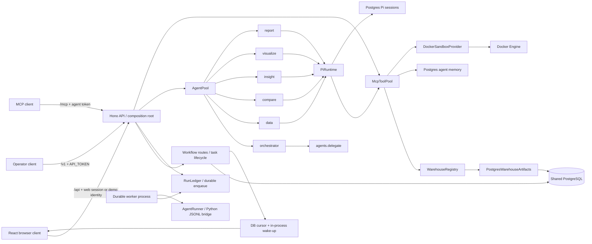
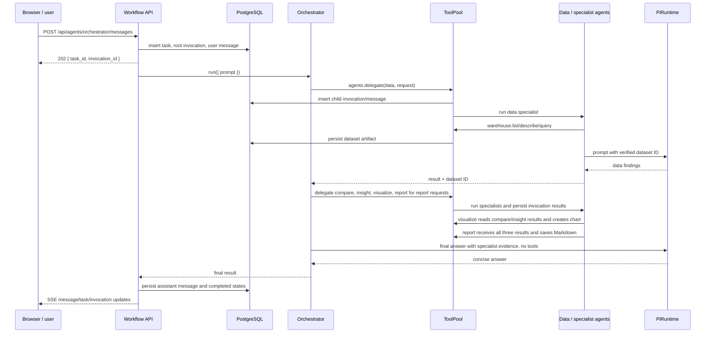

# Kiến trúc VDaAgent Analytics

Tài liệu này mô tả cách hệ thống hiện chạy, ranh giới giữa các thành phần và đường nâng cấp khi
lượng người dùng/tác vụ tăng. Những gì đang chạy được ghi là **hiện tại**; các bước scale được ghi
là **định hướng**, không phải năng lực đã benchmark.

## 1. Tóm tắt

Team 6 cAi hiện là **modular monolith có durable worker boundary** viết bằng TypeScript. API process
phục vụ HTTP và enqueue run; worker process claim run bằng PostgreSQL lease/fencing rồi chạy agent.
Local mặc định dùng `embedded` runner để dễ khởi động, còn Compose dùng API và worker riêng. React
được build thành static assets và phục vụ cùng API. PostgreSQL là một database dùng chung; Docker là
execution sandbox. Pi Agent Core xử lý vòng lặp model/tool; external agent chạy qua
`agent-runner.v2` JSONL process bridge.

```text
Browser / API client / MCP client
                |
                v
       Hono API (stateless)
       |        |
       |        +-- PostgreSQL run ledger / outbox
       |                         |
       |                         +-- worker process
       |                              |-- AgentPool / AgentRunner
       |                              |-- Pi Agent Core
       |                              +-- MCP ToolPool
       |                                   |-- warehouse providers
       |                                   |-- memory/artifacts
       |                                   +-- Docker sandbox
       |
       +-- PostgreSQL: users, tasks, invocations, messages,
                       runs, leases, events, sessions, memory, artifacts
```

Không có một PostgreSQL/database riêng cho mỗi agent. Cũng chưa có microservice riêng cho từng
agent, tool pool hay Pi. Agent TypeScript được nạp như trusted module; agent ngoài process được
đăng ký bằng manifest và worker khởi chạy qua AgentRunner.

## 2. Ranh giới kiến trúc



### API và composition root

`src/server.ts` là composition root: xác thực cấu hình khởi động, mở PostgreSQL pool, chạy
migrations, nạp agent/tool modules, gắn các tool nền tảng rồi đăng ký routes. `src/web-api.ts` sở
hữu các workflow HTTP, ghi task/message/invocation, enqueue durable run, cancellation và artifact
reads. `/v1` là API operator; `/mcp` là MCP server; `/api` là API workflow mà frontend hiện dùng.

API chịu trách nhiệm kiểm tra request, authorization ở boundary, lifecycle task và phối hợp
provider. Agent không mở port riêng và không kết nối warehouse tùy ý. Mã agent/tool được import
như code tin cậy lúc startup; thay đổi module cần deploy/restart process.

### Sáu agent

| Agent | Trách nhiệm | Quyền chính |
| --- | --- | --- |
| `orchestrator` | Hiểu yêu cầu, quyết định specialist cần gọi, tổng hợp câu trả lời cuối. | `agents.catalog`, `agents.delegate`, `agents.send/wait/result`; đọc artifact khi cần. |
| `data` | Khám phá warehouse, kiểm tra bảng và persist dataset. | Warehouse read/query, đọc dataset. |
| `compare` | So sánh dữ liệu/period/segment được cung cấp. | Đọc dataset. |
| `insight` | Giải thích pattern dựa trên evidence, tách fact khỏi hypothesis. | Đọc dataset. |
| `visualize` | Đọc kết quả Compare và Insight, chọn và persist chart từ dataset đã xác minh. | Đọc dataset, tạo chart. |
| `report` | Viết và lưu report dựa trên kết quả Compare, Insight và Visualize. | Đọc dataset, lưu report. |

Implementation là các file Python trong `agents/` (uv project, SDK `agent_platform`), chạy qua
`agent-runner.v2`. Manifest sinh bởi `agents/gen_manifests.py` vào `agents/manifests/`; host nạp
`DEFAULT_AGENT_MANIFESTS` khi `AGENT_EXTERNAL_MANIFESTS` trống. Model call đi qua host (`context.model`).

### AgentPool và MCP ToolPool

AgentPool chỉ chứa plugin đã được nạp. Mỗi plugin mô tả ID, version, API version, input/output
schema, capabilities, guardrails và tên tool có thể dùng. ToolPool là registry dùng chung cho MCP
tool. Một tool có thể phục vụ nhiều agent, nhưng mỗi lần gọi vẫn kiểm tra `agents`, `authorize`,
input schema, timeout, cancellation và output size.

Quyền dùng tool cần khớp ở hai lớp:

1. Manifest agent liệt kê tên tool mà agent được yêu cầu sử dụng.
2. Tool khai báo các agent được phép trong `agents` và kiểm tra scope trong `authorize`.

`alwaysAvailable` chỉ làm Pi nhìn thấy tool nền tảng; nó không vượt qua kiểm tra pool. MCP `tools/list`
và Pi đều dùng cùng ToolPool. Hiện đăng ký động qua HTTP chưa được hỗ trợ.

### Pi runtime

`src/pi-runtime.ts` là adapter của Pi Agent Core, không phải provider model riêng. Adapter chọn
provider/model từ cấu hình chung, dựng `Agent` với system prompt, conversation history và các Pi
tools đã authorize. Pi thực hiện model/tool loop; mỗi tool call quay lại ToolPool để kiểm tra quyền
lần nữa. Giới hạn hiện có gồm 80 context messages, 8 tool calls mỗi prompt, timeout run 180 giây
ở operator endpoint và byte limit session.

Pi session store là port tại `src/pi-session-store.ts`; PostgreSQL implementation nằm trong
`src/postgres-store.ts`. API lấy lease/ advisory lock theo `(space, user, agent, session)` để chặn
hai writer cùng sửa một transcript. Pi model history được prune trước khi lưu.

Tài liệu tham khảo: [Pi Agent Core](https://github.com/earendil-works/pi/tree/main/packages/agent)
và [MCP Tools specification](https://github.com/modelcontextprotocol/specification/blob/main/docs/specification/2025-06-18/server/tools.mdx).

## 3. Luồng xử lý chính

### Chat analytics



Giao diện nhận `202` trước khi tác vụ hoàn tất; API ghi web task và `platform_run` trong cùng
transaction. Worker claim run sau đó; `PLATFORM_RUNNER_MODE=embedded` chỉ gộp worker vào API cho
local development. `agents.delegate` giữ đường chạy đồng bộ tương thích cũ; `agents.send` tạo child
`platform_run` durable, để `agents.wait/result` đọc sau qua cùng task/tenant scope. Parent/child
invocation, trace context, message và artifact được lưu PostgreSQL.

Frontend kết hợp SSE với React Query để tránh phụ thuộc hoàn toàn vào event stream: chat, task list
và report list refetch mỗi 5 giây; roster agent mỗi 10 giây; task detail đang chạy mỗi 3 giây.
Query stale được refetch khi tab được focus hoặc mạng kết nối lại. Khi SSE reconnect, frontend
tiếp tục từ cursor PostgreSQL của event cuối và invalidate cache; khi task kết thúc, report list cũng
được invalidate. Subscriber trong process chỉ là wake-up tối ưu, còn event replay đọc từ database,
không phải cam kết cập nhật tức thời.

### Nhánh greeting và lỗi

Lời chào đơn giản được trả bằng guardrail, không gọi model. Với yêu cầu analytics, Data phải tạo
dataset ID đã persist trước khi Compare/Insight/Report chạy. Nếu thiếu dataset ID, workflow dừng và
giải thích giới hạn; không tự dựng dữ liệu/artifact. Khi có yêu cầu report, Compare và Insight chạy
trước Visualize; Visualize tạo chart, rồi Report nhận đủ ba đầu ra và ghi report. Nếu model
Visualize hoặc Report lỗi, deterministic fallback tạo chart/report từ dataset đã persist.

### Operator run và MCP

- `POST /v1/agents/{id}/run` validate schema và gọi plugin trực tiếp. Endpoint này không tạo
  workflow task/message của UI.
- `GET /v1/agents` và `GET /v1/tools` chỉ đọc registry đã nạp.
- `/mcp` xác minh agent ID/token; `tools/list` và `tools/call` chỉ dùng tool được cấp cho agent.
- `/api` dùng signed bearer web session khi `WEB_AUTH_MODE=session`; `X-User-Id` chỉ là compatibility
  trong demo mode. `/v1` vẫn dùng operator `API_TOKEN`, còn `/mcp` dùng token riêng của agent.

## 4. Dữ liệu, memory và cách ly

### Một database, nhiều tenant logic

PostgreSQL là một datastore dùng chung, không phải một instance/schema/database cho từng agent hay
người dùng. Những bảng chính:

| Bảng | Dữ liệu | Phân vùng logic chính |
| --- | --- | --- |
| `web_users` | User local/demo. | `id` |
| `web_tasks` | Tác vụ workflow và trạng thái root. | `user_id`, `id` |
| `web_invocations` | Agent run root và child/delegation. | `user_id`, `task_id`, `agent` |
| `web_messages` | Hội thoại từng agent trong workflow. | `user_id`, `agent`, `seq` |
| `pi_sessions` | Transcript phục vụ Pi. | `space_id`, `user_id`, `agent_id`, `session_id` |
| `agent_memory_entries` | Ghi nhớ lâu dài của agent. | `space_id`, `user_id`, `agent_id`, `memory_key` |
| `web_datasets`, `web_charts`, `web_reports` | Artifact analytics. | `user_id`, `invocation_id` |
| `platform_runs`, `platform_run_steps`, `platform_run_events` | Durable run, step, event và fencing state. | `space_id`, `user_id`, `run_id` |
| `platform_outbox_events`, `platform_worker_leases` | Transactional outbox và worker lease. | `run_id`, `worker_id` |
| `platform_usage_records` | Model/tool/sandbox usage và latency. | `run_id`, `user_id` |
| `web_events` | Durable per-user SSE cursor/replay. | `user_id`, `id` |
| `platform_audit_events` | Authorization, rate-limit và operator/MCP denial audit. | `space_id`, `user_id`, `created_at` |

Ứng dụng áp dụng scope trong query; hiện schema không phải database-per-tenant. Nếu yêu cầu có
isolated tenant database, encryption key riêng hoặc noisy-neighbor isolation thì cần một tầng
tenant routing và vận hành riêng, không chỉ đổi cách tạo tên agent.

### Memory per agent không có nghĩa mỗi agent một DB

Memory được lưu thành rows trong `agent_memory_entries`. Identity của một memory scope là tổ hợp
`space_id + user_id + agent_id`; memory của agent khác hoặc user/space khác không được query lẫn.
Mỗi scope bị giới hạn tổng dung lượng text 1 MB. Pi tự tìm ghi chú liên quan trong scope riêng của
agent trước mỗi lượt model; phần đưa vào context tối đa 12 KB, được đánh dấu là dữ liệu không đáng
tin cậy chứ không phải chỉ thị. Search dùng GIN full-text index, xếp hạng theo độ phù hợp và trả tối
đa 8 ghi chú; không load toàn bộ history về RAM ứng dụng để lọc. `memory.remember` có khóa tùy chọn
để cập nhật một ghi nhớ thay vì tạo bản trùng, và `memory.forget` xóa theo ID chỉ trong đúng scope.
Đây vẫn là một bảng PostgreSQL dùng chung cho tất cả agent.

Chi phí chính vì vậy tăng theo số scope/entries và kích thước DB/index/backup, không tăng thành một
PostgreSQL connection pool riêng cho từng agent. Dù vậy cần theo dõi tỷ lệ hit của GIN index, thời
gian query, bytes lưu, WAL, vacuum và backup khi số memory entries tăng. Semantic/vector search
chưa được triển khai; nếu cần, hãy thêm adapter/index phù hợp sau benchmark, không nhét embedding
vào mỗi lần đọc mặc định. Mức 1 MB là giới hạn **mỗi** `(space, user, agent)`, không phải toàn hệ
thống: nếu 1.000 user đều dùng sáu agent trong một space và mọi scope chạm trần, payload text tối đa
xấp xỉ 6 GB trước overhead row/index/WAL/backup. Production cần đặt quota tổng/retention theo user
hoặc space nếu dung lượng dự kiến vượt budget; giới hạn hiện tại chưa tự xóa memory cũ.

### Pi history và artifact

Pi session lưu JSONB với giới hạn 4 MB và tối đa 80 context messages sau pruning. Dataset hiện lưu
columns/rows dưới JSONB và có query preview/page limits; phù hợp dữ liệu demo hoặc snapshot nhỏ,
không phải kho lưu trữ bảng warehouse lớn. Khi artifact lớn lên, nên chuyển payload sang object
storage hoặc bảng artifact phân trang, còn PostgreSQL giữ metadata, ownership, checksum và storage
key.

Memory/session/task/artifact và run ledger đều bền qua restart API. Active worker controller vẫn là
process-local implementation detail, nhưng lease/fencing/cancel request trong PostgreSQL cho phép
worker khác reclaim run. SSE wake-up vẫn in-memory nhưng event cursor được lưu trong `web_events` để
replay sau reconnect; xem giới hạn scale ở phần sau.

### Docker sandbox

`src/sandbox.ts` định nghĩa contract provider-neutral; `src/docker-sandbox.ts` là provider Docker.
Mỗi workspace được đặt tên theo hash của `(space, user, agent)` và dùng Docker volume bền. Container
không có network, chạy user không đặc quyền, giới hạn CPU/RAM/PID, read-only root filesystem, bỏ
Linux capabilities và giới hạn output/time. `SANDBOX_PROVIDER=none` tắt tool. Docker socket chỉ
được gắn vào worker nội bộ trong cấu hình Compose; API public không có host control path. Quyền truy cập
socket tương đương quyền quản trị Docker host nên production vẫn cần cô lập worker/supervisor phù hợp.

#### Sandbox và thư viện

Sandbox là container riêng cho từng tổ hợp `(space, user, agent)`, không phải image thư viện riêng
cho mỗi tác vụ. Mọi container hiện dùng chung image `node:24-slim`; Docker cache image layers chung,
còn root filesystem của từng container bị cô lập và read-only. `/workspace` là volume riêng, giữ
file giữa các lần gọi. Package cài trong workspace chỉ thuộc sandbox đó. Thư viện muốn dùng chung
nên được bake một lần vào image đã kiểm duyệt rồi cấu hình qua `SANDBOX_IMAGE`. Network hiện tắt,
nên sandbox không thể tự tải package từ npm; image mặc định hiện chỉ có Node base.

## 5. Khả năng scale và chịu tải

### Điều có thể scale với một PostgreSQL dùng chung

Một PostgreSQL dùng chung là cách triển khai tiêu chuẩn cho nhiều user khi dữ liệu đã được scope,
index và giới hạn đúng. User 100 hay 1.000 không tự động buộc phải tạo 100/1.000 database. Số user
đăng ký cũng không quyết định tải bằng số request đồng thời, độ nặng truy vấn, tần suất gọi model,
thời gian giữ connection và kích thước artifact. Hiện chưa có benchmark/load test để cam kết một
con số RPS hay concurrency cụ thể.

`src/server.ts` tạo một `pg.Pool` tối đa 20 connections cho mỗi API process. Tổng connection khả
dụng xấp xỉ:

```text
API replicas x pool.max
+ worker replicas x worker pool.max (nếu bổ sung worker)
+ migration/admin/test connections
<= PostgreSQL max_connections, có phần dự phòng cho vận hành
```

Ví dụ 4 API replicas với `max: 20` có thể giữ tới 80 API connections, dù chỉ có 1.000 user. Trước
khi tăng replicas cần tính tổng pool budget, cân nhắc PgBouncer, theo dõi connection saturation và
đặt `pool.max` theo workload. Không tăng `max_connections` vô hạn vì mỗi backend connection cũng
tốn memory ở PostgreSQL.

### Giới hạn hiện tại trước khi horizontal scale API

1. **Worker reclaim chưa thay thế recovery test đầy đủ.** Lease/fencing đã có, nhưng cần integration
   test kill worker trước/sau side effect và reconciler cho mọi workflow.
2. **Active controller là in-memory map trong từng worker.** Cancellation request đã durable, nhưng
   worker cần heartbeat/retry đúng để dừng provider call; không dùng map làm source of truth.
3. **SSE wake-up là in-memory map.** Lịch sử event và cursor đã ở PostgreSQL; nhiều replicas vẫn
  replay được, còn pub/sub chỉ là tối ưu để đánh thức connection ngay lập tức.
4. **Shared Pi session lease dùng PostgreSQL.** Điều này hỗ trợ cross-process serialize transcript,
   nhưng không tự tạo job recovery hay streaming event fan-out.
5. **Compose đã có API + worker + PostgreSQL**, nhưng chưa có resource limits, autoscaling, PgBouncer,
   backup/restore job, metrics/alerting hay load profile production.
6. **Identity provider vẫn ở ngoài repository.** Signed session mode đã chặn spoofing trong web API,
   nhưng OIDC/gateway provisioning, key rotation và production tenant policy chưa được diễn tập.

Do đó có thể tăng CPU/RAM cho một API hoặc thêm worker trong giới hạn đã đo, nhưng chưa nên công bố
RPS/concurrency hay rolling-deploy SLO trước khi hoàn tất recovery, backup và load evidence.

### Đường nâng cấp theo giai đoạn

| Giai đoạn | Thay đổi | Mở khóa |
| --- | --- | --- |
| 1. Đo baseline | Load test mix chat/greeting/analytics, theo dõi p50/p95, pool wait, DB CPU/IO, query latency, model latency, memory/index size và Docker concurrency. | Có số liệu để đặt capacity và giới hạn thực tế. |
| 2. Bảo vệ PostgreSQL | Scope/index mọi query; connection budget; PgBouncer khi số process tăng; statement/lock timeout; backup/restore drill; giữ artifact nhỏ hoặc chuyển payload lớn sang object storage. | Tăng kết nối/request mà không làm DB quá tải hoặc phình JSONB/WAL. |
| 3. Tách execution worker | API ghi durable job/outbox; worker claim bằng lease, heartbeat, deadline, retry/idempotency và recovery; worker dùng chung AgentPool contract. | Scale agent concurrency độc lập với HTTP và không mất task khi restart API. |
| 4. Scale API stateless | Nhiều API replicas sau khi active task chuyển sang worker; SSE qua Redis/NATS/PostgreSQL event feed có replay; distributed cancellation keyed theo task ID. | Load balancing và deploy rolling có hành vi nhất quán. |
| 5. Tách datastore theo áp lực đo được | Read replicas cho read-heavy endpoint; partition/archive bảng events/invocations khi kích thước/maintenance yêu cầu; object storage cho artifact lớn; database riêng chỉ khi isolation/tenant load yêu cầu. | Bảo vệ OLTP và giảm backup/index cost mà vẫn giữ ownership contract. |
| 6. Tách service có lý do | Tách sandbox supervisor/worker hoặc integration service khi có boundary bảo mật, nhu cầu scale độc lập hay deploy cadence đo được. | Cô lập tải và quyền; tăng độ phức tạp vận hành tương ứng. |

Không nên tách từng agent thành microservice chỉ vì có nhiều agent. Agent hiện chia sẻ runtime,
pool policy, persistence và task context; biến mỗi agent thành service sẽ nhân đôi connection,
deploy, auth, retries và observability trước khi có lợi ích đo được. Modular monolith cho phép scale
API/worker theo process rồi mới extract một boundary có tải hoặc rủi ro riêng.

### Các chỉ số cần có trước production scale

- HTTP request rate, status/error rate và latency p50/p95/p99 theo route.
- Task queue age/count, run duration, cancel latency, retries, orphaned-running tasks và invocation
  depth/count.
- Pi provider latency/error/rate limit/token usage; số lượt model/tool mỗi task.
- PostgreSQL active/idle/waiting connections, pool acquire wait, transaction duration, lock wait,
  slow queries, CPU/IO, table/index/WAL size và replication lag nếu dùng replica.
- Memory rows/bytes theo scope, GIN index size/hit, search latency và limit saturation.
- Docker running containers, create/exec latency, CPU/RAM/PID/output limit, stale container/volume
  count.
- Dataset/artifact size, query duration và tỷ lệ artifact được chuyển external storage.

Load test phải dùng dữ liệu tổng hợp, giới hạn concurrency/tool/model cost, và đo cả cold start lẫn
steady state. Không test tải vào warehouse production hoặc model thật nếu chưa định ngân sách và
ngưỡng dừng.

## 6. Deploy và vận hành

### Local hiện tại

`docker compose up --build -d` chạy API, worker và PostgreSQL; API bind localhost port 3000. Chỉ
worker nội bộ nhận Docker socket để thực hiện sandbox.
Dockerfile build frontend trước rồi đóng gói frontend static, backend TypeScript và migrations. Volume
`postgres-data` giữ PostgreSQL qua restart. API chạy migrations lúc startup trước khi nhận request.
Lệnh chạy nền, prerequisites và frontend hot reload nằm trong [README](../README.md).

### Production prerequisites còn lại

Các kiểm soát nền tảng sau đã có implementation local: signed web session, operator/MCP bearer
auth, body limit, secure headers, per-process rate limit, `/ready`, `/metrics`, audit denial events,
worker-only Docker socket, durable run/outbox/lease primitives và SSE cursor replay. Trước public
deployment vẫn cần bằng chứng vận hành bên ngoài repository:

- OIDC/session gateway thật, provisioning `web_users`, key rotation và tenant policy review.
- Distributed rate limiting, TLS/reverse proxy, CORS/CSRF policy và secret manager.
- Backup/PITR restore rehearsal, migration rollback/forward test, retention và disk/WAL alerts.
- Worker kill/recovery, duplicate side-effect/idempotency và DB outage integration tests.
- OTel exporter/collector delivery, dashboard/alert queries và redaction review trên môi trường đích.
- Load/capacity benchmark cho API, worker, PostgreSQL và sandbox trước khi đặt SLO hoặc scale replicas.

## 7. Bố trí mã nguồn và ownership

```text
src/
├── agents/                 # 6 agent, roster, shared workflow và factory
├── tools/                  # Tool pool modules và tool factory
├── providers/warehouse/    # Warehouse adapters; hiện có mock provider
├── agent-contract.ts       # Shared AgentPlugin/AgentContext
├── registry.ts             # AgentPool + startup module loader
├── tool-pool.ts            # MCP tool contract, authorization, validation, timeout
├── pi-runtime.ts           # Adapter sang Pi Agent Core
├── postgres-store.ts       # PostgreSQL memory và Pi sessions
├── web-api.ts              # Chat/task/invocation/SSE/artifact API
├── server.ts               # Composition root
└── ...                     # MCP, sandbox, warehouse và artifact boundaries
db/migrations/              # Schema/migration version hóa
frontend/src/               # React API client, chat, task tree và artifact views
test/                       # Unit tests + PostgreSQL integration/e2e tests
```

Quy ước chia ownership chi tiết nằm ở [folder-ownership.md](folder-ownership.md). Bắt đầu tạo agent
ở [agents.md](agents.md), tool ở [tools.md](tools.md), endpoint ở [api.md](api.md).

## 8. Kiểm thử kiến trúc

- Unit tests offline cho manifest, registry, authorization, schema, cancellation và specialist
  workflow.
- PostgreSQL integration tests trong `test/agent-memory.test.ts` và
  `test/analytics-e2e.test.ts` bật bằng `TEST_DATABASE_URL`; chúng chạy migrations và kiểm tra
  memory isolation/session lock hoặc toàn bộ workflow. Nếu biến không có, hai suite này được skip.
- Analytics end-to-end test gọi workflow API, dùng PostgreSQL thật, deterministic Pi substitute,
  synthetic warehouse và xác nhận task, cả sáu invocation, dataset/chart/report cùng kết quả cuối.
- Frontend build xác minh client/type contract; không dùng test UI thay integration test backend.
- Load test cần được chạy riêng theo profile mục tiêu trước khi công bố giới hạn concurrency/RPS.

Lệnh cơ bản:

```sh
corepack pnpm check
corepack pnpm test
corepack pnpm lint
corepack pnpm frontend:build
npm --prefix frontend test
```

## 8. Platform refactor direction

`PLAN.md` là tài liệu chuẩn cho lộ trình từ modular monolith lên platform. Phần P1 hiện đã bắt đầu
được hiện thực trong code:

- `AgentPool` có capability discovery, manifest validation và catalog port.
- `ModelRegistry` hỗ trợ model profile cấu hình ngoài agent code.
- `WarehouseAdapter`/`WarehouseRegistry` công bố capability để nhiều provider dùng cùng contract.
- Planner tạo plan theo capability; orchestrator delegate theo capability thay vì chỉ biết specialist
  ID trong đường chạy mới.
- `AgentRuntime`/`agent-sdk` tách contract agent khỏi implementation của API và PiRuntime.
- `platform_runs` cùng worker lease, fencing, outbox và idempotency schema là nền tảng cho bước tách
  execution ra worker; `src/worker.ts` và Compose worker đã nối web task vào queue.
- `agent-runner.v2`, `src/agent-runner.ts`, external manifest loader và `sdk/python` là đường tích hợp
  Python process-isolated đầu tiên; host vẫn giữ tool authorization và scope. `agents.send`,
  `agents.wait`, `agents.result` đi cùng bridge này để Python team agent trao đổi qua durable child
  runs, không gọi backend trực tiếp.

## Trạng thái contract stack mới

`pnpm compat:matrix` (`docs/execution/compatibility-matrix.json`) cho biết lớp nào production import.

Đã nối vào production:

- `src/contracts/`: `agent.v1` manifest, `AgentModule` và ports, cùng generated types từ `schemas/`.
- `src/ports/host-factory.ts` và `module-plugin.ts`: factory port dùng chung cho `AgentModule` và process agent v2.
- `src/registry/agent-registry.ts`: activation gate (`enabled` mới phục vụ traffic).
- `src/agent-runner.ts`: process protocol (`agent-runner.v2`) cho external manifest.
- `/api/v1`, MCP server, A2A gateway; artifact, evidence và receipt storage; OTel, observatory; lifecycle
  probes; `AlertScheduler` trong worker.

- Port `tools`, `warehouse`, `artifacts`, `memory`, `collaboration` (`src/ports/host-*.ts`), event outbox
  fan-out (`src/outbox-consumers.ts`) và shaping ngữ cảnh model (`src/session/runtime-context.ts`).

Chưa được production import: port `sandbox`, `src/ports/mailbox.ts`, `src/checkpoint-manifest.ts`,
`src/sandbox-policy.ts`, `src/registry/policy-engine.ts`, workflow planner/child-run và reference agents.
Danh sách việc còn mở: [PROGRESS](../PROGRESS.md#việc-còn-mở).

Các giới hạn còn lại, đặc biệt recovery/side-effect test, external OIDC provisioning, distributed
rate limiting, backup/load evidence, process/container hardening và OpenTelemetry exporter, vẫn phải
đi qua các phase P2-P5 trong [PLAN](../PLAN.md). Event cursor replay, local auth controls, worker
lease/outbox và sandbox quotas đã có code nhưng chưa tự động chứng minh production conformance. Sơ đồ
ở các phần trước mô tả target architecture; không coi các thành phần chưa có evidence vận hành là đã
được triển khai.
