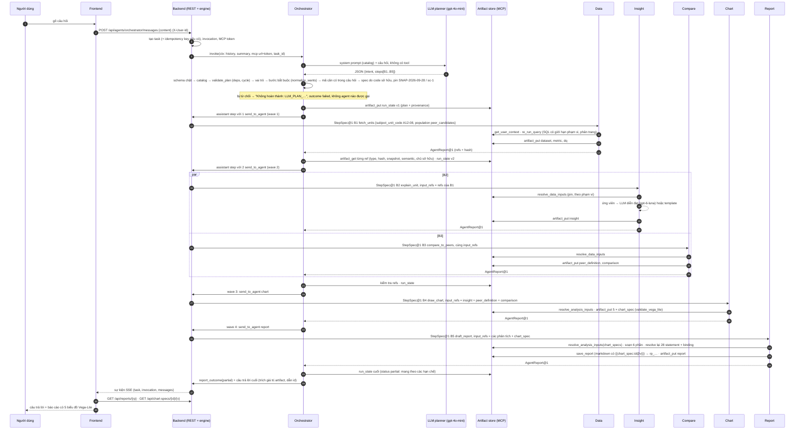
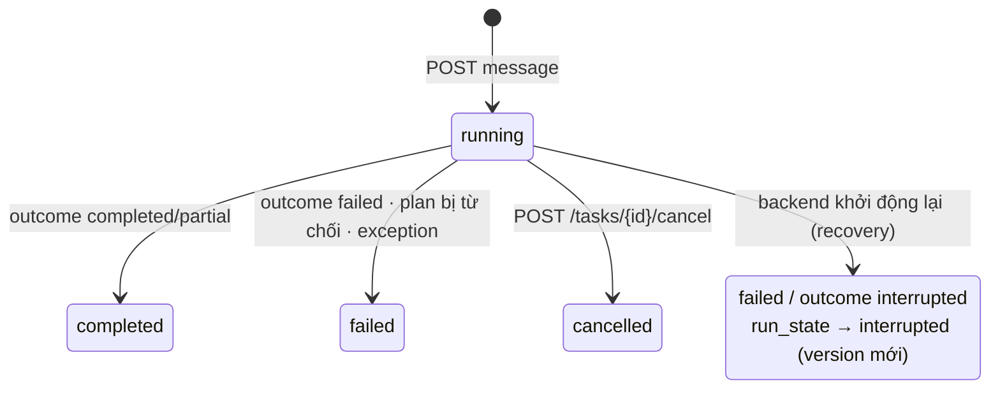
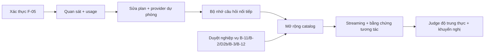

# VDaAgent: Kiến trúc hệ thống đa agent

> Tài liệu kiến trúc chi tiết, nằm dưới [AGENTS.md](../../AGENTS.md) ở thư mục gốc. Tài liệu đã được audit ngày
> 2026-09-30:
> - đối chiếu với code trên branch `agent_a/debug` (working tree chưa commit);
> - đối chiếu với bằng chứng đã chạy của WS1–WS7 và AGENTS.md §18–§21.
>
> Nếu tài liệu này và code không khớp, code là chuẩn; hãy báo lại chỗ lệch. Tên định danh (hàm, file, contract, mã lỗi,
> field) giữ nguyên tiếng Anh như trong code.

**Nhãn trạng thái.**

| Nhãn | Ý nghĩa |
|---|---|
| IMPLEMENTED | Đã có trong code |
| VERIFIED | Đã được chứng minh bằng test hoặc lần chạy runtime được trích dẫn trong tài liệu |
| PARTIAL | Chỉ chạy được cho một phần trường hợp |
| PLANNED | Đã thiết kế, chưa xây dựng |
| BLOCKED | Đang chờ quyết định nghiệp vụ; không được tự đoán |
| NOT IMPLEMENTED | Chưa có |
| NOT VERIFIED | Có thể đã có, nhưng chưa từng được chứng minh |

---

## 0. Mục lục

1. Kiến trúc tổng quan
2. Luồng runtime (HC4)
3. Sáu agent
4. Contract giữa các agent
5. Context và bộ nhớ
6. Quan sát token / LLM
7. Lỗi, retry, idempotency
8. Bảo mật và phân quyền
9. Lỗ hổng kỹ thuật
10. Lộ trình lên hệ thống production-grade ("Grokbot-class")
11. Phân công ownership
12. Danh mục mã nguồn

---

## 1. Kiến trúc tổng quan

### 1.1 VDaAgent là gì

VDaAgent trả lời các câu hỏi phân tích về tồn kho bất động sản cho người dùng Sales Ops. Ví dụ: "Vì sao căn A12-08 bán
chậm? So sánh với các căn tương đồng, vẽ biểu đồ và xuất báo cáo."

Yêu cầu cốt lõi:
- mọi con số trong câu trả lời phải truy được về dữ liệu warehouse có quản trị;
- mọi con số được pin vào đúng một snapshot và một cấu hình semantic.

### 1.2 Vì sao có sáu agent

| Agent | Lý do tồn tại |
|---|---|
| Orchestrator | Điểm vào duy nhất: hiểu yêu cầu, lập kế hoạch, chạy DAG, viết câu trả lời cuối |
| Data | Nơi duy nhất đọc warehouse có quản trị; tạo dataset, metric và DQ, pin bằng hash |
| Insight | Giải thích *vì sao*: tạo ứng viên chẩn đoán và diễn đạt chúng |
| Compare | So sánh với peer: chọn peer, tính chênh lệch với trung vị peer |
| Chart | Biến artifact phân tích thành Vega-Lite render được, gắn với bằng chứng |
| Report | Ghép báo cáo 6 phần có trích dẫn đầy đủ và giao báo cáo |

Việc chia agent tách biệt trách nhiệm, và buộc tuân theo một nguyên tắc: **chỉ Data chạm vào dữ liệu gốc, không agent
nào phía sau được tính lại số.**

### 1.3 Vì sao agent này dùng LLM, agent kia thì không

- **LLM được dùng ở những chỗ mà ngôn ngữ chính là nhiệm vụ:**
  - hiểu ý định và đề xuất plan (Orchestrator);
  - diễn đạt insight (Insight).
- **Mọi thứ tạo ra hoặc di chuyển con số đều deterministic.** Gồm SQL, chọn peer, metric, biểu đồ và số liệu trong
  báo cáo, để sự thật tái lập và kiểm toán được.
- Kiểm chứng live (AGENTS.md §19–§21) cho thấy bật LLM chỉ thay đổi **cách diễn đạt**: cả 28 giá trị trong báo cáo
  giống hệt bản chạy deterministic.

### 1.4 Quyền điều khiển, sự thật và artifact nằm ở đâu

| Vấn đề | Vị trí | Trạng thái |
|---|---|---|
| Luồng điều khiển | DAG thực thi bằng code của Orchestrator (`dag.py`, `executor.py`). LLM chỉ *đề xuất* plan (`llm_planner.py`). | VERIFIED |
| Lập lịch lượt chạy, gọi agent, huỷ, độ sâu, deadlock | Engine của Backend (`backend/vdagent_backend/engine/engine.py`) | VERIFIED |
| Dữ liệu chuẩn | `var/re_warehouse.db` (mock DW bất động sản), chỉ đọc qua các MCP tool có giới hạn phạm vi của Backend | VERIFIED |
| Artifact | Artifact store của Backend: bảng SQLite `artifacts` (`db/artifact_store.py`), có version và content hash | VERIFIED |
| Contract | `contracts/vdagent_contracts/` (`messages.py`, `reports.py`, `envelope.py`, `step_inputs.py`, `vega_lite.py`) và `catalogs/*.json` | VERIFIED |
| Truy vết | `input_artifact_refs` pin bằng `content_hash`; mỗi giá trị trong binding biểu đồ và statement của báo cáo có `source_ref = <id>@<v>#<json-pointer>` | VERIFIED |

### 1.5 Sơ đồ tổng quan (theo đúng implementation hiện tại)

```mermaid
flowchart TB
    UI[Người dùng / React UI<br/>do Backend phục vụ] -->|REST POST /api/agents/orchestrator/messages<br/>X-User-Id, Idempotency-Key tuỳ chọn| BE
    subgraph BE[Tiến trình Backend: FastAPI + engine + MCP server, mọi plugin chạy in-process]
      ENG[Engine<br/>stack theo user,agent · hàng đợi FIFO · max_depth 4 · max_steps 12<br/>wait-for graph · huỷ · khôi phục]
      MCP[MCP server<br/>bearer token theo từng invocation → user, agent, task<br/>PERMISSIONS + WRITABLE_TYPES]
      STORE[(backend.db<br/>tasks · invocations · messages · artifacts · reports · user_scopes · memories)]
      DW[(re_warehouse.db<br/>view theo phạm vi từng user)]
      subgraph ORCH[Plugin Orchestrator]
        LLMP[LLM planner<br/>ORCH_LLM=on]
        DET[Bộ phân loại deterministic<br/>ORCH_LLM=off]
        VAL[Kiểm tra plan<br/>schema · catalog · deps · cycle · vai trò · pin]
        EXE[DAG executor<br/>wave · kiểm tra ranh giới · run_state]
      end
      D[Plugin Data]
      I[Plugin Insight]
      C[Plugin Compare]
      CH[Plugin Chart]
      R[Plugin Report]
    end
    LLMP --> VAL
    DET --> VAL
    VAL --> EXE
    EXE -->|send_to_agent StepSpec@1 qua engine| D & I & C & CH & R
    D & I & C & CH & R -->|AgentReport@1| EXE
    D -->|re_run_query| MCP
    ORCH & D & I & C & CH & R -->|artifact_put / get / list| MCP
    MCP --> STORE
    MCP --> DW
    R -->|save_report → rp_…| MCP
    LLMP -. OpenAI gpt-4o-mini .-> EXTL[(LLM API)]
    I -. OpenAI gpt-6-luna / Gemini .-> EXTL
```

Điểm then chốt: các agent **không bao giờ gọi trực tiếp nhau** và không dùng chung bộ nhớ.
- Mọi lời gọi đi qua engine (`send_to_agent` → `ctx.call_agent`).
- Mọi dữ liệu trao đổi đi qua artifact store.

---

## 2. Luồng runtime (HC4, VERIFIED live)

Câu hỏi: "Vì sao căn A12-08 bán chậm? So sánh với các căn tương đồng, vẽ biểu đồ và xuất báo cáo."

Lần chạy live đã kiểm chứng: task `t_2fa1d728cded`. Planner `gpt-4o-mini`, 3,1 s. Waves `[[B1],[B2,B3],[B4],[B5]]`.



Chi tiết từng giai đoạn:

| Wave | Bước | Đầu vào | Kiểm tra trước khi gọi | Đọc | Ghi | Trả về |
|---|---|---|---|---|---|---|
| 1 | B1 data.fetch_units | StepSpec@1, không có input_refs | plan đã được kiểm tra; snapshot đã pin | `get_user_context`, `re_run_query` | dataset `re_dataset@1`, metric `re_metric@1`, dq `re_dq@1` | 3 ref |
| 2 | B2 insight.explain_unit ∥ B3 compare.compare_to_peers | StepSpec@1 với refs **giống hệt nhau** từ B1 | mọi ref của B1 được kiểm bằng `artifact_get`: type theo catalog, hash, snapshot, semantic, chủ sở hữu | dataset / metric / dq | insight; peer_definition + comparison | 1 ref; 2 ref |
| 3 | B4 chart.draw_chart | refs insight + peer_definition + comparison (mode `any`) | như trên | ba phân tích | 5 × chart_spec | 5 ref |
| 4 | B5 report.draft_report | refs phân tích + chart_spec (mode `any`) | như trên | tất cả ở trên | `rp_…` (bảng reports) + artifact report | 1 ref |

Thời gian đo được ở lần chạy live HC4 là khoảng 25 s từ đầu đến cuối. Gần như toàn bộ thời gian nằm ở hai lần gọi LLM
(planner ≈3 s, Insight ≈4–5 s). Tổng các bước deterministic dưới 1 s.

---

## 3. Sáu agent

### 3.1 Orchestrator (`agents/orchestrator/vdagent_orchestrator/`)

**Trách nhiệm.**
- Sở hữu yêu cầu: ý định, plan, thực thi, câu trả lời cuối và outcome của run.
- Sở hữu `run_state` (các loại artifact được ghi: `run_state`, `run_summary`).

**Không sở hữu.**
- Không tính metric, không chọn peer, không đọc warehouse, không ghi artifact phân tích.
- Không bao giờ chuyển tiếp ref chưa được kiểm tra.

**Đầu vào.**
- Văn bản tự do từ người dùng.
- JSON `AnalysisRequest@1` (`planner.parse_request`).

**Đầu ra.**
- Câu trả lời cuối trong chat: bảng markdown trích giá trị artifact, các hạn chế, id `run_state`.
- `task.outcome` qua `ctx.report_outcome` (`completed | partial | failed`).
- Các version của `run_state@1`.

**Tool.**
- `send_to_agent` (engine).
- MCP `artifact_get`, `artifact_list`, `artifact_put` (`run_state`), `get_user_context`.

**Sử dụng LLM.**

| Mode | Diễn ra thế nào | Trạng thái |
|---|---|---|
| `ORCH_LLM=on` (mặc định khi có key; `backend-live`) | 1 lần gọi mỗi yêu cầu (`gpt-4o-mini` trong demo, prompt `orch-llm-plan-1.1.0`, không có tool). LLM trả `{intent: {in_scope, subject_unit_code, wants}, steps: [{step_id, agent, operation, depends_on}]}`. | VERIFIED live trên 4 happy case |
| `ORCH_LLM=off` | Bộ phân loại theo từ khoá, deterministic (`planner.classify`) | VERIFIED |
| `ORCH_LEGACY_LOOP=on` | Vòng lặp tool LiteLLM cũ, nằm ngoài DAG (chỉ để debug) | IMPLEMENTED, không dùng cho demo |

**Phần deterministic.**
- Schema, kiểm tra catalog, dependency, cycle, luật vai trò và `normalize_wants`.
- Mã căn phải xuất hiện trong câu hỏi.
- Spec (`planner.step_spec`), binding, mode phụ thuộc, pin snapshot/semantic, `plan_id`, thực thi.
- Soạn câu trả lời (`answer.py`).

**Trạng thái / context.**
- `ctx.history` (tin nhắn người dùng) và `ctx.summary` (stack đã nén).
- Plan nằm trong bộ nhớ tiến trình và trong `run_state` (`payload.plan`, `steps[]`, `waves`, `provenance` với plan
  do LLM lập).

**Chế độ lỗi.**
- Các mã từ chối plan (§7.2).
- `CALL_REJECTED`, `MALFORMED_REPORT`, `UPSTREAM_FAILED:<agent>`.
- Deadline của run `ORCH_DAG_TIMEOUT_S` (mặc định 300 s) → `timed_out` / `DEADLINE_EXCEEDED`.
- `LLM_PLAN_UNAVAILABLE`.

**Upstream / downstream.**
- Upstream: người dùng qua Backend.
- Downstream: 5 worker và UI.

**Giới hạn hiện tại.**
- Chỉ phân tích một căn; catalog chưa có plan cho nhiều căn hay cấp dự án.
- Không sửa hay thử lại plan khi bị từ chối.
- Không có tiến trình dạng streaming ngoài các sự kiện của engine.
- Không thể đặt timeout cho từng bước (luật R4 của engine); chỉ có deadline cho cả run.
- Chưa có LLM diễn đạt câu trả lời cuối.

**Mục tiêu production-grade.**
- Lập plan nhiều ý định trên một catalog phong phú hơn.
- Vòng sửa plan có giới hạn: gửi lý do từ chối ngược lại LLM, thử lại tối đa 1 lần.
- Câu hỏi làm rõ (`input_required`).
- Ngân sách chi phí/độ trễ cho plan.
- SLA cho từng bước.
- LLM tổng hợp câu trả lời, nhưng chỉ dùng các statement có trích dẫn.

### 3.2 Data (`agents/data/vdagent_data/`)

**Trách nhiệm.**
- Nơi duy nhất đọc `re_warehouse` có quản trị.
- Pin snapshot (`_pin_snapshot`: chỉ nhận snapshot APPROVED; từ chối `latest` và DRAFT).
- SQL có giới hạn phạm vi, phân trang dòng, tạo artifact dataset / metric / DQ.
- Metric thiếu được ghi `null` kèm hạn chế (D8).

**Không sở hữu.**
- Chọn peer (Compare), giải thích (Insight), biểu đồ, báo cáo.
- Phân quyền: phạm vi do Backend cấp.

**Đầu vào.**
- `StepSpec@1` với `fetch_units` (`subject_unit_code`, `population` `subject|peer_candidates`, `project_ids` tuỳ
  chọn), hoặc `aggregate_metrics` (`filters`).
- Văn bản tự do đi vào đường SQL-bằng-LLM legacy trên warehouse bán lẻ, là một miền dữ liệu khác.

**Đầu ra.**
- `AgentReport@1` với 3 ref.
- `dataset` `re_dataset@1`: các bảng, row_counts, excluded, truy vấn theo hash SQL, snapshot và cấu hình semantic.
- `metric` `re_metric@1`.
- `dq` `re_dq@1`.

**Tool.** `re_run_query`, `re_list_tables`, `re_describe_table`, `get_dataset_rows`, `get_user_context`,
`artifact_put`.

**LLM.**
- Không dùng trên đường StepSpec (VERIFIED).
- `DATA_LLM` chỉ bật/tắt vòng lặp văn bản tự do legacy (warehouse bán lẻ).

**Trạng thái.** `_Run` theo từng bước (queries, sources); không giữ gì giữa các bước.

**Chế độ lỗi.**
- `UNIT_NOT_FOUND`, `UNIT_AMBIGUOUS` (kèm `question`).
- `SUBJECT_AREA_UNAVAILABLE`, `RESULT_TRUNCATED`, `EMPTY_POPULATION`, lỗi snapshot, `TOOL_FAILED`.

**Downstream.** Insight, Compare (qua ref).

**Giới hạn.**
- `net_area_m2` là dữ liệu tổng hợp (B-3).
- Chưa nạp CRM hay báo cáo chuyên gia.
- Catalog chỉ có `fetch_units` và `aggregate_metrics`.

**Mục tiêu.**
- Truy vấn qua semantic layer thay vì SQL viết tay.
- Metadata về độ tươi của dữ liệu và SLA.
- Snapshot tăng dần.
- Lineage ở mức cột.

### 3.3 Insight (`agents/insight/vdagent_insight/`)

**Trách nhiệm.**
- Giải thích chẩn đoán cho một căn: tạo ứng viên (T1/T7…), cổng đủ dữ liệu, đánh giá độ tin cậy/KEY.
- Diễn đạt: bằng LLM khi được cấu hình, nếu không thì bằng template.
- Tạo artifact `insight`.

**Không sở hữu.** Truy cập dữ liệu gốc, chọn peer, biểu đồ, báo cáo.

**Đầu vào.**
- `StepSpec@1` `explain_unit` (`intent SLOW_MOVING_INVESTIGATION`, `tasks`, `analysis_scope` do executor tính từ
  dataset của B1).
- Ref tới dataset / metric / dq.

**Đầu ra.** Artifact `insight` (`insight.v2`), gồm `input_view`, `insight.insights[]` (claim với
`numeric_bindings`, `rendered_text`, confidence), các hạn chế, `chart_hints`.

**Tool.**
- `artifact_get`, `artifact_put`, `get_user_context` (qua `resolve_data_inputs`).
- Store SQLite riêng `var/insight_artifacts.db` (idempotency, usage).

**LLM.**
- Chính: Gemini `gemini-3.5-flash-lite`; dự phòng: OpenAI `gpt-6-luna`; tối đa 1 lần sửa (`config/llm.yaml`).
- Mới VERIFIED live với OpenAI, vì key Gemini đang trống.
- LLM chọn và diễn đạt insight từ **các ứng viên đã tính sẵn**. Con số lấy từ `numeric_bindings`, không phải từ LLM.
- `INSIGHT_LLM=off` chuyển sang template.

**Trạng thái.**
- Chỉ trong phạm vi một task. Trên đường DAG, bộ nhớ là `NoOpMemory`.
- Đường văn bản tự do legacy dùng `ctx.memory` (`ScopedMemory` của Backend).

**Chế độ lỗi.**
- Lỗi đầu vào từ resolver (`SCOPE_VIOLATION`, lệch hash…).
- `INSIGHT_LLM_FAILED` thì quay về template.
- Hết deadline thì tạo artifact PARTIAL.

**Giới hạn.**
- B-12: ngưỡng và mẫu hành động của sc-1 chưa được duyệt.
- D2b: ánh xạ phân khúc.
- LLM từng làm mất một sắc thái ("thiếu không ngẫu nhiên") khi diễn đạt lại (AGENTS.md §19).

**Mục tiêu.**
- Kiểm tra độ trung thực của văn bản LLM ở mức từng câu, đối chiếu với binding.
- Ngưỡng được duyệt.
- Bối cảnh thị trường lấy từ DW.
- Điểm bằng chứng cho từng insight hiển thị trên UI.

### 3.4 Compare (`agents/compare/vdagent_compare/`)

**Trách nhiệm.**
- Chọn peer: diện tích net với dung sai theo tỷ lệ (D9); cùng loại, cùng đợt mở bán, cùng nhóm tầng.
- Metric so sánh: giá trị của căn, trung vị peer, `pctGap`.
- Artifact `peer_definition` + `comparison`.

**Không sở hữu.** Đọc dữ liệu, giải thích, biểu đồ.

**Đầu vào.** `StepSpec@1` `compare_to_peers` (`subject`, `comparisonMode peer_group`), kèm ref tới dataset / metric / dq.

**Đầu ra.**
- `peer_definition@1`: peers, subjectProfile, areaTolerance.
- `comparison@1`: metrics với subjectValue, benchmark `{value, n}`, pctGap.

**LLM.**
- Không dùng trên đường StepSpec (VERIFIED).
- `COMPARE_LLM` và key chỉ ảnh hưởng planner/diễn đạt của đường văn bản tự do legacy.

**Chế độ lỗi.** Lỗi đầu vào từ resolver; không đủ peer (hạn chế `BLOCKED:B-2_min_peer_count`).

**Giới hạn.**
- **B-11:** chọn được 5 peer, trong khi bộ golden của nghiệp vụ có 7 và chưa có luật được duyệt.
- B-2: `min_peer_count`.

**Mục tiêu.**
- Luật chọn peer được duyệt và có version.
- Điểm tương đồng giải thích được.
- Test độ ổn định của tập peer.
- Benchmark cấu hình được (trung vị/IQR).

### 3.5 Chart (`agents/chart/vdagent_chart/`)

**Trách nhiệm.**
- Chiếu artifact phân tích thành `chart_spec@1`: Vega-Lite v6 kèm bản render Plotly, semantic spec, dataset và
  `bindings[{record_index, field, value_exact, unit, source_ref}]`.
- Kiểm tra bằng `validate_vega_lite`; không lưu spec sai (`INVALID_VEGA_LITE`).

**Không sở hữu.** Con số (không bao giờ tính lại), phân tích, soạn báo cáo.

**Đầu vào.** `StepSpec@1` `draw_chart` (`chart_type` tuỳ chọn), kèm ref tới insight và/hoặc comparison +
peer_definition.

**Đầu ra.**
- Các artifact `chart_spec`.
- HC4 tạo 5: 2 cột căn so với peer, 1 scatter trên các peer thực tế, 2 KPI dạng mark `text`.

**LLM.**
- Không dùng trên đường StepSpec.
- Có một advisor tuỳ chọn cho đường demo, chỉ khi `CHART_DEMO=on`.

**Chế độ lỗi.** `NOTHING_TO_CHART`, `CHART_FAILED`, `NOT_CHARTED_NULL`, `INVALID_BINDING`, `UNSUPPORTED_CHART_TYPE`,
`INVALID_VEGA_LITE`.

**Giới hạn.**
- Tên policy `chart-policy/demo-1.0` là nợ đặt tên.
- Chưa có biểu đồ 7 peer (B-11).
- Id `chart_spec` không click được trong chat; biểu đồ chỉ render bên trong báo cáo.

**Mục tiêu.**
- Render biểu đồ ngay trong chat.
- Drill-down tương tác tới `source_ref`.
- Khả năng tiếp cận (alt text sinh từ binding).
- Policy production.

### 3.6 Report (`agents/report/vdagent_report/`)

**Trách nhiệm.**
- Báo cáo tiếng Việt 6 phần, deterministic (`compose.py`). Mỗi con số là một `Statement` có `value_exact` và
  `source_ref`.
- Resolve lại toàn bộ statement và binding biểu đồ trước khi lưu.
- Giao báo cáo qua `save_report` (`rp_…`, nhúng `{{chart_spec:id@v}}`) và artifact `report`.

**Không sở hữu.** Phân tích, biểu đồ, con số.

**Đầu vào.** `StepSpec@1` `draft_report` (`title` tuỳ chọn), kèm ref tới insight / comparison / peer_definition /
chart_spec.

**Đầu ra.** `rp_…` (bảng reports) và artifact `report`; artifact là PARTIAL khi có hạn chế.

**LLM.**
- Không dùng trên đường StepSpec (`REPORT_LLM` không ảnh hưởng ở đây).
- Đường LangGraph + Jev judge có tồn tại cho văn bản tự do khi có key, nhưng NOT VERIFIED live.

**Chế độ lỗi.**
- `EVIDENCE_INVALID`: statement hoặc binding không resolve được, hoặc Vega-Lite sai. Khi đó không lưu gì.
- Lỗi lưu trữ: không ghi gì (VERIFIED bằng test).

**Mục tiêu.**
- Tóm tắt điều hành bằng LLM (tuỳ chọn), chỉ dùng statement có trích dẫn, có judge kiểm tra độ trung thực.
- Xuất PDF/DOCX.
- Version và diff báo cáo.

---

## 4. Contract giữa các agent

### 4.1 Cách truyền tải (VERIFIED trong code)

| Câu hỏi | Trả lời |
|---|---|
| Agent có gọi trực tiếp nhau không? | **Không.** Orchestrator phát một assistant step chứa các tool call `send_to_agent`. Engine biến mỗi call thành một invocation con của agent đích (`ctx.call_agent`), sau khi kiểm tra: agent không tồn tại, tự gọi mình, `max_depth` 4, deadlock trên wait-for graph. |
| Truyền cái gì? | Một **chuỗi**: JSON StepSpec@1 khi gọi xuống; khi trả về là 1–3 dòng tóm tắt cộng đúng một khối JSON `AgentReport@1` (`render_agent_report` / `parse_agent_report`). |
| Cái gì được lưu? | Messages và invocations (`backend.db`), mọi version artifact (`artifacts`), báo cáo `rp_…`, các version `run_state`. |
| Cái gì chỉ tồn tại lúc chạy? | Đối tượng plan trong bộ nhớ, MCP bearer token, trạng thái `_Run` theo bước bên trong agent. |
| Schema nằm ở đâu? | `contracts/vdagent_contracts/messages.py` (StepSpec), `reports.py` (AgentReport), `envelope.py` (ArtifactEnvelope / Draft / Ref), `catalogs/*.json` (operation, produces, mã lỗi, deadline), `vega_lite.py`. Schema payload thuộc agent tạo ra nó (chuỗi `schema_version`, vd `re_dataset@1`). |
| Kiểm soát version | `contract: "StepSpec@1"` và `"AgentReport@1"` là Literal, `extra="forbid"`. Bên tiêu thụ kiểm tra `schema_version` (`_fetch_pinned(kind, schema)`). Version catalog: data 1.4.0, insight 2.1.0, compare/chart ws5-1, report ws6-1. |
| Toàn vẹn hash | Store tính `content_hash` (JSON chuẩn hoá, bỏ owner). `ArtifactRef.content_hash` bắt buộc khi chuyển tiếp. Store từ chối input lệch hash. Executor kiểm tra lại mọi ref trả về. `artifact_store.verify()` kiểm chứng được cả version SUPERSEDED (F-02). |
| Pin snapshot / semantic | Plan pin đúng một cho mỗi loại, rồi chép vào mọi StepSpec. Bên tiêu thụ kiểm tra, và executor kiểm tra lại trên mọi artifact trả về. Store từ chối draft có input không thống nhất. |
| Quyền đi theo lời gọi thế nào | Không nằm trong message. Mỗi invocation nhận MCP token riêng, gắn với (user, agent, invocation, task). Tool suy ra phạm vi từ token (`get_user_context`, view SQL theo phạm vi, `artifact_get` theo chủ sở hữu). `StepSpec.user_context` chỉ mang tính thông tin; resolver so nó với `get_user_context` của bên gọi. |

### 4.2 `StepSpec@1` (Orchestrator → worker)

```json
{
  "contract": "StepSpec@1",
  "run_id": "t_2fa1d728cded",
  "plan_id": "pl_…",
  "step_id": "B2",
  "idempotency_key": "pl_…:B2",
  "operation": "explain_unit",
  "spec": {"intent": "SLOW_MOVING_INVESTIGATION", "tasks": ["T1", "T7"],
           "analysis_scope": {"level": "UNIT", "project_ids": ["PRJ-X"], "unit_ids": ["U-PRJ-X-A12-08"]}},
  "user_context": {"user_id": "u_000000000001", "authorized_scope": {"project_ids": ["PRJ-X"], "zone_ids": []}},
  "snapshot_id": "SNAP-2026-09-28",
  "semantic_config_version": "sc-1",
  "input_refs": [{"artifact_id": "art_…", "version": 1, "artifact_type": "dataset", "content_hash": "…64 hex…"},
                 {"artifact_id": "art_…", "version": 1, "artifact_type": "metric", "content_hash": "…"},
                 {"artifact_id": "art_…", "version": 1, "artifact_type": "dq", "content_hash": "…"}],
  "released_inputs": [],
  "answered_choices": [],
  "deadline_s": 90,
  "original_question": "Vì sao căn A12-08 bán chậm? …"
}
```

Luật:
- `idempotency_key` phải bằng `plan_id:step_id` (validator).
- `step_id` phải khớp `^B[1-9][0-9]*$`.
- `extra="forbid"`.

### 4.3 `AgentReport@1` (worker → Orchestrator)

```json
{
  "contract": "AgentReport@1", "run_id": "t_…", "step_id": "B3", "idempotency_key": "pl_…:B3",
  "state": "completed", "partial": true,
  "artifact_refs": [{"artifact_id": "art_…", "version": 1, "artifact_type": "peer_definition", "content_hash": "…"},
                    {"artifact_id": "art_…", "version": 1, "artifact_type": "comparison", "content_hash": "…"}],
  "snapshot_id": "SNAP-2026-09-28", "semantic_config_version": "sc-1",
  "summary": "…", "warnings": ["BLOCKED:B-2_min_peer_count"], "error": null, "question": null,
  "data_confidence": null, "usage": {"llm_calls": 0, "sql_runs": 0, "elapsed_ms": 0}
}
```

- `state` là một trong `completed | input_required | failed | rejected | canceled`.
- `failed` và `rejected` cần `error {code, message, retryable}`.
- `input_required` cần `question`.
- Định dạng truyền: các dòng tóm tắt cộng đúng một khối ```` ```json ````. Sai định dạng là `MALFORMED_REPORT`.
- **`usage` có khai báo nhưng KHÔNG đường StepSpec nào điền** (luôn bằng 0). Xem §6.

### 4.4 Envelope của artifact (mọi artifact)

```json
{
  "artifact_id": "art_…", "run_id": "t_…", "task_id": "t_…", "user_id": "u_…",
  "artifact_type": "comparison", "schema_version": "comparison@1", "version": 1,
  "status": "VALID|PARTIAL|INVALID|DRAFT|SUPERSEDED",
  "producer": {"agent": "compare", "agent_version": "…", "prompt_version": null, "model_id": null},
  "content_hash": "…", "snapshot_refs": ["SNAP-2026-09-28"], "semantic_config_version": "sc-1",
  "source_refs": [], "input_artifact_refs": [{"…ArtifactRef…"}], "evidence_refs": [],
  "limitations": ["BLOCKED:B-2_min_peer_count"], "reason_code": null, "reason": null,
  "payload": {"…theo agent tạo ra…"}, "created_at": "…"
}
```

- PARTIAL bắt buộc có `limitations`.
- SUPERSEDED chỉ do store đặt, khi có version mới. Trigger chỉ cho phép đúng thao tác cập nhật này.
- Mỗi agent chỉ ghi được các loại trong `WRITABLE_TYPES` của mình.

### 4.5 Danh mục artifact

| Loại | Schema | Tạo bởi | Nội dung payload chính | Bên tiêu thụ |
|---|---|---|---|---|
| dataset | `re_dataset@1` | data | `snapshot`, `population{rule, subject_unit_key, area_field}`, `tables{dim_unit_master, fact_unit_inventory_snapshot, dm_unit_friction_diagnostics, …}`, `row_counts`, `excluded`, `semantic_config`, `queries[{table, sql_sha256, row_count}]`. Không đếm số dòng ngoài phạm vi (F-08). | insight, compare (qua resolver); executor (phạm vi) |
| metric | `re_metric@1` | data | `metrics[{metric, value \| null, unit, …}]`. Giá trị thiếu là null kèm hạn chế. | insight, compare |
| dq | `re_dq@1` | data | `overall_status`, các kiểm tra | insight, compare |
| insight | `insight.v2` | insight | `input_view`, `insight{insights[{claim{numeric_bindings, rendered_text}, confidence}], limitations, chart_hints, summary}` | chart, report |
| peer_definition | `peer_definition@1` | compare | `peers[{entityCode, …}]`, `subjectProfile{areaM2…}`, `areaTolerance` | chart, report |
| comparison | `comparison@1` | compare | `metrics[{metric, subjectValue, benchmark{value, n}, pctGap}]`; `input_artifact_refs` phải chứa peer_definition | chart, report |
| chart_spec | `chart_spec@1` | chart | `chart_id`, `chart_type`, `title`, `vega_lite` (v6, đã kiểm tra), `plotly`, `semantic_spec`, `dataset`, `bindings[{record_index, field, value_exact, unit, source_ref}]`, `policy_ref` | report; UI qua `/api/chart-specs/{id}/{v}` |
| report | `report@1` | report | `sections[6]`, `statements[{…, value_exact, source_ref}]`, `charts`, `tables`, `actions`, `validation`, `delivery{report_id}` | UI (`rp_…`) |
| run_state | `run_state@1` | orchestrator | `plan_id`, `run_id`, `question`, `status`, `waves`, `plan` (+ `provenance` với plan do LLM lập), `steps[{step_id, agent, status, started_at, finished_at, input_refs, output_refs, error}]` | executor (chạy tiếp), audit, khôi phục |

### 4.6 Contract theo từng cạnh (HC4)

| Cạnh | StepSpec chính | Ref vào | Ref ra |
|---|---|---|---|
| Orchestrator → Data | `fetch_units {subject_unit_code, population}` | không có | dataset, metric, dq |
| Data → Insight | `explain_unit {intent, tasks, analysis_scope}` | dataset, metric, dq (ref của B1) | insight |
| Data → Compare | `compare_to_peers {subject, comparisonMode}` | **cùng** các ref của B1 | peer_definition, comparison |
| Insight + Compare → Chart | `draw_chart {}` (mode `any`) | insight, peer_definition, comparison | chart_spec × n |
| Phân tích + Chart → Report | `draft_report {}` (mode `any`) | insight, peer_definition, comparison, chart_spec × n | report |

Định dạng `source_ref` (minh hoạ): `art_<id>@1#/<json-pointer trỏ vào payload>`. Report và executor resolve lại ref này
trên đúng version đã pin.

---

## 5. Context và bộ nhớ

| Tầng | Cơ chế | Phạm vi | Trạng thái |
|---|---|---|---|
| Stack hội thoại | Messages theo (user, agent) trong `backend.db`. Engine nén các message đã xong của task khác vào `ctx.summary` qua `agent.compact()` (có timeout; nếu lỗi thì ghi log và bỏ qua). | theo user × agent | IMPLEMENTED; `compact` của Orchestrator chỉ dùng LLM khi đã cấu hình |
| Context của lượt | `InvocationContext`: `history`, `summary`, `peers`, `mcp {url, token}`, `task_id`, `max_steps`, `memory`, `report_outcome` | một invocation | VERIFIED |
| Bộ nhớ dài hạn | `ctx.memory` = `ScopedMemory` của Backend (SQLite FTS5 + sqlite-vec, theo user × agent). Luật SDK R1: không có bộ nhớ ẩn. | theo user × agent | IMPLEMENTED; chỉ đường **legacy** của Insight dùng. Đường DAG dùng `NoOpMemory`. |
| Context của run | Artifact `run_state` (plan + trạng thái từng bước) | theo task | VERIFIED |
| Riêng của agent | Store của Insight (`var/insight_artifacts.db`: idempotency, usage) | theo agent | IMPLEMENTED |
| Câu hỏi nối tiếp | Không có. Mỗi yêu cầu được lập plan chỉ từ chính nội dung của nó; planner không thấy các lượt trước. | không có | NOT IMPLEMENTED |

---

## 6. Quan sát token / LLM

| Tín hiệu | Ở đâu | Trạng thái |
|---|---|---|
| Orchestrator planner | Dòng log `orchestrator llm plan accepted: {planner, model, prompt_version, llm_calls, latency_ms, llm_plan, plan_id, waves}`, lưu trong `run_state.payload.plan.provenance`. Plan bị từ chối được log kèm mã và câu trả lời LLM đã cắt ngắn. **Không có số token, không có chi phí.** | VERIFIED (log + run_state) |
| Insight | Sự kiện có cấu trúc `INSIGHT_LLM_CALLED {provider, model_id, input_tokens, output_tokens, cost_usd, latency_ms}`, `INSIGHT_TASK_COMPLETED {llm_calls, task_cost_usd, narrative_mode}`. Ngân sách ngày `5.0 USD` trong `config/llm.yaml`. | VERIFIED (log) |
| `AgentReport.usage` | Có khai báo (`llm_calls`, `sql_runs`, `elapsed_ms`); chưa bao giờ được điền | NOT IMPLEMENTED |
| Tổng chi phí theo run / UI | không có | NOT IMPLEMENTED |
| Tracing (span OpenTelemetry theo bước / lần gọi LLM) | không có | NOT IMPLEMENTED |
| Log mode lúc khởi động | `orchestrator: LLM planner on (model …)`, `insight: … LLM on` | VERIFIED |

---

## 7. Lỗi, retry, idempotency

### 7.1 Mô hình



| Cơ chế | Hành vi | Trạng thái |
|---|---|---|
| Idempotency của request | Header `Idempotency-Key`, duy nhất theo (user, agent, key). Gửi lại trả về đúng task cũ (`deduplicated: true`, 200). Nội dung khác trả 409. Không có key thì không bao giờ gộp. | VERIFIED (F-11) |
| Idempotency của bước | `idempotency_key = plan_id:step_id`. Gọi lại cùng plan thì dùng lại các bước đã xong, lấy từ `run_state`. | VERIFIED |
| Lỗi ở bước phụ thuộc | Mode `all`: các bước phụ thuộc bị bỏ qua. Mode `any`: vẫn chạy, kèm `UPSTREAM_FAILED:<agent>`. Câu trả lời là PARTIAL. | VERIFIED |
| Retry | **Engine không retry.** Insight: chuyển provider và sửa 1 lần. Orchestrator planner: không retry. | như mô tả |
| Deadline | Deadline cho cả run trong Orchestrator; `deadline_s` theo từng operation của catalog được truyền trong StepSpec; timeout cho mỗi lần gọi LLM | VERIFIED (run), PARTIAL (theo bước) |
| Khôi phục sau crash | Khi khởi động: task đang chạy thành `failed / interrupted`, các bước running/pending trong run_state thành `interrupted`. **Không tự chạy tiếp.** | VERIFIED (F-04, test kill -9) |
| Outcome | `tasks.outcome` là `completed / partial / failed / interrupted` (F-03); UI hiển thị `completed · partial` | VERIFIED |

### 7.2 Mã từ chối plan (LLM planner)

`LLM_PLAN_MALFORMED`, `UNSUPPORTED_AGENT`, `UNSUPPORTED_OPERATION`, `UNKNOWN_DEPENDENCY`, `CYCLE`,
`LLM_PLAN_INVALID_DEPENDENCY`, `LLM_PLAN_MISSING_STEP`, `LLM_PLAN_UNGROUNDED`, `LLM_PLAN_UNAVAILABLE`,
`SNAPSHOT_REQUIRED`, `SEMANTIC_VERSION_REQUIRED`. `OUT_OF_SCOPE` chỉ trả lời giải thích, không tạo run.
**Không có chuyện âm thầm quay về planner deterministic.**

---

## 8. Bảo mật và phân quyền

| Ranh giới | Cơ chế | Trạng thái |
|---|---|---|
| Danh tính người dùng cuối | Header `X-User-Id`, được tin tuyệt đối (chỉ cho dev) | **BLOCKED: F-05**, thiết kế trong [AUTH_DESIGN.md](../integration/AUTH_DESIGN.md) |
| Agent → Backend | MCP bearer token theo từng invocation (cấp lúc bắt đầu, thu hồi lúc kết thúc); thiếu token trả 401 | VERIFIED |
| Quyền dùng tool | `PERMISSIONS` (tool → agent) và `WRITABLE_TYPES` (agent → loại artifact) | VERIFIED |
| Phạm vi dữ liệu | `user_scopes` (dự án/zone). `re_run_query` chạy trên view theo phạm vi; dòng ngoài phạm vi không được trả về và cũng không được đếm (F-08). Resolver báo `SCOPE_VIOLATION`. | VERIFIED (Bob → 404 / failed; không lộ PRJ-Y) |
| Quyền xem artifact | `artifact_get` / reports / chart-specs theo chủ sở hữu; truy cập chéo user trả 404 | VERIFIED |
| Phơi bày với LLM | Planner chỉ thấy câu hỏi và catalog. Insight chỉ thấy các ứng viên tính sẵn từ dữ liệu được phép. Key chỉ nằm trong `agents/<name>/.env` (mount chỉ đọc, không vào image hay log). | VERIFIED (không có key trong bằng chứng) |
| Prompt injection | Câu hỏi được bọc trong `<data>` và đánh dấu là dữ liệu. Output plan được kiểm tra chặt, nên LLM không chèn được spec, snapshot hay id. | IMPLEMENTED; test tấn công NOT VERIFIED |

---

## 9. Lỗ hổng kỹ thuật (hiện tại)

| # | Lỗ hổng | Ảnh hưởng | Trạng thái |
|---|---|---|---|
| G1 | Chưa có xác thực thật (F-05) | Không triển khai được ngoài demo | BLOCKED (chờ owner quyết định AUTH-1..5) |
| G2 | Luật nghiệp vụ: B-11 (7 peer), B-2, D2b, B-3, B-12 | Tập peer và ngưỡng chưa được duyệt | BLOCKED |
| G3 | Miền của planner hẹp: một căn, 5 operation | Câu hỏi khác thành OUT_OF_SCOPE | PARTIAL |
| G4 | Planner không có context hội thoại hay câu hỏi nối tiếp | Mỗi câu hỏi phải tự đủ nghĩa | NOT IMPLEMENTED |
| G5 | Quan sát token/chi phí: planner không có token; `AgentReport.usage` rỗng; không có tracing hay tổng hợp | Không kiểm soát được chi phí theo run | PARTIAL |
| G6 | Không sửa hay thử lại plan; LLM sập thì run thất bại | Tính sẵn sàng phụ thuộc LLM | NOT IMPLEMENTED |
| G7 | Biểu đồ chỉ render trong báo cáo; id `art_` không click được | Demo HC3 kém trực quan | PARTIAL |
| G8 | Độ trung thực của LLM chỉ được đảm bảo với con số (binding), không với sắc thái của câu chữ | Có thể lệch nghĩa (đã gặp: mất ý "thiếu không ngẫu nhiên") | PARTIAL |
| G9 | Gemini làm provider chính, Report LangGraph/Jev live, các vòng lặp văn bản tự do legacy | Các đường chưa được chứng minh | NOT VERIFIED |
| G10 | Backend SQLite một tiến trình; token registry trong bộ nhớ; không mở rộng ngang | Khả năng mở rộng / HA | Thiết kế ở mức PoC |
| G11 | Không stream token ra; tiến trình chỉ qua sự kiện task/invocation | Trải nghiệm người dùng | NOT IMPLEMENTED |
| G12 | Dữ liệu tổng hợp (`net_area_m2`, fixture); chưa nạp CRM / báo cáo chuyên gia | Độ thực tế của dữ liệu | BLOCKED / NOT IMPLEMENTED |

---

## 10. Lộ trình lên hệ thống đa agent production-grade ("Grokbot-class")

"Grokbot-class" ở đây nghĩa là:
- trò chuyện trôi chảy, nhanh, và thể hiện rõ sự thông minh;
- **nhưng không đánh đổi** thế mạnh hiện tại: mọi con số đều có quản trị và có trích dẫn.

### 10.1 Nền tảng (bắt buộc trước khi lên production)

1. **Xác thực và multi-tenant** (F-05): OIDC, ánh xạ subject → user, SSE ticket, ghi subject audit trên task/báo cáo.
2. **Quan sát**:
   - span OpenTelemetry cho request → plan → bước → tool → lần gọi LLM;
   - điền `AgentReport.usage`;
   - tổng hợp token và chi phí theo run trong `run_state` và trên UI;
   - ngân sách theo user/ngày (mở rộng từ Insight).
3. **Độ tin cậy**:
   - vòng sửa plan (gửi lý do từ chối lại cho LLM, thử lại 1 lần);
   - provider dự phòng cho planner;
   - fallback deterministic tuỳ chọn, **tường minh và được ghi rõ** trong câu trả lời;
   - SLA theo bước;
   - run chạy tiếp được sau khi khởi động lại (các bước đã idempotent theo `plan_id:step_id`).
4. **Mở rộng**: Postgres cho store, kho token/session dùng chung, pool worker theo agent, backpressure.
5. **Duyệt nghiệp vụ**: B-11 / B-2 / D2b / B-3 / B-12, và cấu hình luật có version.

### 10.2 Trí tuệ (tạo "WOW")

| Năng lực | Phác thảo thiết kế | Dựa trên |
|---|---|---|
| Câu hỏi nối tiếp | Planner nhận một **run memory** gọn: plan trước, căn đang xét, các ref artifact chính. "Thế còn A12-11?" hay "chỉ biểu đồ giá thôi" được lập plan trên artifact có sẵn (dùng lại theo hash). | `run_state`, ScopedMemory, dùng lại ref |
| Catalog phong phú hơn | Operation mới: tổng quan dự án/zone, xu hướng qua các snapshot, giả lập giá what-if (ghi rõ là mô phỏng), xếp hạng danh mục | catalogs + validate_plan |
| Câu hỏi làm rõ | `input_required` + `ReportQuestion` hiển thị thành nút bấm trên UI (đã có trong contract, vd `UNIT_AMBIGUOUS`) | AgentReport.question, answered_choices |
| Streaming câu trả lời | Stream câu trả lời của Orchestrator và phần diễn đạt của Insight, con số vẫn gắn binding; thẻ tiến trình từng bước trên UI | SSE bus |
| Chốt chặn độ trung thực | Judge ở mức statement: mỗi câu do LLM viết phải ánh xạ được tới một statement có trích dẫn; câu không có căn cứ bị loại (mở rộng kiểm tra bằng chứng của Report sang văn bản) | validator của report, Jev judge |
| Bằng chứng tương tác | Click vào bất kỳ con số hay điểm trên biểu đồ để thấy `source_ref`, version artifact, hash SQL; render `chart_spec` ngay trong chat | bindings, source_ref |
| Minh bạch plan | Hiển thị đồ thị plan của LLM (các wave) trực tiếp trong Inspector, kèm huy hiệu đã kiểm tra | run_state.provenance |
| Khuyến nghị hành động | Gợi ý hành động chỉ từ mẫu đã duyệt (B-12), mỗi gợi ý kèm bằng chứng và độ tin cậy | hành động của Insight |

### 10.3 Thứ tự đề xuất



---

## 11. Phân công ownership

| Owner | Sở hữu | Bề mặt contract |
|---|---|---|
| Owner Orchestrator | `llm_planner.py`, `planner.py`, `dag.py`, `executor.py`, `answer.py`, `run_state@1`, cách dùng catalog | tạo StepSpec@1, tiêu thụ AgentReport@1 |
| Owner Data | `steps.py`, `re_dataset@1` / `re_metric@1` / `re_dq@1`, `catalogs/data.json` | tạo đầu vào chuẩn |
| Owner Insight | `stepspec.py`, `dw_reader.py`, `insight.v2`, cấu hình insight sc-1, cấu hình LLM | tiêu thụ ref của Data; tạo insight |
| Owner Compare | `stepspec.py`, `vh_*`, `peer_definition@1` / `comparison@1` | tiêu thụ ref của Data |
| Owner Chart | `stepspec.py`, `vega.py`, `chart_spec@1`, chart policy | tiêu thụ phân tích; bindings |
| Owner Report | `stepspec.py`, `compose.py`, `report@1`, nhúng trong `save_report` | tiêu thụ tất cả; kiểm tra bằng chứng |
| Integration owner | `contracts/`, engine của `backend/`, quyền MCP, artifact store, acceptance (`acceptance/ws7/`), `docker-compose.yml` | mọi cạnh |

## 12. Danh mục mã nguồn

- Engine: `backend/vdagent_backend/engine/engine.py`, `context.py`.
- Tool MCP và quyền: `backend/vdagent_backend/mcp/tools.py`.
- Store: `backend/vdagent_backend/db/artifact_store.py`.
- Contract: `contracts/vdagent_contracts/{messages,reports,envelope,step_inputs,vega_lite,peer_rules}.py`, `catalogs/*.json`.
- Orchestrator: `agents/orchestrator/vdagent_orchestrator/{llm_planner,planner,dag,executor,answer,agent}.py`.
- Worker:
  - Data: `agents/data/vdagent_data/steps.py`
  - Insight: `agents/insight/vdagent_insight/stepspec.py`
  - Compare: `agents/compare/vdagent_compare/stepspec.py`
  - Chart: `agents/chart/vdagent_chart/stepspec.py`, `vega.py`
  - Report: `agents/report/vdagent_report/stepspec.py`, `compose.py`
- Acceptance: `acceptance/ws7/` (`run.sh`).
- Demo: `make docker-live-up`, [DEMO_RUNBOOK_4_HAPPY_CASES.md](../integration/DEMO_RUNBOOK_4_HAPPY_CASES.md).
- Bằng chứng: `docs/integration/{ws7_remediation_evidence,live_ai_evidence,orch_llm_planner_evidence,demo_live_evidence}/`.
