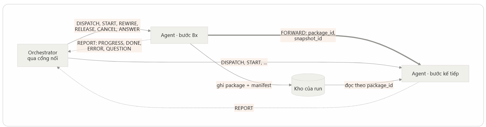
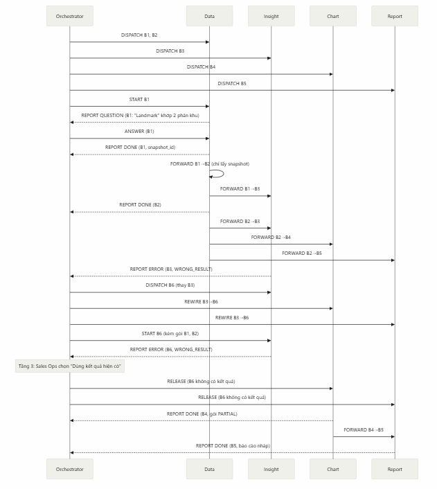

# VDAgent — Contract giao tiếp Orchestrator ↔ Agent v1.0

> **Cảnh báo — tài liệu mô tả giao thức cũ, không khớp code hiện tại.** File này mô tả giao thức
> message-based cũ (9 loại message qua tool `agents.delegate`, kiến trúc TypeScript). Code thật ở
> `agents/orchestrator/vdagent_orchestrator/` (Python) dùng cơ chế khác: `send_to_agent`, điều phối
> theo wave (D3), gói tin `StepSpec@1`/`AgentReport` (`contracts/vdagent_contracts/`). Xem
> [docs/agents/orchestrator.md](../../agents/orchestrator.md) để biết kiến trúc hiện hành (Data vẫn có cửa v1.0
> riêng, `agents/data/vdagent_data/wire.py`). Nội dung bên dưới chỉ còn giá trị tham khảo
> lịch sử, chưa được viết lại theo code mới.

Orchestrator_Agent_Contract_v1.0.0.schema.json (JSON Schema draft 2020-12, 34 ví dụ đã kiểm).

Orchestrator và 5 agent giao tiếp bằng một contract v1.0.0: header chung 10 trường, 9 loại message, 3 loại phản hồi. Phần riêng của từng agent chỉ nằm ở body.spec (phiếu giao việc) và body.ext (báo cáo), ghi ở tab của agent đó. 18 điểm các đặc tả còn lệch, kèm phương án contract đã chọn, nằm ở tab "Đối chiếu & cần chốt"; file JSON Schema đi kèm kiểm được mọi message trong tài liệu.

# Tab 1 — Contract chung

## 1. Phạm vi và quy ước

Contract này chỉ quy định đường điều khiển: lệnh của Orchestrator, báo cáo của agent và lần chuyển tiếp giữa các bước. Dữ liệu vẫn nằm trong kho của run, message chỉ mang mã gói (Orch §6; Data §5.1).

- **Có trong contract:** 9 loại message, 3 loại phản hồi, header chung, kiểu dữ liệu chung, và phần riêng của 5 agent trong body.spec (phiếu giao việc) và body.ext (báo cáo).

- **Không có trong contract:** khuôn catalog (11 mục ở Orch §4), nội dung package và manifest, lời gọi Insight → Data ngoài kế hoạch (Data §5.7), API giữa BFF và Orchestrator.

- **Không chọn giao thức truyền.** HTTP, MCP hay hàng đợi do Tech Lead chọn (D-02). Cổng nối (adapter) của Orchestrator đổi message sang giao thức của từng agent (Orch §6).

- **Tên trường:** snake_case. Enum viết HOA; trạng thái bước viết thường như Orch §10. Thời điểm theo RFC 3339 giờ UTC; hậu tố _s là giây, _ms là mili giây.

- **Mã bước** dạng B1, B2… và không dùng lại trong run. Khóa chống chạy trùng luôn là plan_id:step_id.

- **Message không mang bảng dữ liệu, SQL, prompt hay dữ liệu cá nhân,** chỉ mã, trạng thái, tóm tắt ngắn: đường điều khiển chỉ mang tin ngắn, dữ liệu nằm ở đường dữ liệu (Orch N2; Data §5.1).

- **Kiểm chặt:** bên nhận từ chối trường lạ. Thêm trường tùy chọn thì tăng MINOR của contract_version; đổi hoặc bỏ trường thì tăng MAJOR. POC dùng một bản 1.0.0 cho mọi bên.

- **Nhãn:** [Giữ] lấy nguyên đặc tả; [Đổi] đổi tên hoặc cách truyền để thống nhất; [Thêm] trường mới; [Đề xuất] đặc tả agent chưa có, owner cần xác nhận.

File JSON Schema đi kèm (draft 2020-12) là bản máy đọc của đúng các bảng dưới đây, sinh từ cùng một nguồn.

## 2. Các loại message

Có 9 loại message: 7 do Orchestrator (hoặc cổng nối) gửi, 1 agent gửi agent, 1 agent gửi Orchestrator. Mỗi message nhận đúng một phản hồi đồng bộ.

|**message_type**|**Chiều**|**Khi nào gửi**|**Phản hồi**|
|---|---|---|---|
|DISPATCH|Orchestrator → agent|Phát kế hoạch: mỗi bước một DISPATCH,<br>trước khi mở bước đầu|COMMAND_ACK kèm<br>agent_ref|
|START|Orchestrator → agent|Mở bước có danh sách chờ rỗng; mở bước mới<br>sau lên lại kế hoạch hoặc thử lại, kèm gói đã có|COMMAND_ACK|
|REWIRE|Orchestrator → agent|Bước hỏng đã có bước thay: đổi nguồn một<br>mục chờ|COMMAND_ACK|
|RELEASE|Orchestrator → agent|Mục chờ SOFT sẽ không có gói (báo thẳng,<br>hoặc Sales Ops chọn dùng kết quả hiện có)|COMMAND_ACK|
|CANCEL|Orchestrator → agent|Hủy bước (mục chờ HARD hỏng hẳn, quá hạn,<br>bị bỏ, câu hỏi hết hạn) hoặc hủy cả run|COMMAND_ACK|
|ANSWER|Orchestrator → agent|Sales Ops đã chọn cho câu hỏi của agent|COMMAND_ACK|
|STATUS_QU<br>ERY|Cổng nối → agent|Chỉ với agent không tự đẩy báo cáo, mỗi 2 giây|STATUS|
|FORWARD|Agent → agent|Bước xong: gửi cho từng bước trong<br>forward_to|COMMAND_ACK|
|REPORT|Agent →<br>Orchestrator<br>(reportStep)|PROGRESS(tùy chọn),DONE,ERROR,<br>QUESTION|REPORT_ACK|





## 3. Thống nhất tên các trường

|**Khái niệm**|**Orchestrato**|**Data v4**|**Compare**|**Insight 2.0**|**Chart**|**Report**|**Tên trong contract**|
|---|---|---|---|---|---|---|---|
||**r v4**||**v5.2**|||**v0.5**||
|Mã run|run_id|run_id|run_id|run_id|run_id|run_id|run_id(header)|


|Mã kế<br>hoạch|plan_id|plan_id|plan_id|—|—|—|plan_id(header) [Thêm<br>cho Insight, Chart,<br>Report]|
|---|---|---|---|---|---|---|---|
|Mã bước|step_id = B1|step_id =<br>B1;<br>envelope<br>cũ ghi<br>PLAN-0<br>012:B1|step_id; kết<br>quả ghi<br>plan_id:step<br>_id; task_id|task_id<br>(UUID)|task_id|task_id|step_id= B<n><br>(header) [Đổi]|
|Chống<br>chạy trùng|idempotency<br>_key =<br>plan_id:step<br>_id|khóa<br>chống<br>chạy<br>trùng|idempotenc<br>y_key =<br>plan_id:step<br>_id|khóa nội<br>bộ<br>run+task+<br>hash+prom<br>pt|idempotenc<br>y_key<br>(sha256,<br>SHOULD)|—|idempotency_key=<br>plan_id:step_id (header)|
|Mã<br>message|command_i<br>d<br>(agent_com<br>mands)|—|—|—|—|—|message_id(header)<br>[Thêm]|
|Thời điểm<br>gửi|—|—|—|—|—|—|sent_at(header) [Thêm]|
|Phiên bản<br>hợp đồng|contract_ver<br>sion|phiên<br>bản hợp<br>đồng|contract_ve<br>rsion|—<br>(insight.v2<br>là schema<br>artifact)|schema_ver<br>sion<br>chart-task/2.<br>0|—|contract_version<br>(header)|
|Phiên bản<br>catalog|catalog_vers<br>ion|catalog_<br>version|catalog_ver<br>sion|—|—|—|body.catalog_version<br>(DISPATCH)|
|Agent của<br>bước|agent<br>(PlanDraft)|—|—|—|—|—|agent(header)|
|Phiên chat<br>(session)|conversation<br>_id (runs)|—|—|conversati<br>on_id|—|—|body.conversation_id<br>(DISPATCH)|
|Người<br>dùng|user_context<br>(chép từ<br>BFF)|user_con<br>text|user_contex<br>t {user_id,<br>role,<br>projects,<br>zones,<br>signature?}|user_conte<br>xt<br>{user_id,<br>role,<br>authorized<br>_scope}|requested_b<br>y,<br>auth_contex<br>t|— (scope)|body.user_context<br>{user_id, role,<br>authorized_scope{proje<br>ct_ids, zone_ids},<br>signature?} [Đổi]|


|Truy vết|trace_id<br>(runs)|—|—|—|trace_conte<br>xt|—|trace{trace_id, span_id,<br>parent_span_id}<br>(header)|
|---|---|---|---|---|---|---|---|
|Snapshot|snapshot_id|snapshot<br>_id|snapshot_id|snapshot_i<br>d|scope.snaps<br>hot_id|snapshot_r<br>efs[]|snapshot_id<br>(DISPATCH, START,<br>FORWARD, DONE)|
|Phiên bản<br>semantic|đã bỏ (chốt<br>26/09)|semantic<br>_version<br>(manifest<br>)|semantic_c<br>onfig_versi<br>on (đọc<br>manifest)|semantic_c<br>onfig_versi<br>on<br>(request)|—|semantic_c<br>onfig_versi<br>on|Không nằm trong<br>message; đọc từ<br>manifest gói [Đổi]|
|Câu hỏi<br>gốc|original_que<br>stion|câu hỏi<br>gốc|original_qu<br>estion|question_n<br>ormalized|business_qu<br>estion|resolved<br>user<br>question<br>(C1)|body.original_question|
|Mục đích<br>bước|objective|mục đích|objective<br>(tùy chọn)|—|—|—|body.objective(bắt<br>buộc)|
|Kiểu việc<br>của câu hỏi|task_kinds<br>(IntentFram<br>e)|—|—|intent (3<br>intent cũ)|—|intent (3<br>intent cũ)|body.task_kinds[Đổi:<br>thay intent]|
|Việc|operation|operation|operation|tasks[]<br>T1–T7<br>(việc con)|— (chưa<br>có)|step_type|body.operation(+ chi<br>tiết trong spec)|
|Phiếu riêng<br>của agent|phiếu giao<br>việc<br>(StepSpec)|các ô của<br>phiếu|params|các trường<br>request|scope,<br>intent,<br>artifact_refs<br>, policy_ref|các trường<br>StepSpec|body.spec[Đổi]|
|Hạn giờ|deadline_s|deadline<br>_s|deadline_s|constraints<br>.deadline_<br>ms|—|timeout_m<br>s|body.deadline_s(giây)|
|Danh sách<br>chờ|danh sách<br>chờ<br>(wait_list)|danh<br>sách chờ|—|—|ArtifactRef.<br>required|required /<br>optional_ar<br>tifact_refs|body.wait_list[]<br>(HARD, SOFT)|
|Danh sách<br>chuyển tiếp|danh sách<br>chuyển tiếp<br>(forward_to)|danh<br>sách<br>chuyển<br>tiếp;<br>consume<br>r_steps|consumer_s<br>teps|—|—|—|body.forward_to[]|


|Gói đầu<br>vào|package_id<br>qua chuyển<br>tiếp|input_art<br>ifact_refs|input_packa<br>ges<br>{step_id,<br>operation,<br>package_id<br>}|input_artif<br>act_refs<br>(ArtifactRe<br>f)|artifact_refs<br>(ArtifactRef<br>)|required /<br>optional_ar<br>tifact_refs|PackageRef trong<br>FORWARD, START,<br>provided_inputs|
|---|---|---|---|---|---|---|---|
|Mã gói|package_id|package_<br>id|<br>package_id<br>=<br>artifact_id|artifact_id<br>+ version|artifact_id<br>@version|artifact IDs|package_id, trỏ một<br>phiên bản bất biến|
|Trạng thái<br>gói|VALID,<br>PARTIAL|VALID,<br>PARTIA<br>L|DRAFT…S<br>UPERSED<br>ED|VALID,<br>PARTIAL|validated,<br>partial|dependenc<br>y_status|package.status: VALID,<br>PARTIAL|
|Dấu vân<br>tay nội<br>dung|—|—|content_has<br>h|content_ha<br>sh|content_has<br>h|content_ha<br>sh|package.content_hash|
|Loại báo<br>cáo|DONE,<br>ERROR,<br>QUESTION|DONE,<br>ERROR,<br>QUESTI<br>ON|state|trạng thái<br>task|status<br>success,<br>partial,<br>failed|sự kiện<br>REPORT_<br>*|body.kind(+<br>PROGRESS)|
|Trạng thái<br>gốc|agent_state|submitte<br>d…cance<br>led|state|PENDING<br>…CANCE<br>LLED|RECEIVED<br>…FAILED|CREATED<br>…CANCE<br>LLED|body.agent_state|
|Tóm tắt|tóm tắt 3–5<br>dòng|summary|summary ≤<br>400 ký tự|summary<br>(payload)|—|—|result.summary|
|Cảnh báo|cảnh báo|warnings<br>[]|warnings[]|limitations|warnings<br>(Issue)|limitations|result.warnings[]{code,<br>message, target, details}|
|Lỗi|mã lỗi, lý do|error_co<br>de,<br>reason|error {code,<br>class,<br>reason}|mã<br>E01–E19|errors<br>(Error<br>Object)|error code,<br>reason|body.error{code, class,<br>reason, details}|
|Câu hỏi<br>cho người<br>dùng|câu hỏi +<br>lựa chọn<br>đóng|question,<br>options[]<br>,<br>input_ki<br>nd|input_reque<br>st<br>{question,<br>options<br>{value,<br>label}}|—|"yêu cầu<br>làm rõ"|—|body.question<br>{question_id,<br>reason_code, text,<br>options[],<br>max_selections,<br>subject_text}|
|Câu trả lời|lệnh câu trả<br>lời|ANSWE<br>R|nhận lựa<br>chọn đóng|—|—|—|ANSWER<br>{question_id,<br>selected_option_ids,|


||||||||answered_by,<br>answered_at}|
|---|---|---|---|---|---|---|---|
|Mã việc ở<br>agent|agent_ref|—|—|—|—|—|agent_ref(ACK,<br>REPORT)|
|Chi phí,<br>thời gian|llm_calls<br>(của<br>Orchestrator<br>)|—|usage<br>{llm_calls,<br>elapsed_ms<br>}|LlmUsage,<br>task_cost_<br>usd|trace_summ<br>ary|—|body.usage{llm_calls,<br>elapsed_ms, cost_usd}|
|Run trước|parent_run_i<br>d|snapshot<br>của run<br>trước|artifact<br>trước qua<br>input_artifa<br>ct_refs|parent_insi<br>ght_ref|—|report_vers<br>ion_base|body.parent_run_id+<br>provided_inputs|
|Ngôn ngữ|—|—|—|constraints<br>.language|presentation<br>_context.lan<br>guage|language/t<br>one (C2)|body.locale(mặc định<br>vi-VN)|
|Lease,<br>fencing|chỉ cho task<br>PLAN,<br>REPLAN|—|—|attempt,<br>fencing_to<br>ken|—|—|Bỏ khỏi contract (nội bộ<br>agent)|


Phần riêng của agent (tab của từng agent) giữ tên theo đặc tả của agent đó, vì owner agent quy định phiếu giao việc (Orch §4, N3). Vì vậy Orchestrator v4 cần đổi ba tên của Data: scope → entities, extra_needs → out_of_catalog_need, acceptance → success_criteria (Data v4 §7.3.2).

## 4. Header chung

Mọi message (trừ 3 loại phản hồi) có 10 trường header ở mức gốc và một body. Header giống nhau cho cả 5 agent; bên nhận từ chối header thiếu trường hoặc có trường lạ.

|**Trường**|**Kiểu**|**Bắt**<br>**buộc**|**Quy định**|
|---|---|---|---|
|contract_versi<br>on|string (SemVer)|Có|Phiên bản contract này, dạng SemVer (bản này: 1.0.0). Bên nhận không<br>hỗ trợ bản MAJOR đó thì trả ACK REJECTED mã<br>UNSUPPORTED_CONTRACT_VERSION.|
|message_id|string (≤ 64 ký tự)|Có|Mã duy nhất của message (khuyến nghị UUID). Gửi lại dùng đúng mã<br>cũ; bên nhận khử trùng theo mã này. Lệnh của Orchestrator dùng<br>agent_commands.command_id.|
|sent_at|string (date-time UTC)|Có|Thời điểm bên gửi tạo message, RFC 3339 giờ UTC. Gửi lại giữ<br>nguyên giá trị.|


|message_type|enum: DISPATCH,<br>START, REWIRE,<br>RELEASE, CANCEL,<br>ANSWER,<br>STATUS_QUERY,<br>FORWARD, REPORT|Có|Loại message; quyết định khuôn của body.|
|---|---|---|---|
|run_id|string|Có|Mã run: một lần hệ thống xử lý một câu hỏi.|
|plan_id|string|Có|Mã kế hoạch, cố định suốt run; không đổi khi lên lại kế hoạch.|
|step_id|string (B<n>)|Có|Bước mà message nói tới, dạng B1, B2… Lệnh và FORWARD: bước<br>nhận. REPORT: bước báo. Số không dùng lại trong run.|
|agent|enum: DATA,<br>COMPARE, INSIGHT,<br>CHART, REPORT|Có|Agent thực hiện step_id.|
|idempotency_<br>key|string (plan_id:step_id)|Có|Khóa chống chạy trùng của bước, luôn bằng plan_id + ":" + step_id.<br>Cùng khóa thì agent trả kết quả cũ, không làm lại.|
|trace|Trace|Không|Ngữ cảnh truy vết phân tán (khuyến nghị gửi). Bên nhận chép trace_id<br>vào log và span con.|


Quy tắc không biểu diễn được bằng JSON Schema, code của hai bên phải kiểm:

- idempotency_key = plan_id + ":" + step_id.

- agent phải là agent thực hiện step_id trong kế hoạch hiện hành; sai thì ACK REJECTED mã WRONG_AGENT.

- Danh tính bên gửi lấy từ kênh (xác thực dịch vụ), không tin trường nào trong message (Data §5.7; Orch §12).

## 5. Kiểu dữ liệu chung

Các kiểu dưới đây dùng lại trong nhiều message. Mọi object đều đóng (không nhận trường lạ).

**UserContext** — thông tin người dùng, BFF tạo, Orchestrator chép nguyên vào DISPATCH (Orch N11). Không chứa tên, email.

|**Trường**|**Kiểu**|**Bắt**<br>**buộc**|**Quy định**|**Căn cứ**|
|---|---|---|---|---|


|user_id|string|Có|Mã người dùng đã xác thực<br>(JWT).|Insight §3.3; Compare<br>§3.4|
|---|---|---|---|---|
|role|enum: SALES_OPS,<br>SALES_MANAGER,<br>PROJECT_DIRECTOR,<br>DATA_ANALYST|Có|Vai trò của người dùng.<br>Danh sách lấy theo Insight<br>§3.3; BFF xác nhận.|Insight §3.3; Compare<br>§3.4|
|authorized_scope|AuthorizedScope|Có|Phạm vi dữ liệu người dùng<br>được xem. Data dùng để lọc<br>quyền ở mọi truy vấn; agent<br>khác dùng để kiểm lại phạm<br>vi.|Insight §3.3<br>(authorized_scope);<br>Compare §3.4<br>(projects, zones); Data<br>§2.2|
|signature|string|Không|Chữ ký của BFF trên<br>user_context để agent kiểm<br>không bị sửa. Tùy chọn.|Compare §3.4<br>(signature?)|


#### AuthorizedScope

|**Trường**|**Kiểu**|**Bắt buộc**|**Quy định**|
|---|---|---|---|
|project_ids|array<string>|Có|Mã các dự án được xem.|
|zone_ids|array<string>|Có|Mã các phân khu được xem. Mảng rỗng: không giới hạn phân khu<br>trong các dự án trên (cần BFF xác nhận).|


#### Trace

|**Trường**|**Kiểu**|**Bắt buộc**|**Quy định**|
|---|---|---|---|
|trace_id|string|Có|Mã trace của run, lấy từ runs.trace_id.|


|span_id|string|Không|Span của bên gửi.|
|---|---|---|---|
|parent_span_id|string|Không|Span cha.|


**PackageRef** — tham chiếu một gói kết quả. Không chứa dữ liệu.

|**Trường**|**Kiểu**|**Bắt buộc**|**Quy định**|
|---|---|---|---|
|package_id|string (≤ 200 ký<br>tự)|Có|Mã gói kết quả, trỏ đúng một phiên bản bất biến. Nội dung đổi thì<br>là package_id mới. Khuyến nghị dạng <artifact_id>@<version>.|
|kind|string (tên<br>snake_case)|Có|Loại kết quả theo mục "tạo ra gì" trong catalog của agent tạo gói:<br>unit_set, metric_table, peer_set, context_bundle, comparison,<br>insight, chart_bundle, report_draft.|
|status|enum: VALID,<br>PARTIAL|Có|Trạng thái gói. Chỉ gói VALID hoặc PARTIAL được chuyển tiếp<br>và được dùng; PARTIAL bắt buộc bên dùng đọc limitations.|
|content_hash|string (sha256<br>hex)|Không|SHA-256 (hex) của nội dung chuẩn hóa. Bên dùng so lại khi đọc<br>từ kho để phát hiện sửa ngầm.|


**WaitItem** — một mục trong danh sách chờ của bước.

|**Trường**|**Kiểu**|**Bắt buộc**|**Quy định**|
|---|---|---|---|
|step_id|string (B<n>)|Có|Bước phải chờ.|
|agent|enum: DATA, COMPARE,<br>INSIGHT, CHART,<br>REPORT|Có|Agent của bước phải chờ.|
|operation|string (tên snake_case)|Có|Việc của bước phải chờ; giúp bên nhận biết loại gói sẽ tới.|
|dependency|enum: HARD, SOFT|Có|HARD: chỉ bắt đầu khi đã có gói của bước này. SOFT: chờ tới<br>khi có gói hoặc có RELEASE, rồi chạy với những gì có.|
|purpose|enum: INPUT,<br>SNAPSHOT_ONLY|Có|INPUT: gói là đầu vào. SNAPSHOT_ONLY: chỉ chờ để nhận<br>snapshot_id (luật ghim snapshot), luôn SOFT, không dùng gói.|
|input_slot|string (tên snake_case) | null|Có|Ô đầu vào nhận gói, theo catalog của agent nhận. null khi<br>purpose = SNAPSHOT_ONLY.|


|expected_kind|string (tên snake_case) | null|Có|Loại gói mong đợi (khớp mục "tạo ra gì" của bước nguồn). null<br>khi SNAPSHOT_ONLY.|
|---|---|---|---|


Luật: purpose = SNAPSHOT_ONLY thì dependency = SOFT, input_slot = null, expected_kind = null, và chỉ có ở bước Data chờ bước Data.

#### ForwardTarget

|**Trường**|**Kiểu**|**Bắt**<br>**buộc**|**Quy định**|**Căn cứ**|
|---|---|---|---|---|
|step_id|string (B<n>)|Có|Bước nhận<br>chuyển tiếp.|Orch §4 (danh sách<br>chuyển tiếp)|
|agent|enum: DATA, COMPARE,<br>INSIGHT, CHART, REPORT|Có|Agent của bước<br>nhận.|Orch §6 (kèm agent<br>nhận)|


**InputArrival** — gói của bước trước, dùng trong START.

|**Trường**|**Kiểu**|**Bắt**<br>**buộc**|**Quy định**|**Căn cứ**|
|---|---|---|---|---|
|from_step_id|string (B<n>)|Có|Bước đã tạo<br>gói.|Orch §6 (bước<br>vừa xong)|
|from_agent|enum: DATA, COMPARE,<br>INSIGHT, CHART, REPORT|Có|Agent của bước<br>đó.|Orch §6|
|package|PackageRef|Có|Gói kết quả của<br>bước đó.|Orch §6|


**ProvidedInput** — gói dùng lại từ run trước, dùng trong DISPATCH.

|**Trường**|**Kiểu**|**Bắt buộc**|**Quy định**|
|---|---|---|---|
|source_run_id|string|Có|Run trước đã tạo gói (câu hỏi nối tiếp,<br>thử lại báo cáo).|
|source_step_id|string (B<n>)|Có|Bước trong run trước.|
|source_agent|enum: DATA,<br>COMPARE, INSIGHT,<br>CHART, REPORT|Có|Agent đã tạo gói.|


|input_slot|string (tên snake_case)|Có|Ô đầu vào của bước này nhận gói (theo<br>catalog).|
|---|---|---|---|
|package|PackageRef|Có|Gói dùng lại.|


**MissingPart** — một bước kết thúc mà không có gói; dùng trong RELEASE và START.

|**Trường**|**Kiểu**|**Bắt**<br>**buộc**|**Quy định**|**Căn cứ**|
|---|---|---|---|---|
|step_id|string (B<n>)|Có|Bước kết thúc mà không có gói<br>(bước được báo "không có").|Orch §6 (chạy<br>không có phần<br>này)|
|agent|enum: DATA,<br>COMPARE,<br>INSIGHT,<br>CHART,<br>REPORT|Có|Agent của bước đó.|Orch §9<br>(missing_parts)|
|part_label|string (≤ 80 ký<br>tự)|Có|Tên phần theo nghiệp vụ: Số liệu ·<br>So sánh với nhóm tương đồng ·<br>Giải thích nguyên nhân · Biểu đồ ·<br>Báo cáo nháp.|Orch §7 (Câu chữ<br>cho Sales Ops)|
|root_step_id|string (B<n>)|Có|Bước hỏng đầu tiên của chuỗi<br>(bằng step_id nếu chính nó hỏng).|Orch §9 (lần theo<br>chuỗi bước bị bỏ<br>qua)|
|reason_class|enum (13 giá trị)|Có|Lớp lỗi gốc; thêm TIMEOUT,<br>DELIVERY_FAILED<br>(Orchestrator tự phát hiện) và<br>DROPPED_BY_PLAN (bị bỏ theo<br>kế hoạch mới).|Orch §7, §8, §9|
|error_code|string | null|Có|Mã lỗi gốc của agent, hoặc null.|Orch §9|
|user_messag<br>e|string (≤ 300 ký<br>tự)|Có|Câu cho Sales Ops, code sinh từ<br>mẫu câu (PO duyệt). Report, Chart<br>chép vào phần giới hạn.|Orch §7, Q-19;<br>Report §9 mục 6,<br>E7|


#### Warning

|**Trường**|**Kiểu**|**Bắt**<br>**buộc**|**Quy định**|**Căn cứ**|
|---|---|---|---|---|


|code|string (mã<br>HOA)|Có|Mã cảnh báo, lấy trong danh sách<br>của agent (tab của agent).|Data §6.4; Compare<br>§3.4; Chart §4.2|
|---|---|---|---|---|
|message|string (≤ 300<br>ký tự)|Có|Mô tả ngắn, tiếng Việt, không chứa<br>dữ liệu cá nhân.|Chart §8.3|
|target|string|Không|Phần bị ảnh hưởng: mã mục tiêu<br>trực quan, chỉ số, phần báo cáo…|Chart §4.2 (target_id)|
|details|object|Không|Chi tiết kỹ thuật đã làm sạch.|Chart §8.3|


#### ErrorInfo

|**Trường**|**Kiểu**|**Bắt**<br>**buộc**|**Quy định**|
|---|---|---|---|
|code|string (mã HOA)|Có|Mã lỗi của agent, phải có trong catalog. Mã<br>lạ → Orchestrator coi là FATAL.|
|class|enum: NEED_INPUT,<br>WRONG_RESULT,<br>SPEC_ISSUE, NO_DATA,<br>NO_ACCESS,<br>DATA_QUALITY,<br>QUOTA_EXHAUSTED,<br>TRANSIENT, FATAL,<br>CANCELED|Không|Lớp lỗi agent tự ghi, chỉ để đọc log.<br>Orchestrator luôn xếp lớp theo catalog; lệch<br>thì ghi CLASS_MISMATCH vào nhật ký.|
|reason|string (≤ 1000 ký tự)|Có|Lý do kỹ thuật, không lộ dữ liệu ngoài quyền.<br>Orchestrator đưa vào ReplanItem cho LLM<br>khi lên lại kế hoạch.|
|details|object|Không|Chi tiết đã làm sạch (vd vị trí lỗi, mã phụ).|


#### Question** và **QuestionOption

|**Trường**|**Kiểu**|**Bắt buộc**|**Quy định**|
|---|---|---|---|


|question_id|string (≤ 64 ký tự)|Có|Mã câu hỏi, duy nhất trong bước. Gửi lại<br>cùng câu thì giữ mã; hỏi câu mới trong cùng<br>bước thì mã mới.|
|---|---|---|---|
|reason_code|string (MÃ_HOA)|Có|Vì sao hỏi (mã của agent, vd<br>AMBIGUOUS_REQUEST).|
|text|string (≤ 500 ký tự)|Có|Câu hỏi cho Sales Ops, tiếng Việt.|
|options|array<QuestionOptio<br>n> (≥ 1 phần tử, ≤ 10<br>phần tử)|Có|Lựa chọn đóng. Orchestrator thêm nút<br>"Không phải các lựa chọn này"; nút đó không<br>nằm trong options.|
|max_selections|integer ≥ 1; mặc định<br>1|Không|Số lựa chọn tối đa được chọn; mặc định 1.|
|subject_text|string (≤ 200 ký tự)|Không|Cụm từ người dùng đã nói gây mơ hồ (vd<br>"Landmark").|


|**Trường**|**Kiểu**|**Bắt**<br>**buộc**|**Quy định**|
|---|---|---|---|
|option_id|string (≤<br>64 ký tự)|Có|Mã lựa chọn, duy nhất trong câu hỏi.|
|label|string (≤<br>200 ký tự)|Có|Chữ hiện cho Sales Ops.|
|value|object|Không|Giá trị máy đọc, khuôn theo agent (vd mã thực thể).<br>Orchestrator không đọc.|


#### Usage

|**Trường**|**Kiểu**|**Bắt**<br>**buộc**|**Quy định**|**Căn cứ**|
|---|---|---|---|---|
|llm_calls|integer ≥ 0|Có|Số lượt gọi LLM của bước.|Compare §3.4<br>(usage)|


|elapsed_ms|integer ≥ 0|Có|Thời gian xử lý của bước, mili giây.|Compare §3.4<br>(usage)|
|---|---|---|---|---|
|cost_usd|string (số thập<br>phân) | null|Không|Chi phí LLM dạng số thập phân<br>chuỗi; null nếu chưa có bảng giá.|Insight §7.5<br>(cost_usd)|


#### Progress

|**Trường**|**Kiểu**|**Bắt buộc**|**Quy định**|
|---|---|---|---|
|stage|string<br>(MÃ_HOA)|Có|Giai đoạn đang chạy, theo danh sách của agent.|
|stage_index|integer ≥ 0|Không|Thứ tự giai đoạn (0 = đầu tiên).|
|stage_count|integer ≥ 1|Không|Tổng số giai đoạn của pipeline.|
|note|string (≤ 300<br>ký tự)|Không|Ghi chú ngắn cho giao diện.|


#### DoneResult

|**Trường**|**Kiểu**|**Bắt**<br>**buộc**|**Quy định**|
|---|---|---|---|
|package|PackageRef|Có|Gói kết quả của bước (đúng một gói mỗi bước).|
|snapshot_id|string | null|Có|Snapshot đã dùng. Data bắt buộc có giá trị; agent khác<br>chép snapshot đã nhận.|
|summary|string (≤ 800 ký<br>tự)|Có|Tóm tắt 1–5 dòng để hiện trên giao diện. Orchestrator<br>lưu và chuyển nguyên, không đưa vào LLM, không<br>dùng để quyết định.|
|warnings|array<Warning>|Có|Cảnh báo không làm bước thất bại; đi vào bản tóm tắt<br>run.|


## 6. Body của từng loại message

body đổi theo message_type. Phần riêng của agent chỉ nằm ở body.spec (DISPATCH) và body.ext (REPORT).

### 6.1 DISPATCH — phát phần việc của một bước

Cột "Ai điền" theo nguyên tắc LLM đề xuất, code quyết định (Orch N1, §4).

|**Trường**|**Kiểu**|**Bắt**<br>**buộ**<br>**c**|**Ai điền**|**Quy định**|**Căn cứ**|
|---|---|---|---|---|---|
|operation|string (tên<br>snake_case)|Có|LLM<br>chọn<br>trong<br>catalog|Việc trong catalog<br>của agent.|Orch §4, §5<br>(UNKNOWN_OPER<br>ATION)|
|catalog_versi<br>on|string (SemVer)|Có|Code|Phiên bản catalog<br>của agent mà kế<br>hoạch đã dùng.<br>Agent không còn<br>hỗ trợ → báo lỗi<br>SPEC_INVALID<br>(hoặc mã tương<br>đương của agent).|Orch §4; Data §2.3,<br>§7.2 trường 10|
|plan_version|integer ≥ 1|Có|Code|Phiên bản kế hoạch<br>đã tạo bước này<br>(tăng mỗi lần lên<br>lại kế hoạch).|Orch §8, §12|
|objective|string (≤ 500 ký<br>tự)|Có|LLM|Mục đích của<br>bước, một câu.|Orch §4 (objective);<br>Data §2.2|
|original_ques<br>tion|string (≤ 2000<br>ký tự)|Có|Code|Câu hỏi gốc,<br>nguyên văn. Là<br>ngữ cảnh, không<br>phải chỉ thị.|Orch §4; Data §2.1;<br>Insight §3.1; Chart<br>§3.5; Report §3|
|task_kinds|array<enum:<br>LOOKUP,<br>COMPARE,<br>TREND,<br>EXPLAIN> (≥ 1<br>phần tử)|Có|Code (từ<br>IntentFra<br>me)|Kiểu việc của câu<br>hỏi<br>(IntentFrame.task_<br>kinds). Thay<br>trường intent cũ.|Orch §3; thay intent<br>của Insight §3.1,<br>Report §5.1|
|locale|string (vd<br>vi-VN); mặc<br>định vi-VN|Khô<br>ng|Code|Ngôn ngữ đầu ra;<br>mặc định vi-VN.|Insight §3.1<br>(language); Chart<br>§3.5; Report §3 (C2)|


|user_context|UserContext|Có|Code|Thông tin người<br>dùng, chép nguyên<br>từ BFF. LLM<br>không thấy, không<br>sửa.|Orch N11, §4; Data<br>§2.2|
|---|---|---|---|---|---|
|conversation_<br>id|string | null|Có|Code|Mã cuộc chat<br>(phiên). Agent có<br>bộ nhớ hội thoại<br>(Insight) dùng;<br>agent khác bỏ qua.|Orch §12<br>(runs.conversation_id)<br>; Insight §3.1|
|parent_run_id|string | null|Có|Code|Run trước nếu là<br>câu hỏi nối tiếp;<br>null nếu không.|Orch §3<br>(IntentFrame.parent_r<br>un_id); Data §5.5|
|snapshot_id|string | null|Có|Code|Snapshot đã ghim.<br>null khi run chưa<br>có snapshot (Data<br>bước đầu tự khóa);<br>run nối tiếp dùng<br>snapshot của run<br>trước.|Orch §6; Data §2.2,<br>§5.5|
|deadline_s|integer ≥ 1|Có|Code (từ<br>catalog)|Hạn giờ của bước<br>(giây), lấy từ<br>catalog. Tính từ lúc<br>đủ đầu vào; dừng<br>khi chờ Sales Ops.<br>Orchestrator cộng<br>15 giây đệm, agent<br>không được dựa<br>vào phần đệm.|Orch §11; Data §3.8|
|wait_list|array<WaitItem<br>>|Có|Code<br>(suy từ<br>catalog)|Danh sách chờ;<br>rỗng = bắt đầu khi<br>nhận START.|Orch §4, §6; Data<br>§5.3|
|forward_to|array<ForwardT<br>arget>|Có|Code|Danh sách chuyển<br>tiếp: xong thì gửi<br>FORWARD cho<br>các bước này. Thay<br>consumer_steps.|Orch §4, §6; Data<br>§2.2|
|provided_inp<br>uts|array<ProvidedI<br>nput>|Khô<br>ng|Code|Gói dùng lại từ run<br>trước, giao kèm<br>phần việc; không<br>phải chờ.|Orch §4 (Dùng lại kết<br>quả run trước)|


|replaces_step<br>_id|string (B<n>) |<br>null|Khô<br>ng|Code|Bước mà bước này<br>thay (lên lại kế<br>hoạch hoặc Sales<br>Ops chọn thử lại).|Orch §4<br>(PlanDraft.replaces),<br>§7|
|---|---|---|---|---|---|
|retry_kind|enum: NONE,<br>REPLAN,<br>USER_RETRY;<br>mặc định NONE|Khô<br>ng|Code|NONE; REPLAN<br>(bước mới do LLM<br>viết lại);<br>USER_RETRY<br>(cùng phiếu, Sales<br>Ops chọn thử lại).<br>Với<br>USER_RETRY<br>agent không được<br>trả kết quả lưu đệm<br>(cache) của bước<br>bị thay.|Thêm mới; Orch §7<br>(Thử lại) và Data §3.8<br>(cache theo nội dung<br>phiếu)|
|spec|object|Có|LLM<br>trong<br>giới hạn<br>catalog +<br>Code|Phiếu giao việc<br>riêng của agent<br>(khuôn theo agent<br>và operation, xem<br>tab của agent).|Orch §4 (phiếu giao<br>việc)|


### 6.2 Lệnh điều khiển và FORWARD

Sáu lệnh còn lại của Orchestrator (qua cổng nối) và lần chuyển tiếp giữa các agent. Mỗi lệnh nhận COMMAND_ACK, riêng STATUS_QUERY nhận STATUS.

**START** — mở bước.

|**Trường**|**Kiểu**|**Bắt**<br>**buộc**|**Quy định**|**Căn cứ**|
|---|---|---|---|---|
|snapshot_id|string | null|Có|Snapshot đã ghim của run, null<br>nếu chưa có.|Orch §6|
|inputs|array<InputArrival>|Có|Gói của các bước đã xong mà<br>bước này chờ (bắt buộc với<br>bước mới sau lên lại kế hoạch<br>hoặc thử lại, vì bước cũ không<br>biết bước mới).|Orch §6 (Mở<br>bước, kèm<br>package đầu vào<br>đã có), §8|
|released|array<MissingPart>|Không|Các bước chờ kiểu SOFT đã kết<br>thúc mà không có gói.|Suy từ Orch §8<br>bước 7|
|**REWIRE**—|đổi nguồn một mục chờ.||||


|**Trường**|**Kiểu**|**Bắt**<br>**buộc**|**Quy định**|**Căn cứ**|
|---|---|---|---|---|
|old_step_id|string (B<n>)|Có|Bước cũ trong danh sách<br>chờ (vd B3).|Orch §6;<br>Data §5.2|
|new_step_id|string (B<n>)|Có|Bước thay thế (vd B6).<br>Kiểu chờ và ô đầu vào giữ<br>nguyên.|Orch §6,<br>§8|
|new_agent|enum: DATA, COMPARE,<br>INSIGHT, CHART, REPORT|Có|Agent của bước mới.|Orch §8|
|new_operatio<br>n|string (tên snake_case)|Có|Việc của bước mới.|Orch §8|


**RELEASE** — mục chờ SOFT sẽ không có gói.

|**Trường**|**Kiểu**|**Bắt**<br>**buộc**|**Quy định**|**Căn cứ**|
|---|---|---|---|---|
|missing|MissingPart|Có|Bước SOFT sẽ không có gói, kèm lý do để ghi|Orch §6,|
||||giới hạn. Chỉ gửi cho mục SOFT; mục HARD|§7; Data|
||||nhận CANCEL.|§5.2|


**CANCEL** — hủy bước hoặc run.

|**Trường**|**Kiểu**|**Bắt**<br>**buộc**|**Quy định**|**Căn cứ**|
|---|---|---|---|---|
|scope|enum: STEP, RUN|Có|STEP: hủy bước<br>này. RUN: cả run<br>bị hủy, agent<br>ngừng mọi bước<br>của run và không<br>chuyển tiếp nữa.|Orch §6<br>điều 5,<br>§11;<br>Data<br>§5.2|
|reason|enum: USER_CANCELED,|Có|Lý do hủy (để ghi|Orch §7,|
||RUN_DEADLINE, STEP_TIMEOUT,<br>UPSTREAM_FAILED,<br>DROPPED_BY_PLAN, INPUT_EXPIRED,<br>INPUT_DECLINED, QUESTION_LIMIT||log; hành vi của<br>agent như nhau).|§8, §11|
|messag<br>e|string (≤ 300 ký tự)|Không|Ghi chú.|Thêm<br>mới|


Giá trị reason: USER_CANCELED (người dùng hủy run), RUN_DEADLINE (run quá hạn chót), STEP_TIMEOUT (bước quá hạn), UPSTREAM_FAILED (mục chờ HARD hỏng hẳn),

DROPPED_BY_PLAN (bị bỏ khi lên lại kế hoạch), INPUT_EXPIRED (câu hỏi quá 5 phút), INPUT_DECLINED (Sales Ops chọn "Không phải các lựa chọn này"), QUESTION_LIMIT (câu hỏi thứ 3 của agent trong run) (Orch §7, §8, §11).

**ANSWER** — câu trả lời của Sales Ops.

|**Trường**|**Kiểu**|**Bắt**<br>**buộc**|**Quy định**|**Căn cứ**|
|---|---|---|---|---|
|question_id|string (≤ 64 ký<br>tự)|Có|Câu hỏi đang được trả lời.|Orch §7;<br>Data §5.6|
|selected_option_ids|array<string (≤<br>64 ký tự)> (≥ 1<br>phần tử)|Có|Lựa chọn Sales Ops đã chọn.<br>"Không phải các lựa chọn này"<br>không đi qua ANSWER mà thành<br>CANCEL (INPUT_DECLINED).|Orch §7;<br>Data §5.6|
|answered_by|string|Có|user_id của người chọn.|Orch §7<br>(người<br>chọn,<br>thời<br>điểm)|
|answered_at|string<br>(date-time<br>UTC)|Có|Thời điểm chọn, UTC.|Orch §7|
|**TATUS_QUERY**—<br>**Trường**<br>**Kiểu**|cổng nối hỏi trạng<br>**Bắt**<br>**buộc**|thái.<br>**Quy**|**định**<br>**Căn cứ**||
|agent_ref<br>string|Có<br>Mã tham<br>ACK của|chiếu a<br>DISPA|gent trả trong<br>TCH.<br>Orch §11 (agent_ref)<br>(Hỏi trạng thái)|; Data §5.2|


**STATUS_QUERY** — cổng nối hỏi trạng thái.

**FORWARD** — bước vừa xong chuyển gói cho bước kế tiếp. Header mang step_id, agent, idempotency_key của bước nhận.

|**Trường**|**Kiểu**|**Bắt**<br>**buộc**|**Quy định**|**Căn cứ**|
|---|---|---|---|---|
|from_step_id|string (B<n>)|Có|Bước vừa xong.|Orch §6;<br>Data<br>§5.1|
|from_agent|enum: DATA,<br>COMPARE, INSIGHT,<br>CHART, REPORT|Có|Agent của bước vừa xong.|Orch §6|


|package|PackageRef|Có|Gói kết quả của bước vừa xong.|Orch §6;<br>Data|
|---|---|---|---|---|
|||||§5.1|
|snapshot_id|string|Có|Snapshot đã ghim của run; bước<br>nhận dùng khi chạy (Insight dùng<br>|Orch §6;<br>Data|
||||khi hỏi thẳng Data).|§5.5|


### 6.3 REPORT và phản hồi

**REPORT** — agent báo về Orchestrator qua reportStep. Mỗi kind chỉ mang đúng một khối: progress, result, error hoặc question.

|**Trường**|**Kiểu**|**Bắt**<br>**buộc**|**Quy định**|**Căn cứ**|
|---|---|---|---|---|
|kind|enum:<br>PROGRESS,|Có|PROGRESS (tùy chọn, lần đầu =<br>đã bắt đầu), DONE, ERROR,|Orch §12 (DONE,<br>ERROR,|
||DONE, ERROR,<br>QUESTION||QUESTION.|QUESTION); Data<br>§5.3 (báo đã bắt<br>đầu)|
|agent_state|string (≤ 40 ký<br>tự)|Có|Trạng thái gốc của agent, lưu<br>nguyên để truy vết<br>(agent_tasks.agent_state).|Orch §10, §12|
|agent_ref|string|Không|Mã tham chiếu nội bộ của agent.|Orch §11|
|usage|Usage|Không|Lượt gọi LLM, thời gian, chi phí;<br>chỉ để theo dõi (Orchestrator<br>không giới hạn LLM của agent).|Compare §3.4;<br>Insight §7.5; Orch<br>D-06|
|progress|Progress|Có<br>điều<br>kiện|Bắt buộc khi kind =<br>PROGRESS; cấm với kind khác.|Data §5.3; Report<br>§5.3|
|result|DoneResult|Có<br>điều<br>kiện|Bắt buộc khi kind = DONE; cấm<br>với kind khác.|Orch §6 điều 3;<br>Data §6.2|
|error|ErrorInfo|Có<br>điều<br>kiện|Bắt buộc khi kind = ERROR;<br>cấm với kind khác.|Orch §6 điều 4;<br>Data §6.2|
|question|Question|Có<br>điều|Bắt buộc khi kind = QUESTION;<br>cấm với kind khác. Chỉ Data,|Orch §7; Data<br>§5.6; Compare|
|||kiện|Compare được hỏi.|§3.4|


|ext|object|Có<br>điều<br>kiện<br>Trường riêng của agent theo kind<br>(xem tab của agent). Agent<br>không khai ext cho kind đó thì<br>không gửi.|Tab riêng từng<br>agent|
|---|---|---|---|
|**kind**|**Khối bắt buộc**|**Ý nghĩa với Orchestrator**|**Căn cứ**|
|PROGR<br>ESS|progress|Tùy chọn. Lần đầu = đã bắt đầu: bước pending<br>chuyển working, phát hiện sớm lần chuyển tiếp bị<br>mất. Không đổi trạng thái khác|<br>Data §5.3 [Đề<br>xuất]; Orch §11,<br>Q-31|
|DONE|result(+ext<br>nếu agent khai)|Bước completed; gói VALID hoặc PARTIAL|Orch §6 điều 3;<br>Data §6.2|
|ERROR|error(+extnếu<br>agent khai)|Bước failed, xếp lớp theo catalog, xử lý 3 tầng;<br>lớp CANCELED thì canceled|Orch §7; Data<br>§6.2|
|QUESTI<br>ON|question|Bước và run input_required, chờ Sales Ops tối đa<br>5 phút. Chỉ Data, Compare được gửi|Orch §7; Data<br>§5.6; Compare<br>§3.4|


**Phản hồi.** Ba loại, có response_type thay cho header.

COMMAND_ACK — trả cho mọi lệnh và FORWARD.

|**Trường**|**Kiểu**|**Bắt**<br>**buộc**|**Quy định**|**Căn cứ**|
|---|---|---|---|---|
|contract_version|string (SemVer)|Có|Phiên bản contract.|Như header|
|response_type|const<br>"COMMAND_ACK"|Có|Loại phản hồi.|Thêm mới|
|in_reply_to|string (≤ 64 ký tự)|Có|message_id của lệnh<br>hoặc FORWARD được<br>phản hồi.|Thêm mới|
|ack_status|enum: ACCEPTED,<br>DUPLICATE,|Có|ACCEPTED: đã lưu.<br>DUPLICATE: đã nhận|Data §5.2, §5.3<br>(ACCEPTED,|
||REJECTED||trước đó, không làm lại.<br>REJECTED: message<br>hỏng hoặc không hỗ trợ;<br>không gửi lại.|DUPLICATE)|


|agent_ref|string|Không|Mã tham chiếu việc ở<br>agent, trả khi nhận<br>DISPATCH; dùng cho<br>STATUS_QUERY.|Orch §11|
|---|---|---|---|---|
|reject|Reject|Có<br>điều|Bắt buộc khi<br>REJECTED.|Thêm mới|
|||kiện|||


REPORT_ACK — trả cho REPORT.

|**Trường**|**Kiểu**|**Bắt**<br>**buộc**|**Quy định**|**Căn cứ**|
|---|---|---|---|---|
|contract_version|string (SemVer)|Có|Phiên bản contract.|Như<br>header|
|response_type|const<br>"REPORT_ACK"|Có|Loại phản hồi.|Thêm<br>mới|
|in_reply_to|string (≤ 64 ký tự)|Có|message_id của REPORT.|Thêm<br>mới|
|ack_status|enum: ACCEPTED,<br>DUPLICATE, STALE,<br>REJECTED|Có|ACCEPTED; DUPLICATE (báo<br>cáo giống lần trước); STALE<br>(bước đã kết thúc khác, đã bị hủy,<br>bị thay, hoặc run đã kết thúc:<br>agent dừng gửi); REJECTED<br>(message hỏng).|Orch<br>§11,<br>§12;<br>Data<br>§5.4|
|reject|Reject|Có<br>điều<br>kiện|Bắt buộc khi REJECTED.|Thêm<br>mới|


STATUS — trả cho STATUS_QUERY.

|**Trường**|**Kiểu**|**Bắt**<br>**buộc**|**Quy định**|**Căn cứ**|
|---|---|---|---|---|
|contract_version|string<br>(SemVer)|Có|Phiên bản contract.|Như<br>header|
|response_type|const<br>"STATUS"|Có|Loại phản hồi.|Thêm mới|
|in_reply_to|string (≤ 64<br>ký tự)|Có|message_id của STATUS_QUERY.|Thêm mới|


|agent_state|string (≤ 40<br>ký tự)|Có|Trạng thái gốc của bước.|Data §5.2<br>(Hỏi trạng<br>thái)|
|---|---|---|---|---|
|last_report|ReportBody |<br>null|Có|Body của báo cáo gần nhất (cùng khuôn<br>REPORT), hoặc null. Cổng nối đưa vào<br>cùng đường xử lý như reportStep.|Orch §6,<br>§11|


**Reject** (trong ACK REJECTED)

|**Trường**|**Kiểu**|**Bắt**|**Quy**|**Căn**|
|---|---|---|---|---|
|||**buộc**|**định**|**cứ**|
|code|enum: UNSUPPORTED_CONTRACT_VERSION,|Có|Lý do|Thêm|
||MALFORMED_MESSAGE,||từ|mới|
||UNKNOWN_MESSAGE_TYPE, UNKNOWN_STEP,||chối.||
||WRONG_AGENT||||
|messag|string (≤ 300 ký tự)|Có|Mô tả<br>|Thêm|
|e|||ngắn.|mới|


## 7. Quy tắc gửi, nhận và bắt đầu bước

Mọi bên chịu được nhận trùng: lệnh có thể tới hơn một lần vì Orchestrator gửi lại theo mẫu transactional outbox (Orch §11).

#### Giao nhận

- Orchestrator ghi lệnh vào agent_commands cùng lần lưu trạng thái rồi mới gửi. Hỏng thì gửi lại tối đa 2 lần, cách 2 và 4 giây, cùng message_id; vẫn hỏng là DELIVERY_FAILED (Orch §7, §11).

- Lệnh của một bước gửi đúng thứ tự, lệnh sau chờ ACK của lệnh trước. START chỉ gửi khi mọi DISPATCH, REWIRE cùng đợt đã có ACK (Orch §6, §11).

- Bên nhận khử trùng theo message_id: đã nhận thì trả DUPLICATE, không làm lại (Orch §6 điều 1, 5).

- Agent gửi REPORT tới khi nhận ACCEPTED hoặc DUPLICATE; nhận STALE hoặc REJECTED thì dừng (Orch §11; Data §5.4). PROGRESS không cần gửi lại.

- FORWARD gửi lại có giới hạn, cùng message_id [Đề xuất: 3 lần, cách 2, 4, 8 giây]. Mất hẳn thì bước nhận quá hạn, Orchestrator báo TIMEOUT (Orch §11). Agent ghi mỗi lần chuyển tiếp vào agent_task_logs với source là tên agent (Orch §12, Q-28, Q-31).

#### Agent làm gì khi nhận

|**Message**|**Agent làm**|**Căn cứ**|
|---|---|---|
|DISPATCH|Lưu phiếu,wait_list,forward_to,user_contexttheo run; trả|Data §5.2,|
||ACCEPTED (hoặc DUPLICATE); chưa chạy|§5.3|


|START|Ghi gói tronginputsvàreleasedvào mục chờ tương ứng; xét<br>điều kiện bắt đầu|Orch §6, §8|
|---|---|---|
|FORWARD|from_step_idkhông còn trongwait_list(đã đổi nguồn, đã<br>RELEASE) thì bỏ qua; ngược lại ghi gói và snapshot, xét điều<br>kiện bắt đầu|Orch §6<br>điều 2; Data<br>§5.3|
|REWIRE|Sửa mục chờ cũ sang bước mới; gói của bước mới đã tới thì<br>dùng luôn; FORWARD muộn từ bước cũ bị bỏ|Data §5.2|
|RELEASE|Đánh dấu mục SOFT là "không có", giữmissingđể ghi giới<br>hạn; xét điều kiện bắt đầu|Data §5.2;<br>Orch §7|
|CANCEL|Dừng trước bước xử lý kế tiếp; không gửi DONE, không<br>FORWARD; gói đã ghi thì đánh dấu SUPERSEDED.scope =<br>RUN: áp cho mọi bước của run|Data §5.2;<br>Orch §6<br>điều 5|
|ANSWER|Ghi lựa chọn, chạy tiếp với thời gian còn lại; Data ghi lựa<br>chọn vào bản ghi ghim của run để bước sau không hỏi lại|Data §5.6|
|STATUS_QUERY|Trảagent_statevà body REPORT gần nhất|Data §5.2;<br>Orch §11|


#### Điều kiện bắt đầu bước

- Mọi mục HARD đã có gói; mọi mục SOFT (kể cả SNAPSHOT_ONLY) đã có gói hoặc RELEASE; bước chưa bị hủy. Gói PARTIAL vẫn tính là có gói (Orch §6 bước 4; Data §5.3).

- Bước có wait_list rỗng chỉ bắt đầu khi có START (Orch §6 bước 2).

- Agent nhận bước một lần bằng thao tác nguyên tử rồi mới chạy, để hai worker không chạy trùng (Data §5.3, §5.9).

#### Hạn giờ

- Agent tính deadline_s từ lúc bắt đầu; dừng đồng hồ khi gửi QUESTION; có ANSWER thì chạy tiếp với thời gian còn lại (Data §3.8, §5.6; Orch §11).

- Agent tự dừng và trả trước hạn: DONE với gói PARTIAL, hoặc ERROR. Orchestrator cộng 15 giây đệm rồi mới báo TIMEOUT (Orch §11).

#### Khi xong, lỗi, hỏi

- DONE: ghi gói và trạng thái cùng thành công, rồi gửi DONE và FORWARD, hai việc không chờ nhau (Data §5.4; Orch §6).

- ERROR: không FORWARD (Orch §6 bước 5). Hết ngân sách mà có gói một phần là DONE với gói PARTIAL, không phải ERROR (Orch §7; Data §5.8).

- QUESTION: Orchestrator đếm, tối đa 2 câu hỏi của agent mỗi run; câu thứ 3 nhận CANCEL (QUESTION_LIMIT) (Orch §7).

- retry_kind = USER_RETRY: agent chạy lại thật, không trả kết quả lưu đệm của bước bị thay [Thêm].

#### Bảo mật

- Chỉ agent được gọi reportStep; danh tính lấy từ kênh (Orch §12; Data §5.7).

- user_context chép nguyên, không đưa cho LLM; agent không nhận quyền từ nguồn khác (Orch N11; Data §2.3).

- Chữ trong original_question, objective là dữ liệu, không phải lệnh (Orch §3; Data §2.1).

## 8. Ánh xạ trạng thái

Orchestrator suy trạng thái bước từ kind của REPORT; agent_state chỉ lưu để truy vết (Orch §10).

|**Tín hiệu**|**Trạng thái bước ở**<br>**Orchestrator**|**Căn cứ**|
|---|---|---|
|Đã DISPATCH, còn chờ đầu vào|pending|Orch §10|
|PROGRESS đầu tiên; hoặc mục cuối trongwait_listđã<br>kết thúc; hoặc đã gửi START|working (đồng hồ bắt đầu)|Orch §10,<br>§11|
|REPORTQUESTION|input_required (đồng hồ<br>dừng)|Orch §7,<br>§11|
|REPORTDONE|completed|Orch §10|
|REPORTERRORlớp CANCELED|canceled|Orch §7|
|REPORTERRORlớp khác|failed, xử lý 3 tầng|Orch §7|
|Không báo gì quádeadline_s+ 15 giây|failed (TIMEOUT)|Orch §7,<br>§11|
|Mục chờ HARD hỏng hẳn|skipped, gửi CANCEL|Orch §7|


Trạng thái gốc của từng agent quy về kind như sau (chi tiết ở tab của agent):

|**Agent**<br>Data|**→ working**<br>submitted, working|**→**<br>**input_require**<br>**d**<br>**(QUESTION**<br>**)**<br>input_required|**→ DONE**<br>completed|**→**<br>**ERRO**<br>**R**<br>failed,<br>rejected|**→ canceled**<br>canceled|
|---|---|---|---|---|---|
|Compar<br>e|working [Thêm]|input_required|completed|failed,<br>rejected|canceled|
|Insight|LEASED, RUNNING,|không dùng|SUCCEEDE|FAILE|CANCELLE|
||VALIDATING (PENDING<br>= pending)||D (VALID),<br>PARTIAL|D|D|


|Chart|RECEIVED …|không dùng|SUCCESS|FAILE|CANCELED|
|---|---|---|---|---|---|
||PERSISTING||(VALID),<br>PARTIAL|D|[Thêm]|
|Report|RUNNING, VALIDATING|không dùng|COMPLETE|FAILE|CANCELLE|
||(CREATED,||D (VALID),|D|D|
||WAITING_DEPENDENCI||PARTIAL|||
||ES, READY = pending)|||||


## 9. Contract đáp ứng 6 điều Orchestrator cần

Mỗi điều ở Orch §6 ứng với trường và message cụ thể; agent đạt đủ 6 điều thì chạy được với Orchestrator mà không cần cổng nối riêng.

#### # Orchestrator cần (Orch §6)

**Trong contract**

- 1 Nhận bước kèm khóa chống chạy trùng; nhận trùng thì trả kết quả cũ

idempotency_key, message_id; ACK DUPLICATE

- 2 Nhận phần việc trước, bắt đầu khi đủ đầu vào; bỏ qua chuyển tiếp từ bước không còn trong danh sách chờ

DISPATCH (wait_list), START, FORWARD; mục 7

- 3 Xong thì báo "xong" và chuyển package_id, snapshot_id cho bước kế tiếp; kết quả ghi rõ gói đã dùng

REPORT DONE (result), FORWARD; input_artifact_refs nằm trong manifest (đường dữ liệu)

- 4 Lỗi thì không chuyển tiếp, báo mã lỗi kèm lý do; cần hỏi thì báo lựa chọn đóng và nhận câu trả lời

REPORT ERROR, REPORT QUESTION, ANSWER

- 5 Nhận lệnh hủy, đổi nguồn, chạy thiếu; nhận trùng như một lần

CANCEL, REWIRE, RELEASE; ACK DUPLICATE

- 6 Catalog có các mục ở Orch §4

Ngoài contract. Contract dùng catalog để kiểm operation, spec, mã lỗi → lớp, input_slot

## 10. Phần riêng của từng agent

Phần riêng chỉ nằm ở body.spec của DISPATCH và body.ext của REPORT; tab của mỗi agent ghi đủ trường, mã lỗi → lớp, và đối chiếu từng trường với đặc tả. Mã C-xx trỏ tới tab "Đối chiếu & cần chốt".

|**Agen**|**Operation →**|**Ô đầu vào**|**Gửi QUESTION**|**ext**|**C**|**Tab**|
|---|---|---|---|---|---|---|
|**t**|**loại gói**|**(kiểu chờ)**|||**ầ**||
||||||**n**||


||||||**ch**<br>**ốt**||
|---|---|---|---|---|---|---|
|Data|fetch_units→|input_artifact_|Có:|DONE:|C-|Tab|
||unit_set;|refs: SOFT với|AMBIGUOUS_RE|data_confidence;|02|Data|
||aggregate_metr<br>ics→|aggregate_met<br>rics; HARD|QUEST,<br>ENTITY_NOT_FO|ERROR:<br>partial_package_id|,<br>C-|Agen<br>t|
||metric_table;|với|UND||05||
||fetch_peer_can<br>didates→|fetch_peer_can<br>didates,|||,<br>C-||
||peer_set;|fetch_unit_con|||06||
||fetch_unit_cont|text khi spec|||,||
||ext→|không có|||C-||
||context_bundle|entities|||12||
||||||,<br>C-<br>16||
|Com|compare_peer_|input_package|Có:|DONE:|C-|Tab|
|pare|group,|s(HARD)|SUBJECT_AMBIG|reason_code,|08|Com|
||compare_head_||UOUS,|peer_definition_pa|,|pare|
||to_head,||CLARIFICATION_|ckage_id|C-|Agen|
||compare_cohor||NEEDED||15|t|
||t,||||,||
||compare_ranki||||C-||
||ng→<br>comparison||||17||
|Insig|generate_insigh|metric|Không|DONE:|C-|Tab|
|ht|ts→ insight<br>[Đề xuất]|(HARD),<br>dataset(HARD||narrative_mode|06<br>,|Insig<br>ht|
|||khi tasks có T1|||C-|Agen|
|||hoặc T2),<br>market_contex<br>t(SOFT);|||07<br>,<br>C-|t|
|||parent_insight<br>chỉ khi dùng<br>lại gói run<br>trước|||09||


|Chart|build_charts→<br>chart_bundle<br>[Đề xuất]|data(HARD),<br>insight<br>(SOFT),<br>comparison|Không (thiếu thông<br>tin → ERROR<br>INP-004)|DONE:<br>chart_package_ids,<br>target_results,<br>versions; ERROR:|C-<br>06<br>,<br>C-|Tab<br>Chart<br>Agen<br>t|
|---|---|---|---|---|---|---|
|||(SOFT)||errors,<br>dependency_reques|09<br>,||
|||||ts|C-<br>10||
||||||,<br>C-||
||||||11||
||||||,<br>C-||
||||||18||
|Repo|compose_repor|data(HARD),|Không|DONE:|C-|Tab|
|rt|t→<br>report_draft<br>[Đề xuất]|comparison<br>(SOFT),<br>insight||report_version,<br>sections,render,<br>review_state|09<br>,<br>C-|Repo<br>rt<br>Agen|
|||(SOFT),chart<br>(SOFT);|||11<br>,|t|
|||parent_report<br>chỉ khi dùng<br>lại gói run<br>trước|||C-<br>14||


## Nguồn

Cột "Căn cứ" dẫn theo tên viết tắt và số mục dưới đây. Q-xx (câu hỏi mở), D-xx (quyết định), Nx (nguyên tắc), Vx (kịch bản kiểm thử) là mã trong Orch; [Data chốt] là nhãn trong đặc tả Data.

|**Viết tắt**|**Tài liệu**|**Phiên bản**|
|---|---|---|
|Orch|VDAgent—Đặc tả thiết kế Orchestrator|v4, 28/09/2026|
|Data|VDAgent — Data Agent: đặc tả kỹ thuật (tệp docx<br>đính kèm)|v4, 29/09/2026|
|Compare|Compare Agent — Spec (tệp docx đính kèm)|v5.2, 29/09/2026|
|Insight|Insight Agent — Đặc tả thiết kế (tệp docx đính kèm)|2.0, 29/09/2026|
|Chart|Chart Agent — đặc tả 10 mục (tệp docx đính kèm)|schema chart-task/2.0,<br>chart-result/2.0|
|Report|Report Agent Design & Artifact Contract (tệp docx<br>đính kèm)|v0.5|


PRD Không có trong các tệp được gửi; mục PRD dẫn lại theo trích dẫn trong Orch

—

# Tab — Data Agent — contract riêng

Data v4 đã theo Orchestrator v4 nên khớp gần hết: contract giữ tên ô của Data, chỉ đổi cách ghi báo cáo (package.status, error.code, question_id) và bỏ input_kind, consumer_steps.

## A. Việc và phiếu giao việc (body.spec)

Phiếu giao việc là phần duy nhất của DISPATCH đổi theo agent. Cột "Ai điền" theo Orch §4: LLM chỉ điền trong giới hạn catalog, code điền phần còn lại.

|**operation**|**Mô tả**|**Tạo ra**<br>**(package.kind)**|**Kiểu việc**<br>**phục vụ**|**Cần / dùng nếu**<br>**có**|
|---|---|---|---|---|
|fetch_units|Lấy danh sách<br>căn theo phạm vi<br>và bộ lọc, kèm<br>thuộc tính|unit_set|LOOKUP<br>(câu kiểu liệt<br>kê)|Đối tượng hoặc<br>scope_all|
|aggregate_metrics|Tính chỉ số theo<br>nhóm chiều trên<br>một phạm vi|metric_table|LOOKUP|Đối tượng hoặc<br>scope_all; ít nhất<br>1 chỉ số|
|fetch_peer_candidates|Lấy ứng viên<br>nhóm tương<br>đồng cho một<br>căn mục tiêu|peer_set|không (đầu<br>vào của<br>Compare)|unit_set chứa căn<br>mục tiêu (HARD)<br>hoặc căn nêu trực<br>tiếp|
|fetch_unit_context|Lấy lịch sử giá,<br>phễu, thị trường<br>thứ cấp, vĩ mô,<br>hạ tầng của một<br>tập căn|context_bundle|không (đầu<br>vào của<br>Insight)|unit_set (HARD)<br>hoặc đối tượng<br>theo tên|
|**fetch_units**|||||
|**Trường**|**Kiểu**<br>**Bắt**<br>**buộ**<br>**c**|**Ai điền**|**Qu**|**y định**<br>**Căn cứ**|


|entities|array<DataEntit<br>y> (≥ 1 phần<br>tử)|Có<br>điều<br>kiện|LLM, chỉ tên trong<br>IntentFrame.mentions (luật<br>MENTION_NOT_IN_REQ<br>UEST)|Đối tượng<br>cần lấy. Bắt<br>buộc khi<br>scope_all<br>không bật;<br>không đi<br>cùng<br>scope_all =<br>true.|Data<br>§7.3.2;<br>Orch §3<br>(mentions<br>)|
|---|---|---|---|---|---|
|scope_all|boolean; mặc<br>định false|Khô<br>ng|Code<br>(IntentFrame.scope_all)|true: hỏi<br>trên toàn<br>bộ phạm vi<br>người dùng<br>được xem;<br>Data lọc<br>theo quyền,<br>không hỏi<br>lại.|Data<br>§2.4,<br>§7.3.2;<br>Orch §3,<br>V24|
|filters|array<string<br>(tên<br>snake_case)>|Khô<br>ng|LLM, tên trong catalog|Tên bộ lọc<br>trong từ<br>vựng<br>catalog (vd<br>slow_movi<br>ng). Không<br>chứa<br>ngưỡng.|Data<br>§7.3.2,<br>§7.4|
|attributes|array<string<br>(tên<br>snake_case)>|Khô<br>ng|LLM, tên trong catalog|Tên thuộc<br>tính cần<br>lấy, trong<br>từ vựng<br>catalog.|Data<br>§7.3.2|
|out_of_catalog_<br>need|string (≤ 1000<br>ký tự)|Khô<br>ng|LLM<br>(IntentFrame.unmatched_ne<br>eds)|Nhu cầu<br>không<br>khớp tên<br>nào trong<br>catalog, ghi<br>nguyên lời<br>người<br>dùng. Data<br>xử lý bằng<br>tầng T3 và<br>gắn nhãn<br>độ tin cậy.|Data<br>§2.5,<br>§7.3.2<br>(Orch v4<br>gọi là<br>extra_nee<br>ds)|


|success_criteria|DataSuccessCri|Khô|LLM|Tiêu chí|Data|
|---|---|---|---|---|---|
||teria|ng||đạt của|§7.3.2|
|||||bước.|(Orch v4|
||||||gọi là|
||||||acceptanc<br>e)|


#### aggregate_metrics

|**Trường**|**Kiểu**|**Bắt**<br>**buộ**<br>**c**|**Ai điền**|**Quy định**|**Căn cứ**|
|---|---|---|---|---|---|
|entities|array<DataEn<br>tity> (≥ 1<br>phần tử)|Có<br>điều<br>kiện|LLM, chỉ tên trong<br>IntentFrame.mentions<br>(luật<br>MENTION_NOT_IN_R<br>EQUEST)|Đối tượng cần lấy.<br>Bắt buộc khi<br>scope_all không<br>bật; không đi cùng<br>scope_all = true.|Data<br>§7.3.2;<br>Orch §3<br>(mention<br>s)|
|scope_all|boolean; mặc<br>định false|Khô<br>ng|Code<br>(IntentFrame.scope_all)|true: hỏi trên toàn<br>bộ phạm vi người<br>dùng được xem;<br>Data lọc theo<br>quyền, không hỏi<br>lại.|Data<br>§2.4,<br>§7.3.2;<br>Orch §3,<br>V24|
|metrics|array<string<br>(tên<br>snake_case)><br>(≥ 1 phần tử)|Có|LLM, tên trong catalog|Tên chỉ số trong từ<br>vựng catalog; ít<br>nhất 1.|Data<br>§7.3.2|
|group_by|array<string<br>(tên<br>snake_case)>|Khô<br>ng|LLM, tên trong catalog|Tên chiều chia<br>nhóm<br>(IntentFrame.dime<br>nsions).|Data<br>§7.3.2|
|filters|array<string<br>(tên<br>snake_case)>|Khô<br>ng|LLM, tên trong catalog|Tên bộ lọc trong từ<br>vựng catalog (vd<br>slow_moving).<br>Không chứa<br>ngưỡng.|Data<br>§7.3.2,<br>§7.4|
|out_of_catalog<br>_need|string (≤ 1000<br>ký tự)|Khô<br>ng|LLM<br>(IntentFrame.unmatched<br>_needs)|Nhu cầu không<br>khớp tên nào trong<br>catalog, ghi<br>nguyên lời người<br>dùng. Data xử lý<br>bằng tầng T3 và|Data<br>§2.5,<br>§7.3.2<br>(Orch v4<br>gọi là|


|||gắn nhãn độ tin<br>cậy.|extra_ne<br>eds)|
|---|---|---|---|
|success_criteri<br>a|DataSuccessC<br>riteria<br>Khô<br>ng<br>LLM|Tiêu chí đạt của<br>bước.|Data<br>§7.3.2<br>(Orch v4|
||||gọi là<br>acceptan<br>ce)|


**fetch_peer_candidates**

|**Trường**|**Kiểu**|**Bắt**<br>**buộ**<br>**c**|**Ai điền**|**Quy định**|**Căn cứ**|
|---|---|---|---|---|---|
|entities|array<DataEnti<br>ty> (≥ 1 phần<br>tử)|Khô<br>ng|LLM|Căn nêu trực<br>tiếp (kind_hint<br>= UNIT).<br>Vắng thì phải<br>có mục chờ<br>HARD vào ô<br>input_artifact_<br>refs.|Data<br>§7.3.1,<br>§7.5|
|out_of_catalog_<br>need|string (≤ 1000<br>ký tự)|Khô<br>ng|LLM<br>(IntentFrame.unmatched<br>_needs)|Nhu cầu<br>không khớp<br>tên nào trong<br>catalog, ghi<br>nguyên lời<br>người dùng.<br>Data xử lý<br>bằng tầng T3<br>và gắn nhãn<br>độ tin cậy.|Data<br>§2.5,<br>§7.3.2<br>(Orch v4<br>gọi là<br>extra_nee<br>ds)|
|success_criteria|DataSuccessCri<br>teria|Khô<br>ng|LLM|Tiêu chí đạt<br>của bước.|Data<br>§7.3.2<br>(Orch v4<br>gọi là<br>acceptanc<br>e)|
|**fetch_unit_context**||||||
|**Trường**|**Kiểu**|**Bắ**<br>**bu**|**t**<br>**ộc**<br>**Ai điền**|**Quy**<br>**định**|**Căn cứ**|


|entities|array<DataEntity|Khôn|LLM|Đối|Data|
|---|---|---|---|---|---|
||> (≥ 1 phần tử)|g||tượng<br>theo<br>tên, khi<br>không<br>nhận<br>unit_set<br>.|§7.3.2|
|context_groups|array<enum:<br>price, funnel,<br>secondary,<br>macro, infra> (≥<br>1 phần tử)|Khôn<br>g|LLM|Nhóm<br>dữ liệu<br>cần lấy:<br>price =<br>giá,<br>funnel =<br>phễu,<br>seconda<br>ry = thứ<br>cấp,<br>macro =<br>vĩ mô,<br>infra =<br>hạ tầng.<br>Vắng:<br>theo<br>mặc<br>định<br>của<br>Data.|Data<br>§7.3.2,<br>§6.3 (mã<br>giá trị là<br>đề xuất)|
|out_of_catalog_n<br>eed|string (≤ 1000 ký<br>tự)|Khôn<br>g|LLM<br>(IntentFrame.unmatched_n<br>eeds)|Nhu cầu<br>không<br>khớp<br>tên nào<br>trong<br>catalog,<br>ghi<br>nguyên<br>lời<br>người<br>dùng.<br>Data xử<br>lý bằng<br>tầng T3<br>và gắn|Data §2.5,<br>§7.3.2<br>(Orch v4<br>gọi là<br>extra_nee<br>ds)|
|||||nhãn độ<br>tin cậy.||


|success_criteria|DataSuccessCrit|Khôn|LLM|Tiêu chí|Data|
|---|---|---|---|---|---|
||eria|g||đạt của|§7.3.2|
|||||bước.|(Orch v4|
||||||gọi là|
||||||acceptanc<br>e)|


- entities và scope_all: đúng một trong hai (JSON Schema kiểm). fetch_peer_candidates, fetch_unit_context: không có entities thì phải có mục chờ HARD vào ô input_artifact_refs (code kiểm, luật MISSING_REQUIRED_INPUT của Orch §5).

- Tên ô theo Data v4 §7.3.2 (Data ghi "tên ô là mô tả"); contract đề xuất chốt đúng các tên này. Orchestrator v4 cần đổi scope → entities, extra_needs → out_of_catalog_need, acceptance → success_criteria.

- Không có ô nào mang quyền, bảng, cột hay SQL (Data §2.1, §2.3).

Kiểu con dùng trong phiếu:

#### DataEntity

|**Trường**|**Kiểu**|**Bắt**<br>**buộc**|**Quy định**|**Căn cứ**|
|---|---|---|---|---|
|mention|string (≤ 200 ký tự)|Có|Tên đối tượng như người dùng nói|Data §2.4,|
||||hoặc đã chọn trên giao diện (vd<br>"phân khu Landmark"). Data đổi<br>sang mã bằng value index.|§7.3.2; Orch<br>N6|
|kind_hint|enum: PROJECT,<br>ZONE, UNIT,|Có|Gợi ý cấp của đối tượng.|Data §7.3.2;<br>Orch §3|
||UNKNOWN|||(kind_hint)|


#### DataSuccessCriteria

|**Trường**|**Kiểu**|**Bắt**<br>**buộc**|**Quy định**|**Căn cứ**|
|---|---|---|---|---|
|allow_empt|boolean;|Có|true: 0 dòng vẫn là completed|Data §5.8|
|y|mặc định||kèm cảnh báo|(EMPTY_RESULT),|
||false||EMPTY_RESULT. false: 0 dòng<br>là lỗi EMPTY_RESULT. Data có<br>thể thêm tiêu chí khác ở bản sau.|§7.3.2 (success_criteria) —<br>cấu trúc là đề xuất|


## B. Ô đầu vào (input_slot)

Mỗi mục chờ và mỗi gói dùng lại chỉ trỏ vào một ô dưới đây. Orchestrator kiểm ô và loại gói bằng luật BAD_WIRING (Orch §5).

|**input_slot**|**Nhận loại**<br>**gói**|**Operation · kiểu chờ**|**Ghi chú**|
|---|---|---|---|
|input_artifact_refs|unit_set|aggregate_metrics: SOFT|có thì tính trên<br>tập căn đó|
|input_artifact_refs|unit_set|fetch_peer_candidates: HARD nếu spec<br>không có entities|tập căn chứa<br>căn mục tiêu|
|input_artifact_refs|unit_set|fetch_unit_context: HARD nếu spec<br>không có entities|tập căn cần lấy<br>bối cảnh|


Bước Data còn có thể có mục chờ purpose = SNAPSHOT_ONLY vào bước Data đầu tiên (luật ghim snapshot, Orch §6); mục đó không có ô đầu vào.

## C. Báo cáo (REPORT)

result.summary tối đa 800 ký tự. result.snapshot_id bắt buộc có giá trị (Data khóa snapshot).

#### ext khi DONE

|**Trường**|**Kiểu**|**Bắt**<br>**buộc**|**Quy định**|**Căn cứ**|
|---|---|---|---|---|
|data_confidence|DataConfidence|Có|Độ tin cậy dữ liệu của gói;<br>|Data §6.2,|
||||Orchestrator chép vào bản tóm tắt|§6.4; Orch|
||||run, không tự tính.|§9, Q-27|


#### ext khi ERROR

|**Trường**|**Kiểu**|**Bắt**<br>**buộc**|**Quy định**|**Căn cứ**|
|---|---|---|---|---|
|partial_package_|id<br>string|Không|Gói một phần nếu có, chỉ để truy vết.<br>Orchestrator không dùng, không<br>chuyển tiếp. Muốn dùng phần đã có thì<br>Data gửi DONE với gói PARTIAL.|Data §6.2<br>(package_id<br>một phần)|
|**ataConfidence**<br>**Trường**|**Kiểu**|**Bắt**<br>**buộc**|**Quy định**|**Căn cứ**|
|level<br>enum:<br>MEDI|HIGH,<br>UM, LOW|Có|Mức tin cậy dữ liệu của gói:<br>HIGH = cao, MEDIUM = vừa,<br>LOW = thấp (Data §6.4).<br>Data|§6.4; Orch Q-27|


#### DataConfidence

|reasons|array<string (≤ 200|Có|Lý do ngắn (vd "có chỉ số|Data §6.2|
|---|---|---|---|---|
||ký tự)> (≥ 1 phần||provisional", "có truy vấn T3").|(data_confidence + lý|
||tử)|||do)|


#### **Giai đoạn cho PROGRESS** — Data §3.3 (S0–S7)

|**progress.stage**|**Nghĩa**|
|---|---|
|S0_INTAKE|Kiểm phiếu, khóa snapshot|
|S1_RESOLVE|Phân giải thực thể|
|S2_PLAN|Lập kế hoạch truy vấn|
|S3_GENERATE_Q<br>UERY|Sinh truy vấn T1/T2/T3|
|S4_STATIC_CHEC<br>K|Kiểm tra tĩnh SQL|
|S5_EXECUTE|Thực thi|
|S6_RESULT_CHE<br>CK|Kiểm kết quả, DQ|
|S7_MATERIALIZE|Ghi gói, manifest|


#### Trạng thái gốc → trạng thái bước

|**agent_state**|**Trạng thái bước ở Orchestrator**|**Căn cứ**|
|---|---|---|
|submitted|working|Data §5.2|
|working|working|Data §5.2|
|input_required|input_required|Data §5.2|
|completed|completed|Data §5.2|
|failed|failed|Data §5.2|
|rejected|failed|Data §5.2|
|canceled|canceled|Data §5.2|


## D. Mã lỗi → lớp lỗi

Mã không có trong bảng bị Orchestrator coi là FATAL (Orch §7). Lỗi mức mục tiêu hoặc phần nhỏ không làm bước lỗi: đi vào cảnh báo.

|**error.code**|**Nghĩa**|**agent_stat**<br>**e**|**Lớp**|**Orchestrato**<br>**r xử lý**|**Trạng**<br>**thái**|
|---|---|---|---|---|---|
|SPEC_MISMAT<br>CH|Phiếu mâu<br>thuẫn câu gốc<br>(chỉ khi kiểm<br>bằng code thất<br>bại)|failed|SPEC_ISSUE|Tầng 2; vẫn<br>lỗi thì báo<br>thẳng|Data<br>chốt|
|SPEC_INVALI<br>D|Phiếu sai<br>khuôn, sai tên,<br>phiên bản<br>contract/catalo<br>g không hỗ trợ|rejected|SPEC_ISSUE|Tầng 2; vẫn<br>lỗi thì báo<br>thẳng|Data<br>đề xuất|
|DATA_UNAVAI<br>LABLE|DW không có<br>dữ liệu cho<br>nhu cầu này|failed|NO_DATA|Tầng 2; vẫn<br>lỗi thì báo<br>thẳng|Data<br>chốt|
|EMPTY_RESU<br>LT|0 dòng và tiêu<br>chí đạt không<br>cho phép rỗng|failed|NO_DATA|Tầng 2; vẫn<br>lỗi thì báo<br>thẳng|Theo<br>đặc tả|
|OUT_OF_SCO<br>PE|Ngoài quyền<br>hoặc ngoài<br>operation|rejected|NO_ACCESS|Báo thẳng,<br>không lặp|Theo<br>đặc tả|
|DQ_BLOCKIN<br>G|Kiểm tra chặn:<br>sai snapshot,<br>lệch phiên<br>bản, trùng<br>khóa, kỳ đổi<br>giữa run|failed|DATA_QUALITY|Báo thẳng,<br>dừng run<br>(failed), báo<br>Data Analyst|Theo<br>đặc tả|
|RESULT_TRU<br>NCATED|Vượt giới hạn<br>dòng (không<br>cắt im lặng)|failed|SPEC_ISSUE|Tầng 2; vẫn<br>lỗi thì báo<br>thẳng|Data<br>đề xuất|
|BUDGET_EXC<br>EEDED|Hết ngân sách<br>và không có<br>gói|failed|SPEC_ISSUE|Tầng 2; vẫn<br>lỗi thì báo<br>thẳng|Theo<br>Orch<br>§7|
|CONFIG_MISS<br>ING|Thiếu ngưỡng<br>hoặc ngưỡng<br>chưa duyệt|failed|FATAL|Báo thẳng,<br>cảnh báo vận<br>hành|Data<br>đề xuất|
|ID_CONFLICT|Cùng khóa<br>chống chạy<br>trùng, khác nội<br>dung|rejected|FATAL|Báo thẳng,<br>cảnh báo vận<br>hành|Data<br>đề xuất|


|LLM_UNAVAI<br>LABLE|LLM lỗi tạm<br>thời (sau khi<br>Data tự thử<br>lại)|failed|TRANSIENT|Báo thẳng,<br>cảnh báo vận<br>hành|Data<br>đề xuất|
|---|---|---|---|---|---|
|LLM_QUOTA|Hết quota ở cả<br>nhà cung cấp<br>chính và dự<br>phòng|failed|QUOTA_EXHAUSTE<br>D|Báo thẳng,<br>cảnh báo vận<br>hành|Data<br>đề xuất|
|WORKER_LOS<br>T|Worker chết,<br>hết số lần thử|failed|TRANSIENT|Báo thẳng,<br>cảnh báo vận<br>hành|Data<br>đề xuất|
|CANCELED|Bước hoặc run<br>đã bị hủy (xác<br>nhận sau<br>CANCEL, tùy<br>chọn)|canceled|CANCELED|Hủy bước|Mã<br>chung<br>của<br>contrac<br>t|


## E. Mã cảnh báo (result.warnings[].code)

|**code**|**Khi nào**|**Căn cứ**|**Trạng**<br>**thái**|
|---|---|---|---|
|PROVISIONAL_DEFIN<br>ITION|Dùng chỉ số provisional (định nghĩa chưa<br>được team DATA duyệt)|Data §6.4|Theo đặc<br>tả|
|SPEC_DOUBT|Phiếu có nghi ngờ ngữ nghĩa nhưng không<br>kiểm tra code nào thất bại|Data §2.3,<br>§6.4|Theo đặc<br>tả|
|SMALL_SAMPLE|Nhóm hoặc tập peer dưới ngưỡng mẫu tối<br>thiểu|Data §6.3,<br>§6.4|Theo đặc<br>tả|
|LOW_CONFIDENCE|T3 không đạt đồng thuận hoặc evaluator<br>nghi ngờ|Data §5.8,<br>§6.4|Theo đặc<br>tả|
|EMPTY_RESULT|0 dòng và tiêu chí đạt cho phép rỗng|Data §5.8|Theo đặc<br>tả|
|BUDGET_EXCEEDED|Hết ngân sách nhưng có gói một phần (gói<br>PARTIAL)|Data §5.8;<br>Orch §7|Theo đặc<br>tả|
|LIMITATION|Manifest có limitation (thiếu tháng vĩ mô,<br>không có hạ tầng, căn hướng N/NE chưa<br>thuộc nhóm hướng…)|Data §5.8<br>(dòng cuối),<br>§6.4|Đề xuất<br>(mã mới)|
|T3_CAP_REACHED|Chạm trần tỷ lệ truy vấn T3, trả gói<br>PARTIAL|Data §3.8|Đề xuất<br>(mã mới)|


## F. Câu hỏi (QUESTION)

Chỉ gửi khi có lựa chọn đóng; Orchestrator thêm nút "Không phải các lựa chọn này" và chờ tối đa 5 phút (Orch §7).

|**question.reason_code**|**Khi nào**|**Căn cứ**|
|---|---|---|
|AMBIGUOUS_REQU|Khớp nhiều đối tượng hoặc sai cấp; options = các ứng|Data §2.4,|
|EST|viên|§5.8|
|ENTITY_NOT_FOUN|Không tìm thấy; options = vài gợi ý gần nhất|Data §2.4,|
|D||§5.8|


options[].value của agent này:

|**Trường**|**Kiểu**|**Bắt**<br>**buộc**|**Quy định**|**Căn cứ**|
|---|---|---|---|---|
|entity_id|string|Có|Mã thực thể ứng<br>với lựa chọn.|Data §5.6 (tên người dùng gõ<br>→ ID đã chọn)|
|entity_kind|enum: PROJECT,<br>ZONE, UNIT|Có|Cấp của thực thể.|Data §2.4|
|display_nam<br>e|string (≤ 200 ký tự)|Không|Tên chuẩn để<br>hiện.|Data §4.2 (entity_resolve: tên<br>chuẩn)|


## G. Đối chiếu với đặc tả Data Agent

Mỗi trường ở chỗ giao nhau với Orchestrator trong đặc tả đều có một dòng. Giữ: như đặc tả; Đổi: đổi tên hoặc cách truyền; Bỏ: không còn trong message; Thêm: đặc tả thiếu.

|**Trong đặc tả (mục)**|**Trong contract**|**Kết quả**|**Ghi chú**|
|---|---|---|---|
|Mã run, plan, step; khóa<br>chống chạy trùng (§2.2)|header: run_id, plan_id,<br>step_id,<br>idempotency_key|Giữ||
|Phiên bản hợp đồng,|header.contract_version;|Giữ|Sai khuôn message:|
|phiên bản catalog (§2.2,<br>§2.3)|body.catalog_version||ACK REJECTED;<br>sai phiếu: ERROR<br>SPEC_INVALID|


|user_context (§2.2)|body.user_context|Giữ, chốt khuôn|Data không quy|
|---|---|---|---|
||||<br>định khuôn; contract<br>chốt {user_id, role,<br>authorized_scope,<br>signature?}|
|Câu hỏi gốc (§2.2)|body.original_question|Giữ||
|Snapshot (§2.2, §5.5)|body.snapshot_id;<br>START, FORWARD,<br>DONE|Giữ|null ở bước Data<br>đầu tiên|
|Mục đích, operation<br>(§2.2)|body.objective,<br>body.operation|Giữ||
|Đối tượng / entities<br>(§2.2, §7.3.2)|spec.entities {mention,<br>kind_hint}|Giữ tên Data v4|Orch v4 gọi là scope|
|scope_all (§7.3.2)|spec.scope_all|Giữ||
|Bộ lọc, thuộc tính (§2.2,<br>§7.3.2)|spec.filters,<br>spec.attributes|Giữ||
|metrics, group_by<br>(§7.3.2)|spec.metrics,<br>spec.group_by|Giữ||
|context_groups (§7.3.2)|spec.context_groups|Giữ, thêm mã giá trị|price, funnel,<br>secondary, macro,<br>infra là đề xuất|
|input_artifact_refs|wait_list[].input_slot =|Đổi cách truyền|Lúc phát kế hoạch|
|(§7.3.2)|input_artifact_refs; gói<br>qua FORWARD,<br>START,<br>provided_inputs||chưa có package_id|
|Nhu cầu ngoài catalog /<br>out_of_catalog_need<br>(§2.5, §7.3.2)|spec.out_of_catalog_ne<br>ed|Giữ tên Data v4|Orch v4 gọi là<br>extra_needs|
|Tiêu chí đạt /<br>success_criteria (§7.3.2)|spec.success_criteria<br>{allow_empty}|Giữ tên, thêm cấu<br>trúc [Đề xuất]|Orch v4 gọi là<br>acceptance|
|consumer_steps (§2.2)|body.forward_to|Đổi|Hai trường cùng<br>nghĩa, giữ một|
|Danh sách chờ, danh<br>sách chuyển tiếp (§2.2,<br>§5.3)|body.wait_list,<br>body.forward_to|Giữ||
|deadline_s (§2.2, §3.8)|body.deadline_s|Giữ||


|DISPATCH, START,|cùng tên message_type|Giữ||
|---|---|---|---|
|REWIRE, RELEASE,||||
|CANCEL, ANSWER<br>(§5.1, §5.2)||||
|CANCEL bước hoặc cả<br>run (§5.2)|CANCEL.scope =<br>STEP | RUN|Giữ, thêm reason||
|Hỏi trạng thái (§5.2)|STATUS_QUERY →<br>STATUS|Giữ||
|Đọc catalog (§5.2)|—|Ngoài contract||
|DISPATCH trả|COMMAND_ACK|Giữ, thêm||
|ACCEPTED,<br>DUPLICATE (§5.3)||REJECTED||
|Báo "đã bắt đầu" [Đề<br>xuất] (§5.3)|REPORT kind =<br>PROGRESS|Giữ|Tùy chọn|
|DONE: status completed<br>[+ partial] (§6.2)|agent_state +<br>result.package.status|Đổi cách ghi|partial = gói<br>PARTIAL|
|DONE: package_id<br>(§6.2)|result.package<br>{package_id, kind,<br>status, content_hash}|Giữ, thêm kind,<br>content_hash||
|DONE: snapshot_id<br>(§6.2)|result.snapshot_id (Data<br>bắt buộc)|Giữ||
|DONE: data_confidence<br>+ lý do (§6.2, §6.4)|ext.data_confidence<br>{level, reasons}|Giữ, đổi cao/vừa/thấp<br>→<br>HIGH/MEDIUM/LO<br>W|Cùng thang với<br>Insight|
|DONE: summary,<br>warnings[] (§6.2)|result.summary;<br>result.warnings[] {code,<br>message, target, details}|Giữ, thêm message||
|ERROR: error_code,<br>reason (§6.2)|body.error {code,<br>reason}|Đổi tên error_code →<br>code||
|ERROR: package_id<br>một phần (§6.2)|ext.partial_package_id|Giữ|Chỉ truy vết; muốn<br>dùng thì gửi DONE<br>với gói PARTIAL|
|QUESTION: question,|body.question|Đổi, thêm||
|options[] đóng (§6.2)|{question_id,|question_id,||
||reason_code, text,|option_id||


||options[] {option_id,<br>label, value}}|||
|---|---|---|---|
|QUESTION: input_kind<br>(§6.2)|—|Bỏ|Orchestrator tự gán<br>AGENT_QUESTIO<br>N cho mọi câu hỏi<br>của agent (Orch<br>§10)|
|Chuyển tiếp: run, bước<br>vừa xong, package_id,<br>snapshot_id (§5.1)|FORWARD|Giữ||
|ACCEPTED,|REPORT_ACK|Giữ, thêm||
|DUPLICATE, STALE<br>(§5.4)||REJECTED||
|Bảng mã lỗi §5.8|mục D|Giữ|Lớp của mã [Đề<br>xuất] chờ<br>Orchestrator xác<br>nhận (Q-26)|
|FOLLOWUP_REJECTE<br>D (§5.8)|—|Ngoài contract|Trả cho Insight|
|Cảnh báo §6.4|mục E|Giữ, thêm 2 mã [Đề<br>xuất]|LIMITATION,<br>T3_CAP_REACHE<br>D|
|Trạng thái gốc (§5.2)|body.agent_state|Giữ||
|Insight xin thêm dữ liệu|—|Ngoài contract|Owner Data, Insight|
|(§5.7)|||tự thống nhất|


## H. Owner Data Agent cần sửa

- Bỏ input_kind khỏi QUESTION; thêm question_id, option_id.

- Báo partial bằng package.status = PARTIAL; đổi error_code → error.code; thêm message cho mỗi cảnh báo.

- Xác nhận mã giá trị context_groups, cấu trúc success_criteria, 2 mã cảnh báo mới.

- Không trả kết quả lưu đệm khi retry_kind = USER_RETRY.

# Tab — Compare Agent — contract riêng

Compare v5.2 có sẵn khuôn phiếu và kết quả; contract giữ tên trường nội dung, đổi vỏ (params → spec, input_request → question, step_id dạng B<n>) và thêm phần chờ đủ đầu vào, tự chuyển tiếp mà đặc tả Compare chưa có.

## A. Việc và phiếu giao việc (body.spec)

Phiếu giao việc là phần duy nhất của DISPATCH đổi theo agent. Cột "Ai điền" theo Orch §4: LLM chỉ điền trong giới hạn catalog, code điền phần còn lại.

|**operation**|**Mô tả**|**Tạo ra**<br>**(package.kind)**|**Kiểu việc**<br>**phục vụ**|**Cần / dùng nếu có**|
|---|---|---|---|---|
|compare_peer_group|So một căn<br>với nhóm<br>căn tương<br>đồng theo<br>luật peer<br>của team|comparison|COMPARE|Gói<br>fetch_peer_candidates<br>(HARD)|
|compare_head_to_hea<br>d|So trực<br>diện 2 đối<br>tượng cùng<br>cấp|comparison|COMPARE|Gói fetch_units (căn)<br>hoặc aggregate_metrics<br>(nhóm) (HARD)|
|compare_cohort|So các<br>nhóm chia<br>theo tầng,<br>hướng,<br>view, phân<br>khu|comparison|COMPARE|Gói aggregate_metrics<br>hoặc fetch_units (HARD)|
|compare_ranking|Xếp hạng<br>trong toàn<br>phạm vi|comparison|COMPARE|Gói fetch_units (HARD)|


|**compare_peer_group**|
|---|


|**Trường**|**Kiểu**|**Bắt**<br>**buộc**|**Ai điền**|**Quy định**|**Căn cứ**|
|---|---|---|---|---|---|
|subject|string (≤ 100 ký tự)|Có|LLM|Đối tượng như người<br>dùng nói (vd A12-08).|Compa<br>re §3.1,<br>§3.4|


|metrics|array<string (tên<br>snake_case)>|Khôn<br>g|LLM|Tên chỉ số (từ catalog<br>của Data). Vắng: mặc<br>định theo cấp (căn:<br>net_asking_price_per_<br>m2, dom).|Compa<br>re §3.1,<br>§3.4|
|---|---|---|---|---|---|
|criteria_overrid|CompareCriteriaOver|Khôn|Code|Thu hẹp nhóm peer từ<br>|Compa|
|e|ride|g|(ui_selectio|nút "Đổi nhóm so|re §3.1,|
||||n)|sánh".|§3.5|


#### compare_head_to_head

|**Trường**|**Kiểu**|**Bắt**<br>**buộc**|**Ai**<br>**điền**|**Quy định**|**Căn cứ**|
|---|---|---|---|---|---|
|subject|string (≤ 100 ký<br>tự)|Có|LLM|Đối tượng như người dùng nói (vd<br>A12-08).|Compare<br>§3.1, §3.4|
|targets|array<string (≤<br>100 ký tự)><br>(đúng 1)|Có|LLM|Đúng 1 đối tượng đích cùng cấp.|Compare<br>§1.3.2, §3.4|
|metrics|array<string<br>(tên<br>snake_case)>|Không|LLM|Tên chỉ số (từ catalog của Data).<br>Vắng: mặc định theo cấp (căn:<br>net_asking_price_per_m2, dom).|Compare<br>§3.1, §3.4|
|unit_type|string (≤ 40 ký<br>tự)|Không|LLM|Cố định một loại căn. Bắt buộc khi<br>so nhóm mà phạm vi có hơn 1 loại<br>căn; thiếu thì Compare hỏi lại.|Compare<br>§1.3.2,<br>§1.3.3, §3.1|


#### compare_cohort

|**Trường**|**Kiểu**|**Bắt**<br>**buộc**|**Ai**<br>**điền**|**Quy định**|**Căn cứ**|
|---|---|---|---|---|---|
|cohort_dimensio<br>n|enum: floor_band,<br>balcony_orientation,<br>orientation_group,<br>view_type, zone_id,<br>area_band|Có|LLM|Chiều chia nhóm.|Compare<br>§1.3.3,<br>§3.4|
|scope_mention|string (≤ 200 ký tự)|Không|LLM|Phạm vi (dự án, đợt, phân<br>khu) như người dùng nói.|Compare<br>§3.1,<br>§3.4|


|unit_type|string (≤ 40 ký tự)<br>Không LLM|Cố định một loại căn. Bắt<br>buộc khi so nhóm mà<br>phạm vi có hơn 1 loại căn;<br>thiếu thì Compare hỏi lại.|Compare<br>§1.3.2,<br>§1.3.3,<br>§3.1|
|---|---|---|---|
|metrics|array<string (tên<br>snake_case)><br>Không LLM|Tên chỉ số (từ catalog của<br>Data). Vắng: mặc định<br>theo cấp (căn:|Compare<br>§3.1,<br>§3.4|
|||net_asking_price_per_m2,<br>dom).||


#### compare_ranking

|**Trường**|**Kiểu**|**Bắt**<br>**buộc**|**Ai**<br>**điền**|**Quy định**|**Căn cứ**|
|---|---|---|---|---|---|
|subject|string (≤ 100 ký tự)|Có<br>điều<br>kiện|LLM|Căn cần biết vị trí. Cần<br>subject hoặc<br>scope_mention.|Compare<br>§1.3.5|
|scope_mentio<br>n|string (≤ 200 ký tự)|Có<br>điều<br>kiện|LLM|Phạm vi xếp hạng. Cần<br>subject hoặc<br>scope_mention.|Compare<br>§1.3.5|
|metrics|array<string (tên<br>snake_case)> (đúng<br>1)|Có|LLM|Đúng 1 chỉ số xếp hạng.|Compare<br>§1.3.5, §3.4|
|unit_type|string (≤ 40 ký tự)|Không|LLM|Cố định một loại căn. Bắt<br>buộc khi so nhóm mà phạm<br>vi có hơn 1 loại căn; thiếu<br>thì Compare hỏi lại.|Compare<br>§1.3.2,<br>§1.3.3, §3.1|
|ranking|CompareRanking|Không|LLM|Số dòng và thứ tự danh<br>sách.|Compare<br>§3.1, §3.4|


- comparison_mode (Compare §3.1, §3.4) bỏ vì operation đã chọn loại so sánh; CompareStepParams ở §3.4 cũng không có trường này.

- criteria_override chỉ thu hẹp; nới luật peer bị từ chối INVALID_INPUT (Compare §3.5). external_benchmark không có trong catalog (Compare §1.3.4).

- Compare đổi spec sang camelCase bên trong adapter như hiện nay (Compare §3.1).

Kiểu con dùng trong phiếu:

#### CompareCriteriaOverride

|**Trường**|**Kiểu**|**Bắt**<br>**buộc**|**Quy định**|**Căn cứ**|
|---|---|---|---|---|


|must_match|array<enum:<br>balcony_orientation,<br>view_type, zone_id> (≥ 1<br>phần tử)|Không|Điều kiện thêm, chỉ để thu<br>hẹp nhóm.|Compare<br>§3.1, §3.5|
|---|---|---|---|---|
|area_band_pct|number 5–10|Không|Dải diện tích hẹp hơn, từ 5<br>đến 10 (%). Yêu cầu nới bị<br>từ chối INVALID_INPUT.|Compare<br>§3.1, §3.5|


#### CompareRanking

|**Trường**|**Kiểu**|**Bắt**<br>**buộc**|**Quy định**|**Căn cứ**|
|---|---|---|---|---|
|top_n|integer ≥ 1; mặc định 20|Không|Số dòng danh sách; mặc<br>định 20.|Compare §1.3.5|
|order|enum: attention_first,|Không|attention_first: cần chú ý|Compare §1.3.5 (tên|
||best_first; mặc định<br>attention_first||nhất trước (mặc định);<br>best_first: tốt nhất trước.|attention_first là đề<br>xuất)|


## B. Ô đầu vào (input_slot)

Mỗi mục chờ và mỗi gói dùng lại chỉ trỏ vào một ô dưới đây. Orchestrator kiểm ô và loại gói bằng luật BAD_WIRING (Orch §5).

|**input_slot**|**Nhận loại gói**|**Operation · kiểu chờ**|**Ghi chú**|
|---|---|---|---|
|input_packages|peer_set|compare_peer_group:<br>HARD|gói fetch_peer_candidates|
|input_packages|unit_set |<br>metric_table|compare_head_to_head:<br>HARD|gói căn hoặc gói chỉ số<br>nhóm|
|input_packages|metric_table |<br>unit_set|compare_cohort: HARD|gói chỉ số hoặc gói căn|
|input_packages|unit_set|compare_ranking: HARD|gói căn của phạm vi|


## C. Báo cáo (REPORT)

result.summary tối đa 400 ký tự. result.snapshot_id chép snapshot đã nhận qua FORWARD hoặc START.

#### ext khi DONE

|**Trường**|**Kiểu**|**Bắt**<br>**buộ**<br>**c**|**Quy định**|**Căn cứ**|
|---|---|---|---|---|
|reason_code|enum:<br>INSUFFICIENT_EVID<br>ENCE,|Khô<br>ng|reason_code của<br>artifact khi gói<br>PARTIAL;|Compare §2.9,<br>§3.3, §3.5|
||METRIC_NOT_APPLI<br>CABLE,<br>MISSING_COMPUTAT<br>ION_ID | null||INSUFFICIENT_EVI<br>DENCE = "Không đủ<br>nhóm so sánh" (bước<br>vẫn completed).||
|peer_definition_pack<br>age_id|string | null|Khô<br>ng|Gói peer_definition đi<br>kèm (chỉ<br>compare_peer_group).|Compare §3.2,<br>§3.4<br>(peerDefinitio<br>nRef)|


**ext khi ERROR:** không có (không gửi ext).

**Giai đoạn cho PROGRESS** — Compare §2.1 (14 bước S1–S14; tên đủ nằm trong sơ đồ, file nhận được không kèm hình)

**progress.stage Nghĩa** S1 Theo sơ đồ Compare §2.1 S2 Theo sơ đồ Compare §2.1 S3 Đọc hồ sơ đối tượng từ gói S4 Lập kế hoạch so sánh (LLM, Part B) S5 Theo sơ đồ Compare §2.1 S6 Đọc ứng viên từ gói S7 Lọc peer, mở tầng liền kề S8 Theo sơ đồ Compare §2.1 S9 Đọc chỉ số của peer S10 Mốc chuẩn, chênh lệch, đáng chú ý S11 Theo sơ đồ Compare §2.1 S12 Diễn đạt (LLM, Part B) S13 Theo sơ đồ Compare §2.1 S14 Ghi artifact

#### Trạng thái gốc → trạng thái bước

|**agent_state**|**Trạng thái bước ở Orchestrator**|**Căn cứ**|
|---|---|---|
|working|working|Thêm (dùng khi gửi PROGRESS)|
|input_required|input_required|Compare §3.3|
|completed|completed|Compare §3.3|
|failed|failed|Compare §3.3|
|rejected|failed|Compare §3.4|
|canceled|canceled|Compare §3.3|


## D. Mã lỗi → lớp lỗi

Mã không có trong bảng bị Orchestrator coi là FATAL (Orch §7). Lỗi mức mục tiêu hoặc phần nhỏ không làm bước lỗi: đi vào cảnh báo.

|**error.code**|**Nghĩa**|**agent_state**|**Lớp**|**Orchestrator**<br>**xử lý**|**Trạng**<br>**thái**|
|---|---|---|---|---|---|
|INVALID_INPUT|Input sai<br>schema,<br>yêu cầu<br>nới luật<br>peer|failed |<br>rejected|SPEC_ISSUE|Tầng 2; vẫn<br>lỗi thì báo<br>thẳng|Theo<br>đặc tả|
|DATASET_MISMATCH|Snapshot<br>hoặc<br>phiên<br>bản cấu<br>hình lệch<br>gói Data|failed|SPEC_ISSUE|Tầng 2; vẫn<br>lỗi thì báo<br>thẳng|Theo<br>đặc tả|
|SUBJECT_NOT_FOUN<br>D|Không<br>thấy đối<br>tượng|failed|NO_DATA|Tầng 2; vẫn<br>lỗi thì báo<br>thẳng|Theo<br>đặc tả|
|PERMISSION_DENIED|Đối<br>tượng<br>ngoài<br>quyền|failed |<br>rejected|NO_ACCESS|Báo thẳng,<br>không lặp|Theo<br>đặc tả|


|UPSTREAM_QUALIT<br>Y_FAILED|DQ gate<br>của gói là<br>FAIL|failed|DATA_QUALITY|Báo thẳng,<br>dừng run<br>(failed), báo<br>Data Analyst|Theo<br>đặc tả|
|---|---|---|---|---|---|
|UPSTREAM_NOT_VA<br>LID|Data<br>Package<br>không<br>hợp lệ|failed|SPEC_ISSUE|Tầng 2; vẫn<br>lỗi thì báo<br>thẳng|Theo<br>đặc tả|
|SCHEMA_VIOLATION|Engine<br>tự kiểm<br>thấy kết<br>quả sai|failed|WRONG_RESUL<br>T|Tầng 2 (viết<br>lại kế hoạch),<br>rồi tầng 3 (hỏi<br>Sales Ops)|Theo<br>đặc tả|
|ENGINE_TIMEOUT|Đọc gói<br>lỗi tạm<br>thời, đã<br>tự thử lại<br>1 lần|failed|TRANSIENT|Báo thẳng,<br>cảnh báo vận<br>hành|Theo<br>đặc tả|
|CANCELED|Run bị<br>hủy|canceled|CANCELED|Hủy bước|Theo<br>đặc tả|


## E. Mã cảnh báo (result.warnings[].code)

|**code**|**Khi nào**|**Căn cứ**|**Trạng**<br>**thái**|
|---|---|---|---|
|SMALL_SAMPLE|Không đủ nhóm<br>(INSUFFICIENT_EVIDENCE) hoặc n <<br>10|Compare<br>§3.4|Theo<br>đặc tả|
|PEER_SAMPLE_CONS<br>TRAINED|Đã mở sang nhóm tầng liền kề|Compare<br>§3.4|Theo<br>đặc tả|
|METRIC_DROPPED|Bỏ chỉ số (không áp dụng hoặc dưới 5 căn<br>có dữ liệu)|Compare<br>§3.4|Theo<br>đặc tả|
|STALE_DATA|Dữ liệu quá hạn freshness (P7)|Compare<br>§3.1, §3.4|Theo<br>đặc tả|
|QUOTA_EXHAUSTED|LLM hết quota; số vẫn đủ, câu mô tả theo<br>mẫu|Compare<br>§1.9, §3.4|Theo<br>đặc tả|


## F. Câu hỏi (QUESTION)

Chỉ gửi khi có lựa chọn đóng; Orchestrator thêm nút "Không phải các lựa chọn này" và chờ tối đa 5 phút (Orch §7).

|**question.reason_code**|**Khi nào**|**Căn cứ**|
|---|---|---|
|SUBJECT_AMBIGUO|Trùng hoặc không rõ đối tượng; options = các căn<br>|Compare §2.9, §3.2|
|US|trong quyền||
|CLARIFICATION_NE|Thiếu thông tin (vd loại căn khi so nhóm); options|Compare §1.3,|
|EDED|= các lựa chọn đang có|§1.4, §2.9|


options[].value của agent này:

|**Trường**|**Kiểu**|**Bắt**<br>**buộc**|**Quy định**|**Căn cứ**|
|---|---|---|---|---|
|entity_id|string|Không|Mã căn ứng với lựa chọn<br>(khi hỏi đối tượng).|Compare §3.2<br>(clarification.options.entityId)|
|entity_code|string|Không|Mã căn hiển thị.|Compare §3.2 (entityCode)|
|unit_type|string|Không|Loại căn (khi hỏi loại căn<br>cho so nhóm).|Compare §1.3.2, §1.3.3|


## G. Đối chiếu với đặc tả Compare Agent

Mỗi trường ở chỗ giao nhau với Orchestrator trong đặc tả đều có một dòng. Giữ: như đặc tả; Đổi: đổi tên hoặc cách truyền; Bỏ: không còn trong message; Thêm: đặc tả thiếu.

|**Trong đặc tả**<br>**(mục)**|**Trong contract**|**Kết quả**|**Ghi chú**|
|---|---|---|---|
|contract_version,<br>catalog_version<br>(§3.4)|header.contract_version;<br>body.catalog_version|Giữ||
|run_id, plan_id,<br>step_id (§3.4)|header|Giữ||
|idempotency_key =<br>plan_id:step_id<br>(§3.4)|header.idempotency_key|Giữ||
|user_context|body.user_context {user_id,|Đổi tên||
|{user_id, role,<br>projects[], zones[],<br>signature?} (§3.4)|role,<br>authorized_scope{project_ids,<br>zone_ids}, signature?}|projects,<br>zones||


|snapshot_id, chuỗi<br>bắt buộc (§3.4)|body.snapshot_id (có thể null)<br>+ FORWARD.snapshot_id|Đổi|Compare lấy snapshot từ<br>FORWARD của bước<br>fetch_peer_candidates|
|---|---|---|---|
|original_question,<br>objective? (§3.4)|body.original_question,<br>body.objective (bắt buộc)|Đổi:<br>objective<br>bắt buộc||
|operation, 4 việc<br>(§3.4)|body.operation|Giữ||
|params,|body.spec|Đổi tên||
|CompareStepParam<br>s (§3.4)||khối||
|params.subject,<br>targets, metrics,<br>cohort_dimension,<br>unit_type,<br>scope_mention,<br>criteria_override,<br>ranking (§3.4)|spec.* cùng tên|Giữ||
|comparison_mode,<br>trường LLM (§3.1,<br>§3.4)|—|Bỏ|operation đã chọn loại so<br>sánh|
|input_packages[]<br>{step_id, operation,<br>package_id} (§3.4)|wait_list[] (input_slot =<br>input_packages) + gói qua<br>FORWARD, START|Đổi cách<br>truyền|Adapter của Compare dựng<br>lại input_packages|
|consumer_steps[]<br>(§3.4)|body.forward_to[]|Đổi||
|deadline_s = 30<br>(§3.4)|body.deadline_s|Giữ||
|task_id = step_id<br>(§3.1)|header.step_id|Đổi||
|Kết quả: step_id|header.step_id = B<n>,|Đổi||
|dạng<br>plan_id:step_id<br>(§3.4)|plan_id riêng|||
|Kết quả: state<br>(§3.4)|body.kind + body.agent_state|Đổi||


|Kết quả:|result.package (kind =|Giữ, thêm||
|---|---|---|---|
|package_id =<br>artifact_id của<br>comparison (§3.4)|comparison)|kind, status||
|Kết quả: summary<br>≤ 400 ký tự (§3.4)|result.summary (Compare ≤<br>400)|Giữ||
|Kết quả: warnings[]<br>5 mã (§3.4)|result.warnings[].code|Giữ, thêm<br>message||
|Kết quả: error<br>{code, class,<br>reason} (§3.4)|body.error {code, class,<br>reason}|Giữ|class chỉ để đọc log;<br>Orchestrator xếp lớp theo<br>catalog|
|Kết quả:<br>input_request<br>{question, options[]<br>{value, label}}<br>(§3.4)|body.question {question_id,<br>reason_code, text, options[]<br>{option_id, label, value}}|Đổi tên,<br>thêm<br>question_id<br>, option_id,<br>reason_cod<br>e||
|Kết quả: usage<br>{llm_calls,<br>elapsed_ms} (§3.4)|body.usage|Giữ||
|Kết quả thiếu<br>run_id,|header; body.kind;<br>result.snapshot_id|Thêm||
|idempotency_key,<br>kind, snapshot_id||||
|peerDefinitionRef<br>(§3.2)|ext.peer_definition_package_i<br>d|Thêm vào<br>báo cáo||
|reason_code của<br>artifact (§3.3)|ext.reason_code|Thêm vào<br>báo cáo|INSUFFICIENT_EVIDENC<br>E = "Không đủ nhóm so<br>sánh"|
|6 điều: step_status,<br>cancel, nhận lựa<br>chọn (§3.4)|STATUS_QUERY, CANCEL,<br>ANSWER|Giữ||
|Chờ đủ đầu vào, tự<br>chuyển tiếp,<br>REWIRE,|DISPATCH.wait_list,<br>FORWARD, REWIRE,<br>RELEASE|Thêm|Compare §1.4, §1.8 còn ghi<br>"Orchestrator chuyển tiếp",<br>trái D-08|
|RELEASE (Orch||||
|§6 điều 2, 3, 5)||||


Catalog: agent, — Ngoài failure_group, contract error_codes, self_retry, llm_fields, needs… (§3.4)

## H. Owner Compare Agent cần sửa

- Chờ đủ đầu vào theo wait_list, tự gửi FORWARD, nhận REWIRE, RELEASE (sửa §1.4, §1.5, §1.8 cho khớp D-08).

- CompareStepSpec: params → spec; input_packages, consumer_steps → wait_list, forward_to; bỏ comparison_mode; cho snapshot_id null ở DISPATCH.

- CompareStepResult → REPORT: step_id dạng B<n>; input_request → question.

- user_context: projects, zones → authorized_scope.project_ids, zone_ids. Ghi rõ mã nào trả rejected.

# Tab — Insight Agent — contract riêng

Insight 2.0 còn theo mô hình hàng đợi, lease và 3 intent cũ; contract giữ phần nội dung (tasks, constraints, mã lỗi) và thay phần giao nhận bằng DISPATCH, FORWARD, REPORT. Operation, lớp lỗi và khuôn báo cáo là đề xuất, owner Insight cần xác nhận.

## A. Việc và phiếu giao việc (body.spec)

Phiếu giao việc là phần duy nhất của DISPATCH đổi theo agent. Cột "Ai điền" theo Orch §4: LLM chỉ điền trong giới hạn catalog, code điền phần còn lại.

|**operation**|**Mô tả**|**Tạo ra**<br>**(package.kind)**|**Kiểu việc**<br>**phục vụ**|**Cần / dùng nếu có**|
|---|---|---|---|---|
|generate_insights|Sinh nhận<br>định có bằng<br>chứng từ chỉ<br>số và kết quả<br>chẩn đoán|insight|EXPLAIN<br>(bảng tạm<br>Orch §4)|metric (HARD); dataset<br>(HARD khi có T1/T2);<br>market_context (SOFT)|
|**generate_insights**|||||


|**Trường**|**Kiểu**|**Bắt**<br>**buộc**|**Ai điền**|**Quy định**|**Căn cứ**|
|---|---|---|---|---|---|


|tasks|array<enum: T1,<br>T2, T3, T5, T6,<br>T7> (≥ 1 phần tử)|Có|LLM (theo<br>bảng map<br>của Insight<br>§2)|Tập con<br>task Insight<br>làm (T4 đã<br>bỏ).|Insight §2, §3.1|
|---|---|---|---|---|---|
|analysis_level|enum: MARKET,<br>PROJECT, ZONE,<br>UNIT|Có|LLM (từ<br>kind_hint)|Cấp phân<br>tích. Mã dự<br>án, phân<br>khu, căn đã<br>phân giải<br>lấy từ<br>manifest<br>gói Data,<br>không nằm<br>trong phiếu.|Insight §3.1<br>(analysis_scope.level)|
|constraints|InsightConstraints|Không|Code|Giới hạn<br>trình bày.|Insight §3.1|


- operation = generate_insights là tên đề xuất: Insight chưa có catalog. Kiểu việc phục vụ: EXPLAIN (bảng tạm Orch §4).

- LLM của Orchestrator chọn tasks theo bảng "Map intent → task" của Insight §2, đọc theo task_kinds: EXPLAIN ↔ Slow-moving Investigation, LOOKUP ↔ Performance Metric Lookup.

- Mã dự án, phân khu, căn (analysis_scope của Insight §3.1) không nằm trong phiếu: Orchestrator không giữ mã (Orch N6). Insight đọc từ manifest gói Data (entities_resolved, Data §6.1).

Kiểu con dùng trong phiếu:

#### InsightConstraints

|**Trường**|**Kiểu**|**Bắt**<br>**buộc**|**Quy định**|**Căn cứ**|
|---|---|---|---|---|
|max_key_insights|integer ≥<br>1|Không|Số KEY insight tối đa; vắng thì lấy từ<br>semantic_config (5).|Insight §3.1,<br>BR-11|
|language|const<br>"vi"|Không|Ngôn ngữ, cố định vi.|Insight §3.3|


## B. Ô đầu vào (input_slot)

Mỗi mục chờ và mỗi gói dùng lại chỉ trỏ vào một ô dưới đây. Orchestrator kiểm ô và loại gói bằng luật BAD_WIRING (Orch §5).

|**input_slot**|**Nhận loại gói**|**Operation · kiểu chờ**|**Ghi chú**|
|---|---|---|---|


|metric|metric_table|generate_insights: HARD|Metric Artifact|
|---|---|---|---|
|dataset|unit_set|generate_insights: HARD khi tasks có|slice mart chẩn đoán|
|||T1 hoặc T2|+ bridge|
|market_context|context_bundle|generate_insights: SOFT|chỉ số vĩ mô (T5)|
|parent_insight|insight|chỉ trong provided_inputs (run trước)|gói của run trước|


## C. Báo cáo (REPORT)

result.summary tối đa 800 ký tự. result.snapshot_id chép snapshot đã nhận qua FORWARD hoặc START.

#### ext khi DONE

|**Trường**|**Kiểu**|**Bắt**<br>**buộc**|**Quy định**|**Căn cứ**|
|---|---|---|---|---|
|narrative_mode|enum: LLM,|Có|Cách diễn đạt;|Insight §4.2|
||TEMPLATE||TEMPLATE thì giao|(summary.narrative_mode),|
||||diện hiện nhãn.|§8.2|


**ext khi ERROR:** không có (không gửi ext).

**Giai đoạn cho PROGRESS** — Insight §6.1 (bước 0–10)

**progress.stage Nghĩa** S0_RECEIVE Nhận task, kiểm idempotency S1_VALIDATE_INPU Kiểm input T S2_LOAD_CONTEX Nạp ngữ cảnh, memory T S3_SUFFICIENCY_G Kiểm độ đủ dữ liệu ATE S4_CANDIDATE_EN Sinh candidate GINE S5_PREFLIGHT Đếm token S6_LLM_SELECT LLM chọn và diễn giải S7_PARSE_VALIDAT Parse và validator E

S8_CLAIM_BINDER Điền số vào slot S9_SCORE_STATUS Confidence, KEY, status S10_PERSIST Ghi artifact, chi phí

#### Trạng thái gốc → trạng thái bước

|**agent_state**|**Trạng thái bước ở Orchestrator**|**Căn cứ**|
|---|---|---|
|PENDING|pending|Insight §9.2|
|LEASED|working|Insight §9.2|
|RUNNING|working|Insight §9.2|
|VALIDATIN<br>G|working|Insight §9.2|
|SUCCEEDE<br>D|completed (gói VALID)|Insight §9.2|
|PARTIAL|completed (gói PARTIAL)|Insight §9.2|
|FAILED|failed|Insight §9.2|
|CANCELLE<br>D|canceled|Insight §9.2|


## D. Mã lỗi → lớp lỗi

Mã không có trong bảng bị Orchestrator coi là FATAL (Orch §7). Lỗi mức mục tiêu hoặc phần nhỏ không làm bước lỗi: đi vào cảnh báo.

|**error.code**|**Nghĩa**|**agent_state**|**Lớp**|**Orchestrat**<br>**or xử lý**|**Trạng**<br>**thái**|
|---|---|---|---|---|---|
|INPUT_SCHEMA_IN<br>VALID|Request sai<br>schema (E01)|FAILED|SPEC_ISSUE|Tầng 2;<br>vẫn lỗi thì<br>báo thẳng|Đề<br>xuất<br>(lớp)|
|REQUIRED_ARTIFAC<br>T_MISSING|Thiếu<br>metric/dataset<br>hoặc gói<br>không hợp lệ<br>(E02)|FAILED|SPEC_ISSUE|Tầng 2;<br>vẫn lỗi thì<br>báo thẳng|Đề<br>xuất<br>(lớp)|


|SNAPSHOT_MISMAT<br>CH|Các đầu vào<br>khác snapshot<br>hoặc phiên bản<br>semantic<br>(E03)|FAILED|FATAL|Báo thẳng,<br>cảnh báo<br>vận hành|Đề<br>xuất<br>(lớp)|
|---|---|---|---|---|---|
|SCOPE_VIOLATION|Phạm vi vượt<br>authorized_sco<br>pe (E04)|FAILED|NO_ACCESS|Báo thẳng,<br>không lặp|Đề<br>xuất<br>(lớp)|
|OUTPUT_VALIDATIO<br>N_FAILED|Artifact<br>INVALID vì<br>validator vẫn<br>lỗi sau bước<br>sửa và<br>TEMPLATE|FAILED|WRONG_RESU<br>LT|Tầng 2<br>(viết lại kế<br>hoạch), rồi<br>tầng 3 (hỏi<br>Sales Ops)|Đề<br>xuất<br>(mã<br>mới)|
|WORKER_LOST|Mất worker<br>giữa chừng<br>(phần<br>LEASE_LOS<br>T của E15)|FAILED|TRANSIENT|Báo thẳng,<br>cảnh báo<br>vận hành|Đề<br>xuất<br>(mã<br>mới)|
|CANCELED|Người dùng<br>hủy (phần<br>CANCELLED<br>của E15)|CANCELL<br>ED|CANCELED|Hủy bước|Mã<br>chung<br>của<br>contra<br>ct|


## E. Mã cảnh báo (result.warnings[].code)

|**code**|**Khi nào**|**Căn cứ**|**Trạng thái**|
|---|---|---|---|
|DQ_CRITICAL_FAIL|DQ FAIL trên field chính; chỉ có<br>DATA_LIMITATION (E05)|Insight<br>§8.1|Theo đặc tả|
|PEER_DATA_MISSING|Mart thiếu price_spread_vs_peer_pct<br>(E06)|Insight<br>§8.1|Theo đặc tả|
|NO_OVERDUE_UNITS|Không có căn quá hạn trong phạm vi<br>(E07, gói vẫn VALID)|Insight<br>§8.1|Theo đặc tả|
|TEMPLATE_FALLBAC|Có item chạy chế độ TEMPLATE (E08,|Insight|Đề xuất|
|K|E09, E10, E12)|§8.1, §8.2|(mã mới)|
|EVIDENCE_MISSING|Insight trỏ evidence không tồn tại, bị hạ<br>SUPPORTING (E11)|Insight<br>§8.1|Theo đặc tả|


|CONFLICTING_EVIDE<br>NCE|Hai nguồn lệch quá ngưỡng, sinh<br>CONFLICT (E14)|Insight<br>§8.1|Theo đặc tả|
|---|---|---|---|
|DEADLINE_EXCEEDE<br>D|Hết hạn, ghi phần đã validate (E16)|Insight<br>§8.1|Theo đặc tả|
|STALE_SNAPSHOT|Snapshot quá cũ (BR-12)|Insight<br>§5.1|Theo đặc tả|
|PEER_SAMPLE_CONS<br>TRAINED|Mẫu peer bị giới hạn (BR-07)|Insight<br>§5.1|Theo đặc tả|
|PRICING_MISSING|Model không có trong bảng giá|Insight<br>§7.5|Theo đặc tả|
|MEMORY_UNAVAILAB<br>LE|Không đọc được agent memory (E18)|Insight<br>§8.1|Theo đặc tả|


## F. Câu hỏi (QUESTION)

Agent này không gửi QUESTION (JSON Schema chặn). Thiếu thông tin thì báo ERROR lớp SPEC_ISSUE để Orchestrator viết lại kế hoạch [Đề xuất].

## G. Đối chiếu với đặc tả Insight Agent

Mỗi trường ở chỗ giao nhau với Orchestrator trong đặc tả đều có một dòng. Giữ: như đặc tả; Đổi: đổi tên hoặc cách truyền; Bỏ: không còn trong message; Thêm: đặc tả thiếu.

|**Trong đặc tả (mục)**|**Trong contract**|**Kết**<br>**quả**|**Ghi chú**|
|---|---|---|---|
|run_id (§3.1)|header.run_id|Giữ||
|task_id, UUID (§3.1)|header.step_id<br>(B<n>) + plan_id|Đổi||
|attempt, fencing_token<br>(§3.1)|—|Bỏ|Ở v4 lease, fencing chỉ dùng cho<br>task PLAN, REPLAN của<br>Orchestrator; Insight tự quản<br>worker|
|intent, 3 giá trị (§3.1)|body.task_kinds|Đổi|SLOW_MOVING_INVESTIGATI<br>ON → EXPLAIN;<br>PEER_GROUP_COMPARISON →<br>COMPARE;<br>PERFORMANCE_METRIC_LOO<br>KUP → LOOKUP|


|tasks T1–T7 (§3.1)|spec.tasks|Giữ||
|---|---|---|---|
|question_normalized|body.original_questio|Đổi|v4 không có câu hỏi chuẩn hóa|
|(§3.1)|n|||
|analysis_scope.level (§3.1)|spec.analysis_level|Đổi<br>tên||
|analysis_scope.project_ids<br>, zone_ids, unit_ids (§3.1)|—|Bỏ<br>khỏi<br>phiếu|Đọc từ manifest gói Data<br>(entities_resolved)|
|snapshot_id, bắt buộc<br>(§3.1)|body.snapshot_id (có<br>thể null) +<br>FORWARD.snapshot<br>_id|Đổi||
|semantic_config_version,|—|Bỏ|Orch bỏ trường này (chốt 26/09);|
|bắt buộc (§3.1)||khỏi<br>phiếu|đọc manifest (semantic_version)|
|user_context {user_id,|body.user_context|Giữ|Cùng khuôn|
|role, authorized_scope}<br>(§3.3)||||
|input_artifact_refs:<br>ArtifactRef[] (§3.1, §3.2)|wait_list (ô metric,<br>dataset,<br>market_context) +<br>PackageRef qua<br>FORWARD, START|Đổi<br>cách<br>truyền||
|ArtifactRef.artifact_type<br>metric, dq, dataset,<br>market_context (§3.2)|PackageRef.kind<br>metric_table,<br>unit_set,<br>context_bundle; DQ<br>nằm trong manifest|Đổi<br>[cần<br>Data,<br>Insight<br>chốt]||
|ArtifactRef.version, status,<br>content_hash (§3.3)|package_id (bản bất<br>biến), package.status,<br>content_hash|Giữ<br>nghĩa||
|constraints.max_key_insig<br>hts, language (§3.1)|spec.constraints|Giữ||
|constraints.deadline_ms|body.deadline_s|Đổi||
|(§3.1)||đơn vị||
|parent_insight_ref (§3.1,|provided_inputs[]|Đổi||
|§9.3)|(input_slot =|cách||
||parent_insight)|truyền||


|conversation_id (§3.1)|body.conversation_id|Giữ||
|---|---|---|---|
|"Trạng thái task, artifact<br>ref" trả Orchestrator (§7.2)|REPORT DONE,<br>ERROR|Thêm<br>khuôn|Đặc tả chưa có khuôn báo cáo|
|Envelope status VALID,|package.status|Đổi||
|PARTIAL, INVALID|VALID, PARTIAL;|||
|(§4.4)|INVALID →<br>REPORT ERROR|||
|summary.narrative_mode<br>(§4.2)|ext.narrative_mode|Thêm<br>vào<br>báo<br>cáo||
|Mã E01–E19 (§8.1)|mục D (lỗi) và E<br>(cảnh báo)|Đổi:<br>bỏ số<br>E khỏi<br>mã|Lớp lỗi là đề xuất|
|Vòng đời PENDING …<br>CANCELLED (§9.2)|body.agent_state|Giữ||
|Orchestrator → Insight<br>qua PostgreSQL Queue,<br>SKIP LOCKED, lease<br>(§10.4)|DISPATCH qua cổng<br>nối; Insight tự chờ đủ<br>đầu vào, tự<br>FORWARD|Đổi|Theo D-08|
|Sự kiện INSIGHT_*|agent_task_logs|Ngoài||
|(§10.2)|(source = insight)|contra<br>ct||
|Không gọi tool, không gọi|—|Lệch|Orch §6, Data §5.7 chọn cho Insight<br>|
|Data (§7.1)|||hỏi thẳng Data|


## H. Owner Insight Agent cần sửa

- Nhận DISPATCH, START, FORWARD, REWIRE, RELEASE, CANCEL thay cho hàng đợi và lease; tự chờ đủ đầu vào; tự FORWARD cho Chart, Report.

- Bỏ attempt, fencing_token, ID trong analysis_scope, semantic_config_version khỏi request; thay intent bằng task_kinds.

- Khai catalog: generate_insights, 3 ô đầu vào, lớp của 7 mã lỗi, deadline_s.

- Chốt với Data: gói nào ứng với artifact metric, dataset, market_context; DQ nằm ở đâu. Chốt có hỏi thẳng Data hay không.

# Tab — Chart Agent — contract riêng

Chart có contract vào ra chi tiết nhưng theo mô hình Orchestrator ghim sẵn artifact_ref; contract giữ intent, visual_targets, mã lỗi, và chuyển phần tham chiếu gói sang wait_list, FORWARD. Operation, lớp lỗi, gói chart_bundle là đề xuất.

## A. Việc và phiếu giao việc (body.spec)

Phiếu giao việc là phần duy nhất của DISPATCH đổi theo agent. Cột "Ai điền" theo Orch §4: LLM chỉ điền trong giới hạn catalog, code điền phần còn lại.

|**operation**|**Mô tả**<br>**Tạo ra**<br>**(package.k**|<br>**ind)**|**Kiểu việc**<br>**phục vụ**|**Cần / d**|**ùng nếu có**|
|---|---|---|---|---|---|
|build_charts|Dựng một hoặc<br>nhiều biểu đồ từ<br>kết quả đã xác thực<br>chart_bundle||không (đầu<br>ra CHART)|data (HAR<br>comparison<br>mục tiêu)|D); insight,<br>(SOFT, theo|
|**build_charts**||||||
|**Trường**|**Kiểu**|**Bắt**<br>**buộc**|**Ai điền**|**Quy định**|**Căn cứ**|
|mode|enum:<br>investigation_evidence,<br>direct_visualization,<br>report_compilation|Có|LLM|Bối cảnh<br>thực thi.|Chart §3.3|
|purpose|enum:<br>direct_visualization,<br>support_insight,<br>support_comparison,<br>support_report|Có|LLM|Mục đích<br>sử dụng.|Chart §2.2,<br>§3.5|
|level|enum: MARKET,<br>PROJECT, ZONE, UNIT|Có|LLM (từ<br>kind_hint<br>)|Cấp<br>nghiệp vụ<br>cao nhất<br>(Chart gọi<br>area;<br>contract<br>dùng<br>ZONE như<br>Data,<br>Insight).|Chart §3.4<br>(scope.level<br>)|


|time_range|ChartTimeRange|Khôn<br>g|LLM|Khoảng<br>thời gian<br>khi câu hỏi<br>nêu kỳ.|Chart §3.4|
|---|---|---|---|---|---|
|visual_targets|array<ChartVisualTarget<br>> (≥ 1 phần tử)|Có|LLM|1..N mục<br>tiêu trực<br>quan độc<br>lập.|Chart §3.5|
|presentation_context|ChartPresentation|Khôn<br>g|Code|Bối cảnh<br>trình bày.|Chart §3.5|
|ruleset_version|string (≤ 40 ký tự)|Có|Code (từ<br>catalog<br>Chart)|Policy<br>Chart phải<br>dùng (vd<br>chart-polic<br>y/1.0).|Chart §3.3<br>(policy_ref)|


- operation = build_charts là tên đề xuất: Chart chưa có catalog. Một operation, cần gói Data kiểu HARD, gói Insight và Compare kiểu SOFT; mục tiêu cần Insight mà Insight bị RELEASE thì mục tiêu đó failed, bước PARTIAL (Chart §3.8, §8.9).

- Phạm vi được phép lấy từ user_context.authorized_scope; phạm vi thực, grain, population, bộ lọc đọc từ manifest gói (Chart §3.4 "ba lớp scope").

- source_step_ids thay source_artifact_ids: lúc lập kế hoạch chưa có mã gói; Chart ghép mục tiêu với gói nhận qua FORWARD của các bước đó.

Kiểu con dùng trong phiếu:

#### ChartVisualTarget

|**Trường**|**Kiểu**|**Bắt**<br>**buộc**|**Quy định**|**Căn cứ**|
|---|---|---|---|---|
|target_id|string (vt_…)|Có|Mã mục tiêu trực<br>quan, ổn định trong<br>bước.|Chart §3.5|
|visual_question|enum (17 giá trị)|Có|Câu hỏi trực quan (17<br>mã).|Chart §2.3, §3.5|
|visualization_goal|string (≤ 300 ký<br>tự)|Có|Điều cụ thể biểu đồ<br>cần thể hiện.|Chart §3.5|
|source_kind|enum:<br>direct_metric,<br>insight,<br>comparison,<br>report_selection|Có|Nguồn ngữ nghĩa<br>chính.|Chart §3.5|


|source_step_ids|array<string|Có|Các bướ|c (trong danh|Chart §3.5, §3.6|
|---|---|---|---|---|---|
||(B<n>)> (≥ 1<br>phần tử)||sách chờ<br>mục tiêu<br>source_a<br>lúc lập k<br>có mã gó|) có gói hỗ trợ<br>này. Thay<br>rtifact_ids vì<br>ế hoạch chưa<br>i.|(visual_target_ids)|
|preferred_chart_type|enum (17 giá trị)|Không|Loại biể<br>dùng mo<br>là ưu tiên|u đồ người<br>ng muốn; chỉ<br>.|Chart §2.7, §3.5|
|preferred_variant|string (≤ 40 ký<br>tự)|Không|Biến thể<br>bubble…|(donut,<br>).|Chart §3.5|
|priority|enum: high,<br>normal|Không|Ưu tiên<br>max_cha<br>mục tiêu|khi<br>rts nhỏ hơn số<br>.|Chart §3.5|
|**ChartTimeRange**||||||
|**Trường**|**Kiểu**|**Bắt**<br>**buộ**|<br>**c**|**Quy định**|**Căn cứ**|
|start<br>string (date)||Có|Ngà|y bắt đầu.|Chart<br>§3.4|
|end<br>string (date)||Có|Ngà<br>start|y kết thúc, khôn<br>.|g trước<br>Chart<br>§3.4|
|timezon<br>string; mặc đ|ịnh|Có|Múi|giờ.|Chart|
|e<br>Asia/Ho_Chi|_Minh||||§3.4|
|**ChartPresentation**||||||
|**Trường**|**Kiểu**||**Bắt**<br>**buộc**|**Quy định**|**Căn cứ**|
|audience<br>enum:<br>SALE<br>PROJ|SALES_OPERAT<br>S_MANAGER,<br>ECT_DIRECTOR|IONS,|Không|Người xem<br>chính.|Chart §2.7,<br>§3.5 (đổi sang<br>chữ hoa theo<br>Report)|
|language<br>string|(vd vi-VN)||Không|Ngôn ngữ nhã<br>mặc định theo<br>body.locale.|n;<br> <br>Chart §3.5|
|max_charts<br>intege|r ≥ 1||Không|Số biểu đồ tối|đa. Chart §3.5|


report_section string (≤ 60 ký tự) Không Phần báo cáo Chart §2.7 biểu đồ phục vụ.

## B. Ô đầu vào (input_slot)

Mỗi mục chờ và mỗi gói dùng lại chỉ trỏ vào một ô dưới đây. Orchestrator kiểm ô và loại gói bằng luật BAD_WIRING (Orch §5).

|**input_slot**|**Nhận loại gói**|**Operation · kiểu**<br>**chờ**|**Ghi chú**|
|---|---|---|---|
|data|metric_table | unit_set | peer_set |<br>context_bundle|build_charts: HARD|gói Data|
|insight|insight|build_charts: SOFT|Insight Artifact|
|compariso|comparison|build_charts: SOFT|Comparison|
|n|||Artifact|


## C. Báo cáo (REPORT)

result.summary tối đa 800 ký tự. result.snapshot_id chép snapshot đã nhận qua FORWARD hoặc START.

#### ext khi DONE

|**Trường**|**Kiểu**|**Bắt**<br>**buộc**|**Quy định**|**Căn cứ**|
|---|---|---|---|---|
|chart_package_ids|array<string> (≥ 1 phần<br>tử)|Có|Các gói<br>ChartSpecArtifact<br>(chart_id@version)<br>nằm trong<br>chart_bundle.|Chart §4.2<br>(chart_artifacts)|
|target_results|array<ChartTargetResult><br>(≥ 1 phần tử)|Có|Kết quả từng mục<br>tiêu; không che lỗi<br>của mục tiêu con.|Chart §4.2, §8.9|
|versions|ChartVersions|Có|Phiên bản agent,<br>policy, validator,<br>renderer.|Chart §4.2<br>(trace_summary),<br>§10.7|


#### ext khi ERROR

|**Trường**|**Kiểu**|**Bắt**<br>**buộc**|**Quy định**|**Căn cứ**|
|---|---|---|---|---|
|errors|array<ChartIssue> (≥ 1 phần tử)|Có|Mọi lỗi theo Error<br>Object Contract;<br>error chung là lỗi<br>chính.|Chart<br>§4.2,<br>§8.3|
|dependency_requests|array<ChartDependencyRequest>|Có|Yêu cầu upstream<br>khi thiếu đầu vào<br>(có thể rỗng).|Chart<br>§4.2,<br>§8.6|
|**ChartTargetResult**|||||


|**Trường**|**Kiểu**|**Bắt**<br>**buộc**|**Quy định**|**Căn cứ**|
|---|---|---|---|---|
|target_id|string (vt_…)|Có|Mục tiêu trực quan.|Chart §4.2|
|status|enum: success,<br>partial, failed|Có|Kết quả của mục tiêu.|Chart<br>§4.2, §8.9|
|chart_package_id|string | null|Có|Gói ChartSpecArtifact<br>(chart_id@version), null nếu không<br>có.|Chart<br>§4.2,<br>§4.11|
|fallback|string (≤ 40 ký<br>tự)|Không|Loại biểu đồ thay thế (vd table,<br>kpi_card) hoặc no_chart.|Chart<br>§4.11,<br>§8.5|
|reason_code|enum (42 giá<br>trị)|Không|Mã lý do.|Chart<br>§4.11|
|**ChartVersions**|||||


|**Trường**|**Kiểu**|**Bắt**<br>**buộc**|**Quy định**|**Căn cứ**|
|---|---|---|---|---|
|chart_agent_version|string|Có|Phiên bản Chart<br>Agent.|Chart §4.2<br>(trace_summary), §10.7|
|ruleset_version|string|Có|Policy đã dùng.|Chart §4.3|
|validator_version|string|Có|Phiên bản validator.|Chart §4.3|
|renderer_contract_version|string|Không|Phiên bản renderer<br>contract đã kiểm.|Chart §4.3|


#### ChartIssue

|**Trường**|**Kiểu**|**Bắt**<br>**buộc**|**Quy định**|**Căn cứ**|
|---|---|---|---|---|
|code|enum (42 giá trị)|Có|Mã trong Error<br>Catalog.|Chart<br>§8.3,<br>§8.4|
|category|enum: input, dependency, data,<br>selection, semantic, output,<br>security, renderer, storage, policy|Có|Nhóm lỗi.|Chart<br>§8.3|
|severity|enum: warning, error, fatal|Có|Mức độ.|Chart<br>§8.3|
|retryable|boolean|Có|Có nên tự thử lại<br>không (Chart đã tự<br>thử trước khi báo).|Chart<br>§8.3|
|message|string (≤ 300 ký tự)|Có|Mô tả ngắn, không<br>PII.|Chart<br>§8.3|
|target_id|string (vt_…)|Không|Mục tiêu bị ảnh<br>hưởng.|Chart<br>§8.3|
|artifact_refs|array<string>|Không|Gói liên quan.|Chart<br>§8.3|
|details|object|Không|Chi tiết đã làm sạch.|Chart<br>§8.3|
|suggested_action|string (≤ 80 ký tự)|Không|Hành động gợi ý.|Chart<br>§8.3|


|**ChartDependencyReque**|**st**||||
|---|---|---|---|---|
|**Trường**|**Kiểu**|**Bắt**<br>**buộc**|**Quy định**|**Căn**<br>**cứ**|
|request_id|string|Có|Mã yêu cầu.|Chart<br>§8.6|
|target_id|string (vt_…)|Có|Mục tiêu bị chặn.|Chart<br>§8.6|
|missing_type|enum: metric,<br>evidence, insight,<br>comparison|Có|Loại đầu vào thiếu.|Chart<br>§8.6|


|missing_ref|string | null|Không|Mã gói thiếu nếu đã biết.|Chart<br>§8.6|
|---|---|---|---|---|
|reason_code|enum (42 giá trị)|Có|Mã lý do (DEP-xxx).|Chart<br>§8.6|
|required_status|enum: VALID,<br>PARTIAL|Có|Trạng thái tối thiểu cần<br>(validated → VALID).|Chart<br>§8.6|
|suggested_upstream_action|string (≤ 120 ký tự)|Có|Việc upstream gợi ý;<br>Orchestrator chỉ đưa vào<br>lý do lên lại kế hoạch.|Chart<br>§8.6|


#### **Giai đoạn cho PROGRESS** — Chart §6.2

|**progress.stage**|**Nghĩa**|
|---|---|
|RECEIVED|Nhận task, idempotency|
|RESOLVING_DEPENDE<br>NCIES|Đọc đúng phiên bản gói|
|VALIDATING_INPUT|Kiểm bất biến đầu vào|
|BUILDING_EVIDENCE<br>_MAP|Lập Evidence Map|
|PLANNING_VISUAL|Câu hỏi trực quan, chọn biểu đồ|
|ASSEMBLING_DATASE<br>T|Dựng dataset|
|BUILDING_SPEC|Tạo ChartSpec|
|VALIDATING_OUTPUT|Kiểm đầu ra|
|PERSISTING|Lưu artifact|


#### Trạng thái gốc → trạng thái bước

|**agent_state**|**Trạng thái bước ở Orchestrator**|**Căn cứ**|
|---|---|---|
|RECEIVED|working|Chart §6.2|
|RESOLVING_DEPENDE|working|Chart §6.2|
|NCIES|||
|VALIDATING_INPUT|working|Chart §6.2|


|BUILDING_EVIDENCE<br>_MAP|working|Chart §6.2|
|---|---|---|
|PLANNING_VISUAL|working|Chart §6.2|
|ASSEMBLING_DATASE<br>T|working|Chart §6.2|
|BUILDING_SPEC|working|Chart §6.2|
|VALIDATING_OUTPUT|working|Chart §6.2|
|PERSISTING|working|Chart §6.2|
|SUCCESS|completed (gói VALID)|Chart §6.2|
|PARTIAL|completed (gói PARTIAL)|Chart §6.2|
|FAILED|failed|Chart §6.2|
|CANCELED|canceled|Thêm|


## D. Mã lỗi → lớp lỗi

Mã không có trong bảng bị Orchestrator coi là FATAL (Orch §7). Lỗi mức mục tiêu hoặc phần nhỏ không làm bước lỗi: đi vào cảnh báo.

|**error.code**|**Nghĩa**|**agent_state**|**Lớp**|**Orchestrato**<br>**r xử lý**|**Trạng**<br>**thái**|
|---|---|---|---|---|---|
|INP-001|Task schema không<br>hợp lệ|FAILED|SPEC_ISSUE|Tầng 2; vẫn<br>lỗi thì báo<br>thẳng|Đề xuất<br>(lớp)|
|INP-002|run_id hoặc snapshot<br>xung đột|FAILED|FATAL|Báo thẳng,<br>cảnh báo vận<br>hành|Đề xuất<br>(lớp)|
|INP-003|Scope hoặc grain<br>xung đột|FAILED|SPEC_ISSUE|Tầng 2; vẫn<br>lỗi thì báo<br>thẳng|Đề xuất<br>(lớp)|
|INP-004|Intent hoặc visual<br>question ngoài<br>taxonomy; cũng dùng<br>cho "cần làm rõ"|FAILED|SPEC_ISSUE|Tầng 2; vẫn<br>lỗi thì báo<br>thẳng|Đề xuất<br>(lớp)|


|INP-005|Policy reference<br>không hợp lệ (sau khi<br>tải lại)|FAILED|FATAL|Báo thẳng,<br>cảnh báo vận<br>hành|Đề xuất<br>(lớp)|
|---|---|---|---|---|---|
|DEP-001|Thiếu artifact bắt<br>buộc (kèm<br>dependency_requests)|FAILED|SPEC_ISSUE|Tầng 2; vẫn<br>lỗi thì báo<br>thẳng|Đề xuất<br>(lớp)|
|DEP-002|Trạng thái artifact<br>không được phép|FAILED|SPEC_ISSUE|Tầng 2; vẫn<br>lỗi thì báo<br>thẳng|Đề xuất<br>(lớp)|
|DEP-003|Xung đột version<br>hoặc content hash|FAILED|FATAL|Báo thẳng,<br>cảnh báo vận<br>hành|Đề xuất<br>(lớp)|
|DEP-004|Evidence ref không<br>resolve được|FAILED|SPEC_ISSUE|Tầng 2; vẫn<br>lỗi thì báo<br>thẳng|Đề xuất<br>(lớp)|
|DEP-005|Comparison bắt buộc<br>nhưng thiếu|FAILED|SPEC_ISSUE|Tầng 2; vẫn<br>lỗi thì báo<br>thẳng|Đề xuất<br>(lớp)|
|DAT-001|Không có evidence<br>trực quan hóa được|FAILED|NO_DATA|Tầng 2; vẫn<br>lỗi thì báo<br>thẳng|Đề xuất<br>(lớp)|
|DAT-004|Lệch grain giữa các<br>artifact|FAILED|FATAL|Báo thẳng,<br>cảnh báo vận<br>hành|Đề xuất<br>(lớp)|
|DAT-005|Giá trị lệch metric đã<br>xác thực (sau 1 lần<br>dựng lại)|FAILED|WRONG_RESUL<br>T|Tầng 2 (viết<br>lại kế hoạch),<br>rồi tầng 3<br>(hỏi Sales<br>Ops)|Đề xuất<br>(lớp)|
|DAT-006|Trùng khóa quan sát|FAILED|FATAL|Báo thẳng,<br>cảnh báo vận<br>hành|Đề xuất<br>(lớp)|
|SEL-001|Không có loại biểu đồ<br>tương thích cho mọi<br>mục tiêu|FAILED|SPEC_ISSUE|Tầng 2; vẫn<br>lỗi thì báo<br>thẳng|Đề xuất<br>(lớp)|
|OUT-001|ChartSpec sai schema<br>(lỗi code)|FAILED|FATAL|Báo thẳng,<br>cảnh báo vận<br>hành|Đề xuất<br>(lớp)|


|OUT-002<br>…<br>OUT-005|Lineage thiếu, hash<br>lệch, encoding sai,<br>validation thiếu|FAILED|WRONG_RESUL<br>T|Tầng 2 (viết<br>lại kế hoạch),<br>rồi tầng 3<br>(hỏi Sales<br>Ops)|Đề xuất<br>(lớp)|
|---|---|---|---|---|---|
|SEC-001,<br>SEC-003|Vi phạm PII hoặc text<br>không an toàn không<br>làm sạch được|FAILED|FATAL|Báo thẳng,<br>cảnh báo vận<br>hành|Đề xuất<br>(lớp)|
|SEC-002|Scope vượt quyền|FAILED|NO_ACCESS|Báo thẳng,<br>không lặp|Đề xuất<br>(lớp)|
|REN-002|Renderer không<br>tương thích spec|FAILED|WRONG_RESUL<br>T|Tầng 2 (viết<br>lại kế hoạch),<br>rồi tầng 3<br>(hỏi Sales<br>Ops)|Đề xuất<br>(lớp)|
|STO-001,<br>STO-002,<br>POL-001|Store, Policy Store lỗi<br>sau khi tự thử lại|FAILED|TRANSIENT|Báo thẳng,<br>cảnh báo vận<br>hành|Đề xuất<br>(lớp)|
|POL-002|Ruleset version<br>không tồn tại|FAILED|FATAL|Báo thẳng,<br>cảnh báo vận<br>hành|Đề xuất<br>(lớp)|
|CANCEL<br>ED|Bước hoặc run bị hủy|CANCELE<br>D|CANCELED|Hủy bước|Mã<br>chung<br>của<br>contract|


Các mã Chart khác (DAT-002, DAT-003, DAT-007 … DAT-010, SEL-002 … SEL-004, TXT-*, REN-001, POL-003) thường chỉ làm một mục tiêu dùng biểu đồ thay thế: đi vào warnings với target, bước vẫn DONE (Chart §8.5, §8.9). JSON Schema chấp nhận mọi mã trong Error Catalog.

## E. Mã cảnh báo (result.warnings[].code)

|**code**|**Khi nào**|**Căn cứ**|**Trạng**<br>**thái**|
|---|---|---|---|
|DAT-002|Không đủ quan sát, đã dùng biểu đồ thay thế|Chart §8.4|Theo đặc<br>tả|
|SEL-002|Loại biểu đồ mong muốn không tương thích, đã chọn<br>loại khác|Chart §8.4|Theo đặc<br>tả|
|SEL-003|Vượt giới hạn category/series, đã chuyển Table hoặc<br>tách|Chart §8.4|Theo đặc<br>tả|


|REN-001|Renderer chưa sẵn sàng, spec vẫn được lưu|Chart §8.4|Theo đặc<br>tả|
|---|---|---|---|
|… (mọi mã|Cảnh báo mức mục tiêu dùng đúng mã trong Error|Chart §4.2,|Theo đặc|
|Chart)|Catalog, kèm target|§8.4|tả|


## F. Câu hỏi (QUESTION)

Agent này không gửi QUESTION (JSON Schema chặn). Thiếu thông tin thì báo ERROR lớp SPEC_ISSUE để Orchestrator viết lại kế hoạch [Đề xuất].

## G. Đối chiếu với đặc tả Chart Agent

Mỗi trường ở chỗ giao nhau với Orchestrator trong đặc tả đều có một dòng. Giữ: như đặc tả; Đổi: đổi tên hoặc cách truyền; Bỏ: không còn trong message; Thêm: đặc tả thiếu.

|**Trong đặc tả (mục)**|**Trong contract**|**Kết quả**|**Ghi chú**|
|---|---|---|---|
|schema_version<br>chart-task/2.0 (§3.3)|header.contract_version +<br>body.catalog_version|Đổi||
|run_id (§3.3)|header.run_id|Giữ||
|task_id (§3.3)|header.step_id + plan_id|Đổi||
|mode (§3.3)|spec.mode|Giữ||
|scope.level market, project,<br>area, unit (§3.4)|spec.level MARKET,<br>PROJECT, ZONE, UNIT|Đổi giá trị|Thống nhất với Data,<br>Insight|
|scope.market_ids,<br>project_ids, area_ids,<br>unit_ids (§3.4)|—|Bỏ khỏi<br>phiếu|Phạm vi được phép =<br>user_context.authorized_s<br>cope; phạm vi thực đọc<br>manifest|
|scope.snapshot_id (§3.4)|body.snapshot_id,<br>FORWARD.snapshot_id|Đổi chỗ||
|scope.time_range (§3.4)|spec.time_range|Giữ||
|scope.filters, data_grain,<br>population_ref (§3.4)|—|Bỏ khỏi<br>phiếu|Đọc manifest<br>(filters_applied,<br>datasets[].grain)|
|intent.purpose (§3.5)|spec.purpose|Giữ||
|intent.business_question<br>(§3.5)|body.original_question|Đổi||


|intent.visual_targets[] (§3.5)|spec.visual_targets[]|Giữ||
|---|---|---|---|
|visual_targets[].source_artifa<br>ct_ids (§3.5)|visual_targets[].source_st<br>ep_ids|Đổi|Lúc lập kế hoạch chưa có<br>mã gói|
|intent.presentation_context<br>(§3.5)|spec.presentation_context|Giữ|audience đổi sang chữ<br>HOA như Report|
|artifact_refs[] (§3.3, §3.6)|wait_list + PackageRef<br>qua FORWARD, START|Đổi cách<br>truyền||
|ArtifactRef.version,<br>content_hash (§3.6)|package_id bất biến +<br>content_hash|Giữ nghĩa||
|ArtifactRef.required (§3.6)|wait_list[].dependency<br>HARD, SOFT|Đổi||
|ArtifactRef.required_status<br>(§3.6)|package.status + policy<br>allow_partial_inputs|Đổi||
|ArtifactRef.visual_target_ids<br>(§3.6)|visual_targets[].source_st<br>ep_ids|Đổi chiều||
|policy_ref / ruleset_version<br>(§3.3)|spec.ruleset_version|Giữ||
|requested_by / auth_context<br>(§3.3)|body.user_context + danh<br>tính kênh|Đổi||
|idempotency_key, sha256<br>của input (§3.3, §6.5)|header.idempotency_key<br>= plan_id:step_id|Đổi|Khóa sha256 giữ làm<br>cache nội bộ|
|trace_context (§3.3)|header.trace|Đổi tên||
|ChartTaskResult.schema_ver<br>sion chart-result/2.0 (§4.2)|header.contract_version|Đổi||
|status success, partial, failed|body.kind DONE|Đổi||
|(§4.2)|(VALID, PARTIAL) hoặc<br>ERROR + agent_state|||
|chart_artifacts[] (§4.2)|result.package<br>(chart_bundle) +<br>ext.chart_package_ids|Đổi|Một bước một gói (Data<br>§5.9 bất biến 1)|
|target_results[] (§4.2)|ext.target_results|Giữ||
|warnings Issue[] (§4.2)|result.warnings[] (target =<br>target_id, details.fallback)|Đổi khuôn||


|errors Issue[] (§4.2, §8.3)|body.error (lỗi chính) +<br>ext.errors[]|Giữ||
|---|---|---|---|
|dependency_requests[]<br>(§4.2, §8.6)|ext.dependency_requests[<br>] trong ERROR|Giữ|Orchestrator xử lý theo<br>lớp của mã, không chạy<br>upstream theo yêu cầu|
|trace_summary (§4.2)|ext.versions + body.usage|Đổi||
|Trạng thái RECEIVED …<br>FAILED (§6.2)|body.agent_state|Giữ, thêm<br>CANCEL<br>ED||
|"Trả yêu cầu làm rõ về<br>Orchestrator" (§2.1, §2.8)|ERROR mã INP-004<br>(SPEC_ISSUE)|Đổi [Đề<br>xuất]|Contract chỉ nhận câu hỏi<br>có lựa chọn đóng|
|Chỉ đọc refs được cấp,<br>không browse Store (§5.1,<br>§5.6)|—|Lệch nhẹ|Cần cho Chart đọc gói mà<br>gói đầu vào tham chiếu,<br>trong cùng run (Orch §6<br>"Kho của run")|


## H. Owner Chart Agent cần sửa

- Nhận DISPATCH, START, FORWARD, REWIRE, RELEASE, CANCEL; tự chờ đủ đầu vào; tự FORWARD cho Report.

- ChartTaskInput → body.spec: bỏ ID trong scope, bỏ artifact_refs; dùng source_step_ids.

- ChartTaskResult → REPORT DONE, ERROR; gom nhiều biểu đồ vào gói chart_bundle; thêm trạng thái CANCELED.

- Khai catalog: build_charts, 3 ô đầu vào, lớp cho mã lỗi, deadline_s. Cho phép đọc gói được tham chiếu trong gói đầu vào (cùng run).

# Tab — Report Agent — contract riêng

Report v0.5 có StepSpec và vòng đời nhưng chưa có mã lỗi và khuôn báo cáo; contract giữ audience, required_sections, thay danh sách artifact bằng wait_list, RELEASE và đề xuất mã lỗi, ext của DONE.

## A. Việc và phiếu giao việc (body.spec)

Phiếu giao việc là phần duy nhất của DISPATCH đổi theo agent. Cột "Ai điền" theo Orch §4: LLM chỉ điền trong giới hạn catalog, code điền phần còn lại.

|**operation**|**Mô tả**|**Tạo ra**<br>**(package.kind)**|**Kiểu việc**<br>**phục vụ**|**Cần / dùng nếu có**|
|---|---|---|---|---|
|compose_repor|Soạn báo cáo nháp 6<br>|report_draft|không (đầu|data (HARD);|
|t|phần có evidence,||ra REPORT)|comparison, insight,|
||limitation, Web/PDF|||chart (SOFT)|


#### compose_report

|**Trường**|**Kiểu**|**Bắt**<br>**buộc**|**Ai điền**|**Quy**<br>**định**|**Căn**<br>**cứ**|
|---|---|---|---|---|---|
|audience|array<enum:|Có|Code (mặc định|Ngườ|Repor|
||SALES_OPERATIONS,<br>SALES_MANAGER,||SALES_OPERATION<br>S,|i đọc<br>báo|t §5.1|
||PROJECT_DIRECTOR>||SALES_MANAGER;|cáo.||
||(≥ 1 phần tử)||PO chốt)|||
|required_sections|array<enum:<br>EXECUTIVE_SUMMAR|Có|Code|Các<br>phần|Repor<br>t|
||Y, OBJECTIVES_KPIS,<br>DATA_FINDINGS,<br>ANALYSIS_INSIGHTS,<br>RECOMMENDATIONS,<br>APPENDIX> (≥ 1 phần<br>tử)|||bắt<br>buộc;<br>mặc<br>định<br>đủ 6<br>phần.|§5.1,<br>§9|
|report_version_bas|integer ≥ 1 | null|Khôn|Code|Phiên|Repor|
|e||g||bản|t|
|||||báo|§5.1;|
|||||cáo|Orch|
|||||gốc<br>khi|Q-10|
|||||tạo<br>lại<br>hoặc<br>sửa||
|||||(run<br>nối||
|||||tiếp).||


- operation = compose_report là tên đề xuất thay step_type = REPORT_GENERATION.

- Report biết phần nào thiếu và vì sao qua RELEASE (missing.part_label, user_message) thay cho dependency_status (Report §5.1).

- Report thuộc nhóm đầu ra: mọi lỗi đều báo thẳng, run vẫn completed; người dùng thử lại bằng run nối tiếp (Orch §7, §9, Q-17).

## B. Ô đầu vào (input_slot)

Mỗi mục chờ và mỗi gói dùng lại chỉ trỏ vào một ô dưới đây. Orchestrator kiểm ô và loại gói bằng luật BAD_WIRING (Orch §5).

|**input_slot**|**Nhận loại gói**|**Operation · kiểu chờ**|**Ghi chú**|
|---|---|---|---|
|data|metric_table | unit_set | peer_set |<br>context_bundle|compose_report: HARD|chỉ số và<br>DQ|
|comparison|comparison|compose_report: SOFT|so sánh peer|
|insight|insight|compose_report: SOFT|nhận định|
|chart|chart_bundle|compose_report: SOFT|biểu đồ|
|parent_report|report_draft|chỉ trong provided_inputs<br>(run trước)|gói của run<br>trước|


## C. Báo cáo (REPORT)

result.summary tối đa 800 ký tự. result.snapshot_id chép snapshot đã nhận qua FORWARD hoặc START.

#### ext khi DONE

|**Trường**|**Kiểu**|**Bắt**<br>**buộc**|**Quy định**|**Căn cứ**|
|---|---|---|---|---|
|report_version|integer ≥ 1|Có|Phiên bản báo cáo<br>vừa lưu.|Report §1.1<br>(P8), §14|
|sections|array<ReportSectionStatus> (≥<br>1 phần tử)|Có|Trạng thái từng<br>phần.|Report §9, E4|
|render|ReportRender|Có|Kết quả render<br>Web/PDF.|Report §1.1, §8|
|review_state|const "PENDING_REVIEW"|Có|Báo cáo nháp chờ<br>người duyệt; run<br>kết thúc ở đây.|Report §1.1 (P8<br>handoff); Orch<br>Q-10|


**ext khi ERROR:** không có (không gửi ext).

#### ReportSectionStatus

|**Trườn**<br>**g**|**Kiểu**|**Bắt**<br>**buộc**|**Quy định**|**Căn cứ**|
|---|---|---|---|---|
|section|enum:<br>EXECUTIVE_SUMMAR<br>Y, OBJECTIVES_KPIS,<br>DATA_FINDINGS,<br>ANALYSIS_INSIGHTS,<br>RECOMMENDATIONS,<br>APPENDIX|Có|Phần báo cáo.|Report §5.1,<br>§9|
|status|enum: COMPLETE,<br>PARTIAL, MISSING|Có|Mức hoàn thành.|Report §1.1<br>(P7<br>Completeness<br>)|
|reason|string (≤ 300 ký tự)|Khôn<br>g|Lý do thiếu (vd lấy từ<br>RELEASE.missing.user_message<br>).|Report E7<br>(Failure<br>Transparency<br>)|


#### ReportRender

|**Trường**|**Kiểu**|**Bắt**<br>**buộc**|**Quy định**|**Căn cứ**|
|---|---|---|---|---|
|web|enum: OK, FAILED|Có|Bản Web/HTML.|Report §1.1<br>(P7), §4|
|pdf|enum: OK, FAILED,<br>SKIPPED|Có|Bản PDF; lỗi PDF không làm hỏng<br>bước (bản cấu trúc vẫn lưu).|Report §4, §8|


**Giai đoạn cho PROGRESS** — Report §1.1 (P1–P8)

|**progress.stage**|**Nghĩa**|
|---|---|
|P1_INTAKE|Nhận task, kiểm phiếu|
|P2_CONTEXT|Lắp context C1–C7|
|P3_LOAD_NORMA|Đọc và chuẩn hóa artifact|
|LIZE||
|P4_INTEGRITY_GA<br>TE|Kiểm toàn vẹn|
|P5_CLAIM_PLAN|Gắn claim–evidence, lập ReportPlan|
|P6_NARRATIVE|Viết diễn giải, khuyến nghị|


P7_VALIDATE_RE Kiểm đủ, render Web/PDF NDER

P8_PERSIST_HAND Lưu, chuyển Human Review OFF

#### Trạng thái gốc → trạng thái bước

|**agent_state**|**Trạng thái bước ở Orchestrator**|**Căn cứ**|
|---|---|---|
|CREATED|pending|Report §5.3|
|WAITING_DEPENDE<br>NCIES|pending|Report §5.3|
|READY|pending|Report §5.3|
|RUNNING|working|Report §5.3|
|VALIDATING|working|Report §5.3|
|COMPLETED|completed (gói VALID)|Report §5.3|
|PARTIAL|completed (gói PARTIAL)|Report §5.3|
|FAILED|failed|Report §5.3|
|CANCELLED|canceled|Report §5.3|


## D. Mã lỗi → lớp lỗi

Mã không có trong bảng bị Orchestrator coi là FATAL (Orch §7). Lỗi mức mục tiêu hoặc phần nhỏ không làm bước lỗi: đi vào cảnh báo.

|**error.code**|**Nghĩa**|**agent_stat**<br>**e**|**Lớp**|**Orchestr**<br>**ator xử lý**|**Trạn**<br>**g**<br>**thái**|
|---|---|---|---|---|---|
|REPORT_INPUT_I<br>NVALID|Phiếu không hợp lệ<br>(P1)|FAILED|SPEC_ISSUE|Báo thẳng<br>(nhóm<br>đầu ra);<br>không<br>cảnh báo|Đề<br>xuất<br>(mã<br>mới)|
|REPORT_INTEGRI|Integrity gate chặn|FAILED|FATAL|Báo thẳng|Đề|
|TY_FAILED|(P4): ref gãy, dùng<br>gói|||(nhóm<br>đầu ra);|xuất<br>(mã|
||INVALID/SUPERS<br>EDED|||cảnh báo<br>vận hành|mới)|


|REPORT_VALIDA<br>TION_FAILED|Vẫn không qua<br>validator sau 2 vòng<br>sửa (P7)|FAILED|WRONG_RESUL<br>T|Báo thẳng<br>(nhóm<br>đầu ra);<br>không<br>cảnh báo|Đề<br>xuất<br>(mã<br>mới)|
|---|---|---|---|---|---|
|REPORT_RENDER<br>_FAILED|Không dựng được<br>cả bản Web|FAILED|FATAL|Báo thẳng<br>(nhóm<br>đầu ra);<br>cảnh báo<br>vận hành|Đề<br>xuất<br>(mã<br>mới)|
|LLM_UNAVAILAB<br>LE|LLM lỗi tạm thời|FAILED|TRANSIENT|Báo thẳng<br>(nhóm<br>đầu ra);<br>cảnh báo<br>vận hành|Đề<br>xuất<br>(mã<br>mới)|
|LLM_QUOTA|Hết quota cả hai nhà<br>cung cấp|FAILED|QUOTA_EXHAU<br>STED|Báo thẳng<br>(nhóm<br>đầu ra);<br>cảnh báo<br>vận hành|Đề<br>xuất<br>(mã<br>mới)|
|CANCELED|Run bị hủy|CANCEL<br>LED|CANCELED|Hủy bước|Mã<br>chun<br>g của<br>contr<br>act|


## E. Mã cảnh báo (result.warnings[].code)

|**code**|**Khi nào**|**Căn cứ**|**Trạng**<br>**thái**|
|---|---|---|---|
|SECTION_INCOMPLETE|Có phần báo cáo thiếu hoặc một<br>phần|Report §2.2<br>(Missing section)|Đề xuất<br>(mã mới)|
|UPSTREAM_PARTIAL|Dùng gói PARTIAL; limitation<br>đã đưa vào báo cáo|Report §2.1<br>(Status policy)|Đề xuất<br>(mã mới)|
|UPSTREAM_MISSING|Thiếu phần do RELEASE<br>(Compare, Insight, Chart không<br>có kết quả)|Report E7, §14|Đề xuất<br>(mã mới)|
|CLAIM_EXCLUDED_NO_<br>EVIDENCE|Loại claim không truy được<br>evidence khỏi kết luận|Report §8<br>(Broken evidence<br>refs)|Đề xuất<br>(mã mới)|


|VERSION_MISMATCH|Lệch snapshot hoặc semantic<br>version, xử lý partial theo policy|Report §3.1, §8|Đề xuất<br>(mã mới)|
|---|---|---|---|
|PDF_RENDER_FAILED|PDF lỗi, bản cấu trúc và Web<br>vẫn lưu|Report §8|Đề xuất<br>(mã mới)|


## F. Câu hỏi (QUESTION)

Agent này không gửi QUESTION (JSON Schema chặn). Thiếu thông tin thì báo ERROR lớp SPEC_ISSUE để Orchestrator viết lại kế hoạch [Đề xuất].

## G. Đối chiếu với đặc tả Report Agent

Mỗi trường ở chỗ giao nhau với Orchestrator trong đặc tả đều có một dòng. Giữ: như đặc tả; Đổi: đổi tên hoặc cách truyền; Bỏ: không còn trong message; Thêm: đặc tả thiếu.

|**Trong đặc tả (mục)**|**Trong contract**|**Kết**<br>**quả**|**Ghi chú**|
|---|---|---|---|
|run_id (§5.1)|header.run_id|Giữ||
|task_id (§5.1)|header.step_id + plan_id|Đổi||
|step_type =|body.operation =|Đổi||
|REPORT_GENERATION<br>(§5.1)|compose_report|[Đề<br>xuất<br>tên]||
|intent, 3 giá trị (§5.1)|body.task_kinds|Đổi||
|scope đã resolve (§5.1)|—|Bỏ<br>khỏi<br>phiếu|Đọc manifest gói Data|
|audience[] (§5.1)|spec.audience|Giữ||
|required_sections[] (§5.1)|spec.required_sections|Giữ||
|required_artifact_refs[] (§5.1)|wait_list HARD + gói<br>qua FORWARD, START|Đổi<br>cách<br>truyề<br>n||
|optional_artifact_refs[] (§5.1)|wait_list SOFT|Đổi<br>cách<br>truyề<br>n||


|dependency_status (§5.1)|package.status trong<br>FORWARD +<br>RELEASE.missing|Đổi|Report biết phần thiếu và lý<br>do để ghi limitation|
|---|---|---|---|
|snapshot_refs[] (§5.1)|body.snapshot_id,<br>FORWARD.snapshot_id|Đổi|Một run một snapshot|
|semantic_config_version|—|Bỏ|Đọc manifest|
|(§5.1)||khỏi<br>phiếu||
|report_version_base (§5.1)|spec.report_version_bas<br>e + provided_inputs<br>(parent_report)|Giữ||
|timeout_ms (§5.1)|body.deadline_s|Đổi<br>đơn||
|||vị||
|Vòng đời CREATED …<br>CANCELLED (§5.3)|body.agent_state|Giữ|WAITING_DEPENDENCIE<br>S nay do Report tự giữ|
|Sự kiện|DISPATCH,|Đổi||
|REPORT_TASK_ASSIGNED<br>, _ACK, _PROGRESS,<br>_DRAFT_READY,<br>_PARTIAL, _FAILED (§5.3)|COMMAND_ACK,<br>REPORT PROGRESS,<br>DONE (VALID), DONE<br>(PARTIAL), ERROR|tên||
|"Emit error code/reason"|body.error|Thêm||
|(§5.3)||bảng<br>mã<br>[Đề<br>xuất]||
|Câu hỏi mở: Report load IDs<br>hay run_id? (§8.1, §14)|Nhận package_id qua<br>FORWARD, START;<br>không quét theo run_id|Trả<br>lời||
|Câu hỏi mở: trạng thái nào|wait_list HARD, SOFT|Trả||
|kích hoạt Report khi upstream|+ RELEASE, CANCEL|lời||
|PARTIAL, FAILED? (§14)|(Orch §7)|||


## H. Owner Report Agent cần sửa

- Tự chờ đủ đầu vào (bỏ READY do Orchestrator dispatch); dùng RELEASE để ghi limitation.

- Khai catalog: compose_report, 4 ô đầu vào, deadline_s, bảng mã lỗi.

- Xác nhận ext của DONE: report_version, sections, render, review_state.

# Tab — Đối chiếu và việc cần chốt

18 điểm dưới đây là chỗ các đặc tả còn lệch nhau hoặc lệch Orchestrator v4. Contract đã chọn một phương án cho mỗi điểm để chạy được ngay; cột "Ai chốt" là người cần xác nhận hoặc đổi, cột "Trạng thái" để các owner cập nhật.

## Điểm lệch và phương án contract chọn

|**#**|**Vấn đề**|**Căn cứ**|**Contract chọn**|**Ai chốt**|**Trạng**<br>**thái**|
|---|---|---|---|---|---|
|C-<br>01|Orchestrator v4 còn<br>dùng tên cũ cho 3 ô của<br>Data và có cả<br>consumer_steps lẫn<br>danh sách chuyển tiếp|Data v4<br>§7.3.2;<br>Orch §4|Đổi scope → entities,<br>extra_needs →<br>out_of_catalog_need,<br>acceptance → success_criteria;<br>bỏ consumer_steps|Owner<br>Orchestrator|Chờ<br>chốt|
|C-<br>02|Luật chờ snapshot<br>(SNAPSHOT_ONLY):<br>Data đã chốt tự khóa<br>một snapshot cho mỗi<br>run|Data §5.5<br>[Data<br>chốt];<br>Orch §6,<br>Q-23|Có thể bỏ luật để các bước<br>Data chạy song song; contract<br>hỗ trợ cả hai cách|Owner<br>Orchestrator<br>+ Tech Lead|Chờ<br>chốt|
|C-<br>03|Khuôn user_context<br>khác nhau; nghĩa của<br>zone_ids rỗng chưa rõ|Insight<br>§3.3;<br>Compare<br>§3.4;<br>Chart<br>§3.3|{user_id, role,<br>authorized_scope{project_ids,<br>zone_ids}, signature?};<br>zone_ids rỗng = không giới<br>hạn phân khu|Owner BFF|Chờ<br>chốt|
|C-<br>04|Mã gói có chỉ đúng một<br>phiên bản không|Chart<br>§3.6;<br>Insight<br>§3.3;<br>PRD §4.4|Mỗi phiên bản một<br>package_id, khuyến nghị<br><artifact_id>@<version>|Mọi owner<br>agent +<br>Artifact<br>Store|Chờ<br>chốt|
|C-<br>05|Kết quả DQ cho bên<br>sau: Insight cần artifact<br>dq, Compare kiểm DQ<br>gate, Report cần<br>DQArtifact, còn<br>manifest của Data v4<br>chưa có trường DQ|Insight<br>§3.2;<br>Compare<br>§3.1<br>(P2);<br>Report<br>§14; Data<br>§6.1|Data thêm trạng thái DQ (vd<br>PASS,<br>PASS_WITH_WARNINGS)<br>vào manifest; đường dữ liệu,<br>ngoài contract này|Owner Data<br>+ Insight,<br>Compare,<br>Report|Chờ<br>chốt|


|C-<br>06|Tên loại gói lệch: Data<br>dùng unit_set,<br>metric_table, peer_set,<br>context_bundle; Insight<br>dùng metric, dataset,<br>market_context; Chart<br>dùng metric, evidence|Data<br>§7.3.1;<br>Insight<br>§3.2;<br>Chart<br>§3.7|Ghép theo bảng ô đầu vào ở<br>tab Insight, Chart; evidence<br>của Chart đọc từ manifest và<br>lineage|Owner Data<br>+ Insight +<br>Chart|Chờ<br>chốt|
|---|---|---|---|---|---|
|C-<br>07|Insight hỏi thẳng Data:<br>Orchestrator và Data<br>chọn có, đặc tả Insight<br>ghi không gọi tool|Orch §6;<br>Data<br>§5.7;<br>Insight<br>§7.1|Chọn một: Insight gọi theo<br>Data §5.7, hoặc không gọi và<br>báo SPEC_ISSUE để lên lại kế<br>hoạch|Owner<br>Insight +<br>Data|Chờ<br>chốt|
|C-|Compare ghi|Compare|Compare tự FORWARD như 4|Owner|Chờ|
|08|"Orchestrator chuyển<br>tiếp", "agent không gọi<br>nhau"|§1.4,<br>§1.5,<br>§1.8;<br>Orch<br>D-08|agent kia (thư viện chung,<br>Q-31)|Compare +<br>Tech Lead|chốt|
|C-<br>09|Insight, Chart, Report<br>chưa có catalog:<br>operation, mã lỗi → lớp,<br>ô đầu vào là đề xuất của<br>contract|Insight<br>§8.1;<br>Chart<br>§8.4;<br>Report<br>§5.3|generate_insights,<br>build_charts, compose_report<br>và bảng mã ở tab từng agent|Owner<br>Insight,<br>Chart,<br>Report|Chờ<br>chốt|
|C-<br>10|Chart "trả yêu cầu làm<br>rõ" nhưng không có lựa<br>chọn đóng|Chart<br>§2.1,<br>§2.8;<br>Orch §7|Chart không gửi QUESTION;<br>dùng ERROR INP-004<br>(SPEC_ISSUE)|Owner<br>Chart|Chờ<br>chốt|
|C-|Một bước Chart tạo<br>|Chart|Gói chart_bundle liệt kê các|Owner|Chờ<br>|
|11|nhiều artifact, còn<br>Orchestrator và Data giả<br>định một bước một gói|§4.2;<br>Data §5.9<br>bất biến 1|ChartSpecArtifact|Chart +<br>Report|chốt|
|C-|Sales Ops chọn "Thử|Orch §7;|DISPATCH mang retry_kind =|Owner Data|Chờ|
|12|lại" dùng cùng phiếu,<br>nhưng Data lưu đệm<br>theo nội dung phiếu|Data §3.8|USER_RETRY; agent không<br>trả kết quả lưu đệm|(và agent có<br>cache)|chốt|
|C-|Giao thức truyền chưa|Orch|Contract trung lập; cổng nối|Tech Lead|Chờ|
|13|chọn|D-02;<br>Data §4.3|đổi sang HTTP, MCP hoặc<br>hàng đợi||chốt|


|C-<br>14|Report chưa có bảng mã<br>lỗi|Report<br>§5.3|7 mã đề xuất ở tab Report|Owner<br>Report|Chờ<br>chốt|
|---|---|---|---|---|---|
|C-<br>15|Compare lệch nội bộ:<br>comparison_mode là<br>trường LLM nhưng<br>không có trong<br>CompareStepParams|Compare<br>§3.1,<br>§3.4|Bỏ comparison_mode;<br>operation quyết loại so sánh|Owner<br>Compare|Chờ<br>chốt|
|C-<br>16|Lớp lỗi của các mã Data<br>gắn [Đề xuất]|Data<br>§5.8;<br>Orch<br>Q-26|Theo bảng tab Data|Owner<br>Orchestrator<br>xác nhận|Chờ<br>chốt|
|C-<br>17|Mỗi agent tự đẩy báo<br>cáo hay cho cổng nối hỏi<br>trạng thái|Orch §6,<br>§11|Khai trong catalog; agent cho<br>hỏi phải trả agent_ref trong<br>ACK của DISPATCH|Mọi owner<br>agent|Chờ<br>chốt|
|C-<br>18|Chart chỉ đọc artifact<br>được ghim, nhưng<br>Insight ghi gói Data hỏi<br>thêm vào kết quả để<br>Chart, Report dùng|Chart<br>§5.1,<br>§5.6;<br>Orch §6<br>(Kho của<br>run)|Cho Chart đọc gói được gói<br>đầu vào tham chiếu, trong cùng<br>run|Owner<br>Chart|Chờ<br>chốt|


## Phần contract tự thêm

Các trường dưới đây không có ở đặc tả nào hoặc chỉ có ở một đặc tả, contract thêm để giao nhận an toàn. Mỗi trường có lý do ở cột Căn cứ của bảng trường.

- message_id, sent_at ở header: khử trùng khi gửi lại, ghi nhật ký (Orch §11 transactional outbox).

- trace ở header cho mọi agent (Chart đã có trace_context).

- kind = PROGRESS trong REPORT, tùy chọn (Data §5.3 đề xuất báo đã bắt đầu).

- question_id, option_id: nhận ra câu hỏi thứ hai trong cùng bước (Orch V11) và trả lời bằng mã.

- missing trong RELEASE: Report và Chart ghi được giới hạn có lý do (Report E7; Orch §9 missing_parts).

- provided_inputs, replaces_step_id, retry_kind trong DISPATCH (Orch §4, §7).

- ACK REJECTED cho message hỏng hoặc sai bản contract.

- locale, conversation_id, usage dùng chung cho mọi agent (trước chỉ có ở Insight, Chart, Compare).

# Tab — Ví dụ JSON

16 message mẫu, 14 trong cùng một run "Tại sao phân khu Landmark bán chậm?" (Orch §2, §8): Data hỏi lại, Insight lỗi hai lần, Sales Ops chọn dùng kết quả hiện có; 2 mẫu cuối lấy từ một run của Compare. Cả 34 ví dụ trong khóa examples của file JSON Schema đều qua kiểm tra bằng chính schema đó; số trong summary là số minh họa.

## Luồng mẫu: Landmark bán chậm





Mũi tên liền là lệnh và chuyển tiếp, nét đứt là báo cáo về Orchestrator. Insight hỏng ở B3 và B6 nên Chart, Report chạy thiếu phần giải thích và trả gói PARTIAL.

## Phát kế hoạch, mở bước, Data hỏi lại

**E01 — DISPATCH B1 cho Data (fetch_units). Chưa có snapshot; xong thì chuyển cho B2 (chỉ snapshot) và B3.**

```json
{
  "contract_version": "1.0.0",
  "message_id": "cmd-0f6c-0001",
  "message_type": "DISPATCH",
  "sent_at": "2026-09-29T04:30:05Z",
  "run_id": "0f6c2d4e-5a1b-4c7e-9d2f-3b8a7c6e5d41",
  "plan_id": "pl-0f6c2d4e",
  "step_id": "B1",
  "agent": "DATA",
  "idempotency_key": "pl-0f6c2d4e:B1",
  "trace": {
    "trace_id": "4bf92f3577b34da6a3ce929d0e0e4736"
  },
  "body": {
    "operation": "fetch_units",
    "catalog_version": "1.0.0",
    "plan_version": 1,
    "objective": "Lấy danh sách căn của phân khu Landmark kèm thuộc tính và chẩn đoán",
    "original_question": "Tại sao phân khu Landmark bán chậm?",
    "task_kinds": [
      "EXPLAIN"
    ],
    "locale": "vi-VN",
    "user_context": {
      "user_id": "u-salesops-017",
      "role": "SALES_OPS",
      "authorized_scope": {
        "project_ids": [
          "PRJ-X"
        ],
        "zone_ids": []
      }
    },
    "conversation_id": "c9e1a7b2-4d3f-4a8e-b6c5-2f1d0e9a8b7c",
    "parent_run_id": null,
    "snapshot_id": null,
    "deadline_s": 90,
    "wait_list": [],
    "forward_to": [
      {
        "step_id": "B2",
        "agent": "DATA"
      },
      {
        "step_id": "B3",
        "agent": "INSIGHT"
      }
    ],
    "spec": {
      "entities": [
        {
          "mention": "phân khu Landmark",
          "kind_hint": "ZONE"
        }
      ],
      "attributes": [
        "floor_band",
        "balcony_orientation",
        "view_type"
      ],
      "success_criteria": {
        "allow_empty": false
      }
    }
  }
}
``` **E03 — DISPATCH B3 cho Insight. Chờ B1 (dataset) và B2 (metric) kiểu HARD.** ```json
{
  "contract_version": "1.0.0",
  "message_id": "cmd-0f6c-0003",
  "message_type": "DISPATCH",
  "sent_at": "2026-09-29T04:30:05Z",
  "run_id": "0f6c2d4e-5a1b-4c7e-9d2f-3b8a7c6e5d41",
  "plan_id": "pl-0f6c2d4e",
  "step_id": "B3",
  "agent": "INSIGHT",
  "idempotency_key": "pl-0f6c2d4e:B3",
  "trace": {
    "trace_id": "4bf92f3577b34da6a3ce929d0e0e4736"
  },
  "body": {
    "operation": "generate_insights",
    "catalog_version": "1.0.0",
    "plan_version": 1,
    "objective": "Tìm các yếu tố có khả năng liên quan tới việc phân khu Landmark bán chậm",
    "original_question": "Tại sao phân khu Landmark bán chậm?",
    "task_kinds": [
      "EXPLAIN"
    ],
    "locale": "vi-VN",
    "user_context": {
      "user_id": "u-salesops-017",
      "role": "SALES_OPS",
      "authorized_scope": {
        "project_ids": [
          "PRJ-X"
        ],
        "zone_ids": []
      }
    },
    "conversation_id": "c9e1a7b2-4d3f-4a8e-b6c5-2f1d0e9a8b7c",
    "parent_run_id": null,
    "snapshot_id": null,
    "deadline_s": 120,
    "wait_list": [
      {
        "step_id": "B1",
        "agent": "DATA",
        "operation": "fetch_units",
        "dependency": "HARD",
        "purpose": "INPUT",
        "input_slot": "dataset",
        "expected_kind": "unit_set"
      },
      {
        "step_id": "B2",
        "agent": "DATA",
        "operation": "aggregate_metrics",
        "dependency": "HARD",
        "purpose": "INPUT",
        "input_slot": "metric",
        "expected_kind": "metric_table"
      }
    ],
    "forward_to": [
      {
        "step_id": "B4",
        "agent": "CHART"
      },
      {
        "step_id": "B5",
        "agent": "REPORT"
      }
    ],
    "spec": {
      "tasks": [
        "T2",
        "T3",
        "T6",
        "T7"
      ],
      "analysis_level": "ZONE",
      "constraints": {
        "max_key_insights": 5
      }
    }
  }
}
```

**E07 — START B1 sau khi mọi agent đã ACK phần việc.**

```json
{
  "contract_version": "1.0.0",
  "message_id": "cmd-0f6c-0006",
  "message_type": "START",
  "sent_at": "2026-09-29T04:30:07Z",
  "run_id": "0f6c2d4e-5a1b-4c7e-9d2f-3b8a7c6e5d41",
  "plan_id": "pl-0f6c2d4e",
  "step_id": "B1",
  "agent": "DATA",
  "idempotency_key": "pl-0f6c2d4e:B1",
  "trace": {
    "trace_id": "4bf92f3577b34da6a3ce929d0e0e4736"
  },
  "body": {
    "snapshot_id": null,
    "inputs": []
  }
}
```

**E09 — QUESTION của Data: "Landmark" khớp 2 phân khu (Orch V1).**

```json
{
  "contract_version": "1.0.0",
  "message_id": "rpt-b1-0002",
  "message_type": "REPORT",
  "sent_at": "2026-09-29T04:30:11Z",
  "run_id": "0f6c2d4e-5a1b-4c7e-9d2f-3b8a7c6e5d41",
  "plan_id": "pl-0f6c2d4e",
  "step_id": "B1",
  "agent": "DATA",
  "idempotency_key": "pl-0f6c2d4e:B1",
  "trace": {
    "trace_id": "4bf92f3577b34da6a3ce929d0e0e4736"
  },
  "body": {
    "kind": "QUESTION",
    "agent_state": "input_required",
    "question": {
      "question_id": "q-b1-1",
      "reason_code": "AMBIGUOUS_REQUEST",
      "text": "\"Landmark\" khớp 2 phân khu. Bạn muốn xem phân khu nào?",
      "options": [
        {
          "option_id": "opt-1",
          "label": "Landmark (dự án PRJ-X)",
          "value": {
            "entity_id": "ZN-LMK",
            "entity_kind": "ZONE",
            "display_name": "Landmark"
          }
        },
        {
          "option_id": "opt-2",
          "label": "Landmark Park (dự án PRJ-X)",
          "value": {
            "entity_id": "ZN-LMP",
            "entity_kind": "ZONE",
            "display_name": "Landmark Park"
          }
        }
      ],
      "max_selections": 1,
      "subject_text": "Landmark"
    }
  }
}
``` **E11 — ANSWER: Sales Ops chọn phân khu Landmark.** ```json
{
  "contract_version": "1.0.0",
  "message_id": "cmd-0f6c-0007",
  "message_type": "ANSWER",
  "sent_at": "2026-09-29T04:31:02Z",
  "run_id": "0f6c2d4e-5a1b-4c7e-9d2f-3b8a7c6e5d41",
  "plan_id": "pl-0f6c2d4e",
  "step_id": "B1",
  "agent": "DATA",
  "idempotency_key": "pl-0f6c2d4e:B1",
  "trace": {
    "trace_id": "4bf92f3577b34da6a3ce929d0e0e4736"
  },
  "body": {
    "question_id": "q-b1-1",
    "selected_option_ids": [
      "opt-1"
    ],
    "answered_by": "u-salesops-017",
    "answered_at": "2026-09-29T04:31:00Z"
  }
}
```

## Data xong, Insight lỗi, lên lại kế hoạch

**E12 — DONE của B1: gói unit_set, snapshot đã khóa, độ tin cậy dữ liệu.**

```json
{
  "contract_version": "1.0.0",
  "message_id": "rpt-b1-0003",
  "message_type": "REPORT",
  "sent_at": "2026-09-29T04:31:20Z",
  "run_id": "0f6c2d4e-5a1b-4c7e-9d2f-3b8a7c6e5d41",
  "plan_id": "pl-0f6c2d4e",
  "step_id": "B1",
  "agent": "DATA",
  "idempotency_key": "pl-0f6c2d4e:B1",
  "trace": {
    "trace_id": "4bf92f3577b34da6a3ce929d0e0e4736"
  },
  "body": {
    "kind": "DONE",
    "agent_state": "completed",
    "usage": {
      "llm_calls": 1,
      "elapsed_ms": 17800
    },
    "result": {
      "package": {
        "package_id": "art-b1-7c21@1",
        "kind": "unit_set",
        "status": "VALID",
        "content_hash": "9a1f3c0d2b4e6f8a1c3e5a7b9d0f2e4c6a8b0d2f4e6a8c0e2a4c6e8a0c2e4a6b"
      },
      "snapshot_id": "SNAP-20260630-01",
      "summary": "Phân khu Landmark (PRJ-X): 214 căn trong phạm vi, 61 căn còn hàng quá hạn. Kỳ dữ liệu 30/06/2026.",
      "warnings": []
    },
    "ext": {
      "data_confidence": {
        "level": "HIGH",
        "reasons": [
          "Truy vấn T1, chỉ số approved"
        ]
      }
    }
  }
}
```

**E13 — FORWARD B1 → B3 (Insight nhận gói làm dataset).**

```json
{
  "contract_version": "1.0.0",
  "message_id": "fwd-b1-b3",
  "message_type": "FORWARD",
  "sent_at": "2026-09-29T04:31:20Z",
  "run_id": "0f6c2d4e-5a1b-4c7e-9d2f-3b8a7c6e5d41",
  "plan_id": "pl-0f6c2d4e",
  "step_id": "B3",
  "agent": "INSIGHT",
  "idempotency_key": "pl-0f6c2d4e:B3",
  "trace": {
    "trace_id": "4bf92f3577b34da6a3ce929d0e0e4736"
  },
  "body": {
    "from_step_id": "B1",
    "from_agent": "DATA",
    "package": {
      "package_id": "art-b1-7c21@1",
      "kind": "unit_set",
      "status": "VALID",
      "content_hash": "9a1f3c0d2b4e6f8a1c3e5a7b9d0f2e4c6a8b0d2f4e6a8c0e2a4c6e8a0c2e4a6b"
    },
    "snapshot_id": "SNAP-20260630-01"
  }
}
```

**E16 — ERROR của B3: kết quả tự kiểm vẫn sai (lớp WRONG_RESULT → tầng 2).**

```json
{
  "contract_version": "1.0.0",
  "message_id": "rpt-b3-0001",
  "message_type": "REPORT",
  "sent_at": "2026-09-29T04:32:40Z",
  "run_id": "0f6c2d4e-5a1b-4c7e-9d2f-3b8a7c6e5d41",
  "plan_id": "pl-0f6c2d4e",
  "step_id": "B3",
  "agent": "INSIGHT",
  "idempotency_key": "pl-0f6c2d4e:B3",
  "trace": {
    "trace_id": "4bf92f3577b34da6a3ce929d0e0e4736"
  },
  "body": {
    "kind": "ERROR",
    "agent_state": "FAILED",
    "usage": {
      "llm_calls": 2,
      "elapsed_ms": 21400,
      "cost_usd": "0.00719"
    },
    "error": {
      "code": "OUTPUT_VALIDATION_FAILED",
      "class": "WRONG_RESULT",
      "reason": "Validator vẫn báo NUMERIC_BINDING_VIOLATION ở 2 insight KEY sau bước sửa và TEMPLATE."
    }
  }
}
``` **E17 — DISPATCH B6 thay B3 (kế hoạch phiên bản 2).** ```json
{
  "contract_version": "1.0.0",
  "message_id": "cmd-0f6c-0010",
  "message_type": "DISPATCH",
  "sent_at": "2026-09-29T04:32:58Z",
  "run_id": "0f6c2d4e-5a1b-4c7e-9d2f-3b8a7c6e5d41",
  "plan_id": "pl-0f6c2d4e",
  "step_id": "B6",
  "agent": "INSIGHT",
  "idempotency_key": "pl-0f6c2d4e:B6",
  "trace": {
    "trace_id": "4bf92f3577b34da6a3ce929d0e0e4736"
  },
  "body": {
    "operation": "generate_insights",
    "catalog_version": "1.0.0",
    "plan_version": 2,
    "objective": "Giải thích nguyên nhân bán chậm của phân khu Landmark ở cấp phân khu, bỏ phân tích pattern",
    "original_question": "Tại sao phân khu Landmark bán chậm?",
    "task_kinds": [
      "EXPLAIN"
    ],
    "locale": "vi-VN",
    "user_context": {
      "user_id": "u-salesops-017",
      "role": "SALES_OPS",
      "authorized_scope": {
        "project_ids": [
          "PRJ-X"
        ],
        "zone_ids": []
      }
    },
    "conversation_id": "c9e1a7b2-4d3f-4a8e-b6c5-2f1d0e9a8b7c",
    "parent_run_id": null,
    "snapshot_id": "SNAP-20260630-01",
    "deadline_s": 120,
    "wait_list": [
      {
        "step_id": "B1",
        "agent": "DATA",
        "operation": "fetch_units",
        "dependency": "HARD",
        "purpose": "INPUT",
        "input_slot": "dataset",
        "expected_kind": "unit_set"
      },
      {
        "step_id": "B2",
        "agent": "DATA",
        "operation": "aggregate_metrics",
        "dependency": "HARD",
        "purpose": "INPUT",
        "input_slot": "metric",
        "expected_kind": "metric_table"
      }
    ],
    "forward_to": [
      {
        "step_id": "B4",
        "agent": "CHART"
      },
      {
        "step_id": "B5",
        "agent": "REPORT"
      }
    ],
    "spec": {
      "tasks": [
        "T2",
        "T6",
        "T7"
      ],
      "analysis_level": "ZONE"
    },
    "replaces_step_id": "B3",
    "retry_kind": "REPLAN"
  }
}
```

## Đổi nguồn, mở bước thay, chạy thiếu

**E18 — REWIRE cho B4: đầu vào từ B3 nay lấy từ B6.**

```json
{
  "contract_version": "1.0.0",
  "message_id": "cmd-0f6c-0011",
  "message_type": "REWIRE",
  "sent_at": "2026-09-29T04:32:59Z",
  "run_id": "0f6c2d4e-5a1b-4c7e-9d2f-3b8a7c6e5d41",
  "plan_id": "pl-0f6c2d4e",
  "step_id": "B4",
  "agent": "CHART",
  "idempotency_key": "pl-0f6c2d4e:B4",
  "trace": {
    "trace_id": "4bf92f3577b34da6a3ce929d0e0e4736"
  },
  "body": {
    "old_step_id": "B3",
    "new_step_id": "B6",
    "new_agent": "INSIGHT",
    "new_operation": "generate_insights"
  }
}
```

**E19 — START B6 kèm gói của B1, B2 (bước cũ không biết bước mới nên không tự chuyển tiếp).**

```json
{
  "contract_version": "1.0.0",
  "message_id": "cmd-0f6c-0013",
  "message_type": "START",
  "sent_at": "2026-09-29T04:33:00Z",
  "run_id": "0f6c2d4e-5a1b-4c7e-9d2f-3b8a7c6e5d41",
  "plan_id": "pl-0f6c2d4e",
  "step_id": "B6",
  "agent": "INSIGHT",
  "idempotency_key": "pl-0f6c2d4e:B6",
  "trace": {
    "trace_id": "4bf92f3577b34da6a3ce929d0e0e4736"
  },
  "body": {
    "snapshot_id": "SNAP-20260630-01",
    "inputs": [
      {
        "from_step_id": "B1",
        "from_agent": "DATA",
        "package": {
          "package_id": "art-b1-7c21@1",
          "kind": "unit_set",
          "status": "VALID",
          "content_hash": "9a1f3c0d2b4e6f8a1c3e5a7b9d0f2e4c6a8b0d2f4e6a8c0e2a4c6e8a0c2e4a6b"
        }
      },
      {
        "from_step_id": "B2",
        "from_agent": "DATA",
        "package": {
          "package_id": "art-b2-91d0@1",
          "kind": "metric_table",
          "status": "VALID",
          "content_hash": "2c4e6a8c0e2a4c6e8a0c2e4a6c8e0a2c4e6a8c0e2a4c6e8a0c2e4a6c8e0a2c4e"
        }
      }
    ]
  }
}
```

**E20 — RELEASE cho B4: B6 cũng sai, Sales Ops chọn "Dùng kết quả hiện có".**

```json
{
  "contract_version": "1.0.0",
  "message_id": "cmd-0f6c-0020",
  "message_type": "RELEASE",
  "sent_at": "2026-09-29T04:36:10Z",
  "run_id": "0f6c2d4e-5a1b-4c7e-9d2f-3b8a7c6e5d41",
  "plan_id": "pl-0f6c2d4e",
  "step_id": "B4",
  "agent": "CHART",
  "idempotency_key": "pl-0f6c2d4e:B4",
  "trace": {
    "trace_id": "4bf92f3577b34da6a3ce929d0e0e4736"
  },
  "body": {
    "missing": {
      "step_id": "B6",
      "agent": "INSIGHT",
      "part_label": "Giải thích nguyên nhân",
      "root_step_id": "B6",
      "reason_class": "WRONG_RESULT",
      "error_code": "OUTPUT_VALIDATION_FAILED",
      "user_message": "Phần \"Giải thích nguyên nhân\" chưa dùng được; bạn đã chọn dùng kết quả hiện có."
    }
  }
}
```

**E21 — DONE của Chart: 1 mục tiêu xong, 1 mục tiêu không có dữ liệu Insight → gói PARTIAL.**

```json
{
  "contract_version": "1.0.0",
  "message_id": "rpt-b4-0001",
  "message_type": "REPORT",
  "sent_at": "2026-09-29T04:36:30Z",
  "run_id": "0f6c2d4e-5a1b-4c7e-9d2f-3b8a7c6e5d41",
  "plan_id": "pl-0f6c2d4e",
  "step_id": "B4",
  "agent": "CHART",
  "idempotency_key": "pl-0f6c2d4e:B4",
  "trace": {
    "trace_id": "4bf92f3577b34da6a3ce929d0e0e4736"
  },
  "body": {
    "kind": "DONE",
    "agent_state": "PARTIAL",
    "result": {
      "package": {
        "package_id": "chartset-b4-3e10@1",
        "kind": "chart_bundle",
        "status": "PARTIAL"
      },
      "snapshot_id": "SNAP-20260630-01",
      "summary": "1 biểu đồ cột tốc độ hấp thụ theo nhóm tầng; thiếu biểu đồ cơ cấu nguyên nhân.",
      "warnings": [
        {
          "code": "DEP-001",
          "message": "Không có kết quả Insight cho mục tiêu cơ cấu nguyên nhân.",
          "target": "vt_cause_mix",
          "details": {
            "fallback": "no_chart"
          }
        }
      ]
    },
    "ext": {
      "chart_package_ids": [
        "chart-absorption-floor@1"
      ],
      "target_results": [
        {
          "target_id": "vt_absorption_floor",
          "status": "success",
          "chart_package_id": "chart-absorption-floor@1"
        },
        {
          "target_id": "vt_cause_mix",
          "status": "failed",
          "chart_package_id": null,
          "fallback": "no_chart",
          "reason_code": "DEP-001"
        }
      ],
      "versions": {
        "chart_agent_version": "3.0",
        "ruleset_version": "chart-policy/1.0",
        "validator_version": "chart-validator/1.0",
        "renderer_contract_version": "renderer/1.0"
      }
    }
  }
}
```

## Báo cáo nháp và mẫu của Compare, Chart

**E22 — DONE của Report: báo cáo nháp PARTIAL, chờ người duyệt.**

```json
{
  "contract_version": "1.0.0",
  "message_id": "rpt-b5-0001",
  "message_type": "REPORT",
  "sent_at": "2026-09-29T04:37:40Z",
  "run_id": "0f6c2d4e-5a1b-4c7e-9d2f-3b8a7c6e5d41",
  "plan_id": "pl-0f6c2d4e",
  "step_id": "B5",
  "agent": "REPORT",
  "idempotency_key": "pl-0f6c2d4e:B5",
  "trace": {
    "trace_id": "4bf92f3577b34da6a3ce929d0e0e4736"
  },
  "body": {
    "kind": "DONE",
    "agent_state": "PARTIAL",
    "result": {
      "package": {
        "package_id": "rpt-b5-44aa@1",
        "kind": "report_draft",
        "status": "PARTIAL"
      },
      "snapshot_id": "SNAP-20260630-01",
      "summary": "Báo cáo nháp 6 phần; phần Phân tích và nhận định thiếu mục nguyên nhân.",
      "warnings": [
        {
          "code": "UPSTREAM_MISSING",
          "message": "Thiếu phần Giải thích nguyên nhân.",
          "target": "ANALYSIS_INSIGHTS"
        }
      ]
    },
    "ext": {
      "report_version": 1,
      "sections": [
        {
          "section": "EXECUTIVE_SUMMARY",
          "status": "COMPLETE"
        },
        {
          "section": "OBJECTIVES_KPIS",
          "status": "COMPLETE"
        },
        {
          "section": "DATA_FINDINGS",
          "status": "COMPLETE"
        },
        {
          "section": "ANALYSIS_INSIGHTS",
          "status": "PARTIAL"
        },
        {
          "section": "RECOMMENDATIONS",
          "status": "COMPLETE"
        },
        {
          "section": "APPENDIX",
          "status": "COMPLETE"
        }
      ],
      "render": {
        "web": "OK",
        "pdf": "OK"
      },
      "review_state": "PENDING_REVIEW"
    }
  }
}
``` **E27 — DONE của Compare (số của hero case Compare §5.1).** ```json
{
  "contract_version": "1.0.0",
  "message_id": "rpt-5d1e-b3-01",
  "message_type": "REPORT",
  "sent_at": "2026-09-29T05:02:26Z",
  "run_id": "5d1e8b3a-7c2f-4e6d-a9b8-1c0d2e3f4a5b",
  "plan_id": "pl-5d1e8b3a",
  "step_id": "B3",
  "agent": "COMPARE",
  "idempotency_key": "pl-5d1e8b3a:B3",
  "trace": {
    "trace_id": "4bf92f3577b34da6a3ce929d0e0e4736"
  },
  "body": {
    "kind": "DONE",
    "agent_state": "completed",
    "usage": {
      "llm_calls": 0,
      "elapsed_ms": 1200
    },
    "result": {
      "package": {
        "package_id": "cmp-a1208-01@1",
        "kind": "comparison",
        "status": "VALID"
      },
      "snapshot_id": "SNAP-20260630-01",
      "summary": "Giá ròng/m² của A12-08 cao hơn trung vị 5 căn tương đồng 16,00%; DOM xếp 6/6 trong nhóm.",
      "warnings": [
        {
          "code": "SMALL_SAMPLE",
          "message": "Nhóm tương đồng có 5 căn (n < 10)."
        }
      ]
    },
    "ext": {
      "reason_code": null,
      "peer_definition_package_id": "peerdef-a1208-01@1"
    }
  }
}
``` **E29 — ERROR của Chart: thiếu artifact bắt buộc, kèm dependency_requests.**

```json
{
  "contract_version": "1.0.0",
  "message_id": "rpt-5d1e-b5-01",
  "message_type": "REPORT",
  "sent_at": "2026-09-29T05:03:05Z",
  "run_id": "5d1e8b3a-7c2f-4e6d-a9b8-1c0d2e3f4a5b",
  "plan_id": "pl-5d1e8b3a",
  "step_id": "B5",
  "agent": "CHART",
  "idempotency_key": "pl-5d1e8b3a:B5",
  "trace": {
    "trace_id": "4bf92f3577b34da6a3ce929d0e0e4736"
  },
  "body": {
    "kind": "ERROR",
    "agent_state": "FAILED",
    "error": {
      "code": "DEP-001",
      "class": "SPEC_ISSUE",
      "reason": "Mục tiêu target_vs_peer cần Comparison Artifact nhưng không có trong đầu vào."
    },
    "ext": {
      "errors": [
        {
          "code": "DEP-001",
          "category": "dependency",
          "severity": "error",
          "retryable": false,
          "message": "Required artifact thiếu",
          "target_id": "vt_gap_01"
        }
      ],
      "dependency_requests": [
        {
          "request_id": "dep_req_001",
          "target_id": "vt_gap_01",
          "missing_type": "comparison",
          "missing_ref": null,
          "reason_code": "DEP-001",
          "required_status": "VALID",
          "suggested_upstream_action": "resolve_or_execute_compare_task"
        }
      ]
    }
  }
}
```

