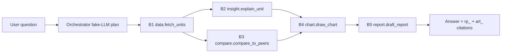

# E2E Test Plan — golden case A12-08 @ SNAP-2026-09-28

Status: plan **APPROVED**; golden case fixed to APPROVED `SNAP-2026-09-28` (no DRAFT/unknown substitution). E-xx/N-xx and
E2E-01 are PLANNED (not written); WS1 contract tests are IMPLEMENTED (§9). Contracts: [CANONICAL_DATA_CONTRACT.md](CANONICAL_DATA_CONTRACT.md),
[AGENT_CONTRACT_MATRIX.md](AGENT_CONTRACT_MATRIX.md).

## 1. Why this case

A12-08 is the only unit that is a golden fixture in the Backend DW (tests
[test_re_fixtures.py:43-100](../../backend/tests/test_re_fixtures.py#L43)), is the Compare hero case, and is used by the
Chart demo. After D1/D10 the DW is the single source; the other two fixtures become unit-test-only.

## 2. Fixed inputs

| Item | Value | Evidence |
|---|---|---|
| DW | `re_warehouse` built by `vdagent_backend.re_warehouse.build(path)` into a tmp dir | [re_warehouse/__init__.py](../../backend/vdagent_backend/re_warehouse/__init__.py) |
| Snapshot | `SNAP-2026-09-28`, key 20260928, APPROVED, semantic `sc-1` | same, L41-46 |
| User | `u_000000000001` (Alice), `authorized_scope.project_ids = ["PRJ-X"]` | [scopes.py:15-17](../../backend/vdagent_backend/db/scopes.py#L15) |
| Question | "Vì sao căn A12-08 bán chậm? So với các căn tương đồng, vẽ biểu đồ và xuất báo cáo." | — |
| Output kinds | `CHAT_ANSWER`, `CHART`, `REPORT` | `intents.py` |
| LLMs | Fake LLM for Orchestrator intent/plan and Report drafting; Jev judge faked; Insight `INSIGHT_LLM=off` (TEMPLATE); Compare `COMPARE_LLM=off` (rules + templates); Chart reasoner `None` | agent settings |

## 3. Expected DW values (read from a scratch build, 2026-09-30)

Subject A12-08 (`U-PRJ-X-A12-08`, ZN-A, 2PN, LB-02, MID, SE, CITY_OPEN):

| Field | Value |
|---|---|
| `inventory_status` | AVAILABLE |
| `unsold_days_dom` | 138 (DRAFT 20260929 would give 139 — must not appear) |
| `net_price_per_m2` | 72 500 000 VND/m² |
| `asking_price_vnd` | 5 463 000 000 |
| `net_area_m2` / `area_m2` | 63.02 / 68.50 |
| diagnostics | `primary_cause_code = OVERPRICED_VS_PEER`, `price_spread_vs_peer_pct = 12.40`, `peer_n = 7`, `is_peer_sample_constrained = 0`, `physical_defect_penalty = 5`, `thermal_view_penalty = 10`, `subsidy_duration_mo = null`, `recommended_action = null` |
| cause bridge | `OVERPRICED_VS_PEER`, rank 1, attribution `1.000` |
| funnel rows | **0** (table covers only 20260925–20260927) |

Peers (existing golden list, [test_re_fixtures.py:18-19](../../backend/tests/test_re_fixtures.py#L18)), all AVAILABLE at 20260928:

| Peer | net_area_m2 | net_price_per_m2 | DOM | similarity (net, D9) |
|---|---|---|---|---|
| A12-11 | 64.58 | 67 000 000 | 46 | 0.9257 |
| A10-02 | 60.72 | 64 500 000 | 61 | 0.8905 |
| A14-03 | 63.48 | 69 000 000 | 42 | 0.8781 |
| A06-01 | 61.73 | 62 500 000 | 80 | 0.8553 |
| B09-05 | 59.43 | 61 500 000 | 86 | 0.7291 |
| B11-07 | 66.42 | 60 000 000 | 105 | 0.5881 |
| B15-02 | 68.08 | 70 000 000 | 30 | 0.5758 |

Derived: peer median net price/m² = 64 500 000 (spread (72.5 − 64.5)/64.5 = 12.40 %, matches the mart);
peer median DOM = 61. Excluded candidates: C05-02, A16-01, A08-09, A13-06 (SOLD), A11-04 (3PN). Out of scope:
D12-09 (PRJ-Y) must be hidden (`hidden_rows ≥ 1`).

Notes: the similarity values assume the scoring formula of test_re_fixtures.py:63-77 with the area term on
`net_area_m2` (DQ-2). The Compare engine's own weights must be confirmed equal to that formula in C-CMP-03;
if they differ, the expected column is recomputed from the engine formula, not edited by hand.

## 4. Execution graph under test

## 5. Boundary assertions

| Id | Boundary | Assertion |
|---|---|---|
| E-01 | Orchestrator plan | Exactly B1..B5; B2 and B3 both depend only on B1; B4 HARD on {B2 or B3}; `idempotency_key = plan_id:step_id` |
| E-02 | B1 Data | dataset/metric/dq envelopes VALID or PARTIAL; `snapshot_refs == ["SNAP-2026-09-28"]`; `semantic_config_version == "sc-1"`; subject row values of §3; 12 candidate rows in PRJ-X; `hidden_rows ≥ 1`; no row with `snapshot_date_key != 20260928` |
| E-03 | B1 DQ | `fields[net_area_m2].missing_count == 0`; limitation `SYNTHETIC_SOURCE:net_area_m2` present |
| E-04 | Parallelism | B2 and B3 invocations overlap in time (engine invocation rows: B3 `running` before B2 `completed`) |
| E-05 | B2 Insight | `insight` envelope; `input_artifact_refs` ⊇ B1 refs; a KEY insight with cause `OVERPRICED_VS_PEER`; its numeric binding `12.40` PCT resolves to the dataset/metric via `source_ref`; no binding without a ref |
| E-06 | B3 Compare | `peer_definition.peers` = the 7 codes of §3 in that order; area band uses `net_area_m2` (tolerance fraction 0.10 → 10 %); `comparison.metrics[net_asking_price_per_m2].subjectValue == "72500000"`, benchmark median `"64500000"`; `metrics[dom].subjectValue == "138"`, median `"61"`; `inquiry_leads_30d` and `discount_pct` are `null` with `METRIC_UNAVAILABLE` limitations; envelope status PARTIAL |
| E-07 | B4 Chart | ≥1 `chart_spec`; every plotted value equals the value at its `source_ref` (e.g. DOM bar for A12-08 = 138, never 126); `expected_hash` equals stored `content_hash`; no artifact whose id starts with `synthetic_`/`llm_insight_` |
| E-08 | B5 Report | `report` envelope + `rp_…`; every number in the markdown maps to a `citations[].source_ref` that `artifact_get` resolves; chart embedded by `chart_spec` ref |
| E-09 | Final answer | cites only ids returned by tools; quotes 138 days and +12,40 %; states unavailable metrics |
| E-10 | Lineage | walking `input_artifact_refs` from `report` reaches B1 `dataset` with no dangling ref; one snapshot + one semantic version across the whole graph |

## 6. Negative scenarios

| Id | Setup | Expected |
|---|---|---|
| N-01 | Insight fake raises in B2 | run completes PARTIAL; B4 built from comparison only; report + answer carry `UPSTREAM_FAILED:insight` |
| N-02 | Compare and Insight both fail | B4 skipped; B5 reports only data facts; ErrorClass surfaced; no chart |
| N-03 | Pin `SNAP-2026-09-29` (DRAFT) | B1 `rejected SPEC_ISSUE`; nothing written |
| N-04 | B3 receives dataset from `SNAP-2026-08-31` with B1 metric of 20260928 | `rejected SPEC_ISSUE` |
| N-05 | Set A12-08 `net_area_m2` to NULL in the tmp DW (schema allows only via test DDL override) | B3 `failed`, `SUBJECT_AREA_UNAVAILABLE` / `DATA_QUALITY`; no fallback to `area_m2` |
| N-06 | Set one peer `net_area_m2` NULL | peer excluded with `net_area_unavailable`; `PEER_AREA_UNAVAILABLE:1` |
| N-07 | User Bob (not PRJ-X) asks about A12-08 | B1 `NO_DATA`/`NO_ACCESS`; no artifact contains PRJ-X rows |
| N-08 | Chart receives ref with wrong `expected_hash` | `failed WRONG_RESULT` |
| N-09 | Fake LLM timeout in Orchestrator | task fails `DEADLINE_EXCEEDED` cleanly; no orphan invocations |
| N-10 | Run twice with same `plan_id` | second run returns same artifact ids (idempotency) |

## 7. Contract tests per boundary (written before implementation)

| Id | Location (proposed) | Checks |
|---|---|---|
| C-ENV-01 | `contracts/vdagent_contracts/tests/test_envelope.py` | ≤1 snapshot, ref hash pattern (**done WS1**); APPROVED snapshot, semantic required, INVALID needs `reason_code` (pending D1/D8) |
| C-STO-01 | `backend/tests/test_artifact_store.py`, `test_mcp_artifacts.py` | dangling refs, hash, snapshot/semantic agreement; chart writes `chart_spec` via MCP (**done WS1**) |
| C-DAT-01 | `agents/data/vdagent_data/tests/test_steps.py`, `test_agent_steps.py` (**done WS2**) | E-02, E-03, N-03, N-07 |
| C-INS-01 | `agents/insight/vdagent_insight/tests/test_dw_rows.py` | DW rows validate as `UnitRow/InventoryRow/ProjectRow/ZoneRow` after D2 |
| C-INS-02 | same | `INTERNAL_COURT`, `LOCKED`, null `subsidy_duration_mo` accepted per decision |
| C-INS-03 | `test_store_reader.py` | E-05 with fake MCP |
| C-CMP-01 | `agents/compare/vdagent_compare/tests/test_dataset_package.py` | dataset → `DataPackage` |
| C-CMP-02 | same | D9: band and score use `net_area_m2`; null → N-05/N-06 |
| C-CMP-03 | same | E-06 values and order; tolerance fraction conversion; `min_group_size` PENDING limitation |
| C-CHT-01 | `agents/chart/vdagent_chart/tests/test_ws4_integration.py` (**done WS4**) | E-07, N-08 |
| C-RPT-01 | `agents/report/vdagent_report/tests/test_citations.py` | E-08 |
| C-ORC-01 | `agents/orchestrator/vdagent_orchestrator/tests/test_dag.py` (**done WS5**) | E-01, E-04, N-01, N-02, N-09 |
| E2E-01 | realised as `agents/orchestrator/vdagent_orchestrator/tests/test_ws5_golden.py` (real Backend engine + real plugins in-process, tmp DBs, no LLM) — **done WS5 without B5 Report** | E-01…E-07, E-09, E-10 (E-08 = WS6) |
| LIVE-01 | same folder, `@pytest.mark.live`, skipped by default | same flow with real LLMs; **requires explicit approval** (paid APIs) |

Existing test to update under D9 (owner decision, TDD): `backend/tests/test_re_fixtures.py:79-81` expected scores → net values of §3.

## 8. Definition of pass

- `uv run pytest -q -m "not live"` green including E2E-01, run twice with identical artifact contents (hash-equal).
- No value in any artifact that is absent from the DW or not DERIVED by a documented formula.
- No reference that fails `artifact_get`.
- Live test run only after approval; its result is reported separately and never substitutes for E2E-01.

## 9. Executed results

### WS1 (2026-09-30, after `uv sync`)

| Command | Result |
|---|---|
| `uv run pytest -q -p no:cacheprovider backend/tests contracts` (baseline, before WS1) | 166 passed |
| WS1 tests written first, before the implementation | contracts: collection error (module missing); store/MCP: 16 failed, 14 passed |
| `uv run pytest -q -p no:cacheprovider contracts/vdagent_contracts/tests/test_peer_rules.py contracts/vdagent_contracts/tests/test_envelope.py backend/tests/test_artifact_store.py backend/tests/test_mcp_artifacts.py backend/tests/test_user_context.py` | 77 passed |
| `uv run pytest -q -p no:cacheprovider backend/tests contracts` | 218 passed |
| `uv run pytest -q -p no:cacheprovider` (whole workspace) | 995 passed, 27 skipped (all pre-existing environment skips: Insight `export/` data pack absent ×11, Compare VHOP CSV pack absent ×13, Insight live test without `GEMINI_API_KEY` ×3) |
| `git diff --check` | clean |

Contract tests realised by WS1: C-ENV-01 (partial: ≤1 snapshot, hash pattern, PARTIAL limitations), C-STO-01
(dangling/foreign/wrong-type/wrong-version refs, hash mismatch, snapshot/semantic mismatch, no write on rejection,
Decimal round trip, chart writes `chart_spec` pinned to a comparison, chart cannot write other types or read other
users). Chart plugin loading (`agents/chart` outside the workspace) is still WS4 and untested here. All E-xx/N-xx
scenarios remain unimplemented.

Note: pytest reports some Compare test paths as `../../Check_Version/Compare_Agent/...`; the cause is stale,
untracked `__pycache__/*-pytest-*.pyc` files compiled from another copy. The imported code is this repository's
(`.venv/.../_editable_impl_vdagent_compare.pth`). Not changed by WS1.

### Docker environment (2026-09-30)

| Command | Result |
|---|---|
| `docker compose --profile test build tests` | PASS (imports all six agent packages + pytest in the image) |
| `docker compose --profile test run --rm tests` (no network) | 995 passed, 27 skipped, 14 subtests passed (same skips as the host) |
| `docker compose --profile offline build backend-offline` | PASS (frontend + runtime) |
| `make docker-offline-up` | seed built `warehouse.db`, `re_warehouse.db` (checksum `523af4c6a963a2ed`, latest APPROVED `SNAP-2026-09-28`), demo users; container `healthy` |
| Second `up` on the same volume | seed kept both databases ("exists, kept") |
| Plugin load, offline (no keys) | compare loaded (rules), insight loaded (TEMPLATE, fixtures source); orchestrator, data, report **failed: missing required environment variable OPENAI_API_KEY**; chart **disabled** (D6) |
| `GET /api/agents` | `["compare", "insight"]` |
| `POST /api/agents/compare/messages` "so sánh căn A12-08 với nhóm tương đồng" | answered from the **legacy hero fixture** (`SNAP-20260630-01`, 5 peers) — standalone regression only, not the canonical DW path |
| `POST /api/agents/insight/messages` "Vì sao căn SAPPHIRE1-16.231 bán chậm?" | PARTIAL insight from the **export_sample fixture** (`SNAP-20260630-01`, TEMPLATE) — standalone only |
| DW in the offline volume | 3 snapshots (2 APPROVED, 1 DRAFT); A12-08 @ 20260928: DOM 138, 72 500 000 VND/m² |
| Chart plugin in the test image (`PluginManager().load([PluginSpec(module="vdagent_chart")])`) | registered `chart`; MCP tools `artifact_get/list/put`, `describe_dataset`, `get_dataset_rows`, `get_user_context`; writes `chart_spec` only |
| `docker compose create backend` without `agents/data/.env` | fails with "bind source path does not exist" (no directory created on the host) |

Not executed: any six-agent or cross-agent flow (E2E-01), live LLM tests.

### WS2 — Data deterministic path (2026-09-30)

| Command | Result |
|---|---|
| RED: `uv run pytest -q -p no:cacheprovider agents/data/vdagent_data/tests/test_steps.py` against a signature-only stub | 28 failed |
| RED: `.../tests/test_agent_steps.py` before `DataAgent` existed | collection error (`ImportError: DataAgent`) — 6 tests |
| GREEN: `uv run pytest -q -p no:cacheprovider agents/data` | 46 passed (28 steps + 6 plugin + 12 legacy) |
| `uv run pytest -q -p no:cacheprovider backend/tests contracts agents/data` | 264 passed |
| `make docker-test` (after `docker compose --profile test build tests`) | 1029 passed, 27 skipped, 14 subtests passed |
| Docker: `.../test_steps.py .../test_agent_steps.py` | 34 passed |
| Docker offline runtime: `POST /api/agents/data/messages` with a `fetch_units` StepSpec (A12-08) | with the seeded volume: `UNIT_NOT_FOUND` (Alice has no scope rows, B-10); after `seed_demo_scopes` **in the disposable volume only**: `completed`, partial, 3 artifacts |

Golden values observed (test and Docker runtime agree): unit `U-PRJ-X-A12-08`, AVAILABLE, DOM 138,
`net_price_per_m2` 72 500 000, `asking_price_vnd` 5 463 000 000, `net_area_m2` "63.02", `dw_peer_n` 7,
`inquiry_leads_30d` null (`WINDOW_INCOMPLETE:inquiry_leads_30d:3`, funnel 20260925–20260927), `discount_pct` null,
`subsidy_duration_mo` null; 71 same-type candidates in PRJ-X with all 7 golden peers; D12-09 absent,
`hidden_rows.dim_unit_master = 28`; every artifact on `SNAP-2026-09-28` / `sc-1`; metric and dq
`input_artifact_refs` = the dataset with its `content_hash`.

Boundary coverage: E-02 and E-03 realised by C-DAT-01 (`test_steps.py`) except "12 candidate rows" (the candidate
population is 71; see INTEGRATION_MASTER_PLAN WS2 deviation / B-11). N-03 (DRAFT) and N-07 (other user) realised.

### WS3 — Insight / Compare on the canonical Data artifacts (2026-09-30)

| Command | Result |
|---|---|
| RED: `backend/tests/test_seed_scopes.py` before the seeder | 6 failed |
| RED: `test_step_inputs.py`, insight `test_dw_integration.py`, compare `test_dw_integration.py`, `test_ws3_cross_agent.py` | collection errors (`vdagent_contracts.step_inputs`, `vdagent_insight.stepspec`, `vdagent_compare.stepspec` missing) |
| RED: compare `test_ws3_plugins.py` before plugin routing | 3 failed |
| RED: data golden test extended with `dim_sales_channel` | 1 failed |
| GREEN: WS3 files in Docker (`docker compose --profile test run --rm tests python -m pytest -q -p no:cacheprovider backend/tests/test_seed_scopes.py contracts/vdagent_contracts/tests/test_step_inputs.py agents/insight/vdagent_insight/tests/test_dw_integration.py agents/compare/vdagent_compare/tests/test_dw_integration.py agents/compare/vdagent_compare/tests/test_ws3_cross_agent.py agents/compare/vdagent_compare/tests/test_ws3_plugins.py -rs`) | 41 passed, 1 skipped (B-11) |
| Docker `agents/insight agents/compare` regression | 617 passed, 28 skipped |
| `make docker-test` | 1070 passed, 28 skipped, 14 subtests passed |
| Host `uv run pytest -q -p no:cacheprovider` | 1070 passed, 28 skipped |
| Docker offline runtime, fresh volume, REST chain `data fetch_units` → `insight explain_unit` → `compare compare_to_peers` (same refs) | seed log `scopes seeded for: u_000000000001, u_000000000002`; all three `completed`; 6 artifacts on `SNAP-2026-09-28`/`sc-1`, insight / peer_definition / comparison pin the dataset (id, version, hash); no `PRJ-Y`/`D12-09` in their payloads |

Observed golden values: Insight KEY root cause `OVERPRICED_VS_PEER` for `U-PRJ-X-A12-08` with bindings `138` (DOM)
and `12.40` (spread); Compare subject `U-PRJ-X-A12-08`, DOM 138 vs peer median 61, net price 72 500 000 vs
64 500 000, `areaM2` 63.02, tolerance ratio 0.10 / percent 10.00; peers (engine) A12-11, A10-02, A14-03, B09-05,
B11-07 — **not** the 7 golden peers (B-11 BLOCKED, acceptance test skipped). E-05 realised; E-06 realised except the
peer set; E-10 realised for the Data→Insight/Compare part; E-04 (parallelism) needs WS5.

### WS4 — Chart on the real WS3 artifacts (2026-09-30)

| Command | Result |
|---|---|
| RED: `uv run pytest -q -p no:cacheprovider agents/chart/vdagent_chart/tests/test_ws4_integration.py` (module missing, then signature stub) | collection error; with stub: 12 failed, 1 skipped |
| GREEN: same file | 13 passed, 1 skipped (B-11) — incl. `test_chart_plugin_serves_stepspec_over_mcp`, written after the routing code (no separate RED) |
| `uv run pytest -q -p no:cacheprovider agents/chart` | 125 passed, 1 skipped (112 legacy demo tests unchanged) |
| Docker `agents/chart` | 125 passed, 1 skipped |
| Docker data + WS3 + backend + contracts | 305 passed, 1 skipped |
| `make docker-test` | 1083 passed, 29 skipped, 14 subtests passed |
| Host `uv run pytest -q -p no:cacheprovider` | 1083 passed, 29 skipped |
| Docker offline runtime, fresh volume, REST chain Data → Insight + Compare → Chart | `plugin vdagent_chart loaded: chart`; 5 `chart_spec` (2 `target_vs_peer` bar, 1 `relationship` scatter, 2 `current_value` kpi_card), all `SNAP-2026-09-28`/`sc-1`, all pin the Data dataset (id + hash); 18/18 bindings resolve to the exact upstream value; no PRJ-Y, no demo/synthetic ids; `chart demo bar` → refusal |

Golden values charted (expected = observed): DOM 138 vs peer median 61; net price 72 500 000 vs 64 500 000 VND/m²;
scatter of A12-08 + the 5 **actual** Compare peers (A12-11, A10-02, A14-03, B09-05, B11-07); KPIs 138 (DOM) and
12.40 (spread, stored `"12.4"`, `value_exact` `"12.40"`). E-07 realised; the 7-peer chart is **BLOCKED (B-11)**,
test `test_golden_seven_peer_chart` skipped.

### WS5 — Orchestrator DAG (2026-09-30)

| Command | Result |
|---|---|
| RED: `uv run pytest -q -p no:cacheprovider agents/orchestrator/vdagent_orchestrator/tests/test_dag.py .../test_ws5_golden.py` before implementation | 2 collection errors (`vdagent_orchestrator.dag` missing, `OrchestratorAgent` missing) |
| GREEN: `uv run pytest -q -p no:cacheprovider agents/orchestrator` | 45 passed (30 DAG unit, 3 real-engine golden/negative, 12 legacy) |
| Docker `agents/orchestrator` | 45 passed |
| Docker WS1–WS4 regression (data, WS3 files, chart, backend, contracts) | 430 passed, 2 skipped (B-11) |
| `make docker-test` | 1116 passed, 29 skipped, 14 subtests passed |
| Host `uv run pytest -q -p no:cacheprovider` | 1116 passed, 29 skipped |
| Docker offline runtime, fresh volume: ONE `POST /api/agents/orchestrator/messages` "Vì sao căn A12-08 bán chậm? So sánh với các căn tương đồng và vẽ biểu đồ." | task `completed`; engine invocations orchestrator → data → insight 23:48:48.239–.339 ∥ compare 48.256–.353 → chart; run_state v5 `partial`, waves [[B1],[B2,B3],[B4]], B2/B3 input refs == B1 output refs; 11 artifacts + run_state all `SNAP-2026-09-28`/`sc-1`; no PRJ-Y, no demo ids |

Parallelism evidence: `test_golden_dag_order_parallelism_and_identical_refs` and `test_ws5_golden.py` gate Insight and
Compare behind an `asyncio.Barrier(2)` (the run would time out if they were sequential); the Docker timestamps are
corroboration only. Golden answer (observed): DOM 138 vs 61; 72.500.000 vs 64.500.000 VND/m² (chênh 12,40 %); the 5
Compare peers named and flagged "Tập 7 căn golden chưa có luật được duyệt (B-11)"; charts cited. Negative: data /
insight / compare / both / chart failure, malformed report, rejected call (depth/deadlock text), tampered hash,
snapshot mismatch, unexpected type, timeout + cancellation, repeated invocation, unauthorized user (Bob: `UNIT_NOT_FOUND`,
only a run_state written) — all pass. Seven-peer golden: still BLOCKED (B-11).

### WS6 — Report + six-agent golden (2026-09-30)

| Verification | Result |
|---|---|
| Baseline inherited WS6/B5 suite | 115 PASS / 8 FAIL: B5 was absent from planner/targets and saved markdown differed by trailing newline |
| RED → GREEN Report/B5/API suite | 114 PASS: B5 plan/ref forwarding/partial failure/idempotency/timeout; report evidence, permissions, lineage, persistence and delivery | 
| Real in-process Backend golden | PASS: six agents, B2/B3 barrier concurrency, report lineage/sections/statements/bindings and saved report checked |
| Docker one-request golden | PASS: task `t_d758975db0ea`; all six agents completed; B2/B3 began together; B5 stored `art_a71bd6a4a8cd` and `rp_9703bbe1162b` |
| Docker full offline suite | 1139 PASS, 29 SKIP, 14 subtests PASS |
| Frontend | production TypeScript/Vite build PASS; Vitest 8 PASS; `chart_spec` embeds resolve via owner-scoped API |

Observed Docker golden values: subject DOM **138** vs peer median **61**; net price **72,500,000** vs **64,500,000 VND/m²**; price gap **12.40%**. Current Compare output names five peers (A12-11, A10-02, A14-03, B09-05, B11-07), not the unapproved seven-peer golden set (B-11 remains BLOCKED). The report had six sections, five supported charts and two tables; 28 report statements and chart bindings resolved to stored refs. Limitations, unavailable metrics, B-2/D2b/B-3/B-12 and B-11 were retained.

The report delivery API returned the saved `rp_…`; frontend compatibility is verified at build/parser/API contract level. Browser visual rendering was not separately exercised, so no claim is made about a manual browser session. WS7 remains PLANNED; do not treat its E2E scope as completed by this WS6 evidence.

### WS7 — independent audit (2026-09-30)

Executed results, acceptance matrix A1–A35, defect register and browser evidence: [WS7_INDEPENDENT_AUDIT.md](WS7_INDEPENDENT_AUDIT.md).
Headline: runtime six-agent golden PASS (18/18 bindings, 28/28 statements); real-browser report rendering FAIL for the two
KPI charts (F-01); 1139 passed / 29 skipped on host and in Docker; seven-peer golden still BLOCKED (B-11).

> WS7 remediation (2026-09-30): the E2E plan is automated in `acceptance/ws7/run.sh`: REST golden with an `Idempotency-Key`; real-browser report with 5/5 charts and a clean console; store audit (hashes via `artifact_store.verify`, lineage, 28/28 statements, no `hidden_rows`); kill -9 restart giving `failed/interrupted`. Status: VERIFIED offline; live LLM/Jev NOT VERIFIED.

> Orchestrator LLM planner live run (2026-09-30), using `gpt-4o-mini`:

- Result: one request produced 1 planner call and an accepted plan with waves [[B1], [B2, B3], [B4], [B5]].
- All 6 agents completed, with B2 ∥ B3.
- The facts match the deterministic baseline, and a retried `Idempotency-Key` was deduplicated.
- Evidence: `orch_llm_planner_evidence/`.
