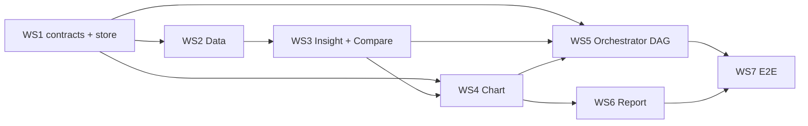

# Integration Master Plan — six-agent real-estate flow

Status: **D1–D10 APPROVED by the Integration Owner (2026-09-30)**; WS1 IMPLEMENTED; Docker dev/test environment
IMPLEMENTED; WS2 IMPLEMENTED + VERIFIED; WS3 IMPLEMENTED + VERIFIED except the peer-set acceptance (B-11 BLOCKED); WS4 IMPLEMENTED + VERIFIED (peer charts use Compare's actual peers; 7-peer chart BLOCKED by B-11); WS5 IMPLEMENTED + VERIFIED (Data → [Insight ∥ Compare] → Chart through the real engine); WS6 IMPLEMENTED + VERIFIED offline (browser: KPI charts fail, F-01); WS7 not implemented — independently audited, see [WS7_INDEPENDENT_AUDIT.md](WS7_INDEPENDENT_AUDIT.md). Branch `agent_a/debug` @ `4b420e9` with a large uncommitted working tree.

Status vocabulary used in all four documents:

| Label | Meaning |
|---|---|
| APPROVED | Architecture decision accepted; says nothing about code |
| IMPLEMENTED | In the code and covered by an executed offline test (cited) |
| PLANNED | Approved work scheduled in WS2–WS7; not in the code |
| BLOCKED | Needs business clarification; must not be guessed |

Target: `User → Orchestrator → Data → [Insight ∥ Compare] → Chart → Report → Chat / Report`.

Documents:
- [CANONICAL_DATA_CONTRACT.md](CANONICAL_DATA_CONTRACT.md): source of truth, envelope rules, field mapping, `net_area_m2` findings.
- [AGENT_CONTRACT_MATRIX.md](AGENT_CONTRACT_MATRIX.md): operations, StepSpec/AgentReport usage, errors, examples.
- [E2E_TEST_PLAN.md](E2E_TEST_PLAN.md): A12-08 golden case, boundary assertions, negative cases.
- Current-state audit: root [AGENTS.md](../../AGENTS.md).

## 1. Decisions

| # | Decision | Status | Re-verification (current source) |
|---|---|---|---|
| D1 | Canonical data = Backend `re_warehouse` via Data (`re_run_query`, scoped) | **APPROVED** | DW + scoped SQL exist ([re_sql.py](../../backend/vdagent_backend/mcp/re_sql.py), [tools.py:47-49](../../backend/vdagent_backend/mcp/tools.py#L47)); no agent uses it; Insight/Compare read CSV packs ([runtime.py:64-73](../../agents/insight/vdagent_insight/runtime.py#L64), [vh_data.py:154-192](../../agents/compare/vdagent_compare/vh_data.py#L154)) |
| D2 | Canonical keys are DW TEXT keys; Insight row models move to `str` keys and widen enums (`INTERNAL_COURT`, `LOCKED`) | **APPROVED** | Insight uses `int` keys and narrow enums ([contracts.py:460-512](../../agents/insight/vdagent_insight/contracts.py#L460)); DW TEXT ([schema.sql:24-67](../../backend/vdagent_backend/re_warehouse/schema.sql#L24)) |
| D2b | Project `segment` mapping (DW `HIGH_END`/`MID_END` vs Insight `AFFORDABLE/MID/MID_HIGH/LUXURY`) | **BLOCKED** — needs DATA owner; do not guess | schema.sql:26 `TODO(spec-gap)` |
| D3 | Insight gets an `sc-1` semantic config (no mapping to `3.1.0`) | **APPROVED** | DW `sc-1` ([semantic_config.py:11](../../backend/vdagent_backend/re_warehouse/semantic_config.py#L11)); Insight registry loaded from `agents/insight/config` ([runtime.py:111](../../agents/insight/vdagent_insight/runtime.py#L111)) |
| D4 | Data serves `StepSpec` deterministically (`fetch_units`, `aggregate_metrics`); LLM SQL only for free text | **APPROVED** | Data today = generic LLM loop, retail prompt ([agents/data/vdagent_data/agent.py](../../agents/data/vdagent_data/agent.py)) |
| D5 | Orchestrator = code DAG executor; LLM only classifies intent and fills the plan | **APPROVED** | Orchestrator today prompt-only; `intent.md`/`plan.md` unused ([agent.py:205](../../agents/orchestrator/vdagent_orchestrator/agent.py#L205)) |
| D6 | Chart is an official Backend plugin; synthetic/demo data never enters production execution | **APPROVED**; packaging IMPLEMENTED (uv workspace, listed in `backend/config*.yaml` with `enabled: false`, MCP permissions from WS1); demo gating PLANNED (WS4) | Before: chart absent from workspace/config and `ALL_AGENTS`; synthetic upstream ([mock_upstream.py:158](../../agents/chart/vdagent_chart/mock_upstream.py#L158)) |
| D7 | Report consumes Chart artifacts (`save_report` embeds `chart_spec`); retail workflow and `create_chart` preserved | **APPROVED** | [tools.py:137-168](../../backend/vdagent_backend/mcp/tools.py#L137) |
| D8 | Never fill missing values; emit `null` + limitation code | **APPROVED** | Compare hero has `discount_pct: 0`, `inquiry_leads_30d: 3` not present in DW ([hero_a12_08.json](../../agents/compare/vdagent_compare/fixtures/hero_a12_08.json)) |
| **D9** | **`net_area_m2` is the canonical peer area; no `area_m2` fallback** | **APPROVED**; helper IMPLEMENTED in WS1 (`peer_rules.peer_area`) | See CANONICAL §2 |
| D10 | Backend DW fixtures for integration tests; older agent fixtures kept for isolated regression tests | **APPROVED** | Chart demo A12-08 DOM 126 vs DW 138 ([demo/artifacts.json](../../agents/chart/vdagent_chart/demo/artifacts.json)) |

Additional approved rules (APPROVED, implementation PLANNED unless noted):

| Rule | Implementation |
|---|---|
| B-4: missing/incomplete funnel data ⇒ `null` + explicit limitation (`METRIC_UNAVAILABLE`, `WINDOW_INCOMPLETE`) | PLANNED (WS2 Data, WS3 Compare) |
| Golden case uses only APPROVED snapshot `SNAP-2026-09-28` | PLANNED (WS7); DW content verified in Docker (`SNAP-2026-09-28` APPROVED, A12-08 DOM 138) |
| DRAFT and unknown snapshots are never silently substituted | PLANNED (WS2 snapshot pin); WS1 store already rejects snapshot disagreement between an artifact and its inputs (IMPLEMENTED) |
| Retail warehouse stays available, outside the canonical real-estate flow | IMPLEMENTED by construction (unchanged retail tools and data) |

Still BLOCKED (business clarification; dependent workstreams must not guess):

| Item | Blocks |
|---|---|
| D2b segment mapping | WS3 Insight `ProjectRow.segment` |
| Business meaning of synthetic `net_area_m2 = area_m2 × 0.92` (B-3) | Sign-off of WS3 Compare peer results; golden values carry `SYNTHETIC_SOURCE:net_area_m2` |
| `min_group_size` ↔ `min_peer_count` and its PENDING `sc-1` value (B-2) | WS3 Compare sufficiency rule |

## 2. Blockers found in this pass

| Id | Blocker | Evidence | Resolution path |
|---|---|---|---|
| B-1 | Tolerance unit: `sc-1` `"0.10"` (fraction) vs Compare percent 5–10 → `INVALID_INPUT` on DW config | [semantic_config.py:74](../../backend/vdagent_backend/re_warehouse/semantic_config.py#L74), [vh_peers.py:124](../../agents/compare/vdagent_compare/vh_peers.py#L124) | WS3 adapter converts; test C-CMP-03 |
| B-2 | **BLOCKED** (surfaced, not defaulted silently): `min_group_size` PENDING and Compare reads non-existent `min_peer_count`; WS3 Compare runs with the engine default 5 and marks every artifact `BLOCKED:B-2_min_peer_count`; Insight sc-1 derives `min_peer_count` = `peer_tiers.compare_min` (10, PENDING) | [semantic_config.py:85](../../backend/vdagent_backend/re_warehouse/semantic_config.py#L85), [vh_service.py:265](../../agents/compare/vdagent_compare/vh_service.py#L265) | Approve key upstream or run with `CONFIG_PENDING` limitation |
| B-3 | **BLOCKED**: `net_area_m2` synthetic (×0.92); real semantics unverified | [fixtures.py:126](../../backend/vdagent_backend/re_warehouse/fixtures.py#L126) | DATA owner confirmation; `SYNTHETIC_SOURCE` limitation until then |
| B-4 | Funnel table covers 3 days; A12-08 has no rows → `inquiry_leads_30d` unavailable | scratch DW | **Resolved by approved rule**: null + limitation (PLANNED WS2/WS3) |
| B-5 | Insight required fields unavailable in DW (`subsidy_duration_mo`, `recommended_action`, `channel_key` int) | CANONICAL §5.2, §5.5 | D2/D8 model changes |
| B-6 | D2b segment mapping undefined | schema.sql:26 | **BLOCKED** — DATA owner |
| B-7 | ~~No `.venv`~~ resolved for WS1: `uv sync` run, offline suite executed (E2E_TEST_PLAN §9) | — | — |
| B-8 | Existing golden test encodes gross-area scores | [test_re_fixtures.py:79-81](../../backend/tests/test_re_fixtures.py#L79) | Update expectation under D9 in WS3 |
| B-9 | ~~"Data harness injects snapshot filters" is claimed but no harness exists~~ | [re_sql.py:3](../../backend/vdagent_backend/mcp/re_sql.py#L3) | **Resolved in WS2** (`steps._pin_snapshot`) |
| B-10 | ~~`data/seed_users.py` never seeds `user_scopes`~~ | — | **Resolved in WS3**: `scopes.seed_missing_demo_scopes` (only users without any scope row; never widens) called by `seed_users.py`; `backend/tests/test_seed_scopes.py` (6 PASS); Docker fresh volume: `scopes seeded for: u_000000000001, u_000000000002` |
| B-11 | No approved peer-selection rule reproduces the 7 golden peers (batch/zone rule undefined) | WS2 deviation; WS3 analysis (§WS3) | **BLOCKED** — Integration Owner / DATA owner; acceptance test `test_golden_peer_set_is_the_seven_canonical_peers` is skipped with this reason |
| B-12 | Insight `sc-1` config: sc-1 `cause_action_mapping` / `insight_templates` (PENDING) differ from Insight 3.1.0's action codes/templates; Insight-only params (e.g. `peer_spread_threshold_pct`, `attribution_sum_tolerance`) have no sc-1 key | [semantic_insight.sc-1.yaml](../../agents/insight/config/semantic_insight.sc-1.yaml) header | **BLOCKED** — Sales Ops / DATA owner decide which set is canonical; until then Insight keeps its 3.1.0 values marked PENDING with provenance |

## 3. Workstreams (ordered)

Each task starts with a failing test (TDD, per root AGENTS.md guideline).

### WS1 — Canonical contracts and Backend artifact store

**Status 2026-09-30: IMPLEMENTED (compatible subset), verified offline.**

| Item | State | Where |
|---|---|---|
| `ArtifactRef.content_hash` (optional, 64 lowercase hex) — pins the expected hash of an input | done | [envelope.py:55-62](../../contracts/vdagent_contracts/envelope.py#L55) |
| `ArtifactDraft`: at most one snapshot | done (draft only; stored envelopes are not re-validated, so old rows stay readable) | envelope.py `_checks` |
| Store checks every `input_artifact_refs` entry: exists for this user at that version, same type, hash matches when pinned; snapshot and semantic version agree wherever declared; a rejected draft writes nothing | done | [artifact_store.py:53-86](../../backend/vdagent_backend/db/artifact_store.py#L53) |
| `chart` in `ALL_AGENTS` → sees `artifact_put/get/list`, `describe_dataset`, `get_dataset_rows`, `get_user_context`; writes only `chart_spec` | done | [tools.py:31](../../backend/vdagent_backend/mcp/tools.py#L31) |
| D9 + ratio tolerance helpers: `PEER_AREA_FIELD`, `peer_area()` (no `area_m2` fallback), `area_tolerance_ratio()` ([0.05, 0.10], percent values rejected), `tolerance_percent()` | done | [peer_rules.py](../../contracts/vdagent_contracts/peer_rules.py) |
| Snapshot must be APPROVED | **deferred to WS2**: snapshots live in `re_warehouse.db`, not `backend.db`; existing artifacts use ids such as `SNAP-1` | — |
| `semantic_config_version` required for analytic types; `INVALID` requires `reason_code`; `re_dataset@1`/`re_metric@1`/`re_dq@1` payload models; limitation-code registry | **blocked** on D1/D2/D2b/D8 approval (public payload semantics) | — |
| `min_group_size` ↔ `min_peer_count` mapping | **blocked** (no approved mapping; `min_group_size` is PENDING in `sc-1`) | — |

Tests: `contracts/vdagent_contracts/tests/test_peer_rules.py` (new), additions in `test_envelope.py`,
`backend/tests/test_artifact_store.py`, `backend/tests/test_mcp_artifacts.py`. Results in E2E_TEST_PLAN.md §9.

Original plan:
- **Files:** `contracts/vdagent_contracts/envelope.py` (validators), new `contracts/vdagent_contracts/re_dataset.py` (`ReDataset`, `ReMetric`, `ReDq`, limitation codes, ref-path parser), `contracts/vdagent_contracts/catalogs/` (real catalogs replacing stubs for compare/chart/report, [stubs.py](../../contracts/vdagent_contracts/catalogs/stubs.py)), `backend/vdagent_backend/db/artifact_store.py` (ref existence check), `backend/vdagent_backend/mcp/tools.py` (`ALL_AGENTS` + chart; snapshot APPROVED check on put).
- **Inputs → outputs:** existing envelope → validated envelope with snapshot/semantic/ref rules.
- **Tests first:** C-ENV-01, C-STO-01; contract round-trip of CANONICAL §8 valid/invalid examples.
- **Acceptance:** all examples in CANONICAL §8 behave as documented; existing backend/contracts tests stay green.
- **Compatibility:** new envelope rules apply to new `schema_version`s only; existing `ds_`/`ch_`/`rp_` retail paths untouched.
- **Risks:** stricter validators could break existing Backend tests that write envelopes without snapshot — gate by schema version.

### WS2 — Real-estate Data agent

**Status 2026-09-30: IMPLEMENTED and VERIFIED offline (host + Docker).**

| Item | State | Evidence |
|---|---|---|
| `StepSpec@1` messages run the deterministic path; other text keeps the LLM loop; JSON without `contract` stays free text | IMPLEMENTED, VERIFIED | `DataAgent.invoke` in [agents/data/vdagent_data/agent.py](../../agents/data/vdagent_data/agent.py); `tests/test_agent_steps.py` |
| `fetch_units` (`subject` / `peer_candidates`) and `aggregate_metrics` (median per group) without LLM | IMPLEMENTED, VERIFIED | [steps.py](../../agents/data/vdagent_data/steps.py) `run_step`; `tests/test_steps.py` |
| Snapshot pin: explicit, APPROVED, matching semantic version; DRAFT / unknown / `latest` / missing rejected with `SPEC_ISSUE` codes; nothing written on rejection | IMPLEMENTED, VERIFIED | `_pin_snapshot`; `test_snapshot_and_semantic_are_enforced` (6 cases incl. `SNAP-2026-09-29`) |
| Scope from `get_user_context` only; mismatching `user_context` → `NO_ACCESS`; out-of-scope unit → `UNIT_NOT_FOUND` (no leak) | IMPLEMENTED, VERIFIED | `test_unit_outside_scope_is_not_found`, `test_user_context_must_match_the_caller`, `test_scope_comes_from_the_backend_not_the_step` |
| `dataset`/`metric`/`dq` (`re_dataset@1`/`re_metric@1`/`re_dq@1`) via `artifact_put`; metric and dq pin the dataset by `content_hash` | IMPLEMENTED, VERIFIED | `test_lineage_refs_and_hashes_resolve` |
| D8/B-4: `inquiry_leads_30d` null + `WINDOW_INCOMPLETE:inquiry_leads_30d:3`; `discount_pct` null + `METRIC_UNAVAILABLE` | IMPLEMENTED, VERIFIED | `test_golden_missing_metrics_are_null_with_limitations` |
| D9: subject without usable `net_area_m2` → `SUBJECT_AREA_UNAVAILABLE`; candidate → excluded + `PEER_AREA_UNAVAILABLE:n`; no `area_m2` fallback | IMPLEMENTED, VERIFIED | `test_subject_without_net_area_fails_without_fallback`, `test_candidate_without_net_area_is_excluded_with_limitation` |
| Blocked semantics passed through raw + flagged: `CONFIG_PENDING:min_group_size`, `BLOCKED:D2b_segment_mapping`, `SYNTHETIC_SOURCE:net_area_m2` | IMPLEMENTED, VERIFIED | `test_golden_blocked_semantics_are_surfaced_not_defaulted` |
| `DATA_LLM=off`: plugin loads without keys (StepSpec only); default still fails on missing LLM settings | IMPLEMENTED, VERIFIED | `test_data_llm_off_builds_a_deterministic_agent_without_keys`, `test_missing_llm_settings_still_fail_by_default`; Docker offline log `plugin vdagent_data loaded: data` |

Deviations from the original WS2 plan (recorded, not hidden):
- **"Exactly 7 peers" is verified as the DW's own count, not re-derived.** No approved rule in the repository selects
  exactly the 7 golden peers: the hard rules (same unit type, AVAILABLE, `net_area_m2` ±10 %, scope) yield 8
  (C05-02 extra), and Compare's L0 rule (same launch batch) excludes B15-02. Data therefore returns the scoped
  candidate population (71 units for A12-08, all 7 golden peers present, D12-09 absent) and the DW metric
  `dw_peer_n = 7` (`dm_unit_friction_diagnostics.peer_n`). Peer **selection** stays WS3 and is **BLOCKED** on an
  approved batch/zone rule (B-11).
- `operations.py` became `steps.py`; the free-text prompt was not changed (legacy path untouched).
- No frozen `contracts/vdagent_contracts/catalogs/data.json`; error classes live in `steps.DATA_ERROR_CLASSES` (WS5 needs a catalog).

Original plan:
- **Files:** `agents/data/vdagent_data/agent.py` (route `StepSpec` vs free text via `parse_incoming`), new `agents/data/vdagent_data/operations.py` (SQL builder, snapshot pin, population rules, DQ), `agents/data/vdagent_data/prompts/system.md` (mention `re_*` tools for free text).
- **Inputs → outputs:** `StepSpec fetch_units` → `dataset`, `metric`, `dq` envelopes + `AgentReport`.
- **Depends on:** WS1; decisions D1, D4, B-4.
- **Tests first:** C-DAT-01 (golden values, DRAFT rejection, hidden rows, no cross-snapshot rows).
- **Acceptance:** E-02, E-03 pass offline without any LLM call.
- **Risks:** Data code is a byte copy of Orchestrator; splitting it may require adopting `vdagent_agentkit` (P2).

### WS3 — Insight / Compare structured integration and parallel execution

**Status 2026-09-30: IMPLEMENTED and VERIFIED offline (host + Docker), except peer-set acceptance (B-11 BLOCKED).**

| Item | State | Evidence |
|---|---|---|
| Shared input resolver: pinned dataset/metric/dq via `artifact_get`; hash, schema, status, snapshot, semantic, lineage (metric/dq pin the dataset), caller and scope checks; error → ErrorClass map | IMPLEMENTED, VERIFIED | [step_inputs.py](../../contracts/vdagent_contracts/step_inputs.py); `contracts/.../tests/test_step_inputs.py` (11 PASS) |
| Insight `StepSpec@1` `explain_unit`: `DwArtifactReader` builds Insight's pack from `re_dataset@1` (no export pack), unchanged pipeline (TEMPLATE), shared `insight`/`insight.v2` artifact pinned to the Data inputs, evidence refs = Data artifacts, Data limitations carried | IMPLEMENTED, VERIFIED | [stepspec.py](../../agents/insight/vdagent_insight/stepspec.py), [dw_reader.py](../../agents/insight/vdagent_insight/dw_reader.py); `tests/test_dw_integration.py` (9 PASS) |
| Insight D2/D8 model changes: DW TEXT keys (`DwKey` = `int | str`, left-to-right so legacy ints stay ints), `INTERNAL_COURT`, `LOCKED`, raw `segment` (D2b), nullable `subsidy_duration_mo`, penalties, `recommended_action`, `peer_count`; null guards in T1/T7 | IMPLEMENTED, VERIFIED | [contracts.py](../../agents/insight/vdagent_insight/contracts.py); legacy suite unchanged 516 PASS / 14 SKIP |
| Insight `sc-1` semantic config with per-value provenance (D3) | IMPLEMENTED (values PENDING where sc-1 says so; B-12) | [semantic_insight.sc-1.yaml](../../agents/insight/config/semantic_insight.sc-1.yaml) |
| Compare `StepSpec@1` `compare_to_peers`: `DataPackage` from the dataset (TEXT ids, `peer_area` D9, tolerance ratio → percent explicitly), unchanged engine, shared `peer_definition@1` + `comparison@1` (numbers as decimal strings), comparison pins the peer definition; `metrics[].sourceRef.artifactId` = dataset | IMPLEMENTED, VERIFIED | [stepspec.py](../../agents/compare/vdagent_compare/stepspec.py); `tests/test_dw_integration.py` (12 PASS, 1 SKIP B-11) |
| Both plugins route `StepSpec@1` messages; other contracts → `UNSUPPORTED_CONTRACT`; free text and legacy JSON unchanged | IMPLEMENTED, VERIFIED | `InsightAgent._contract` ([bridge.py](../../agents/insight/vdagent_insight/bridge.py)), `CompareAgent._contract` ([agent.py](../../agents/compare/vdagent_compare/agent.py)); `compare/tests/test_ws3_plugins.py` (3 PASS) |
| Cross-agent: same dataset ref (id, version, hash), one snapshot/semantic, no PRJ-Y data | VERIFIED | `compare/tests/test_ws3_cross_agent.py`; Docker runtime chain (E2E_TEST_PLAN §9) |
| Data dataset now also carries `dim_sales_channel` (Insight commission inputs) | IMPLEMENTED, VERIFIED | `agents/data/vdagent_data/steps.py`; `test_golden_a12_08_fetch_units` |
| Structured JSON over MCP for deterministic paths (`JsonTools`) | IMPLEMENTED, VERIFIED (Docker runtime over streamable HTTP) | [agents/_shared/vdagent_agentkit/mcp_client.py](../../agents/_shared/vdagent_agentkit/mcp_client.py) |
| Parallel Insight ∥ Compare dispatch | NOT in WS3 (Orchestrator DAG, WS5); the two steps are independent and share only read-only inputs | — |

B-11 investigation (evidence, `SNAP-2026-09-28`, Alice's scope):
- Hard filters over the whole scoped PRJ-X (2PN, AVAILABLE, `net_area_m2` within ±10 % of 63.02) → **64** units, mostly
  background batch `LB-22`. Restricted to the fixture batches LB-01..03 → **8**: the 7 golden peers + C05-02.
- C05-02 (ZN-C, LB-01, LOW, SE, CITY_OPEN, net 62.56) has similarity 0.7948 (formula of test_re_fixtures.py, net area),
  higher than golden peer B15-02 (0.5758): similarity ranking cannot explain keeping B15-02 and dropping C05-02. The
  only differences are batch (LB-01 vs LB-03) and zone (ZN-C vs ZN-B); `sc-1` has no batch, zone or similarity rule
  (only `peer_area_tolerance_pct`, `peer_tiers`, `min_group_size`).
- Compare engine on the canonical dataset: **5 peers at level 0** (A12-11, A10-02, A14-03, B09-05, B11-07) — L0 pool =
  same project and same launch batch LB-02 (B15-02 LB-03 and C05-02 LB-01 never enter the pool), orientation group
  COOL, floor band MID (A06-01 LOW excluded `different_floor_band`); 5 ≥ engine default `min_peers` 5, so no relaxation.
- DW mart `peer_n = 7` is a stored number, not a reconstructible rule. Result: **B-11 stays BLOCKED**; nothing
  hard-codes the 7. Coincidence recorded: the 5-peer medians (price 64 500 000, DOM 61) equal the 7-peer medians.

Original plan:
- **Insight files:** `vdagent_insight/contracts.py` (D2 types/enums, optional fields per D8), new `vdagent_insight/store_reader.py` (MCP `ArtifactReader`), `bridge.py` (StepSpec → `InsightTaskRequest`, `AgentReport` reply, shared-envelope `artifact_put`), `config/` (`sc-1` semantic file, D3), `runtime.py` (select reader).
- **Compare files:** new `vdagent_compare/vh_dataset.py` (dataset → `DataPackage`, `net_area_m2`, config conversion B-1/B-2, D8 nulls), `vh_service.py` (producer object, decimal strings, `min_group_size`), `agent.py` (StepSpec / AgentReport, `artifact_put`).
- **Backend test:** `backend/tests/test_re_fixtures.py:79-81` expectation → net scores (B-8).
- **Depends on:** WS1, WS2.
- **Tests first:** C-INS-01..03, C-CMP-01..03.
- **Acceptance:** E-05, E-06 on the golden dataset; both agents still answer free text as today (regression tests kept).
- **Parallelism:** no agent change needed — engine runs different agents concurrently ([engine.py:317](../../backend/vdagent_backend/engine/engine.py#L317)); verified by E-04 in WS5/WS7.
- **Risks:** large uncommitted changes in both packages — rebase WS3 after those land; Insight export-pack tests must keep passing via the fixtures reader.

### WS4 — Chart registration, real artifact consumption, persistence

**Status 2026-09-30: IMPLEMENTED and VERIFIED offline (host + Docker); 7-peer golden chart BLOCKED (B-11).**

| Item | State | Evidence |
|---|---|---|
| Chart is an enabled Backend plugin (`backend/config*.yaml`, no `enabled: false`); demo commands only with `CHART_DEMO=on` or `opts: {demo: true}`; production setup does not even load the demo store | IMPLEMENTED, VERIFIED | [__init__.py](../../agents/chart/vdagent_chart/__init__.py) `setup`/`demo_enabled`; `test_chart_is_an_enabled_backend_plugin`, `test_setup_registers_chart_with_demo_mode_off`, `test_demo_commands_are_refused_in_production`; Docker log `plugin vdagent_chart loaded: chart`, REST `chart demo bar` → refusal text |
| `StepSpec@1` `draw_chart` routed through MCP (`JsonTools`); other contracts `UNSUPPORTED_CONTRACT` | IMPLEMENTED, VERIFIED | `ChartPluginAgent._contract` ([agent.py](../../agents/chart/vdagent_chart/agent.py)); `test_chart_plugin_serves_stepspec_over_mcp` (written after the routing code: no separate RED) |
| Analysis-input resolver: insight and/or comparison (+ peer_definition), pinned hashes, owner (artifact_get is user-scoped), snapshot, semantic, one common dataset, comparison pins its peer definition | IMPLEMENTED, VERIFIED | `resolve_analysis_inputs` in [step_inputs.py](../../contracts/vdagent_contracts/step_inputs.py); negative tests in `test_ws4_integration.py` |
| Projection of real artifacts into the chart pipeline (no recomputation): comparison metric → `target_vs_peer` (subject vs engine benchmark), scatter hint → `relationship` over `peerValues`, Insight numeric binding → `current_value` KPI; unchanged `ChartAgentService` (selection policy, output validation, Vega-Lite + Plotly), one pipeline task per chart | IMPLEMENTED, VERIFIED | [stepspec.py](../../agents/chart/vdagent_chart/stepspec.py) |
| `chart_spec@1` persisted via `artifact_put`: inputs = dataset + upstream artifacts shown; `bindings[]` give `value_exact` + `source_ref` (`<id>@<v>#<pointer>`) for every displayed value; upstream limitations carried; non-integer values stored as decimal strings with a Vega-Lite `format.parse` | IMPLEMENTED, VERIFIED | `test_golden_charts_from_real_ws3_artifacts`; Docker: 18/18 bindings resolve exactly |
| Insight-only / Compare-only modes with `UPSTREAM_MISSING:<type>` | IMPLEMENTED, VERIFIED | `test_insight_only_mode`, `test_compare_only_mode` |
| Null upstream values never charted (`NOT_CHARTED_NULL:<metric>`); invalid numeric binding excluded (`INVALID_BINDING:<insight>/<slot>`), never 0 | IMPLEMENTED, VERIFIED | `test_invalid_numeric_binding_is_excluded_not_zeroed`, `test_limitations_are_carried_and_nulls_never_charted` |
| Chart policy used: `chart-policy/demo-1.0` — the only ruleset in the repository (chart types/limits, no data); its name is historical | IMPLEMENTED (naming debt) | [policy.py](../../agents/chart/vdagent_chart/policy.py) |

Original plan (partly superseded: `mcp_store.py` became `stepspec.py` + the shared resolver):

Already IMPLEMENTED before WS4 (Docker task): chart in the uv workspace (`pyproject.toml`, `uv.lock`), listed in
`backend/config.yaml` and `backend/config.compose.yaml` with `enabled: false`, `.env` mount in `docker-compose.yml`,
import check in the image. WS4 turns `enabled` on only after the demo gate exists (D6).

- **Files:** root `pyproject.toml` (workspace member + dependency), `backend/config.yaml`, `backend/config.compose.yaml`, `docker-compose.yml` (`.env` mount), `agents/chart/vdagent_chart/agent.py` (StepSpec path, demo flag), new `agents/chart/vdagent_chart/mcp_store.py` (reads via `artifact_get`, writes `chart_spec` via `artifact_put`), `contracts.py` (ref → envelope mapping), `mock_upstream.py` (demo-only).
- **Depends on:** WS1 (chart in `ALL_AGENTS`), WS3 (real inputs).
- **Tests first:** C-CHT-01, N-08; plugin-load test in `backend/tests/test_plugins.py`.
- **Acceptance:** E-07; no `synthetic_*` artifact reachable without the demo flag; existing 24 demo scenarios still pass under the flag.
- **Risks:** chart package was never installed in the workspace; its dependency set (`litellm`) must resolve with `uv.lock` (lockfile change needs approval).

### WS5 — Orchestrator DAG, dependencies, failure handling

**Status 2026-09-30: IMPLEMENTED and VERIFIED offline (unit, real Backend engine in-process, Docker runtime).**

| Item | State | Evidence |
|---|---|---|
| Plan model + code-enforced validation: `B<n>` ids, unique, catalog-declared agent/operation (only data/insight/compare/chart), known deps, no cycle, inputs only from deps, one snapshot + semantic; returns waves | IMPLEMENTED, VERIFIED | [dag.py](../../agents/orchestrator/vdagent_orchestrator/dag.py); `test_dag.py::test_invalid_plans_are_rejected` (10 cases), `test_plan_needs_one_snapshot_and_semantic` |
| Deterministic planner: unit code + keywords (vì sao / so sánh / biểu đồ) or `AnalysisRequest@1`; plan B1 fetch_units → B2 explain_unit ∥ B3 compare_to_peers (same B1 refs; Insight scope resolved from the B1 dataset) → B4 draw_chart (`any`); deterministic `plan_id`; never picks a snapshot | IMPLEMENTED, VERIFIED | [planner.py](../../agents/orchestrator/vdagent_orchestrator/planner.py); `test_classify_*`, `test_structured_request_contract` |
| Executor: one assistant step per wave with `send_to_agent` calls, `TaskGroup` per wave (B2 ∥ B3), dependency barrier, boundary checks (error text → `CALL_REJECTED`, `MALFORMED_REPORT`, `REF_TYPE_UNEXPECTED`/`REF_HASH_*`/`REF_NOT_FOUND`/`REF_SNAPSHOT_MISMATCH`/`REF_SEMANTIC_MISMATCH`/`REF_MISSING`), `UPSTREAM_FAILED:<agent>` for `any` deps, run deadline → `timed_out` + `AgentTimeoutError` (pending calls cancelled) | IMPLEMENTED, VERIFIED | [executor.py](../../agents/orchestrator/vdagent_orchestrator/executor.py); `test_golden_dag_order_parallelism_and_identical_refs` (asyncio.Barrier), failure tests, `test_timeout_cancels_pending_calls_without_orphans` |
| `run_state@1`: one artifact, a version per transition: plan, waves, steps (status, timestamps, input/output refs, error, limitations, partial, reused); repeated invocation reuses completed steps | IMPLEMENTED, VERIFIED | `test_run_state_is_persisted_per_step`, `test_repeated_invocation_does_not_rerun_completed_steps`; Docker run_state v5 |
| Chat answer quotes artifact values only, cites ids, flags B-11, starts "Không hoàn thành" on failure | IMPLEMENTED, VERIFIED | [answer.py](../../agents/orchestrator/vdagent_orchestrator/answer.py); `test_answer_quotes_artifact_values_and_cites_ids`, `test_data_failure_stops_everything` |
| `OrchestratorAgent`: `AnalysisRequest@1` → DAG; free text → legacy LLM loop when an LLM is configured, deterministic DAG when `ORCH_LLM=off`; `ORCH_SNAPSHOT_ID` / `ORCH_SEMANTIC_VERSION` explicit pin; `ORCH_DAG_TIMEOUT_S` | IMPLEMENTED, VERIFIED (offline) | [agent.py](../../agents/orchestrator/vdagent_orchestrator/agent.py); `test_ws5_golden.py` (real engine); legacy `test_agent.py` unchanged |
| Frozen catalogs `data.json`, `insight.json`, `compare.json`, `chart.json` generated from the implemented operations and error-code maps; sync test | IMPLEMENTED, VERIFIED | [catalogs/](../../contracts/vdagent_contracts/catalogs/); `test_catalogs_declare_the_implemented_operations` |
| Catalog migration: the committed `data.json` 1.3.0 and `insight.json` 2.0.0 (DATA merge, `4b420e9`) declared operations that are **not implemented** — `fetch_peer_candidates`, `fetch_unit_context` (data), `explain_slow_moving`, `describe_patterns` (insight) — with artifact kinds (`unit_set`, `metric_table`, `peer_candidates`, `unit_context`, `dq_report`) no agent produces. They were replaced by the implemented operations (data 1.4.0, insight 2.1.0); their `vocabulary` blocks were kept verbatim. The removed operations are PLANNED, recoverable from git history (`git show 4b420e9:contracts/vdagent_contracts/catalogs/data.json`) | IMPLEMENTED (reviewable) | `git diff -- contracts/vdagent_contracts/catalogs/` |
| Engine interplay: depth/deadlock refusals and peer failures arrive as `error:` text → `CALL_REJECTED`; per-(user, agent) queues and R3/R4/R5 respected | VERIFIED (unit with a rule-enforcing fake ctx; real engine golden) | `test_malformed_report_and_rejected_call_fail_the_step`, `test_ws5_golden.py` |

Known limits: a single step cannot be timed out alone (the engine forbids emitting a tool result while its
`call_agent` is pending), so the deadline is per run; on expiry the engine's DEADLINE_EXCEEDED handling closes the
turn and discards late child results. The LLM does not plan yet: with an LLM configured, free text still goes to the
legacy loop (it could be taught to emit `AnalysisRequest@1` later). Report (B5) is WS6.

Original plan:
- **Files:** new `agents/orchestrator/vdagent_orchestrator/planner.py` (intent → plan using `prompts/intent.md`, `prompts/plan.md`, catalogs), new `executor.py` (dispatch StepSpecs, HARD/SOFT waits, parallel `call_agent`, retries per AGENT_CONTRACT_MATRIX §5, `run_state` artifact), `agent.py` (use executor; keep LLM loop for chit-chat), `prompts/system.md` (six agents).
- **Depends on:** WS1; integrates WS2–WS4.
- **Tests first:** C-ORC-01 (E-01, E-04, N-01, N-02, N-09) with fake peers.
- **Acceptance:** plan and state deterministic for the golden question with a fake LLM; partial failures degrade as specified.
- **Risks:** SDK allows one `call_agent` per tool call id; executor must emit synthetic `send_to_agent` tool calls to satisfy R3/R4 ([engine.py:492-505](../../backend/vdagent_backend/engine/engine.py#L492)).

### WS6 — Report integration, evidence-preserving output
- **Files:** `backend/vdagent_backend/mcp/tools.py` + chart rendering for `{{chart_spec:…}}` embeds (D7), `agents/report/vdagent_report/graph.py` (StepSpec path, read artifacts, citations), `prompts/system.md`, judge criteria (`judge.py`) to fail uncited numbers.
- **Depends on:** WS4.
- **Tests first:** C-RPT-01 (fake Jev).
- **Acceptance:** E-08; retail report path unchanged.
- **Risks:** Jev is an external decisions endpoint — offline tests must fake it.

### WS7 — Cross-agent contract tests and offline golden E2E
- **Files:** new `backend/tests/e2e/test_golden_a12_08.py`, fixtures building a tmp DW via `re_warehouse.build`, fakes from `agents/_shared/vdagent_agentkit/testing.py`; `pyproject.toml` pytest marker `live` (config change needs approval).
- **Depends on:** all.
- **Acceptance:** E2E_TEST_PLAN §8.

## 4. Responsibility

| WS | Component owner (per docs/agent-a/workflow.md split) |
|---|---|
| WS1 | Backend/contracts lead |
| WS2, WS5, WS6 | AGENT_A team (Data, Orchestrator, Report) |
| WS3 | Insight team, Compare team |
| WS4 | Chart team + Backend lead (registration) |
| WS7 | Data-test role + all owners |

## 5. Approval checklist (stop gate)

- [x] D1–D8, D10 approved (2026-09-30); D9 approved earlier
- [ ] D2b segment mapping supplied by the DATA owner — **BLOCKED**
- [x] B-4 approved as null + limitation; [ ] B-3 business meaning of `net_area_m2` — **BLOCKED**
- [ ] `min_group_size` ↔ `min_peer_count` mapping and approved value — **BLOCKED**
- [x] Permission to run `uv sync` (granted; `uv.lock` updated by the pre-existing insight dependency change and by adding `vdagent-chart` to the workspace)
- [ ] Permission for any live-LLM test (LIVE-01)

## 6. Docker development and offline test environment (IMPLEMENTED 2026-09-30)

One image (`Dockerfile.python`, targets `runtime` and `test`); the Backend runs every plugin in-process — no
per-agent services. Compose services: `seed` + `backend` (development, `./var`, agent `.env` files mounted
read-only), profile `offline` (`seed-offline` + `backend-offline`, named volume `vdagent_offline_var`, no keys,
port 8001), profile `test` (`tests`, no network, tmpfs `var`). Seeding never overwrites an existing database
(`docker/seed-if-missing.sh`). Verified commands and results: root [AGENTS.md](../../AGENTS.md) "Docker workflow"
and [E2E_TEST_PLAN.md](E2E_TEST_PLAN.md) §9.

What the Docker environment does **not** provide: a working six-agent flow. Orchestrator, Data and Report need
real LLM credentials and there is no fake-LLM switch in their plugin setup; the cross-agent contracts are WS2–WS7.

## 7. WS6 completion record (2026-09-30)

**Status: IMPLEMENTED and VERIFIED offline.** WS6 extends the deterministic plan to Report Mode: B1 Data → B2 Insight ∥ B3 Compare → B4 Chart → B5 `report.draft_report`; Chat Mode remains through B4. B5 accepts `StepSpec@1`, resolves only user-readable hash-pinned Insight/PeerDefinition/Comparison/Chart artifacts, requires one snapshot (`SNAP-2026-09-28`), one semantic version (`sc-1`) and one Data dataset, and checks Compare→PeerDefinition lineage.

`compose.py` produces the approved six sections without an LLM. Numeric statements and all chart bindings are re-resolved from source refs; invalid evidence returns `EVIDENCE_INVALID` without delivery/artifact persistence. Successful output is a `report@1` artifact with source/input refs, limitations, statement validation, charts/tables/actions and delivery `report_id`; it is saved through existing `save_report` as `rp_…`.

D7 delivery is complete: `save_report` validates `{{chart_spec:<id>@<version>}}`, `GET /api/chart-specs/{id}/{version}` is user-scoped, and the frontend renders those pinned Vega-Lite specs while preserving legacy embeds. `REPORT_LLM=off` loads deterministic Report Mode in `backend-offline`; legacy LangGraph/Jev retail reporting remains available with configured keys.

Evidence: WS6 targeted tests 114 PASS; real-engine six-agent golden PASS; Docker one-request golden PASS; Docker full suite 1139 PASS / 29 SKIP / 14 subtests; frontend build PASS and 8 frontend tests PASS. B-11/B-2/D2b/B-3/B-12 remain unchanged. WS7 remains PLANNED and was not started.

### WS7 — status after the independent audit (2026-09-30)

No WS7 suite existed. The audit ([WS7_INDEPENDENT_AUDIT.md](WS7_INDEPENDENT_AUDIT.md)) verified the six-agent offline flow at runtime and
opened F-01…F-11; the WS7 deliverable (automated acceptance + browser suite) is still PLANNED (F-06).

> WS7 remediation (2026-09-30): WS7 acceptance IMPLEMENTED and VERIFIED offline (`acceptance/ws7/`, 14/14). F-05 auth BLOCKED ([AUTH_DESIGN.md](AUTH_DESIGN.md)). Business blockers unchanged. Not production-ready. See [WS7_INDEPENDENT_AUDIT.md §12](WS7_INDEPENDENT_AUDIT.md).

> Orchestrator LLM planner (2026-09-30):

- With `ORCH_LLM=on`, the LLM proposes intent and plan structure only; code validates and compiles the plan (`llm_planner.py`), and the existing DAG executor runs it.
- The legacy loop runs only with `ORCH_LEGACY_LOOP=on`.
- Validated live for the single happy case. Details are in AGENTS.md §20.
