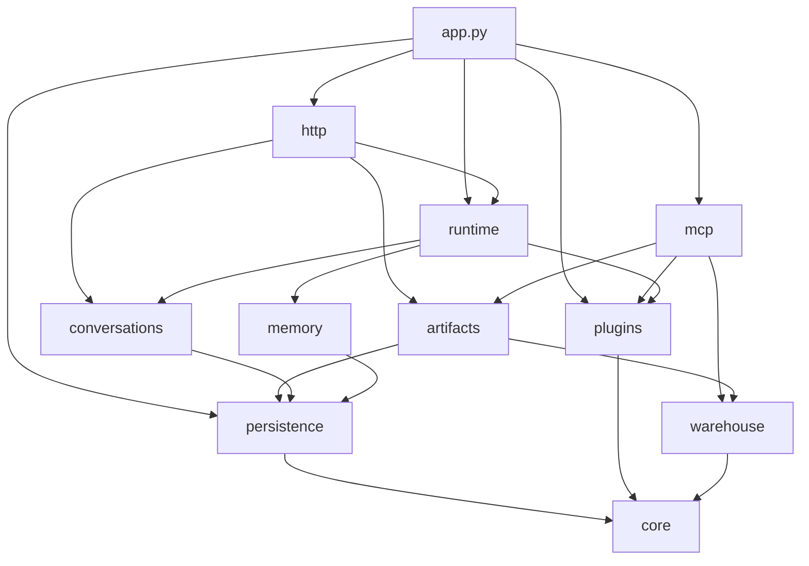

# vdagent Backend — Restructure Design Spec

Status: approved design, not implemented · Date: 2026-09-29
Scope: `backend/` (package `vdagent_backend`, its tests, config files), plus the few files outside
it that name backend internals (`data/seed_users.py`, docs listed in §8.3).

## 1. Purpose and scope

The Backend grew feature by feature into a layout that makes long-term work harder than it needs
to be:

- Loose top-level modules (`ids.py`, `tokens.py`, `events.py`, `plugins.py`, `config.py`) next to
  `app.py`, with no layering rule.
- `db/repo.py` mixes SQL with the REST/SSE DTO shapes; the engine imports DTOs from the DB layer.
- `engine/engine.py` (713 lines) is one class doing scheduling, contract checks, call routing,
  compaction, crash patching and SSE publishing.
- `mcp/` mixes transport (`server`, `auth`), catalog (`TOOLS`, `PERMISSIONS`, `RESULT_FIELDS`) and
  domain logic (`sql.py`, `charts.py`, column stats, embed validation).
- Duplicates: `_describe(exc)` ×2, the error envelope ×3, query helpers ×3, dataset paging ×2.
- Dead code: `EventBus.broadcast`, `EventBus.user_ids`, `repo.get_invocation`, `Services.cfg`,
  `Engine.start` (only calls `recover`).
- Agent names hard-coded in the Backend (`ALL_AGENTS`, `PERMISSIONS`, `_AGENT_ORDER`): a new plugin
  loads, but sees no MCP tools until someone edits `mcp/tools.py`.
- SQLite-only persistence (raw SQL with `rowid`, `lastrowid`, `strftime` defaults, FTS5,
  sqlite-vec), while a move to PostgreSQL will happen.

This refactor restructures the package for scalability, long-term development and organisation,
removes redundant code, applies targeted optimizations, prepares persistence for PostgreSQL, and
documents the Backend (docstrings + `backend/README.md`).

**Out of scope:** implementing the PostgreSQL backend itself (only its preparation, §5.7), auth,
multi-process workers, SSE replay, changes to plugin code, the SDK contract, or the frontend.

### 1.1 Decisions log

| # | Decision | Why |
|---|---|---|
| D1 | Domain packages with thin transports (approach B) | A feature change lands in one package; domains test without HTTP/MCP. Rejected: layered cleanup (features stay scattered across `api/`, `db/`, `mcp/`), hexagonal ports (ceremony for ~3k LOC) |
| D2 | MCP tool grants move to `config.yaml` (`mcp_tools` per plugin entry) | A new agent needs no Backend code edit. Per plugin entry, not per agent name, because plugins may pick agent names at runtime (`_template` with `opts: {name: …}`) |
| D3 | SQLAlchemy Core `Table` metadata + Core expressions + Alembic | PostgreSQL becomes a driver, URL, one search implementation and a migration. Rows stay plain dicts. Rejected: ORM (session lifetime and async lazy-load hazards in the engine), portable raw SQL (duplicated per-dialect queries and migrations) |
| D4 | Memory search is the only dialect-specific module | pgvector handles the memory table as designed: unconstrained `vector` column holds any dimension; `vector_dims(e) = :dim` + `<=>` mirrors today's `vec_length` + `vec_distance_cosine`; per-dimension HNSW possible via expression + partial index |
| D5 | Timestamps keep the API format `YYYY-MM-DDTHH:MM:SS.mmmZ` | The frontend sorts invocations with `created_at.localeCompare` (`frontend/src/components/inspector/TaskTree.tsx:20`) |
| D6 | Dataset rows move to a `dataset_rows` table | Paging no longer decodes up to 10 000 rows per request |
| D7 | Existing `var/backend.db` files are adopted in place | Dev and preview databases must keep working without `make reset-db` |

## 2. Invariants the refactor keeps

Enforced by the existing tests (import paths updated only) plus the smoke run in §9.3.

- Entry points: `vdagent_backend.app:app` (lazy, PEP 562) and `create_app(cfg)`;
  `vdagent_backend.config.load_config`; `vdagent_backend.mcp.reference` (pdoc, SDK docs).
- Every `/api/*` route: paths, query parameters, status codes, JSON shapes, error codes and
  messages, the envelope `{"error": {"code", "message"}}`.
- SSE `GET /api/events?user_id=`: event names `message.appended`, `invocation.updated`,
  `task.updated`, `agent.status`, their payloads, the 15 s `: ping`, the 1000-event queue bound.
- `/mcp` and `/mcp/`: tool names, input schemas, result JSON, error texts, `401 invalid_token`,
  `503 mcp_unavailable`, stateless streamable HTTP, per-invocation bearer tokens.
- Plugin loading: `setup(api, opts)`, `register_agent`, `on_shutdown`, buffered registration,
  failure isolation, shutdown order and timeout.
- `InvocationContext` behaviour; contract-violation messages and failure reasons
  (`DEADLINE_EXCEEDED: …`, `INTERNAL: …`, `backend restarted`, `cancelled`) byte-identical.
- The order of DB writes and SSE publishes for every flow.
- `config.yaml` keys and `VDAGENT_*` overrides; the only addition is optional `mcp_tools`.
- The SQLite file format of existing databases (adopted in place, §5.4).

## 3. Package map

```
backend/
  alembic.ini                    # Alembic CLI config (script_location → package migrations)
  config.yaml, config.compose.yaml
  vdagent_backend/
    __init__.py                  # package docstring: map + dependency rule
    app.py                       # composition root: create_app, lifespan, lazy `app`
    config.py                    # Config, PluginSpec (+ mcp_tools), load_config
    core/
      ids.py                     # new_id
      clock.py                   # utcnow, iso_ms
      errors.py                  # describe(exc), error_body(code, message)
      events.py                  # EventBus, Subscriber
      tokens.py                  # TokenRegistry, McpIdentity
    persistence/
      database.py                # create_database(url), dialect connect hooks
      tables.py                  # Core MetaData + every Table
      types.py                   # UtcTimestamp, Json, Embedding
      query.py                   # fetch_all, fetch_one, write_returning
      migrate.py                 # migrate(url): adopt legacy DB, upgrade head
      migrations/                # Alembic env.py, script.py.mako, versions/
    plugins/
      loader.py                  # PluginManager, _PluginAPI
      registry.py                # AgentRegistry, RegisteredAgent (+ tools)
    conversations/
      users.py                   # Users repository
      tasks.py                   # Tasks repository (tasks + invocations), TASK_STATUSES
      messages.py                # Messages repository (messages + stack summaries)
      dto.py                     # user/task/invocation/message DTOs
    artifacts/
      repository.py              # Artifacts repository (datasets, dataset_rows, charts, reports)
      service.py                 # ArtifactService: store/describe/page dataset, chart, report
      charts.py                  # Vega-Lite spec builder (today's mcp/charts.py)
      dto.py
    warehouse/
      sql.py                     # read-only SQL checks + execution (today's mcp/sql.py)
      warehouse.py               # async Warehouse facade (to_thread inside)
    memory/
      scoped.py                  # ScopedMemory (SDK Memory)
      search.py                  # MemorySearch interface + SqliteMemorySearch
    runtime/
      engine.py                  # Engine: public API + run task
      scheduler.py               # Scheduler: stacks, queue, pump, status
      calls.py                   # CallRouter: accept/reject, WaitGraph, children
      contract.py                # pure contract checks on Step
      run.py                     # Run, Stack, Step
      context.py                 # TurnContext + inbox events (unchanged role)
      history.py                 # to_message, missing_tool_results
      compaction.py              # compact(...)
      publisher.py               # Publisher: SSE events from domain DTOs
      waitgraph.py               # WaitGraph (adjacency lists)
    http/
      deps.py                    # Services, current_user, Svc/UserId aliases
      errors.py                  # ApiError, handlers (uses core.errors.error_body)
      users.py, agents.py, tasks.py, artifacts.py   # routers per resource
      events.py                  # SSE router
      frontend.py                # SPA static mount
    mcp/
      server.py                  # McpServer (low-level SDK server, stateless manager)
      auth.py                    # BearerAuth, current_identity
      catalog.py                 # TOOLS, RESULT_FIELDS, TOOL_NAMES
      args.py                    # argument parsers (ToolError)
      handlers.py                # one function per tool
      reference.py               # generated MCP reference page (path kept)
  tests/                         # mirrors the package; one shared conftest.py harness
```

Old → new: `ids.py`, `tokens.py`, `events.py` → `core/`; `plugins.py` → `plugins/`;
`db/database.py` + `db/schema.sql` → `persistence/`; `db/repo.py` → `conversations/`;
`db/artifacts.py` → `artifacts/repository.py`; `db/memory.py` → `memory/`; `engine/` → `runtime/`;
`api/` → `http/`; `mcp/sql.py` → `warehouse/sql.py`; `mcp/charts.py` → `artifacts/charts.py`;
`mcp/tools.py` → `mcp/catalog.py` + `mcp/args.py` + `mcp/handlers.py` + `artifacts/service.py`.

### 3.1 Dependency rule



- `core` imports no other `vdagent_backend` package. `config` imports only `core`.
- Domains (`conversations`, `artifacts`, `memory`, `warehouse`) never import `http`, `mcp` or
  `runtime`. `http` and `mcp` never import each other. Only `app.py` imports everything.
- Every package `__init__.py` has a docstring (what it owns, what it may import) and an explicit
  `__all__`; other packages import only those names.
- A test (`tests/test_architecture.py`) parses every module's imports with `ast` and fails on a
  forbidden edge.

### 3.2 Composition root

`create_app(cfg)` validates grants against the MCP catalog, then builds the objects that need no
plugins: `create_database(url)` (an engine; no connection yet), `EventBus`, `TokenRegistry`,
`ArtifactService`, `Warehouse`, `McpTools` and `McpServer`. The lifespan then runs `migrate`
(in a worker thread) → `PluginManager.load` → `Engine` → `engine.recover()` →
`mcp.lifespan(registry)` (the registry supplies the grants), and stores the request-time objects
in one `Services` dataclass on `app.state.services`. No globals, no DI framework. `/mcp` answers
`503 mcp_unavailable` until `mcp.lifespan` has started, as today. Tests build the same objects
from a `Config` pointing at `tmp_path`.

## 4. Configuration and MCP grants

`PluginSpec` gains `mcp_tools: frozenset[str]` (default empty). Parsing rules in `config.py`:
`mcp_tools` must be a list of non-empty strings, else `ValueError("plugins[i].mcp_tools …")`.
`_SCALARS` is removed; scalar keys and their types come from `dataclasses.fields(Config)`.

`app.py` validates every enabled spec against `mcp.catalog.TOOL_NAMES` before loading plugins; an
unknown name raises `ValueError` naming the entry and the tool, so startup fails.

`PluginManager` copies the spec's `mcp_tools` into every `RegisteredAgent` the plugin registers
(`RegisteredAgent.tools`). `AgentRegistry.tools_for(agent) -> frozenset[str]` is the only grant
lookup; `McpServer` receives the registry and filters `tools/list` and `tools/call` with it. An
agent with no grants sees no tools and gets `error: tool '<name>' is not available to the <agent>
agent`, as today.

Bundled grants (`config.yaml` and `config.compose.yaml`), identical to today's matrix:

| Plugin module | `mcp_tools` |
|---|---|
| `vdagent_orchestrator` | `describe_dataset`, `get_dataset_rows` |
| `vdagent_data` | `list_tables`, `describe_table`, `run_query`, `query_datasets`, `describe_dataset`, `get_dataset_rows` |
| `vdagent_compare` | `query_datasets`, `describe_dataset`, `get_dataset_rows` |
| `vdagent_insight` | `query_datasets`, `describe_dataset`, `get_dataset_rows` |
| `vdagent_report` | `create_chart`, `save_report`, `describe_dataset`, `get_dataset_rows` |

The commented `agent_template` entry shows `mcp_tools: []`.

`mcp/reference.py` renders the "Who can call what" matrix from `backend/config.yaml` read
directly (`DEFAULT_CONFIG_PATH`, no env overrides) with one column per plugin module, so
`make sdk-docs` output is deterministic. `ALL_AGENTS`, `PERMISSIONS` and `_AGENT_ORDER` are deleted.

## 5. Persistence

### 5.1 Tables

`persistence/tables.py` declares on one `MetaData`: `users`, `tasks`, `invocations`, `messages`,
`stack_summaries`, `datasets`, `dataset_rows` (§5.4, §8.1), `charts`, `reports`, `memories`. Column names,
nullability, check constraints, foreign keys, unique constraints and indexes match today's
`schema.sql`. JSON columns keep their database names (`tool_calls_json`, `columns_json`,
`spec_json`, …): result rows are keyed by column name (checked on SQLAlchemy 2.0.54), so no Core
`key=` aliases are used; the column type decodes the value and the DTOs rename the field as today.

### 5.2 Dialect types (`persistence/types.py`)

| Type | SQLite (now) | PostgreSQL (later) | Python value |
|---|---|---|---|
| `UtcTimestamp` | TEXT; writes `…SS.ffffffZ` | `timestamptz` | bind: aware `datetime`; result: `str` in `…SS.mmmZ` |
| `Json` (TypeDecorator) | TEXT + `json.dumps`/`loads` | `JSONB` | any JSON-able value |
| `Boolean` (SQLAlchemy) | INTEGER 0/1 | `boolean` | `bool` |
| `Embedding` (TypeDecorator) | BLOB (`sqlite_vec.serialize_float32`) | `pgvector` `Vector()`, added with `PgMemorySearch` | `list[float]` |

Timestamps are generated in Python (`core.clock.utcnow()`) through Core column defaults; the
`strftime` server defaults go away, so raw-SQL test fixtures and seed scripts pass `created_at`
explicitly. Legacy rows keep their millisecond text; they always predate new rows, so ordering is
unaffected. `Json` is a TEXT TypeDecorator rather than SQLAlchemy `JSON` because SQLite gives a
column declared `JSON` NUMERIC affinity, which would turn a stored scalar like `5` into an integer.

### 5.3 Query rules

- Repositories use Core expressions (`select`, `insert`, `update`, `.returning(...)`), never
  `text()`, except inside `SqliteMemorySearch` and dialect-gated migrations.
- `ORDER BY …, rowid` → `ORDER BY created_at, id` (same direction as today).
- `lastrowid` → `RETURNING id`.
- Message `seq` stays `COALESCE(MAX(seq), 0) + 1` via `insert().from_select(...)`; safe under the
  stack lock and portable.
- `existing_artifact_ids` takes a `Table` object instead of a table-name string.
- Shared helpers in `persistence/query.py`: `fetch_all(db, stmt) -> list[dict]`,
  `fetch_one(db, stmt) -> dict | None`, `write_returning(db, stmt) -> dict | None`,
  `write_returning_all(db, stmt) -> list[dict]`.

### 5.4 Migrations (Alembic)

- `persistence/migrations/` holds `env.py` (async-engine aware, `target_metadata = tables.metadata`)
  and `versions/`. `backend/alembic.ini` points the CLI at it
  (`uv run alembic -c backend/alembic.ini revision --autogenerate -m …`).
- `0001_baseline`: today's schema through `op.create_table`/`op.create_index`; the FTS5 virtual
  table and its two triggers through `op.execute`, only when `dialect == "sqlite"`.
- `0002_dataset_rows`: create `dataset_rows`, copy every dataset's `rows_json` into it with one
  `INSERT … SELECT … FROM json_each(rows_json)` (SQLite; row order = array index), then drop
  `datasets.rows_json` with `op.drop_column` (native `ALTER TABLE DROP COLUMN`, SQLite ≥ 3.35;
  the bundled SQLite is 3.53, and existing CHECK constraints survive). Not reversible.
- `migrate(url)` (sync, run before the async engine serves requests): if the database has a
  `users` table but no `alembic_version`, stamp `0001` (adoption of a pre-Alembic database);
  then `upgrade head`.
- `create_database(url)` no longer applies any schema. `apply_schema` and `schema.sql` are
  removed; `schema.sql` survives only as the legacy-database test fixture.
- `data/seed_users.py` calls `migrate()` and inserts the demo users through `Users`
  (`INSERT OR IGNORE` semantics preserved via `on_conflict_do_nothing`).

### 5.5 Database object (`persistence/database.py`)

`create_database(url) -> AsyncEngine`. Connect hooks by dialect: SQLite gets
`journal_mode=WAL`, `foreign_keys=ON`, `busy_timeout=5000` and the sqlite-vec extension load.
`Config.backend_db` maps to `sqlite+aiosqlite:///<path>` in `app.py`; a `database_url` key is
added only when PostgreSQL lands.

### 5.6 Repositories

Small classes constructed once with the `AsyncEngine`: `Users`, `Tasks`, `Messages` (package
`conversations`), `Artifacts` (package `artifacts`). Methods keep today's names and semantics
(`create_task`, `finish_task`, `fail_running_tasks`, `insert_invocation`, `finish_invocation`,
`cancel_task_invocations`, `append_message`, `stack_history`, `compaction_candidates`,
`apply_compaction`, `messages_page`, `invocation_messages`, …) and return plain dicts.

### 5.7 Memory search and PostgreSQL preparation

`memory/search.py` defines `MemorySearch` with `keyword(conn, scope, query, limit)` and
`vector(conn, scope, embedding, limit)`. `SqliteMemorySearch` holds today's FTS5/`bm25` and
`vec_distance_cosine`/`vec_length` queries. `ScopedMemory` picks the implementation by
`db.dialect.name`. `Note.score` stays "lower is better" (SDK contract).

The PostgreSQL move (not in this refactor) is then: add `database_url`, the asyncpg driver,
`PgMemorySearch` (generated `tsvector` + GIN with negated `ts_rank_cd`; `vector_dims` filter +
`<=>`), and a migration creating the pgvector/tsvector objects. `backend/README.md` carries this
checklist.

## 6. Runtime (`runtime/`)

| Module | Owns / does |
|---|---|
| `engine.py` → `Engine` | Public API: `post_message`, `cancel_task`, `pending`, `agents`, `recover`, `stop`. The run task per invocation (`_run`, `_drive`, `_execute`, event loop over `ctx.inbox`). The cancelled-task set and in-progress cancels |
| `scheduler.py` → `Scheduler` | Stacks indexed `user → agent → Stack`; `enqueue`, `pump`, `release`, `drop_task(user, task)`, `running_of_task(user, task)`, `status(user, agent)`. Publishes `agent.status` via `Publisher` |
| `calls.py` → `CallRouter` | Per-user `WaitGraph`; accept/reject checks in today's order (unknown agent, self, depth, deadlock); children per run; `deliver`, `drop`, `settle` |
| `contract.py` | Pure functions over a `Step` value: `check_emit`, `check_tool_result`, `check_call`, `final_answer`. Raise `ContractViolation` with today's texts. No DB, no asyncio |
| `run.py` | `Run`, `Stack`, `Step` (tool calls, unresolved, called, replies, last assistant) — `Step` replaces the five `Run` fields reset by hand on every emit |
| `history.py` | `to_message(row)` (OpenAI-shaped history, `[from: <sender>]` prefix), `missing_tool_results(msgs)` |
| `compaction.py` | `compact(...)`: timeout, failure logging, `apply_compaction` |
| `publisher.py` | `Publisher(bus)`: `task`, `invocation`, `message`, `status` from domain DTOs |
| `context.py` | `TurnContext` and inbox events, unchanged |
| `waitgraph.py` | `WaitGraph` with `dict[str, Counter[str]]` adjacency; same counted-edge semantics |

Rules: only `Engine`'s run task awaits DB writes for a run, and those writes are never
interrupted. `Scheduler` and `CallRouter` are synchronous; the wait-for edge is added in the same
synchronous step as the acceptance checks (acyclic wait graph). `Engine.start` is removed; the
lifespan calls `recover()`. `_describe` moves to `core.errors.describe`; `_find_timeout` stays in
`engine.py`.

Named invariants (replace `I1`–`I4` and `§` references in docstrings):

- **Stack lock** — one running invocation per (user, agent); only its run task writes that stack.
- **Stack integrity** — every assistant tool call in a stack has a tool result, synthesised on
  failure, cancel or restart.
- **Acyclic wait graph** — a call that would close a cycle is rejected.
- **User isolation** — every read of user data filters on the owning user.

## 7. Domains and transports

### 7.1 `artifacts/`

`Artifacts` repository: `insert_dataset` (datasets row + `dataset_rows` in one transaction),
`get_dataset` (metadata + all rows), `get_dataset_meta`, `get_rows(user, id, offset, limit)`,
`get_datasets(user, ids)` (two queries for any number of ids), `insert_chart`, `get_chart`,
`insert_report`, `list_reports`, `get_report`, `existing_ids(user, table, ids)`.

`ArtifactService` is the only artifact entry point for both transports: `store_dataset(user_id,
invocation_id, name, source_sql, result)`, `get_dataset`, `datasets(user_id, ids)` (for
`query_datasets`), `describe_dataset` (column stats), `dataset_page` (REST
`GET /api/datasets/{id}` and MCP `get_dataset_rows`), `create_chart`, `get_chart`, `save_report`
(embed-id validation), `list_reports`, `get_report`. Reads of a missing or foreign artifact return
`None` (HTTP maps it to `404 not_found` as today; MCP to `error: dataset not found`). Invalid
requests raise `ArtifactError` (`ChartError` is a subclass), whose text MCP returns as
`error: <text>` (today's texts, unchanged).

### 7.2 `warehouse/`

`sql.py` keeps today's checks and execution (single statement, `SELECT`/`WITH` only, read-only
URI + `query_only`, progress-handler deadline, 10 000-row cap, unique column names).
`Warehouse(path, timeout_s)` exposes async `tables()`, `describe(table)`, `query(sql)` and
`query_datasets(sql, datasets)`; `asyncio.to_thread` lives only here.

### 7.3 `http/`

One router per resource (`users`, `agents` incl. messages, `tasks`, `artifacts`), `events` (SSE),
`frontend` (SPA mount, moved out of `app.py`). Handlers parse input, call a domain/runtime
method, return DTOs. Validation messages stay identical (`TASK_STATUSES` comes from
`conversations.tasks`).

### 7.4 `mcp/`

`catalog.py` (pure data: `TOOLS`, `RESULT_FIELDS`, `TOOL_NAMES`), `args.py` (required/optional
string, bounded int, string list → `ToolError`), `handlers.py` (one function per tool calling
`ArtifactService`/`Warehouse`), `server.py` (registry-based filtering), `auth.py`,
`reference.py`. The `RESULT_FIELDS`-equals-handler-output test is kept.

### 7.5 `core/`

`ids.new_id`, `clock.utcnow`/`iso_ms`, `events.EventBus` (without `broadcast`/`user_ids`),
`tokens.TokenRegistry`/`McpIdentity`, `errors.describe`/`error_body`. The REST envelope, MCP 401
and MCP 503 all use `error_body`.

## 8. Optimizations, removals, documentation

### 8.1 Optimizations

| # | Change | Effect |
|---|---|---|
| O1 | `dataset_rows(dataset_id, idx, row Json)`, PK `(dataset_id, idx)` | A page reads `limit` rows by index range instead of decoding the whole ≤10 000-row blob |
| O2 | `query_datasets` loads its datasets with one `IN` query | N round-trips → 1 |
| O3 | `WaitGraph` adjacency lists | `has_path` O(V·E) → O(V+E) |
| O4 | `Scheduler` indexes stacks per user | `cancel_task` scans one user's stacks, not all |
| O5 | JSON/boolean decoding in column types | ~15 manual `json.loads`/`dumps`/`bool()` calls removed |

Not changed on purpose: single process, SSE without replay, per-connection sqlite-vec load,
dataset stats computed on read, `columns` JSON format.

### 8.2 Removals

`EventBus.broadcast`, `EventBus.user_ids`, `repo.get_invocation`, `Services.cfg`, `Engine.start`,
`apply_schema`, `schema.sql` (becomes a test fixture), `config._SCALARS`, `ALL_AGENTS`,
`PERMISSIONS`, `_AGENT_ORDER`, duplicate `_describe`, duplicate envelope builders, duplicate query
helpers, duplicate dataset paging, per-handler `asyncio.to_thread`.

### 8.3 Documentation

- **Docstrings:** every module states what it owns, the invariants it upholds and what it may
  import; public classes/functions use Google style (summary; `Args`/`Returns`/`Raises` when not
  obvious); private helpers get a one-liner only when non-obvious. `§n` and `I1`–`I4` references
  are replaced by self-contained text and the named invariants of §6.
- **`backend/README.md`** (for the backend team): 1) what the Backend is and its runtime model;
  2) package map and dependency rule; 3) sequence diagrams: human message → task → turn → SSE,
  agent call, cancel, restart recovery, MCP tool call; 4) data model (ER) and named invariants;
  5) configuration (`config.yaml` keys, `VDAGENT_*`, `mcp_tools`); 6) persistence: dialect types,
  adding a table/column, writing and running an Alembic revision; 7) recipes: add a REST
  endpoint, add an MCP tool, grant a tool, add a domain package; 8) testing: layout, harness,
  `FakeAgent`, commands; 9) PostgreSQL migration checklist; 10) log lines worth knowing.
- **Grant references rewritten** to `config.yaml` `mcp_tools`: `sdk/vdagent_sdk/__init__.py`
  (setup step and troubleshooting row), `agents/_template/README.md` step 8, the five
  `agents/<name>/README.md` "MCP tools granted" lines, `README.md` step 4, and the
  `mcp/reference.py` intro and matrix text. No plugin code changes.

## 9. Testing and verification

### 9.1 Regression net

All 107 current tests keep their assertions; only imports and fixture construction change. The
test tree mirrors the packages (`tests/core/`, `tests/persistence/`, `tests/runtime/`,
`tests/http/`, `tests/mcp/`, …) with one shared `conftest.py` (`Harness`, `FakeAgent`,
`Session`, `wait_for`, `make_config`).

### 9.2 New tests, written failing first (TDD)

- `mcp_tools` parsing: valid list, non-list, empty string entry; unknown tool fails startup.
- Grants: an agent sees exactly its plugin entry's tools in `tools/list`; calls outside them are
  refused with today's text; no `mcp_tools` → no tools.
- Migrations: fresh database migrates to head; a legacy database built from the old
  `schema.sql` fixture with users, tasks, messages, datasets, memories is adopted and all data is
  readable through the API; `0002` moves `rows_json` rows in order.
- Drift: Alembic `compare_metadata` on a migrated database reports no differences.
- `UtcTimestamp`: writes µs text on SQLite, reads back `…mmmZ`.
- `dataset_page`: offsets and limits at the boundaries; other users get `None`.
- `contract.py`: each violation text, directly on `Step` values.
- `WaitGraph`: counted edges, `has_path` across multi-hop paths.
- Architecture: forbidden import edges fail.

### 9.3 Smoke run (before calling the refactor done)

1. `make reset-db && make backend` with `agent_template` enabled (`opts: {name: echo}`,
   `mcp_tools: [describe_dataset]`).
2. `curl`: `GET /api/users`, `POST /api/agents/echo/messages`, SSE stream shows
   `task.updated` / `invocation.updated` / `message.appended` / `agent.status`, `GET /api/tasks/{id}`,
   `POST /api/tasks/{id}/cancel` on a running task.
3. MCP `tools/list` with a live turn token returns exactly the granted tools.
4. The built frontend loads at `/`.
5. Start once against a copy of an existing pre-refactor `var/backend.db`: startup adopts it and
   old tasks, messages and datasets are served.
6. `uv run pytest backend agents` green; `make sdk-docs` renders the reference.

## 10. Rollout

Seven steps, each ending with the full suite green and one Conventional Commit on the personal
branch (GIT_RULE.md):

1. `core/`, `plugins/`, config `mcp_tools` + registry grants.
2. `persistence/` (tables, types, query helpers, database, Alembic `0001`, adoption) and the
   `conversations/`, `artifacts/`, `memory/` repositories.
3. Alembic `0002_dataset_rows` and the dataset repository methods.
4. `warehouse/` and `ArtifactService`.
5. `runtime/` split (mechanical move first, then restructure).
6. `http/`, `mcp/`, `app.py` composition root; `data/seed_users.py`.
7. Docstrings, `backend/README.md`, grant-reference doc rewrites, final dead-code sweep.

## 11. Risks

| Risk | Mitigation |
|---|---|
| Subtle ordering change in cancel/finish paths during the engine split | Mechanical move first; `test_engine.py` green after every sub-step; event-order assertions kept |
| Legacy database not matching `0001` exactly | Adoption test on the real old `schema.sql` fixture; drift test; smoke step 9.3.5 |
| `0002` data move on large dev databases | Batched copy inside one migration transaction; datasets are capped at 10 000 rows each |
| Alembic stamp on a half-created database | Adoption requires the `users` table; otherwise the database is treated as fresh |
| Docs build reading `config.yaml` | Reads the bundled file directly, no env, so output is deterministic |
